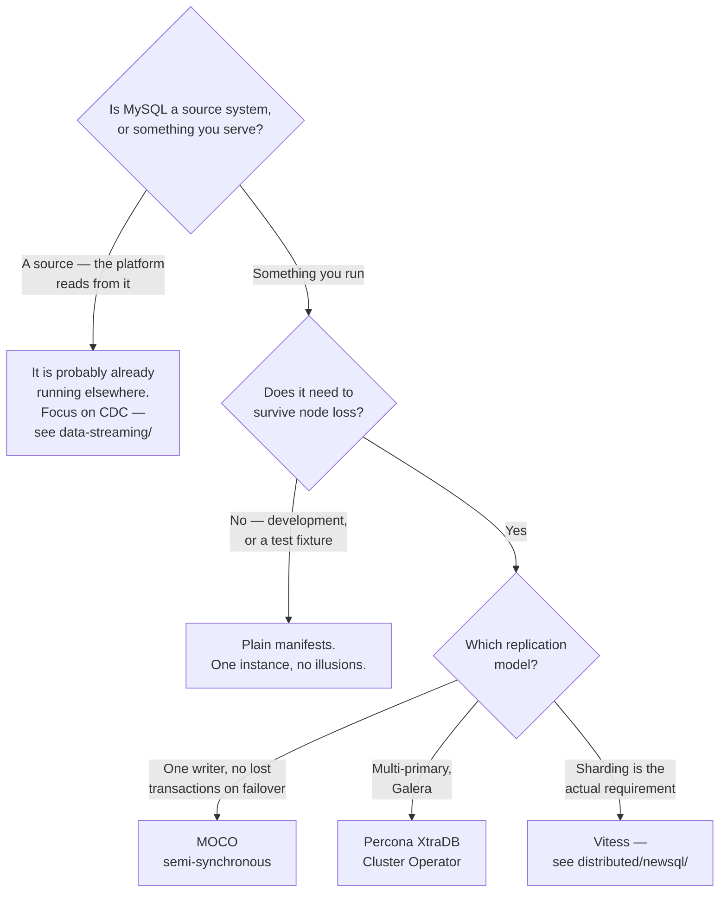

[← MySQL](../README.md)

# MySQL operators

Running MySQL on Kubernetes as a set of resources rather than as a StatefulSet and a runbook.

Tools covered: [`moco`](moco/README.md)

---

## What an operator has to solve

MySQL replication is not difficult to configure and is genuinely difficult to *operate*. The
things that must be handled correctly, every time:

| Concern | Why it is not a StatefulSet |
|---|---|
| **Cluster bootstrap** | the primary must be initialised before replicas clone from it, in order |
| **Failover** | promoting a replica means confirming it is caught up, then repointing the others |
| **Clone and rejoin** | a replica that falls too far behind cannot catch up; it must be re-cloned |
| Backups and PITR | binlog-based recovery, not a `mysqldump` in a CronJob |
| Rolling upgrades | replicas first, primary last, with a switchover in between |
| Connection routing | clients must reach the current primary for writes, and replicas for reads |
| Users and grants | as Kubernetes resources rather than shell scripts |

The failover row is the one that decides whether an operator is needed. A manual failover is
several sequenced steps under pressure, and getting the order wrong produces two writable
primaries — which is the worst outcome available.

## The landscape

The MySQL operator space is more fragmented than PostgreSQL's, where
[CloudNativePG](../../postgresql/operator/cnpg/README.md) has become a clear default:

| Operator | Position |
|---|---|
| **MOCO** | Cybozu's — semi-synchronous replication, clear failover semantics, Apache-2.0 | 
| Percona XtraDB Cluster Operator | Galera-based synchronous multi-primary; a different replication model |
| Oracle MySQL Operator | official, built around MySQL InnoDB Cluster and Group Replication |
| Vitess | not really an operator — [sharding MySQL](../../../distributed/newsql/vitess/README.md) |

The important distinction is the **replication model** underneath, because it determines the
failure behaviour far more than the operator does:

| Model | Writes | Failover | Trade |
|---|---|---|---|
| Asynchronous | primary only | may lose the last transactions | fastest writes |
| **Semi-synchronous** | primary only | at least one replica has it | a small write latency cost |
| Group Replication / Galera | multiple nodes | automatic | write conflicts become a concern |

[MOCO](moco/README.md) uses semi-synchronous replication, which is the pragmatic middle: a
committed transaction exists on at least one replica, so a failover does not silently lose it, and
there is still exactly one writer.

## Decision tree

## What to configure regardless of operator

| Setting | Why |
|---|---|
| **`binlog_format = ROW`** | CDC does not work properly without it, and finding out later is expensive |
| `innodb_buffer_pool_size` | the single most important performance setting; the default assumes a small machine |
| `sql_mode` | permissive defaults silently truncate and coerce data |
| Character set | `utf8mb4`, explicitly — `utf8` in MySQL is not UTF-8 |
| Backup retention and PITR | binlogs retained long enough to recover to a point in time |

The first row is the one that matters most for a data platform, and it is covered in
[`../README.md`](../README.md). An operator will happily run a cluster that cannot be used as a
CDC source.

## Anti-patterns

| Anti-pattern | Why it is bad | What to do instead |
|---|---|---|
| A hand-rolled StatefulSet for a real cluster | bootstrap, failover and rejoin are sequenced procedures | an operator |
| Manual failover | several ordered steps under pressure; the failure is two primaries | let the operator do it |
| Asynchronous replication assumed durable | a failover can lose committed transactions | semi-synchronous, or accept it knowingly |
| `binlog_format` not set to `ROW` | CDC produces unusable output | set it before building the pipeline |
| Backups without tested restores | discovered during the incident | scheduled restore drills |
| Replicas used without monitoring lag | stale reads, and a useless failover target | alert on lag in seconds |
| An operator chosen without understanding its replication model | the failure behaviour is the operator's, and it is not obvious | decide the model first |

## How this applies to pikakube

[MOCO](moco/README.md) is what is mapped here, and it is a reasonable choice for the reason in
section 2: semi-synchronous replication with one writer is the model with the fewest surprises.

The larger point is the one made in [`../README.md`](../README.md): for this platform MySQL
appears on the **left** of the pipeline — the application database data is extracted *from*,
rather than a database the platform serves. In that position the operator question is largely
academic, because the MySQL instance belongs to somebody else.

What is not academic is `binlog_format`. Whether MySQL is run here or read from elsewhere, CDC
into [`data-streaming/`](../../../../data-streaming/README.md) depends on it, and it is a setting
on the source rather than something the pipeline can compensate for.

---

[← MySQL](../README.md)
