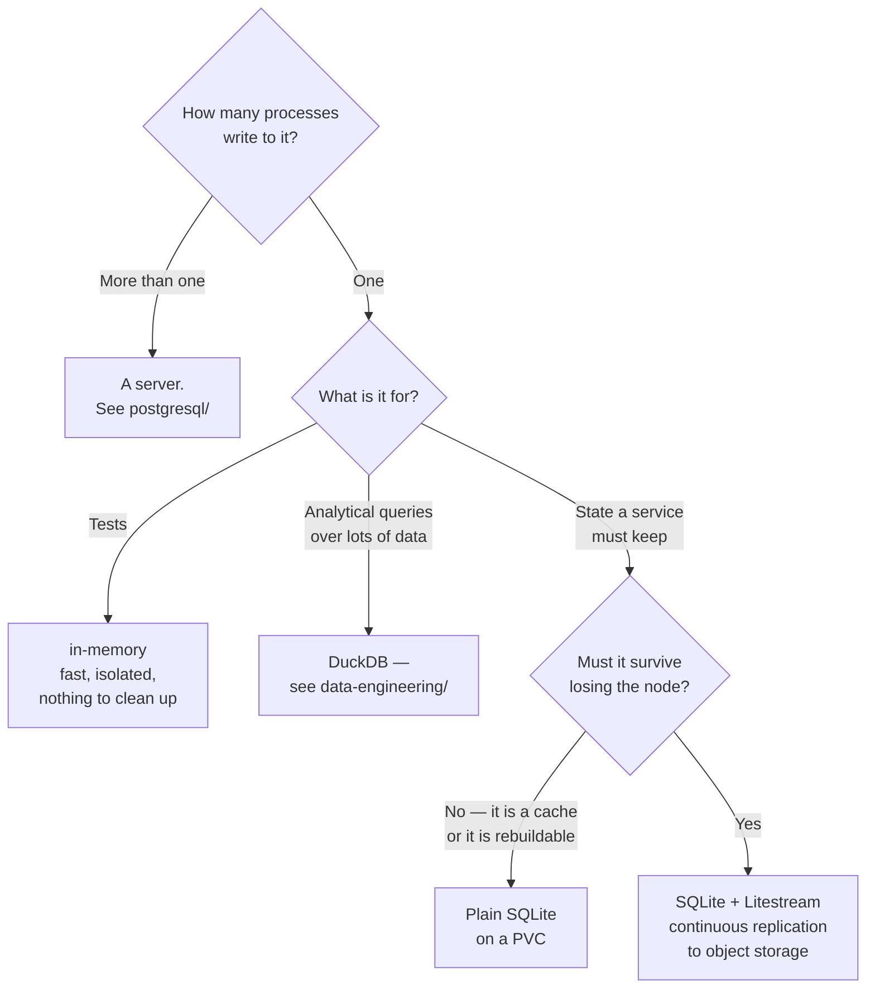

[← SQL databases](../README.md)

# SQLite

The most deployed database in the world, and the most consistently underrated in platform work.

Tools covered: [`sqlite`](sqlite/README.md) · [`litestream`](litestream/README.md) ·
[`in-memory`](in-memory/README.md)

---

## What it is

Not a server. A **library** that reads and writes a single file, linked into the process that
uses it. There is no daemon, no port, no connection string, no user management — opening the
file is connecting to the database.

That removes the entire operational surface that the rest of [`databases/`](../../README.md)
exists to manage:

| | A database server | SQLite |
|---|---|---|
| Deployment | a StatefulSet, a PVC, an operator | **a file** |
| Connection | network, pooling, credentials | open the file |
| Failure modes | node loss, failover, split brain | the file is there, or it is not |
| Latency | a network round trip | a function call |
| Backup | a procedure | copy the file |
| Concurrency | many writers | **one writer**, many readers |

The last row is the real constraint and the honest limit. Everything else is upside.

## When it is the right answer

| Case | Why |
|---|---|
| **Embedded state** | a CLI, an agent, a sidecar that must remember something |
| **Tests** | an [in-memory](in-memory/README.md) database per test, with no fixtures to tear down |
| **Local tooling** | analysis, scripts, a cache on disk |
| Single-node services | read-heavy workloads with modest writes |
| **Edge and offline** | no server to reach, no network to depend on |
| Application file format | a structured document that happens to be queryable |

The tests case is worth calling out for platform work. A test suite that spins up PostgreSQL in a
container is slower, flakier and harder to parallelise than one where each test gets its own
in-memory database. The trade is that the test then runs against a different engine than
production — which matters for anything using PostgreSQL-specific SQL, and matters not at all for
testing application logic.

## When it is not

- **more than one process writing** — this is the hard limit, and the workarounds are worse than
  moving to a server
- multiple nodes needing the same data
- large datasets with concurrent analytical queries — see
  [DuckDB](../../../data-engineering/processing/duckdb/README.md), which is the in-process
  database for *that* shape
- anything requiring the network to reach it

## Durability, which is where Litestream comes in

The obvious objection to SQLite for a real service is that the data lives in one file on one
node, and losing the node loses it.

[Litestream](litestream/README.md) answers it: it streams the write-ahead log to object storage
continuously, giving point-in-time recovery without changing the application at all. SQLite stays
SQLite; a sidecar replicates it.

| | Plain SQLite | With Litestream |
|---|---|---|
| Survives node loss | no | **yes, restore from object storage** |
| Point-in-time recovery | no | **yes** |
| Application changes | — | **none** |
| Extra components | — | one sidecar |

That combination covers a genuinely wide range of small services: a single pod, a PVC, and
continuous replication to [MinIO](../../../site-reliability-engineering/storage/object-storage/minio/README.md)
or S3. Compared with running a PostgreSQL cluster for a service with one writer, it is
dramatically less to operate.

## Decision tree

## Configuration that matters

Four settings that change SQLite from "a file" into something suitable for a service:

| Setting | Why |
|---|---|
| **WAL mode** | readers no longer block the writer; this is close to mandatory for a service, and it is what Litestream replicates |
| `busy_timeout` | without it, a concurrent write returns `SQLITE_BUSY` immediately instead of waiting |
| `synchronous` | `FULL` for durability, `NORMAL` with WAL is the usual compromise |
| `foreign_keys` | **off by default**, which surprises everyone |

The last row is a genuine trap: SQLite parses foreign-key clauses and does not enforce them
unless the pragma is on, per connection.

## Anti-patterns

| Anti-pattern | Why it is bad | What to do instead |
|---|---|---|
| Multiple pods writing to the same file | corruption, or constant lock contention | a server database |
| SQLite on a shared network filesystem | its locking assumes a local filesystem; NFS breaks it | local storage, or a server |
| No WAL mode for a service | readers block the writer, and concurrency collapses | enable WAL |
| `foreign_keys` left off | constraints silently unenforced | enable it per connection |
| Assuming a copied file is a valid backup | copying mid-write yields a corrupt file | Litestream, or the backup API |
| Dismissing it as a toy | it is the most deployed database in existence, and it is well engineered | evaluate it for the single-writer case |
| Using it for analytics over large data | it is row-oriented and single-threaded | [DuckDB](../../../data-engineering/processing/duckdb/README.md) |
| Testing against SQLite, deploying on Postgres | dialect differences surface in production | acceptable for logic, not for SQL-specific behaviour |

## How this applies to pikakube

Mapped as the embedded case, and the pairing that makes it interesting for a Kubernetes platform
is **SQLite plus [Litestream](litestream/README.md)**: one pod, one PVC, continuous replication
to [MinIO](../../../site-reliability-engineering/storage/object-storage/minio/README.md).

That is worth holding as a real alternative rather than a curiosity. Several platform components
here keep small amounts of state and currently imply a PostgreSQL instance to hold it — and for a
single-writer service, a replicated SQLite file is less to deploy, less to back up and less to
break than a database cluster.

The in-process sibling to keep distinct:
[DuckDB](../../../data-engineering/processing/duckdb/README.md) is the same idea for *analytical*
queries. Same "no server" property, opposite storage model — and mixing them up leads to
expecting SQLite to scan a Parquet file quickly, which it will not.

---

[← SQL databases](../README.md)
