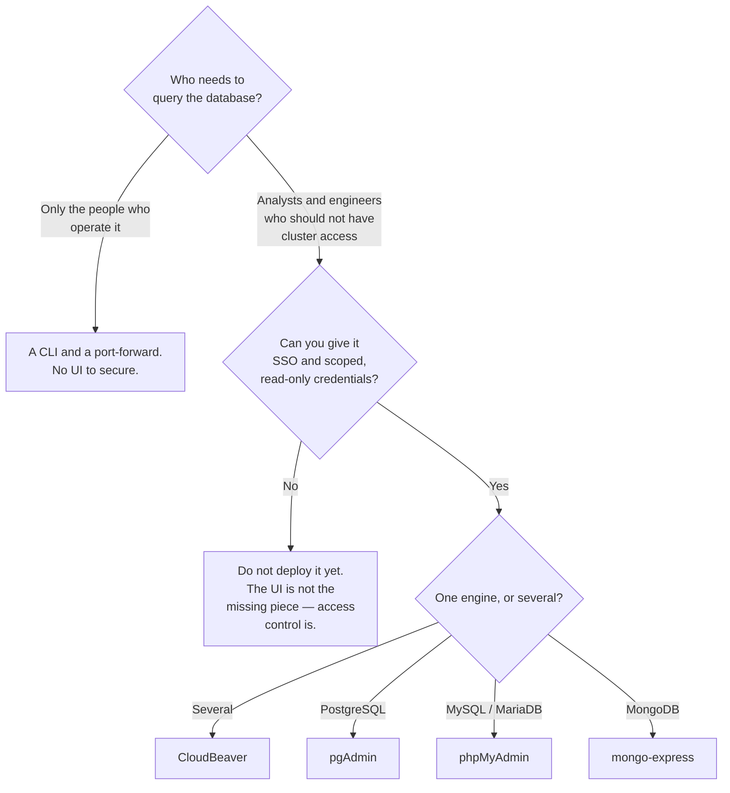

[← Tooling](../README.md)

# Management interfaces

How people query and inspect a database without everybody holding production credentials.

Tools covered: [`cloudbeaver`](cloudbeaver/README.md) · [`pgadmin`](pgadmin/README.md) ·
[`phpmyadmin`](phpmyadmin/README.md) · [`mongo-express`](mongo-express/README.md)

---

## The problem it solves

Two failure modes, and every estate lands on one of them by default:

| | What happens |
|---|---|
| **No interface** | database access requires a port-forward and a CLI, so a handful of people can answer any question and everyone else opens a ticket |
| **An open interface** | a web UI reachable with shared credentials — which is production database access with a friendlier front end |

The second is worse and far more common, because it starts as a convenience for one person and
is never revisited.

A management UI is worth deploying *only* when the access question is answered at the same
time. Otherwise it is not a tool, it is an incident waiting for a URL to leak.

## The tools

| Tool | Engines | Where it shines | Detail |
|---|---|---|---|
| **CloudBeaver** | PostgreSQL, MySQL, and many more | the **multi-engine** option — one interface for a mixed estate, with users and roles | [→](cloudbeaver/README.md) |
| **pgAdmin** | PostgreSQL | the reference Postgres client; deep administrative features beyond querying | [→](pgadmin/README.md) |
| **phpMyAdmin** | MySQL, MariaDB | the MySQL equivalent — ancient, ubiquitous, and it works | [→](phpmyadmin/README.md) |
| **mongo-express** | MongoDB | a light interface for browsing collections | [→](mongo-express/README.md) |

**CloudBeaver** is the one to reach for when the estate has more than one engine. It is the
server edition of DBeaver, so it inherits a very wide driver catalogue, and it has an actual
user model — which is the feature that separates a shared tool from a shared password.

The other three are single-engine and correspondingly simpler. pgAdmin does more than query:
role management, vacuum, server statistics. phpMyAdmin and mongo-express are browsers with a
query box.

## Deciding whether to deploy one at all

The `STOP` branch is the point of the tree. These tools are easy to deploy and the deployment is
not the work.

## Deploying one safely

| Concern | What to do |
|---|---|
| **Authentication** | SSO, through the cluster's existing identity — never the tool's own shared login |
| **Credentials** | a scoped database user per role, **read-only by default** |
| **Exposure** | behind the ingress with authentication in front, not a public route |
| **Network** | a `NetworkPolicy` allowing it to reach the database, and little else |
| **Audit** | who ran what; several of these log poorly, so the database side matters |
| **Which database** | prefer pointing it at a **replica** — an accidental heavy query then costs nothing |

The last row is the cheapest safety measure available and it is routinely skipped. Analysts
running exploratory queries against the primary is a well-established way to cause an unrelated
outage — see the anti-patterns in [`sql/`](../../sql/README.md#6-anti-patterns).

For the authentication piece, the cluster already has the components:
[`identity-access/`](../../../security/2-cluster/identity-access/README.md) and the
[ingress controllers](../../../network/README.md) that can enforce it.

## Anti-patterns

| Anti-pattern | Why it is bad | What to do instead |
|---|---|---|
| A UI with the database superuser configured | anyone who reaches it owns the database | a scoped user per role |
| Shared credentials for the tool itself | no attribution, and the password never rotates | SSO |
| Exposed on a public ingress | it is a login page in front of production data | internal only, with auth in front |
| Pointed at the primary | one exploratory query causes a real incident | a replica |
| Deployed to avoid granting proper access | the problem was access control, and now there is a UI too | fix access, then decide about the UI |
| Write access by default | a `DELETE` without a `WHERE` clause has no undo | read-only, elevated deliberately |
| Left running unused | attack surface with no benefit | remove it |

## How this applies to pikakube

Nothing here is currently the platform's access path — database work happens through the CLI
against [CloudNativePG](../../sql/postgresql/operator/cnpg/README.md).

The realistic case for one is the **analyst** who needs to query without cluster credentials,
and for a mixed estate **CloudBeaver** is the fit, because its user model is the part that makes
it safe rather than merely convenient.

Worth pairing with [`documentation/`](../documentation/README.md): giving someone a query
interface for a schema nobody can explain moves the bottleneck rather than removing it.

---

[← Tooling](../README.md)
