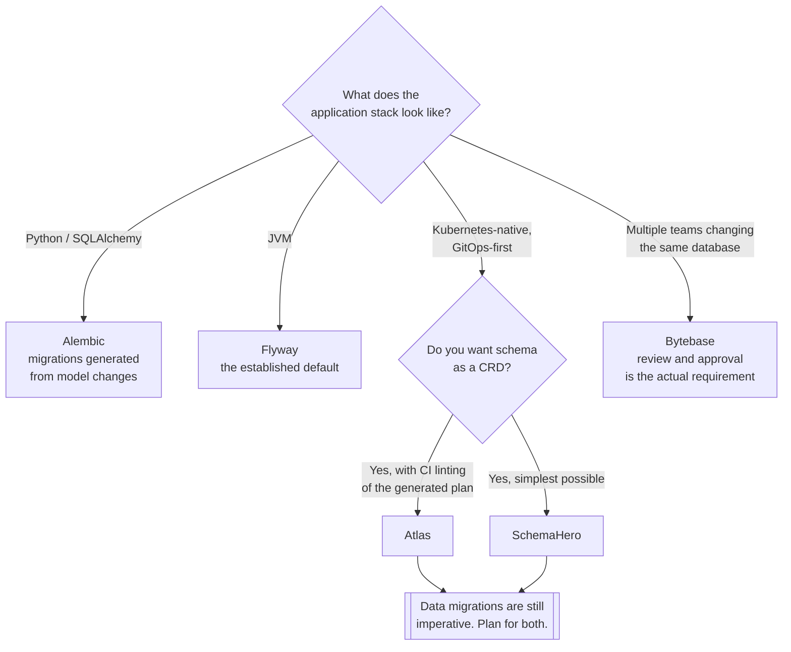

[← Tooling](../README.md)

# Schema migration

How the schema changes — reproducibly, in every environment, without anybody typing `ALTER`.

Tools covered: [`atlas`](atlas/README.md) · [`flyway`](flyway/README.md) ·
[`alembic`](alembic/README.md) · [`bytebase`](bytebase/README.md) ·
[`schemahero`](schemahero/README.md)

## Contents

1. [The problem](#1-the-problem)
2. [Two philosophies: versioned and declarative](#2-two-philosophies-versioned-and-declarative)
3. [The tools](#3-the-tools)
4. [Decision tree](#4-decision-tree)
5. [The part that breaks: expand and contract](#5-the-part-that-breaks-expand-and-contract)
6. [Running migrations on Kubernetes](#6-running-migrations-on-kubernetes)
7. [Anti-patterns](#7-anti-patterns)
8. [How this applies to pikakube](#8-how-this-applies-to-pikakube)

---

## 1. The problem

A schema changed by hand exists in exactly one place. Every other environment drifts from it,
and after a few months nobody can answer *"is staging the same as production?"* except by
comparing them column by column.

The consequences are specific:

| Without migrations | What actually happens |
|---|---|
| No history | nobody knows when a column appeared or why |
| No reproducibility | a fresh environment cannot be built from scratch |
| No rollback | reverting the application does not revert the schema |
| No review | schema changes bypass the process every other change goes through |

This is the highest-value item in [`tooling/`](../README.md), and it is cheap to put in place
before there is anything to migrate.

## 2. Two philosophies: versioned and declarative

The tools split cleanly, and choosing the wrong side is the usual source of friction.

| | **Versioned** | **Declarative** |
|---|---|---|
| You write | the change — `ALTER TABLE ...` | the desired end state |
| The tool | applies files in order, once each | diffs current against desired and generates the change |
| History | explicit, one file per change | derived from the schema definition |
| Analogy | imperative scripts | Terraform, or Kubernetes manifests |
| Risk | a file applied in the wrong order | a generated diff that does something you did not intend |
| Tools | Flyway, Alembic | Atlas, SchemaHero |

**Declarative fits GitOps better** — the repository states what the schema should be, and a
controller reconciles it. That is the same model as everything else in this cluster.

**Versioned is more predictable** — you wrote the exact statement that will run, so there is no
generator to second-guess during a production window.

The honest position: declarative is better for schema *structure*, and worse for **data
migrations**, which are inherently imperative. Most real estates end up with both.

## 3. The tools

| Tool | Model | Where it shines | Detail |
|---|---|---|---|
| **Atlas** | declarative | the Kubernetes-native option — an operator, schema as a CRD, migration linting in CI | [→](atlas/README.md) |
| **Flyway** | versioned | the JVM-world default; enormously deployed, very predictable | [→](flyway/README.md) |
| **Alembic** | versioned | Python and SQLAlchemy estates — migrations generated from model changes | [→](alembic/README.md) |
| **Bytebase** | versioned, with governance | when schema changes need **review and approval**, not just automation | [→](bytebase/README.md) |
| **SchemaHero** | declarative | schema as a Kubernetes resource, operator-driven | [→](schemahero/README.md) |

Bytebase is the odd one out and worth naming separately: it is less a migration runner than a
**change-management process** for databases — review, approval, audit. That matters when more
than one team changes the same database.

## 4. Decision tree

## 5. The part that breaks: expand and contract

Migration tooling solves *applying* the change. It does not solve **deploying** it, and that is
where outages come from.

The failure is simple: the application and the schema are deployed at different moments, so for
some window the old code runs against the new schema, or the reverse.

A renamed column illustrates it. Done in one step, every running pod breaks the instant the
migration lands. Done in three, nothing breaks:

| Phase | Schema | Application |
|---|---|---|
| **Expand** | add the new column, keep the old | write to both, read from the old |
| **Migrate** | backfill the new column | — |
| **Contract** | drop the old column | read and write the new only |

Each phase is compatible with the code on both sides of it, which is the whole point. The
constraint this creates is worth stating plainly: **a migration must be backwards-compatible
with the currently deployed application**, always.

The operations that are never safe in one step:

| Operation | Why | Do instead |
|---|---|---|
| Rename a column | old code selects a column that no longer exists | expand / contract |
| Drop a column | anything still referencing it fails | contract only after nothing reads it |
| Add `NOT NULL` without a default | existing rows violate it | add nullable, backfill, then constrain |
| Change a type narrowing values | data loss, and it is not reversible | new column, backfill, swap |
| Add an index on a large table | locks writes for the duration | `CREATE INDEX CONCURRENTLY` |

## 6. Running migrations on Kubernetes

The mechanics matter more than they look:

| Concern | What to do |
|---|---|
| **Where it runs** | a `Job`, or an init container — never the application at startup, or every replica races |
| **Concurrency** | the tool must take a lock; all of these do, but confirm it |
| **Ordering** | migration completes *before* the new version rolls out — a Helm hook or a Flux dependency |
| **Failure** | a failed migration must stop the rollout, not let it proceed against the old schema |
| **Credentials** | migrations need DDL rights; the application should not have them |

The last row is a real separation and usually skipped: the runtime user should be unable to
alter the schema, so an application bug cannot drop a table.

## 7. Anti-patterns

| Anti-pattern | Why it is bad | What to do instead |
|---|---|---|
| Applying `ALTER` by hand in production | it exists in one environment and nowhere else | a migration tool, in CI |
| Migrations run by the application at startup | every replica races, and one wins arbitrarily | a `Job` that completes first |
| A migration that breaks the running version | the deployment window becomes an outage window | expand and contract |
| Editing an already-applied migration file | environments diverge silently; checksums exist for this reason | a new migration |
| Rollback assumed to work | dropping a column does not restore its data | forward-only, plus backups |
| `CREATE INDEX` without `CONCURRENTLY` | writes block for as long as the build takes | `CONCURRENTLY`, and expect it to be slower |
| The application user owning DDL rights | a bug can drop a table | separate migration and runtime credentials |
| No linting of generated diffs | a declarative tool cheerfully generates a destructive plan | review the plan, and lint it in CI |

## 8. How this applies to pikakube

Migration is documented here as a **process** for PostgreSQL on Kubernetes rather than as a
deployed tool — the alternatives above are what replace doing it by hand.

With [CloudNativePG](../../sql/postgresql/operator/cnpg/README.md) running the database, the
Kubernetes-native options are the natural fit: **Atlas** or **SchemaHero** put the schema in Git
next to everything else, reconciled by a controller, which is the pattern the rest of the
cluster already follows.

One documented limitation is worth carrying forward from
[`atlas/`](atlas/README.md): it does **not** manage permissions through GitOps
([ariga/atlas#647](https://github.com/ariga/atlas/issues/647)). Roles and grants therefore
remain a separate concern — which is fine, as long as it is a decision rather than a discovery.

---

[← Tooling](../README.md)
