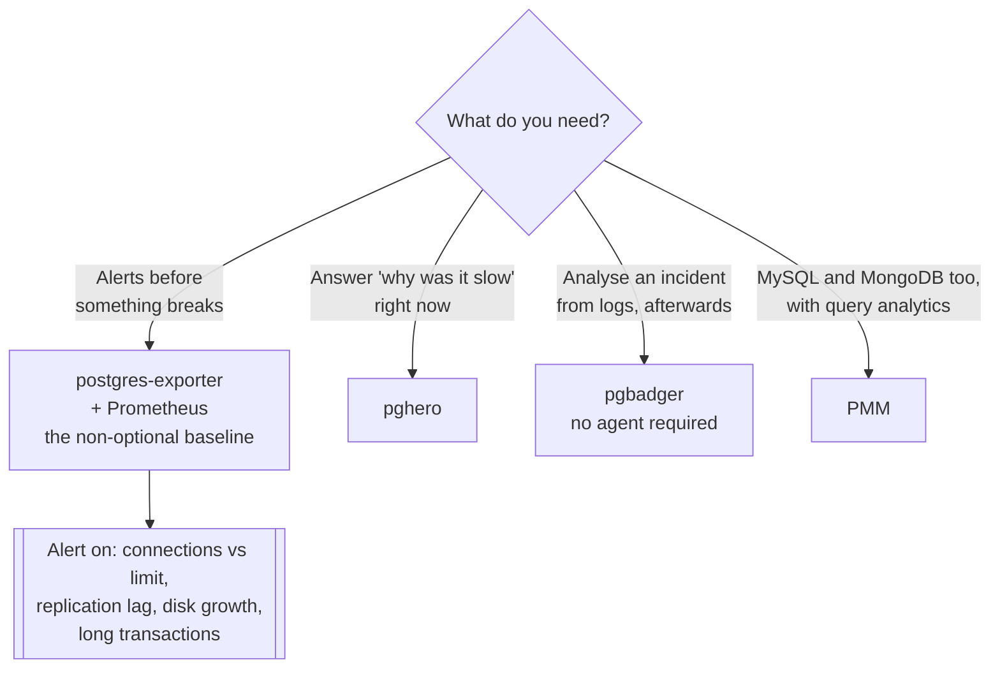

[← Tooling](../README.md)

# Database monitoring

CPU and memory tell you almost nothing about a database. These are the things that do.

Tools covered: [`pghero`](pghero/README.md) · [`pmm`](pmm/README.md) ·
[`pgbadger`](pgbadger/README.md)

## Contents

1. [What to actually monitor](#1-what-to-actually-monitor)
2. [Two different jobs](#2-two-different-jobs)
3. [The tools](#3-the-tools)
4. [Decision tree](#4-decision-tree)
5. [Where this connects to observability](#5-where-this-connects-to-observability)
6. [Anti-patterns](#6-anti-patterns)
7. [How this applies to pikakube](#7-how-this-applies-to-pikakube)

---

## 1. What to actually monitor

A database at 30% CPU can be minutes from an outage. The metrics that predict incidents are
database-specific, and none of them appear on a node dashboard:

| Metric | Why it is the one that pages you |
|---|---|
| **Connections used vs. limit** | exhaustion is a hard wall, not a slope — see [`pooler/`](../pooler/README.md) |
| **Replication lag** | a replica minutes behind is serving stale data, and is not a usable failover target |
| **Long-running transactions** | they hold locks and, on PostgreSQL, block vacuum indefinitely |
| Cache hit ratio | a sudden drop means the working set no longer fits in memory |
| **Table and index bloat** | dead tuples never reclaimed; disk grows, scans slow |
| Locks and deadlocks | the cause of latency that no query plan explains |
| Slow queries | one new query pattern is the usual cause of a bad afternoon |
| Disk usage and growth rate | a full volume is the one failure with no graceful degradation |
| Unused and duplicate indexes | write cost paid for nothing |

Two of these are worth singling out on PostgreSQL because they are self-inflicted and invisible
until severe:

**Long-running transactions.** An open transaction — including one that is idle — prevents
vacuum from reclaiming rows newer than it. A forgotten session in `idle in transaction` causes
unbounded bloat across the whole database, and the symptom appears everywhere except where the
cause is.

**Bloat.** Updates and deletes leave dead tuples that vacuum reclaims. When it cannot keep up,
tables grow, scans read more pages, and performance degrades gradually enough that nobody
notices until it is a rewrite.

## 2. Two different jobs

The tools in this folder answer different questions, and mixing them up produces the wrong
setup:

| Job | Question | Shape | Tools |
|---|---|---|---|
| **Continuous monitoring** | what is it doing *now*, and what is about to break? | metrics, scraped, with alerts | postgres-exporter, PMM |
| **Diagnosis** | why was it slow, and which query caused it? | an interface, or a log analysis | pghero, pgbadger |

Continuous monitoring is what wakes someone up. Diagnosis is what they open afterwards.

A platform needs both, and only the first belongs in
[`observability/`](../../../observability/README.md) — the second is a tool you open
deliberately, not a dashboard that runs forever.

## 3. The tools

| Tool | Job | Where it shines | Detail |
|---|---|---|---|
| **pghero** | diagnosis | a small UI that answers the practical PostgreSQL questions — slow queries, unused indexes, bloat, blocking sessions | [→](pghero/README.md) |
| **PMM** | continuous, plus deep query analytics | Percona's full stack for **MySQL and MongoDB** as well as PostgreSQL; query analytics is its real differentiator | [→](pmm/README.md) |
| **pgbadger** | offline diagnosis | parses PostgreSQL logs into a report — the tool for *after* the incident, from evidence already on disk | [→](pgbadger/README.md) |
| [postgres-exporter](../../../observability/metrics/exporters/postgres-exporter/README.md) | continuous | Prometheus metrics; the baseline everything else assumes | → |

**pghero** is the highest value per unit of effort for PostgreSQL: it surfaces the queries
consuming the most time, indexes that are never used, and sessions blocking others — the three
questions actually asked during an incident.

**PMM** is a platform rather than a tool. Worth it when the estate is genuinely multi-engine,
heavy for one Postgres cluster.

**pgbadger** is the one people forget exists. It needs no agent and no deployment — point it at
logs already being written and it produces the report. That makes it uniquely useful for a
post-mortem on a database nobody instrumented in advance.

## 4. Decision tree

## 5. Where this connects to observability

Metrics belong in the platform's existing pipeline rather than in a parallel one:

- [`postgres-exporter`](../../../observability/metrics/exporters/postgres-exporter/README.md)
  and [`sql-exporter`](../../../observability/metrics/exporters/sql-exporter/README.md) for
  scraping — the second runs arbitrary SQL as metrics, which covers anything the first does not
- [`metrics/storage/`](../../../observability/metrics/storage/README.md) for where they land
- [`alerting/`](../../../observability/alerting/README.md) for what happens next

The tools in this folder are the **diagnosis** layer sitting on top. Sending them somewhere
separate from the rest of the platform's telemetry is how databases end up with their own
monitoring silo that nobody looks at.

## 6. Anti-patterns

| Anti-pattern | Why it is bad | What to do instead |
|---|---|---|
| Monitoring only CPU, memory, disk | none of them predict connection exhaustion or replication lag | database-specific metrics |
| No alert on connections vs. limit | the first symptom is the application failing | alert at a percentage of the limit |
| Replication lag unmonitored | a failover target that is silently useless | alert on lag, in seconds |
| Long-running transactions ignored | bloat grows without bound, and vacuum cannot help | alert on transaction age |
| Slow query logging disabled | no evidence exists when it matters | enable it, with a sensible threshold |
| A separate monitoring stack for databases | one more silo nobody opens | the same Prometheus as everything else |
| Dashboards nobody chose | community dashboards vary wildly in quality; several are actively misleading | curate a small number that answer real questions |
| Alerting on everything | the alerts get muted, including the ones that mattered | alert on the handful with a response |

## 7. How this applies to pikakube

This is the part of [`tooling/`](../README.md) with real history in the repository —
**pghero**, **PMM** and the
[postgres-exporter](../../../observability/metrics/exporters/postgres-exporter/README.md) are all
mapped here, against [CloudNativePG](../../sql/postgresql/operator/cnpg/README.md).

One note carried forward from the exporter's documentation is worth keeping visible: the
**community Grafana dashboards for postgres-exporter are mostly poor** — either broken against
current metric names or displaying numbers that do not answer any question anyone asks. Curating
a small dashboard from the metrics in section 1 is more useful than importing a dashboard with a
high download count.

CloudNativePG also exposes its own metrics endpoint, which covers cluster-level state — primary,
replicas, failover, backup status — that a generic exporter does not know about. Both are worth
scraping.

---

[← Tooling](../README.md)
