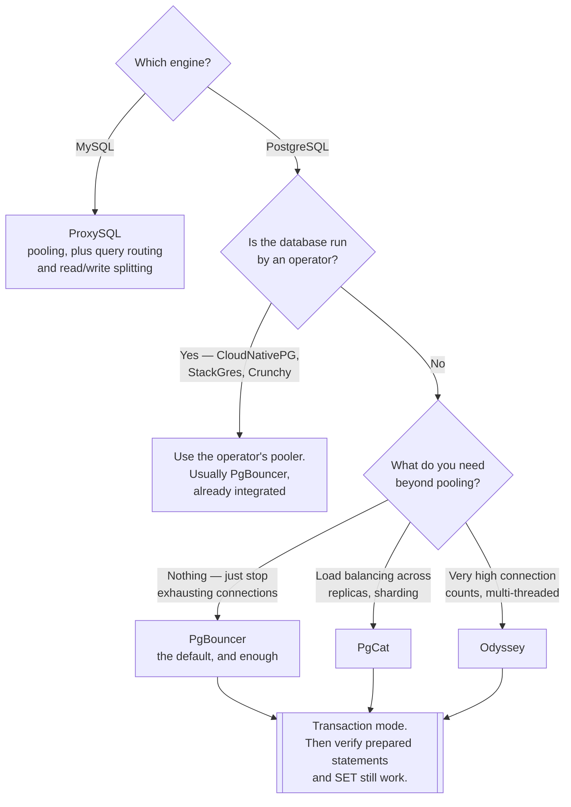

[← Tooling](../README.md)

# Connection pooling

Why a database with idle CPU refuses new connections — and the component that fixes it.

Subfolders: [`postgres/`](postgres/README.md) — PgBouncer, PgCat, Odyssey ·
[`mysql/`](mysql/README.md) — ProxySQL

## Contents

1. [The problem, precisely](#1-the-problem-precisely)
2. [Pooling modes — the decision that matters](#2-pooling-modes--the-decision-that-matters)
3. [What breaks in transaction mode](#3-what-breaks-in-transaction-mode)
4. [Where to run the pooler](#4-where-to-run-the-pooler)
5. [Decision tree](#5-decision-tree)
6. [Anti-patterns](#6-anti-patterns)
7. [How this applies to pikakube](#7-how-this-applies-to-pikakube)

---

## 1. The problem, precisely

PostgreSQL allocates **an operating-system process per connection**. Each one costs memory
before it does any work, and the practical ceiling is a few hundred — far below what a fleet of
application pods will happily open.

The arithmetic is what makes this inevitable rather than unlucky:

```
20 pods × 20 connections in the framework's default pool = 400 connections
```

Twenty pods is a modest deployment, and twenty is a common default pool size. The database is
already at its limit, and it has not been asked to do anything.

The symptom is distinctive and misleading:

| What you see | What it looks like |
|---|---|
| `FATAL: sorry, too many clients already` | the database is "down" |
| Latency spikes with **idle CPU** | the database is "slow" |
| Connection timeouts under load | the network is "flaky" |

Every one of these points away from the actual cause. A pooler sits between the application and
the database, keeps a small number of real connections open, and multiplexes many clients
across them. It is not an optimisation — for PostgreSQL at any scale it is a **requirement**.

MySQL uses threads rather than processes, so the ceiling is higher and the pressure lower. It
still benefits, but the failure is less abrupt.

## 2. Pooling modes — the decision that matters

Everything else about a pooler is configuration. This is the choice:

| Mode | A backend connection is held for | Multiplexing | Use it when |
|---|---|---|---|
| **Session** | the whole client session | almost none | the client needs session state |
| **Transaction** | one transaction | **high** — the reason to deploy a pooler | the default for web applications |
| Statement | one statement | highest | rare; multi-statement transactions are impossible |

**Transaction mode is the point.** Session mode gives you a proxy that holds exactly as many
backend connections as there are clients, which solves nothing. If a pooler is deployed in
session mode, it is worth asking why it is there at all.

Statement mode breaks transactions outright and is almost never the answer.

## 3. What breaks in transaction mode

Transaction mode works because a connection is returned to the pool between transactions.
Anything that assumes the *same* backend connection across statements therefore breaks — and it
breaks intermittently, under load, which is the worst way to find out.

| Feature | Why it breaks | Workaround |
|---|---|---|
| `SET` outside a transaction | applied to a connection someone else then gets | `SET LOCAL`, inside the transaction |
| Session-level advisory locks | acquired on one connection, released on another | transaction-scoped locks |
| Prepared statements | prepared on one backend, executed on another | disable them, or use a pooler that tracks them |
| `LISTEN` / `NOTIFY` | the listening connection is not yours to keep | a separate session-mode connection |
| Temporary tables | created on a connection you will not see again | avoid, or session mode |
| `WITH HOLD` cursors | outlive the transaction, and the connection does not | fetch fully inside the transaction |

The prepared-statement row is the most common surprise, because many drivers and ORMs use them
by default without saying so. Some poolers now track prepared statements per client, which
removes the problem — check the specific tool rather than assuming.

The general rule: **anything session-scoped is unsafe**, and the failure mode is a query
running against a connection with somebody else's state on it.

## 4. Where to run the pooler

Three shapes, and this is a genuine architectural choice:

| Shape | How | Trade-off |
|---|---|---|
| **Sidecar** | one pooler container per application pod | no extra hop, but N poolers means N × pool_size backend connections — it barely helps |
| **Deployment** | a shared pooler service in front of the database | one place holding the ceiling; the usual answer |
| **Operator-managed** | the database operator runs it as part of the cluster | fewest moving parts when the operator supports it |

The sidecar option is worth understanding because it looks attractive and mostly does not work:
pooling only helps if connections are shared, and a per-pod pooler shares nothing between pods.
It reduces connection *churn*, not connection *count*.

Two things to size deliberately once it is deployed:

- **`max_client_conn`** — how many application connections the pooler accepts. Generous.
- **`default_pool_size`** — how many real backend connections it opens. Small; this is the
  number that protects the database.

Getting the second one wrong by making it large recreates the original problem with an extra
hop in front of it.

## 5. Decision tree



## 6. Anti-patterns

| Anti-pattern | Why it is bad | What to do instead |
|---|---|---|
| No pooler on PostgreSQL | exhaustion under load, with symptoms that point elsewhere | deploy one before it is needed |
| Session mode by default | no multiplexing, so the pooler solves nothing | transaction mode, and fix what breaks |
| `default_pool_size` set large | the ceiling moves back to the database, with an extra hop | small pool, generous client limit |
| A pooler per pod as a sidecar | connections are not shared between pods, so the count does not drop | a shared deployment |
| Raising `max_connections` instead | each connection is a process; memory runs out instead | a pooler |
| Prepared statements left on in transaction mode | intermittent failures under load only | disable, or use a pooler that tracks them |
| `SET` instead of `SET LOCAL` | leaks state onto the next client of that connection | `SET LOCAL` |
| Pooler not monitored | it becomes the new bottleneck, invisibly | export its stats — waiting clients is the metric |

## 7. How this applies to pikakube

This is the **named gap** for the platform. With
[CloudNativePG](../../sql/postgresql/operator/cnpg/README.md) running PostgreSQL, pooling is
the piece that decides behaviour under load, and nothing here is deployed yet.

CloudNativePG has a first-class `Pooler` resource that runs PgBouncer against a cluster, which
makes this a small amount of YAML rather than a new system to operate — the cheapest possible
version of the fix, and the reason leaving it undone is hard to justify.

Once it exists, the metric to put on a dashboard is **waiting clients**, not connection count:
a pooler with clients queuing is a pool that is too small, and it is the only early warning
before the timeouts start.

---

[← Tooling](../README.md)
