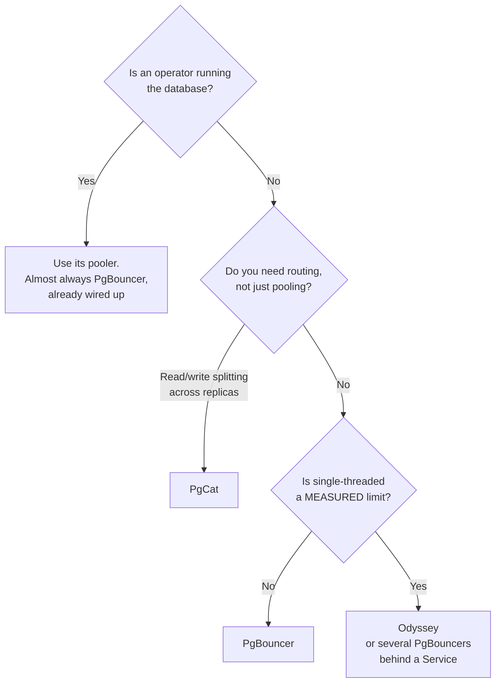

[← Connection pooling](../README.md)

# PostgreSQL poolers

Three answers to the same problem, separated by what they do beyond pooling.

Tools covered: [`pgbouncer`](pgbouncer/README.md) · [`pgcat`](pgcat/README.md) ·
[`odyssey`](odyssey/README.md)

---

## The comparison

All three do transaction pooling correctly. The difference is everything else:

| | **PgBouncer** | **PgCat** | **Odyssey** |
|---|---|---|---|
| Written in | C | Rust | C |
| Threading | single-threaded per process | multi-threaded | multi-threaded |
| Load balancing across replicas | no | **yes** | no |
| Read/write splitting | no | **yes** | no |
| Sharding | no | yes | no |
| Prepared statements in transaction mode | supported in recent versions | supported | supported |
| Maturity | the reference; deployed everywhere | younger | proven at Yandex scale |
| Operator integration | **CloudNativePG, StackGres, Crunchy** | manual | manual |

**PgBouncer is the default answer**, and the bar for choosing something else is a specific
capability it lacks. It has been the standard for long enough that operators, dashboards and
runbooks assume it.

Its single-threaded design is the usual objection, and it is real: one process saturates one
core. The conventional fix is running several instances behind a service, which is
straightforward on Kubernetes and is why the objection rarely decides anything here.

## Choosing between them

**PgBouncer** — pooling is the requirement, and nothing more. Also the correct choice whenever
a database operator manages it for you, because the integration is worth more than any
feature difference.

**PgCat** — the routing features are the reason to pick it. Sending reads to replicas at the
pooler removes that logic from the application, which is a genuine architectural simplification
when there are replicas to use. Sharding is there too, though that is a much larger commitment.

**Odyssey** — very high connection counts where PgBouncer's single-threaded model is a measured
constraint rather than a theoretical one, and running multiple instances is unattractive.

## Decision tree

The second question is the one to be honest about. "Single-threaded" sounds like a
disqualification and is usually not: a PgBouncer instance handles a large workload, and
horizontal replicas are cheap in this environment.

## What to configure, whichever you choose

| Setting | Guidance |
|---|---|
| `pool_mode` | `transaction` — see [`../README.md`](../README.md#2-pooling-modes--the-decision-that-matters) |
| `max_client_conn` | generous; this is what the application sees |
| `default_pool_size` | **small**; this is what protects the database |
| `server_idle_timeout` | so backend connections are released rather than held forever |
| Stats export | waiting clients is the metric that predicts an incident |

## How this applies to pikakube

[CloudNativePG](../../../sql/postgresql/operator/cnpg/README.md) is what runs PostgreSQL here,
and it ships a `Pooler` custom resource that deploys PgBouncer against an existing cluster.

That makes **PgBouncer** the answer for this platform almost by default — not because it wins
on features, but because the operator already knows how to run it, and the alternative is
introducing a component nothing else in the cluster manages.

---

[← Connection pooling](../README.md)
