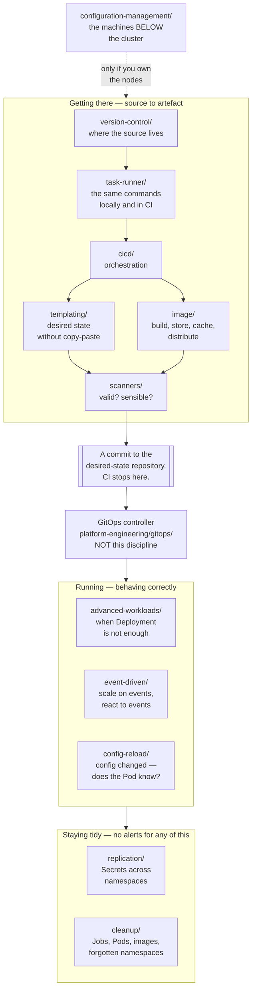
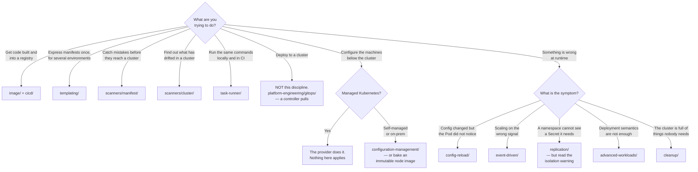

[← infrastructure/](../README.md)

# DevOps

The path from source to running workload — and keeping the cluster tidy afterwards.

Capabilities: [`version-control/`](version-control/README.md) · [`image/`](image/README.md) ·
[`templating/`](templating/README.md) · [`scanners/`](scanners/README.md) ·
[`task-runner/`](task-runner/README.md) · [`cicd/`](cicd/README.md) ·
[`configuration-management/`](configuration-management/README.md) ·
[`advanced-workloads/`](advanced-workloads/README.md) ·
[`event-driven/`](event-driven/README.md) · [`config-reload/`](config-reload/README.md) ·
[`replication/`](replication/README.md) · [`cleanup/`](cleanup/README.md)

## Contents

1. [The organising idea](#1-the-organising-idea)
2. [The twelve capabilities](#2-the-twelve-capabilities)
3. [The boundary: deployment is not here](#3-the-boundary-deployment-is-not-here)
4. [The three phases](#4-the-three-phases)
5. [Other boundaries worth naming](#5-other-boundaries-worth-naming)
6. [Decision tree](#6-decision-tree)
7. [Anti-patterns](#7-anti-patterns)
8. [How this applies to pikakube](#8-how-this-applies-to-pikakube)

---

## 1. The organising idea

Every folder here answers one question, asked at a different point along a single path:

**How does source code become a running workload — and what keeps the cluster habitable once it is?**

That second half is the part most treatments of "DevOps" omit, and it is why this discipline has
twelve folders rather than six. Getting code into a cluster is a well-covered problem. Keeping a
cluster from silently rotting — completed Jobs accumulating, images filling nodes, ConfigMaps
changing without the Pods noticing, Secrets needed in namespaces that cannot see them — is not, and
each of those failures is quiet. None of them produce an alert. They produce a cluster that is
slightly harder to reason about every week until nobody is confident changing anything.

The folders divide accordingly:

| Phase | What it is | Folders |
|---|---|---|
| **Getting there** | source becomes a validated, deployable artefact | version-control, image, templating, scanners, task-runner, cicd |
| **Running** | the workload behaves correctly once deployed | advanced-workloads, event-driven, config-reload |
| **Staying tidy** | the cluster does not degrade over time | replication, cleanup |
| **Outside** | the machines the cluster runs on | configuration-management |

## 2. The twelve capabilities

| Capability | The question it answers | Why it bites |
|---|---|---|
| [`version-control/`](version-control/README.md) | where does the source live, and who hosts it? | in GitOps the repository *is* the desired state — its availability is production's availability |
| [`image/`](image/README.md) | how does source become a container image, and where does it live? | builds are slow, registries are a single point of failure, and image pulls saturate the network |
| [`templating/`](templating/README.md) | how is desired state expressed without copying YAML per environment? | copied manifests diverge within weeks; a template that nobody can render is worse |
| [`scanners/`](scanners/README.md) | is this manifest valid and sensible before it is applied? | a finding before merge costs a comment; the same finding after deployment costs a change window |
| [`task-runner/`](task-runner/README.md) | how do people run the same commands the pipeline runs? | "it works in CI" is a class of problem caused by the pipeline being the only thing that knows the commands |
| [`cicd/`](cicd/README.md) | what orchestrates build, test and validation? | see section 3 — the **CD** half is not how this platform deploys |
| [`configuration-management/`](configuration-management/README.md) | how are the machines *outside* the cluster configured? | mostly **not** how you configure Kubernetes — read that folder before reaching for Ansible |
| [`advanced-workloads/`](advanced-workloads/README.md) | what if `Deployment` and `StatefulSet` are not enough? | in-place updates, sidecar management, multi-Pod inference workloads |
| [`event-driven/`](event-driven/README.md) | how does the platform scale on, or react to, external events? | the HPA scales on CPU, and almost nothing that needs scaling correlates with CPU |
| [`config-reload/`](config-reload/README.md) | a ConfigMap changed — how does a running Pod find out? | it does not. Nothing errors. The change applies weeks later, during an unrelated restart |
| [`replication/`](replication/README.md) | how do Secrets and ConfigMaps reach other namespaces? | they cannot; and every copy weakens the isolation the namespace existed for |
| [`cleanup/`](cleanup/README.md) | who removes what nobody needs? | nobody. Completed Jobs, failed Pods, node images and forgotten test namespaces accumulate forever |

The four rows in the second half of that table are the ones that distinguish this discipline from a
CI/CD chapter. Each names a failure that **produces no error**, which is precisely why each needs
naming.

## 3. The boundary: deployment is not here

The most important thing to know before opening [`cicd/`](cicd/README.md).

**This platform deploys with pull-based GitOps, via [Flux](../platform-engineering/gitops/flux/README.md).**
A controller inside the cluster watches a repository and reconciles continuously. Nothing pushes to
the cluster. There are no cluster credentials in CI, because CI never talks to a cluster.

That makes the **CD half of `cicd/` not how this platform deploys.** Jenkins, Spinnaker, PipeCD and
the deployment stages of GitHub Actions and Tekton are mapped there as the solution space, and the
solution chosen is
[elsewhere](../platform-engineering/gitops/README.md).

The division of responsibility that follows:

| Concern | Where | Who does it |
|---|---|---|
| Build, test, scan, publish an image | [`cicd/`](cicd/README.md), [`image/`](image/README.md), [`scanners/`](scanners/README.md) | a pipeline |
| Update the desired state in the repository | [`image/update/`](image/README.md), or a human with a pull request | a commit |
| Apply that state to a cluster | [GitOps](../platform-engineering/gitops/README.md) | a controller, continuously |

**CI ends at a commit.** That boundary is the single most useful thing to keep straight when reading
this discipline, and the practical test is easy: if a pipeline has a kubeconfig, the boundary has
been crossed.

The property this buys is the fourth GitOps principle — continuous reconciliation. A pipeline that
applies on merge satisfies "declarative", "versioned" and "automated" and provides none of the
value: nothing notices when somebody edits a Deployment by hand at 2am, and nothing puts it back.
The full argument is in [`platform-engineering/gitops/`](../platform-engineering/gitops/README.md).

## 4. The three phases

## 5. Other boundaries worth naming

Several capabilities here have neighbours in other disciplines, and writing the boundary down stops
the same tool being evaluated twice under two names.

| Concern | Here | Elsewhere |
|---|---|---|
| **Applying manifests to a cluster** | [`cicd/`](cicd/README.md) maps the tools | [GitOps](../platform-engineering/gitops/README.md) is the answer used — section 3 |
| **Scanning** | [`scanners/`](scanners/README.md) — *is this correct and will it operate well?* | `security/2-cluster/manifest-scan/` and `security/2-cluster/posture/` — *is this exploitable?* |
| **Enforcement** | nothing here blocks anything; scanners report | policy engines, `security/2-cluster/policies/` — admission-time rejection |
| **Distributing Secrets** | [`replication/`](replication/README.md) — the generic tools | [trust-manager](../security/2-cluster/certificates/trust-manager/README.md) for CA bundles specifically |
| **Registries** | [`image/`](image/README.md) — container images | [`software-engineering/artifact-registry/`](../software-engineering/artifact-registry/README.md) — language packages |
| **Configuring machines** | [`configuration-management/`](configuration-management/README.md) — nodes, on-prem, network devices | Terraform and OpenTofu, under [platform engineering](../platform-engineering/README.md) — cloud resources |
| **Scaling** | [`event-driven/`](event-driven/README.md) — scaling on external signals | `site-reliability-engineering/` — capacity and reliability targets |
| **Testing** | pipelines run tests | [`software-engineering/testing/`](../software-engineering/testing/README.md) — what to write |

The scanning row is the one that causes real duplication. [kube-score](scanners/manifest/kube-score/README.md)
and a security scanner will both tell you `runAsRoot` is set. They are asking different questions
about the same fact, and the practical rule is: if the finding would appear in an **audit**, it is a
security concern; if it would appear in a **post-incident review**, it belongs here.

## 6. Decision tree

## 7. Anti-patterns

| Anti-pattern | Why it is bad | What to do instead |
|---|---|---|
| A pipeline with a kubeconfig | pushes to the cluster, holds cluster credentials, and nothing reconciles drift | CI ends at a commit — [GitOps](../platform-engineering/gitops/README.md) applies it |
| "CD with a Git trigger" called GitOps | satisfies three of the four principles and delivers none of the value | continuous reconciliation, not apply-on-merge |
| Ansible configuring workloads inside Kubernetes | a push tool fighting controllers that already assert state | manifests, [templating/](templating/README.md), a GitOps controller |
| Manifests copied per environment | they diverge within weeks and nobody notices which | [templating/](templating/README.md) |
| Validating unrendered Helm templates | Go templates are not YAML; every finding is noise | render first, then [scan](scanners/README.md) |
| Linting or scanning that only warns | ignored within a fortnight | fail the build on the checks the team agreed to |
| A scanner treated as enforcement | scanners report; they prevent nothing | a policy engine at admission time |
| Build commands that exist only in the pipeline | nobody can reproduce a failure locally | [task-runner/](task-runner/README.md) |
| `latest` as an image tag | nobody can say what is running, and rollback is not possible | immutable tags or digests |
| Assuming a ConfigMap change reached the Pods | it did not, nothing errored, and it will apply during an unrelated restart | [config-reload/](config-reload/README.md) |
| Scaling queue consumers on CPU | they are blocked on I/O at 8% CPU while the backlog grows | [event-driven/](event-driven/README.md) |
| Replicating Secrets widely | every copy widens who can read it, defeating namespace isolation | replicate the least sensitive thing that works |
| No cleanup policy | Jobs, failed Pods and node images accumulate until something breaks at 03:00 | [cleanup/](cleanup/README.md), and native TTLs first |
| Cleanup with no alerting | failures are deleted before anyone sees them, and the cluster looks healthy | alert first, then set retention |
| Adopting a tool per problem | twelve controllers, each solving something a native field covers | check what Kubernetes already does — every folder here says where |

## 8. How this applies to pikakube

**The shape of the discipline.** Most of it is a mapped solution space; a handful of folders record
what was actually run, and those are the ones worth reading first.

The tools **deployed** via Flux across the folders documented here:

| Capability | Deployed | Mapped only |
|---|---|---|
| [`cleanup/`](cleanup/README.md) | kube-cleanup-operator, mayfly | eraser |
| [`config-reload/`](config-reload/README.md) | Reloader **and** Wave | — |
| [`event-driven/`](event-driven/README.md) | KEDA, KEDA HTTP add-on, Argo Events, KubeElasti | shell-operator |
| [`replication/`](replication/README.md) | Reflector **and** Replicator | — |
| [`scanners/`](scanners/README.md) | Polaris (dashboard only) | Marvin, Popeye, and all four manifest tools |
| [`configuration-management/`](configuration-management/README.md) | nothing, correctly | all five |

**The folders with real depth** are [`event-driven/`](event-driven/README.md) — KEDA with worked
scaler examples against RabbitMQ, cron and the Airflow metadata database, and a complete KubeElasti
test environment with a Grafana dashboard — and [`config-reload/`](config-reload/README.md), whose
side-by-side `with/`-and-`without/` Flask Deployments demonstrate a failure that otherwise has no
symptom at all.

**Two places where two tools do one job.** Both [Reloader and Wave](config-reload/README.md) are
deployed, and both [Reflector and Replicator](replication/README.md) are deployed. Neither pair is
harmful — each tool only acts on resources carrying its own annotations — but each means two
mechanisms for one job, and when something restarts or a copy goes stale, working out which
controller owns it is a step nobody should have to take. Both folders argue the choice.

**The clearest gap: manifest scanning is documented and not wired in.**
[yamllint](scanners/manifest/yamllint/README.md),
[kubeconform](scanners/manifest/kubeconform/README.md) and
[kube-score](scanners/manifest/kube-score/README.md) are all chosen, with the flags recorded, and
none of them runs against this repository. For a manifest-heavy repository reconciled by Flux that
is the highest-value unclaimed improvement in the discipline — the decisions are made and the
missing part is a pipeline step. Two details decide whether it works: **render** the Helm and
Kustomize output first, and configure **CRD schemas**, or the check silently skips every custom
resource on a platform built almost entirely from operators.

**The second gap: scale-to-zero is proven and not applied.** The `cron` and `rabbitmq` examples in
[`event-driven/`](event-driven/README.md) demonstrate the mechanism against test workloads, and no
production workload uses it. It is one of the few cost levers on a Kubernetes platform that requires
no application changes.

**Recorded findings worth carrying forward**, because they are judgements and observations rather
than documentation:

| Finding | Where | Why it matters |
|---|---|---|
| **KEDA's charts are not available as OCI artefacts** ([two open issues](event-driven/keda/README.md)) | [`event-driven/keda/`](event-driven/keda/README.md) | forces a classic `HelmRepository` in a Flux setup that otherwise prefers `OCIRepository` — the source-kind inconsistency in this repo is upstream's, not a mistake |
| **kubectl-validate is abandoned** — no release in about two years, with an open issue titled "State of the Project" | [`scanners/manifest/`](scanners/manifest/README.md) | `kubernetes-sigs` is not a maintenance guarantee |
| **kubeconform's own CI example is unusable** — *"fezes puríssima"* | [`scanners/manifest/kubeconform/`](scanners/manifest/kubeconform/README.md) | it is the first thing anyone copies when wiring this in |
| **shell-operator and KEDA's external-scaler docs are bad** — *"doc bosta"*, *"doc meio merda"* | [`event-driven/`](event-driven/README.md) | a fair signal about this corner of the ecosystem: simple concepts, poorly written up |
| **A plaintext password in the RabbitMQ `ScaledObject`** | [`event-driven/keda/`](event-driven/keda/README.md) | works, and `TriggerAuthentication` exists precisely to prevent it |
| **Failed Jobs are deleted after 60 minutes** | [`cleanup/`](cleanup/README.md) | safe only if something alerts within the hour — otherwise cleanup removes the evidence |

**The correct emptiness.** [`configuration-management/`](configuration-management/README.md) contains
five tools and zero manifests, and that is right. Ansible, Chef, Puppet and Salt are the
pre-Kubernetes answer to configuration drift, built for mutable long-lived servers, and they have no
role inside a cluster whose controllers already reconcile state. They are mapped because something
has to build the nodes if the clusters are ever self-managed, and because their
continuous-convergence model is the direct ancestor of what a Kubernetes controller does.

---

[← infrastructure/](../README.md)
