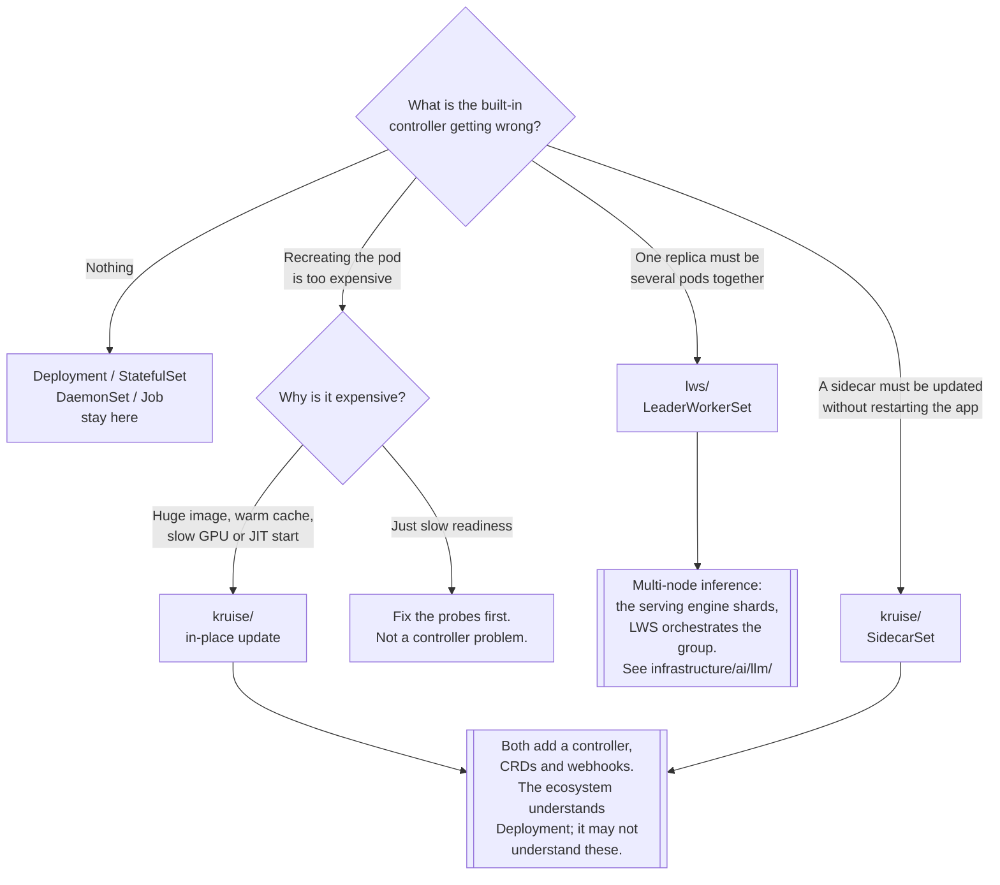

[← DevOps](../README.md)

# Advanced workloads

Controllers for the shapes Kubernetes' built-in workload types cannot express.

Tools covered: [`kruise`](kruise/README.md) · [`lws`](lws/README.md)

## Contents

1. [Where the built-in controllers stop](#1-where-the-built-in-controllers-stop)
2. [Two different gaps](#2-two-different-gaps)
3. [In-place updates: the headline capability](#3-in-place-updates-the-headline-capability)
4. [Leader-worker topologies and multi-node inference](#4-leader-worker-topologies-and-multi-node-inference)
5. [The cost of extra workload controllers](#5-the-cost-of-extra-workload-controllers)
6. [Decision tree](#6-decision-tree)
7. [Anti-patterns](#7-anti-patterns)
8. [How this applies to pikakube](#8-how-this-applies-to-pikakube)

---

## 1. Where the built-in controllers stop

Kubernetes ships four workload controllers, and each one encodes an assumption:

| Controller | Assumes |
|---|---|
| `Deployment` | pods are identical, interchangeable, and individually disposable |
| `StatefulSet` | pods have stable identity and ordered, one-at-a-time rollout |
| `DaemonSet` | one pod per node, and the node set is what varies |
| `Job` / `CronJob` | the work terminates |

Those cover most applications. They stop being enough in two specific situations, and this folder
holds one tool for each:

- **The update semantics are wrong.** Any change to a pod spec destroys and recreates the pod.
  For a large image, a warm cache, or a GPU that took two minutes to initialise, recreating a pod
  to change an environment variable is enormously expensive.
- **The unit of scale is not one pod.** A model that does not fit on one node is served by a
  *group* of pods that must be created, scheduled, restarted and counted together. Kubernetes has
  no built-in idea of a group as a replica.

## 2. Two different gaps

| | [**OpenKruise**](kruise/README.md) | [**LWS**](lws/README.md) |
|---|---|---|
| Fixes | how existing workload types **behave** | a workload **shape** that does not exist |
| Adds | `CloneSet`, `Advanced StatefulSet`, `Advanced DaemonSet`, `SidecarSet`, and more | one CRD: `LeaderWorkerSet` |
| Headline feature | **in-place pod update** — change the image without recreating the pod | a replica is a **leader plus N workers**, scheduled and restarted as a unit |
| Typical driver | large images, slow starts, sidecar fleets, controlled rollouts | multi-node LLM inference, sharded serving |
| Governance | CNCF, originally Alibaba | Kubernetes SIG (`kubernetes-sigs/lws`) |
| Scope | broad — a whole parallel set of controllers | narrow — deliberately one thing |

They are not alternatives. OpenKruise is a general extension of workload behaviour; LWS is a
single missing primitive.

## 3. In-place updates: the headline capability

This is the reason OpenKruise exists, and it is worth being precise about what "in-place" means.

A standard `Deployment` rollout, when the image tag changes:

1. create a new pod (new IP, new node possibly, new UID)
2. wait for it to become ready — image pull, container start, warm-up, readiness probe
3. terminate an old pod
4. repeat

An OpenKruise in-place update, for the same change:

1. update the container image on the **existing** pod
2. the kubelet restarts **that container**, in place

What is preserved, and why each one matters:

| Preserved | Why it matters |
|---|---|
| Pod name, UID and IP | no service-discovery churn, no connection re-establishment storm |
| Node assignment | no rescheduling, and no waiting for capacity |
| Volumes, including the local scratch already populated | no re-download, no re-warming |
| Already-pulled image layers on that node | only the changed layer is fetched |
| Sidecars not being changed | they keep running; only the target container restarts |

The gain is largest exactly where recreation hurts most: multi-gigabyte images, models loaded into
memory at start, GPU device initialisation, and JIT-warmed runtimes.

The limits are real and should be stated: an in-place update can change the **image** and some
metadata; it cannot change resource requests, node placement, or most of the pod spec. Anything
outside that envelope falls back to recreation. And because the pod object survives, a pod that
has been updated in place has a history that `kubectl get pods` alone will not show.

The related capability is `SidecarSet` — defining a sidecar **once, cluster-wide**, injected into
matching pods, and **updatable independently of the application container**. In an estate with a
mesh proxy or a log shipper in every pod, upgrading the sidecar normally means restarting every
application. With `SidecarSet` plus in-place update, it does not.

## 4. Leader-worker topologies and multi-node inference

LWS — **LeaderWorkerSet** — exists because of one concrete problem: **a model too large to serve
from a single node.**

When a model is sharded across several machines with tensor or pipeline parallelism, the serving
unit is a group: one leader that receives requests and coordinates, and N workers that hold the
remaining shards. That group has properties no built-in controller provides:

| Requirement | Why `StatefulSet` or `Deployment` cannot express it |
|---|---|
| The group is the replica | scaling means adding a whole group, not one pod |
| All-or-nothing readiness | the group serves nothing until every member is up |
| Group-level restart | if one worker dies the group is broken; restarting one pod does not repair it |
| Topology-aware placement | members should share a rack or a high-bandwidth interconnect |
| Rolling update by group | updating pod-by-pod would leave mixed-version shards mid-inference |

`LeaderWorkerSet` makes the group first-class: `replicas` counts groups, and
`leaderWorkerTemplate.size` says how many pods form one group. Restart policy, rolling update and
readiness all operate at group granularity.

This is the Kubernetes answer to distributed inference, and it connects directly to the LLM
serving work in `infrastructure/ai/llm/` — vLLM in particular supports multi-node deployment in
exactly this leader/worker shape. Anything with the same topology fits too: sharded search
indexes, distributed caches with a coordinator, MPI-style batch jobs that need co-scheduling.

The important scoping note: LWS solves the *orchestration* of the group. It does not do the
sharding — the serving engine does that, and LWS only guarantees the pods exist together, become
ready together, and die together.

## 5. The cost of extra workload controllers

Adding a workload controller is not free, and the costs are the kind that surface months later:

| Cost | Detail |
|---|---|
| **Ecosystem blindness** | HPA, PDBs, dashboards, policy engines and cost tools understand `Deployment`; a `CloneSet` may be invisible to them |
| **Webhooks in the critical path** | OpenKruise runs mutating and validating webhooks; if they are down, pod creation can be affected |
| **Upgrade coupling** | another controller that must track the Kubernetes version, with its own CRDs |
| **Migration is not free** | moving a `Deployment` to a `CloneSet` is a rewrite of the manifest and anything referencing it |
| **Debugging surface** | one more controller whose logs matter during an incident |

The honest rule: **install these when a specific built-in limitation is actually hurting**, not
because the feature list is impressive. A `Deployment` that rolls out in twenty seconds does not
need in-place updates.

## 6. Decision tree

## 7. Anti-patterns

| Anti-pattern | Why it is bad | What to do instead |
|---|---|---|
| Installing OpenKruise for the feature list | a parallel set of controllers, CRDs and webhooks to operate, for capabilities nothing uses | adopt it when a named limitation is measurably hurting |
| Migrating every `Deployment` to `CloneSet` | breaks tooling that only understands built-in kinds, for no gain on fast-starting apps | migrate only the workloads with an expensive rollout |
| In-place updates as a substitute for fixing startup | the real problem is a slow image or a bad probe, and it is still there | fix startup time; use in-place for what remains |
| Assuming in-place can change anything | it changes the image and little else; the rest silently falls back to recreation | know the envelope before designing a rollout around it |
| Modelling a leader-worker group as a `StatefulSet` | scaling, readiness and restart are all per-pod, so a broken group is never repaired as a unit | `LeaderWorkerSet` |
| Multi-node inference without topology awareness | shards land across racks and the interconnect becomes the bottleneck | topology-aware placement for group members |
| Ignoring the webhooks | a controller with admission webhooks sits in the pod-creation path | monitor them, and set failure policies deliberately |
| No PDB or HPA equivalent for custom kinds | autoscaling and disruption budgets do not carry over automatically | verify each one against the CRD before relying on it |

## 8. How this applies to pikakube

Both are deployed through Flux, and both are mapped rather than in production use:

| Tool | State |
|---|---|
| [OpenKruise](kruise/README.md) | HelmRelease, chart `1.7.3`, from the `openkruise` HelmRepository, default values, own namespace |
| [LWS](lws/README.md) | HelmRelease from an **`OCIRepository`** — `oci://registry.k8s.io/lws/charts/lws`, tag `0.6.1` — plus the upstream sample `LeaderWorkerSet` (3 groups of 4 nginx pods) |

Two details worth carrying forward:

**LWS ships its chart as an OCI artifact**, not a classic Helm repository. That is why its
manifest uses `chartRef` with an `OCIRepository` rather than `chart.spec` with a `HelmRepository` —
the same pattern any `registry.k8s.io` chart will need, and the reason to know it exists.

**The LWS example is nginx, not a model.** It proves the controller works — 3 groups × 4 pods —
and deliberately says nothing about inference. The real use is the one this folder is here for:
serving a model that does not fit on one node, together with the engines under
`infrastructure/ai/llm/`. Until a GPU workload actually needs it, LWS is a mapped primitive.

For OpenKruise, the trigger to look at again is a specific one: **a workload whose rollout is
dominated by image pull or start-up warm-up.** That is when in-place update stops being a feature
and starts being the reason to install it.

---

[← DevOps](../README.md)
