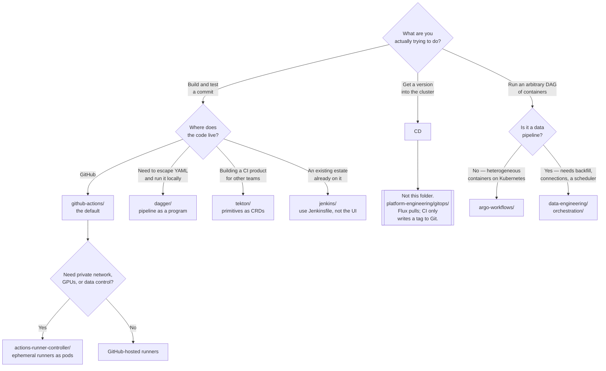

[← DevOps](../README.md)

# CI/CD

Building and testing what was committed — and the honest admission that on this platform the
"CD" half is done somewhere else.

Tools covered: [`github-actions`](github-actions/README.md) ·
[`argo-workflows`](argo-workflows/README.md) · [`dagger`](dagger/README.md) ·
[`tekton`](tekton/README.md) · [`jenkins`](jenkins/README.md) ·
[`jenkins-x`](jenkins-x/README.md) · [`pipecd`](pipecd/README.md) ·
[`spinnaker`](spinnaker/README.md) · [`release-please`](release-please/README.md)

## Contents

1. [CI and CD are not one thing](#1-ci-and-cd-are-not-one-thing)
2. [Push-based CD vs pull-based GitOps](#2-push-based-cd-vs-pull-based-gitops)
3. [The credentials consequence](#3-the-credentials-consequence)
4. [Runners: ephemeral, persistent, and on Kubernetes](#4-runners-ephemeral-persistent-and-on-kubernetes)
5. [Pipeline-as-code vs UI-configured jobs](#5-pipeline-as-code-vs-ui-configured-jobs)
6. [The tools, and what kind of thing each one is](#6-the-tools-and-what-kind-of-thing-each-one-is)
7. [Boundary: Argo Workflows is not only CI](#7-boundary-argo-workflows-is-not-only-ci)
8. [Decision tree](#8-decision-tree)
9. [Anti-patterns](#9-anti-patterns)
10. [How this applies to pikakube](#10-how-this-applies-to-pikakube)

---

## 1. CI and CD are not one thing

They are written with a slash because they usually run in the same tool, not because they are the
same problem.

| | **CI** | **CD** |
|---|---|---|
| Triggered by | a commit or a pull request | a passing build, or a promotion |
| Question answered | *does this change work?* | *is this version running in the cluster?* |
| Output | an artifact — an image, a package, a report | a changed cluster state |
| Failure mode | a red build | an outage |
| Needs cluster access | **no** | **yes**, if push-based |

The last row is the whole reason to separate them. CI needs a registry credential and nothing
else. CD needs the ability to change production. Merging them into one system means the thing
that runs untrusted code from pull requests is also the thing that holds cluster admin.

## 2. Push-based CD vs pull-based GitOps

This is the split that reframes the entire folder.

| | **Push** | **Pull (GitOps)** |
|---|---|---|
| Who applies the change | the CI pipeline, from outside | a controller, from inside the cluster |
| Where the credentials live | in the CI system | nowhere outside the cluster |
| Network direction | CI → cluster API, inbound | cluster → Git, outbound |
| Drift | undetected between runs | reconciled continuously |
| Source of truth | the last pipeline that ran | the repository, always |
| Rollback | re-run an older pipeline | revert a commit |
| Tools | Jenkins, GitHub Actions with `kubectl apply`, Spinnaker | Flux, Argo CD |

**This repository deploys with Flux — pull-based.** See
[`platform-engineering/gitops/`](../../platform-engineering/gitops/README.md), which is where the
CD decision actually lives.

The consequence is worth stating plainly rather than leaving implicit: **for this platform, the CD
half of the tools in this folder is largely not how anything gets deployed.** Spinnaker, PipeCD
and Jenkins X exist here as mapped alternatives, not as a deployment path. What remains genuinely
useful from this folder is:

- **CI** — build, test, scan, sign, push an image
- **workflow orchestration** — arbitrary DAGs of containers on Kubernetes, which is a different
  job entirely (see [section 7](#7-boundary-argo-workflows-is-not-only-ci))

The handoff between the two halves is a commit: CI builds `app:v1.4.2` and writes that tag into a
manifest in Git. Flux notices and does the rest. CI never talks to the cluster.

## 3. The credentials consequence

Push-based CD means the CI system holds a kubeconfig with rights to change production. In most
organisations that makes it **the single largest blast radius on the estate**, and it is rarely
treated that way.

What that credential is actually exposed to:

| Exposure | Detail |
|---|---|
| Pull-request code | a workflow triggered by a fork can run attacker-authored steps |
| Every plugin and action | a third-party action is arbitrary code with access to the job's environment |
| Every engineer with write access | anyone who can merge a pipeline change can use the credential |
| Log output | a secret echoed into a log is a secret published (see [`github-actions/workflows/`](github-actions/workflows/README.md)) |

Pull-based GitOps removes the credential entirely — there is nothing to steal because the
credential never leaves the cluster. That is the security argument for GitOps, and it is stronger
than the reproducibility one.

If push-based CD is unavoidable, the mitigations are: short-lived OIDC-federated credentials
rather than long-lived kubeconfigs, one credential scoped per environment, and separate runners
for pull-request builds and for deploys.

## 4. Runners: ephemeral, persistent, and on Kubernetes

Where the pipeline actually executes, and the choice that decides whether builds are reproducible.

| | **Ephemeral** | **Persistent** |
|---|---|---|
| Lifetime | one job, then destroyed | days or months |
| State between jobs | none | everything — caches, installed tools, leftover files |
| Reproducibility | high | degrades silently |
| Cold start | slower; no warm cache | fast |
| Compromise blast radius | one job | every subsequent job on that runner |

**Ephemeral is the correct default.** A persistent runner accumulates state until a build passes
only on that machine, and a job that installs something globally poisons every job after it.

On Kubernetes, ephemeral is the natural model: a job is a pod, the pod ends, the node is reused
but the filesystem is not. That is what
[`github-actions/actions-runner-controller/`](github-actions/actions-runner-controller/README.md)
provides — self-hosted GitHub Actions runners as pods, scaled by the controller against the number
of queued jobs.

Self-hosting runners is worth it for exactly three reasons, and none of them is cost alone:

1. **Network access** — the build needs to reach something private (a registry, a database, an
   internal package index)
2. **Hardware** — GPUs, ARM, large memory, or nodes the hosted fleet does not offer
3. **Data control** — source and secrets stay inside your own network boundary

The tax is real: you now operate the runner fleet, its autoscaling, its image, and its Docker
story. `containerMode: dind` — what this repository configures — means a privileged sidecar, which
is a security decision, not a default.

## 5. Pipeline-as-code vs UI-configured jobs

Jenkins is the reason this section exists.

| | **Pipeline-as-code** | **UI-configured** |
|---|---|---|
| Definition lives in | the repository, next to the code | the server's own database |
| Reviewed | yes, as a pull request | no |
| Versioned with the code | yes | no |
| Reproducible on a new server | yes | only from a backup |
| Branch-aware | each branch carries its own pipeline | one config for all branches |

Jenkins historically defaulted to **jobs configured by clicking**, and the result is the failure
mode everyone in that world has seen: a build server nobody can rebuild, whose configuration
exists only as mutable server state, changed by whoever last had the browser open. `Jenkinsfile`
and Job DSL fixed this, but the estates that predate them did not migrate, and Jenkins carries the
reputation.

Every other tool in this folder is code-first by construction. That is not a small difference —
it is the main thing the generation after Jenkins actually changed.

## 6. The tools, and what kind of thing each one is

They are not interchangeable. The useful classification is *what kind of thing it is*, not which
one is better.

| Tool | What kind of thing it is | Where it stands | Detail |
|---|---|---|---|
| **GitHub Actions** | hosted CI tied to the forge | the default when the code is on GitHub; enormous action ecosystem | [→](github-actions/README.md) |
| **Argo Workflows** | a general container-native workflow engine on Kubernetes | CI is one use; DAGs are the real product | [→](argo-workflows/README.md) |
| **Dagger** | pipelines written in a real programming language, running in containers | portable between CI systems; runs locally | [→](dagger/README.md) |
| **Tekton** | CI primitives as Kubernetes CRDs | a substrate to build on, not a product to use directly | [→](tekton/README.md) |
| **Jenkins** | the incumbent, plugin-driven | still everywhere; carries decades of accumulated state | [→](jenkins/README.md) |
| **Jenkins X** | an opinionated GitOps CI/CD bundle | past its peak; largely superseded | [→](jenkins-x/README.md) |
| **PipeCD** | pull-based CD with progressive delivery | genuinely pull-based, but overlaps with Flux and Argo CD | [→](pipecd/README.md) |
| **Spinnaker** | multi-cloud deployment orchestration | past its peak; very heavy | [→](spinnaker/README.md) |
| **release-please** | release automation, not a pipeline runner | sits beside CI; computes the version and changelog from commits | [→](release-please/README.md) |

Three of these deserve a sentence rather than a table row:

**Dagger is different in kind.** Everything else in this folder is YAML that a server interprets.
Dagger is a program — Go, Python, TypeScript — that describes a pipeline as a DAG of container
operations, executed by a local engine with content-addressed caching. The argument is escaping
YAML and, more importantly, **running the same pipeline on a laptop that runs in CI**. That
removes the commit-push-wait loop that dominates pipeline debugging everywhere else.

**Tekton is a substrate.** `Task`, `TaskRun`, `Pipeline`, `PipelineRun` as CRDs, with no opinion
about triggers, UI, or promotion. That is deliberate: Tekton exists so platform teams can build a
CI product on it. Using it raw means writing the layer that other tools ship with.

**Spinnaker and Jenkins X are both past their peak.** Spinnaker solved multi-cloud deployment
orchestration for a pre-Kubernetes-operator world; today its concerns are split across Argo CD,
Flux and [progressive-delivery](../../site-reliability-engineering/progressive-delivery/README.md)
tools, at a fraction of the operational cost — Spinnaker is roughly a dozen microservices. Jenkins
X bundled Jenkins, Tekton, GitOps and preview environments into one opinionated product, rewrote
itself around Tekton mid-life, and lost most of its momentum to Argo CD and Flux. Both are mapped
here for completeness. Neither is a reasonable greenfield choice in 2026.

## 7. Boundary: Argo Workflows is not only CI

Argo Workflows is filed under `cicd/`, and that is only half right. It is a **general workflow
engine**: arbitrary DAGs of containers, with parameters, artifacts, fan-out and retries. CI is one
thing you can express in it. So are ETL, batch ML training, and any pipeline whose steps are
containers.

That makes it overlap with [`data-engineering/orchestration/`](../../data-engineering/orchestration/README.md),
and the boundary is worth naming explicitly:

| | **Argo Workflows** | **Airflow** and friends |
|---|---|---|
| Native unit | a **container**, as a Kubernetes pod | a **task**, usually Python |
| Definition | a Kubernetes CRD (YAML) | Python code (a DAG file) |
| Runs on | Kubernetes only | anywhere; Kubernetes is one executor |
| Scheduling | `CronWorkflow`; event-driven via Argo Events | a first-class scheduler with backfill and catchup |
| Data awareness | none — steps are opaque containers | connections, hooks, sensors, dataset lineage |
| Best at | container-native DAGs on Kubernetes, any language | data pipelines, scheduled, with data-tooling integration |

The short version: **Argo Workflows is container-native DAGs on Kubernetes; Airflow is a
data-pipeline scheduler.** If the steps are heterogeneous containers, Argo. If the steps are data
tasks that need backfill, connections, and a scheduler that understands time windows, Airflow —
see [`orchestration/airflow/`](../../data-engineering/orchestration/airflow/README.md).

Choosing Argo Workflows *because it is already installed* is how a data platform ends up
reimplementing backfill in YAML.

## 8. Decision tree

## 9. Anti-patterns

| Anti-pattern | Why it is bad | What to do instead |
|---|---|---|
| CI holding a production kubeconfig | the largest blast radius on the estate, exposed to every pull request | pull-based GitOps; CI writes a tag to Git |
| `kubectl apply` as the deploy step | no drift detection, no reconciliation, and the last pipeline run is the source of truth | a controller reconciling from Git |
| Jobs configured through a UI | the pipeline is unreviewed, unversioned, and exists only as server state | pipeline-as-code in the repository |
| Persistent runners | state leaks between jobs until builds pass only on one machine | ephemeral runners, one job each |
| One runner pool for pull requests and deploys | fork-authored code shares a machine with deployment credentials | separate pools, separate credentials |
| Secrets echoed into build logs | logs are widely readable and retained; masking is best-effort, not a boundary | never print a secret; use OIDC and short-lived tokens |
| Unpinned third-party actions | `@main` is arbitrary code that can change under you between runs | pin to a commit SHA |
| Argo Workflows as a data orchestrator | no backfill, no connections, no scheduler semantics | [`orchestration/`](../../data-engineering/orchestration/README.md) |
| Logic hidden in a 300-line `run:` block | untestable, unrunnable locally, and CI-specific | a script in the repository, or Dagger |
| Adopting Spinnaker or Jenkins X new | both are past their peak and cost far more to run than what replaced them | Flux or Argo CD, plus a progressive-delivery controller |
| Pipelines that build from `latest` | the same commit produces different artifacts on different days | pin base images by digest |

## 10. How this applies to pikakube

**The CD half of this folder is not how this platform deploys.** Flux reconciles everything from
Git — every folder in this repository containing a `helm/helmrelease.yaml` is proof of it. Read
this folder as **CI plus workflow orchestration**, and read
[`platform-engineering/gitops/`](../../platform-engineering/gitops/README.md) for deployment.

What is actually deployed here, from the manifests:

| Tool | State |
|---|---|
| [Argo Workflows](argo-workflows/README.md) | HelmRelease, chart `0.45.2`, `secure: true`, plus a hand-written read-only RBAC role and a token for the UI |
| [Actions Runner Controller](github-actions/actions-runner-controller/README.md) | HelmRelease, `gha-runner-scale-set-controller` and `gha-runner-scale-set` both `0.9.3`, `min 1 / max 3`, `containerMode: dind` |
| [Jenkins](jenkins/README.md) | HelmRelease, chart `5.7.26`, default values |
| [Tekton](tekton/README.md) | HelmRelease from a `GitRepository` pointing at the operator repo, tag `v0.74.0` — **the URL has a stray `]` and is broken as written** |
| [Spinnaker](spinnaker/README.md) | a namespace only; nothing installed |
| [Dagger](dagger/README.md), [Jenkins X](jenkins-x/README.md), [PipeCD](pipecd/README.md) | mapped, not deployed |
| [release-please](release-please/README.md) | mapped, and **not applicable here** — this repository is manifests, not released software; its target would be a chart or an application repository |

The recorded findings that carry the most weight, all of them in the tool pages below:

- **Argo Workflows authentication is awkward.** The UI token has to be extracted from a
  ServiceAccount secret by hand, and the recorded verdict on the situation is blunt — see
  [`argo-workflows/`](argo-workflows/README.md).
- **ARC needs a PodMonitor written by hand**; the chart does not ship one, so metrics do not
  appear until you create it yourself — see
  [`actions-runner-controller/`](github-actions/actions-runner-controller/README.md).
- **The GitHub Actions secret-boundary experiments** in
  [`github-actions/workflows/`](github-actions/workflows/README.md) are the most valuable content
  in this folder: recorded, tested findings on what a reusable workflow can and cannot reach, and
  a demonstration that log masking is not a security boundary.

The direction that follows from all of it: keep CI on **GitHub Actions**, with self-hosted
ephemeral runners via ARC where private network access is needed; let CI end at *push an image and
write the tag to Git*; keep **Argo Workflows** for container DAGs that are not data pipelines; and
leave deployment to Flux.

---

[← DevOps](../README.md)
