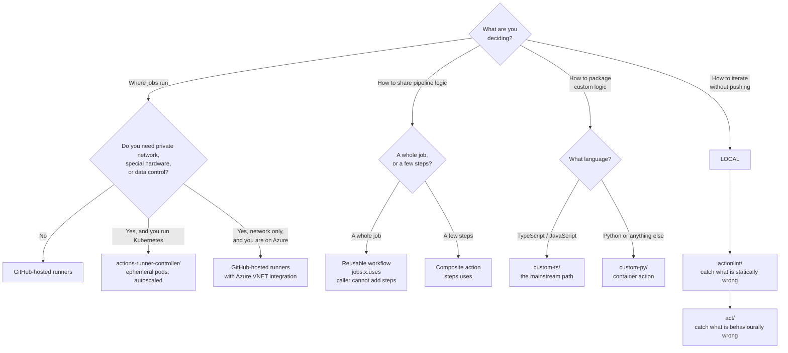

[← CI/CD](../README.md)

# GitHub Actions

CI attached to the forge — and the parts of it that only become visible once you run it seriously.

Tools covered: [`actions-runner-controller`](actions-runner-controller/README.md) ·
[`act`](act/README.md) · [`actionlint`](actionlint/README.md) ·
[`custom-py`](custom-py/README.md) · [`custom-ts`](custom-ts/README.md) ·
[`setup-kubectl`](setup-kubectl/README.md) · [`setup-helm`](setup-helm/README.md)

Local examples: [`workflows/`](workflows/README.md) — reusable workflows, and recorded experiments
on the secret boundary.

## Contents

1. [Why it wins by default](#1-why-it-wins-by-default)
2. [The model: workflow, job, step, action](#2-the-model-workflow-job-step-action)
3. [Runners: hosted, self-hosted, and ARC](#3-runners-hosted-self-hosted-and-arc)
4. [Reusable workflows vs composite actions](#4-reusable-workflows-vs-composite-actions)
5. [Secrets, and what is actually a boundary](#5-secrets-and-what-is-actually-a-boundary)
6. [The supporting tools](#6-the-supporting-tools)
7. [Decision tree](#7-decision-tree)
8. [Anti-patterns](#8-anti-patterns)
9. [Notes](#9-notes)
10. [How this applies to pikakube](#10-how-this-applies-to-pikakube)

---

## 1. Why it wins by default

Not because the YAML is good. Because of three things nothing else has together:

| | Detail |
|---|---|
| **Zero setup** | the code is already on GitHub; a file in `.github/workflows/` is the entire installation |
| **The Marketplace** | tens of thousands of actions, and the ones that matter (`checkout`, `cache`, `setup-*`, `docker/*`, cloud auth) are first-party and well maintained |
| **Native identity** | `GITHUB_TOKEN` per job, OIDC federation into AWS/Azure/GCP, and GitHub App tokens — no long-lived cloud credentials |

The cost side is equally real: the pipeline is **YAML interpreted by a server you do not control**,
which means the only way to test a change is to commit it and watch. That single fact drives most
of the tooling in this folder — [`act`](act/README.md) exists to run workflows locally,
[`actionlint`](actionlint/README.md) exists to catch errors before pushing, and
[Dagger](../dagger/README.md) exists to escape the model entirely.

## 2. The model: workflow, job, step, action

Four levels, and the isolation boundaries between them are what most mistakes come from.

| Level | What it is | Isolation |
|---|---|---|
| **Workflow** | one YAML file, one trigger | its own run |
| **Job** | a unit scheduled onto a runner | **a fresh machine** — nothing is shared with another job except declared outputs and artifacts |
| **Step** | one command or one action | same machine, same filesystem, same environment as its sibling steps |
| **Action** | a reusable step — JavaScript, container, or composite | runs inside the job, with the job's environment |

**Jobs are separate machines.** That is the rule people forget: a file written in job A does not
exist in job B, an environment variable does not carry, and — critically — **a secret available to
job A is not available to job B unless job B is also granted it**. That last point is recorded as
a tested finding in [`workflows/`](workflows/README.md).

Steps are the opposite: they share everything, including any secret loaded into the environment by
an earlier step.

## 3. Runners: hosted, self-hosted, and ARC

| | **GitHub-hosted** | **Self-hosted** |
|---|---|---|
| Setup | none | you operate the fleet |
| Lifetime | ephemeral by construction | ephemeral **only if you make it so** |
| Network | public egress; private access needs extra work | whatever the cluster can reach |
| Hardware | fixed images and sizes | GPUs, ARM, large memory, anything |
| Cost | per minute | your compute, plus the operations |
| Risk | someone else's problem | a persistent runner accumulates state and leaks it between jobs |

Self-hosting is worth it for three reasons, and cost alone is rarely the right one:

1. **Private network access** — an internal registry, a database, a package index
2. **Hardware** the hosted fleet does not offer
3. **Data control** — source and secrets never leave your network

On Kubernetes, [**actions-runner-controller**](actions-runner-controller/README.md) is the answer:
runners as pods, ephemeral by construction (a pod runs one job and ends), scaled by the controller
against the queue depth GitHub reports. It is the only reasonable way to self-host at scale, and
it comes with a genuine tax — the runner image, the Docker-in-Docker decision, and the
GitHub App authentication.

The fourth option, for organisations that need private networking without self-hosting: GitHub's
**Azure VNET integration** for hosted runners, which places hosted runners inside your virtual
network. Recorded in the [notes](#9-notes) below.

## 4. Reusable workflows vs composite actions

Both remove duplication. They are not the same thing and the difference is structural.

| | **Reusable workflow** | **Composite action** |
|---|---|---|
| Called with | `jobs.<id>.uses:` | `steps[].uses:` |
| Replaces | a whole **job** | a group of **steps** |
| Runs on | its own runner, its own machine | the caller's runner |
| Can define | multiple jobs, its own `runs-on`, its own `environment` | steps only |
| Secrets | passed explicitly, or `secrets: inherit` | the caller's environment is already there |
| Can the caller add steps to it? | **No** | not applicable — it *is* steps |

That last row is a recorded, tested finding from [`workflows/`](workflows/README.md): a job that
uses `uses:` cannot also have `steps:`, and therefore cannot have `outputs:` either, because
outputs are defined by referencing step IDs. It is a real isolation property, not a syntax
annoyance — the caller cannot inject code into the reusable workflow's job.

The practical rule: **reusable workflow when you are sharing a pipeline; composite action when you
are sharing a few steps.**

## 5. Secrets, and what is actually a boundary

Three mechanisms, and only two of them are boundaries.

| Mechanism | Is it a boundary? |
|---|---|
| **Job isolation** | **Yes.** A secret given to one job is not available in another |
| **Environments** | **Yes.** Scoped per repository, with optional approval gates — and, as recorded, **not shareable across repositories** |
| **Log masking** | **No.** Best-effort string replacement, trivially defeated |

The masking point deserves being explicit because it is the one people rely on. GitHub replaces
exact matches of a secret's value in log output with `***`. Anything that transforms the value —
splitting it, encoding it, printing it a character at a time — passes straight through. There is a
committed workflow in [`workflows/`](workflows/README.md) that demonstrates precisely this, which
is the correct way to learn it: **treat masking as accident prevention, never as a control.**

The design that follows: prefer **OIDC federation** over stored secrets wherever the target
supports it, so there is a short-lived token instead of a long-lived value; scope secrets to
environments with required reviewers for anything that touches production; and never run
fork-triggered workflows on the same runner pool as anything privileged.

## 6. The supporting tools

| Tool | What it is for | Detail |
|---|---|---|
| **actions-runner-controller** | self-hosted ephemeral runners as Kubernetes pods, autoscaled | [→](actions-runner-controller/README.md) |
| **act** | run workflows **locally**, in Docker, before pushing | [→](act/README.md) |
| **actionlint** | static analysis of workflow YAML — expressions, `runs-on`, shell scripts | [→](actionlint/README.md) |
| **custom-ts** | writing your own action in TypeScript, the mainstream path | [→](custom-ts/README.md) |
| **custom-py** | writing your own action in Python, as a container action | [→](custom-py/README.md) |
| **setup-kubectl** | installing a **pinned** `kubectl` in a job — and the question of why the job needs one | [→](setup-kubectl/README.md) |
| **setup-helm** | the same, for `helm` — where chart *linting and publishing* are the good cases and `helm upgrade` is the bad one | [→](setup-helm/README.md) |

The last two are the odd entries in this table: they are Marketplace actions rather than tools you
operate, and they are documented here because a `setup-kubectl` or `setup-helm` step is the most
reliable place in a workflow to find the deploy-from-CI anti-pattern from
[section 8](#8-anti-patterns) sitting directly beneath it. Both are published by `Azure`, both are
third-party by the rule in that section, and both default to `latest`.

`act` and `actionlint` together address the same weakness from opposite ends — the commit-push-wait
loop. `actionlint` catches what is statically wrong; `act` catches what is behaviourally wrong.
Neither is optional on a repository with more than a couple of workflows.

## 7. Decision tree

## 8. Anti-patterns

| Anti-pattern | Why it is bad | What to do instead |
|---|---|---|
| Unpinned third-party actions (`@main`, `@v3`) | arbitrary code that can change between runs, with access to the job environment | pin to a commit SHA |
| Long-lived cloud keys in repository secrets | a stored credential that never expires and is reachable from every workflow | OIDC federation, short-lived tokens |
| Trusting log masking | best-effort string replacement, defeated by any transformation | never print secrets; scope them per job |
| `secrets: inherit` everywhere | hands a reusable workflow every secret the caller has, not the ones it needs | pass the specific secrets |
| Fork PRs on privileged runners | attacker-authored code on a machine that holds credentials | a separate pool; `pull_request` not `pull_request_target` |
| `pull_request_target` with a checkout of the PR head | runs fork code with the base repository's secrets — the classic escalation | do not; use `pull_request` |
| Persistent self-hosted runners | state leaks between jobs until builds pass only on one machine | ephemeral runners, one job each |
| 200-line `run:` blocks | untestable, unrunnable locally, and locked to GitHub | a script in the repository, or [Dagger](../dagger/README.md) |
| Copy-pasting the same job into every repository | one fix has to be made N times | a reusable workflow in a central repository |
| Expecting a job's outputs to carry secrets | jobs are isolated machines; outputs are not a secret channel | pass secrets explicitly to each job |
| No workflow linting | a typo in an expression fails only after a push, a queue and a runner | [`actionlint`](actionlint/README.md) in pre-commit and in CI |
| `kubectl apply` as the last step | CI now holds cluster admin — see [CI/CD §3](../README.md#3-the-credentials-consequence) | write the image tag to Git; let Flux deploy |

## 9. Notes

The recorded links, grouped by what each one is actually about.

**Private networking for hosted runners.** The Azure VNET integration lets GitHub-hosted runners
run inside your own virtual network — hosted convenience with private reachability, which is the
main reason people self-host in the first place. Worth evaluating *before* taking on a runner
fleet:

- <https://docs.github.com/en/organizations/managing-organization-settings/about-azure-private-networking-for-github-hosted-runners-in-your-organization>
- <https://docs.github.com/en/organizations/managing-organization-settings/configuring-private-networking-for-github-hosted-runners-in-your-organization>
- <https://www.youtube.com/watch?v=8xYz_oCQQsg>

**The first-party actions that matter.** These are the ones GitHub maintains, and the reason the
Marketplace is a genuine advantage rather than a liability:

- <https://github.com/actions/checkout> — clones the repository; almost every workflow's first
  step. Its fetch depth and token behaviour are the source of a surprising number of bugs
- <https://github.com/actions/cache> — the dependency cache. The difference between a two-minute
  and a twelve-minute build, and the correctness of the cache key is entirely on you
- <https://github.com/actions/runner-images> — **what is actually preinstalled** on hosted
  runners. This is the reference to check before adding a `setup-*` step, and the changelog to
  watch when a build breaks with no change on your side
- <https://github.com/actions/create-github-app-token> — mints a short-lived GitHub App token.
  The correct replacement for a personal access token when a workflow needs to act beyond its own
  repository
- <https://github.com/actions/github-script> — run JavaScript against the GitHub API inline,
  without writing a whole action. The pragmatic middle ground between a `curl` and
  [`custom-ts`](custom-ts/README.md)
- <https://github.com/actions/labeler> — labels pull requests by changed paths
- <https://github.com/peter-evans/create-pull-request> — the standard way for a workflow to open a
  PR with its own changes. This is the mechanism behind the *CI writes a tag, GitOps deploys it*
  pattern that this platform uses
- <https://github.com/aws-actions/configure-aws-credentials> and
  <https://github.com/aws-actions/amazon-ecr-login> — the AWS pair. The first is what makes OIDC
  federation practical: assume a role from GitHub's identity token, no stored keys

**Two recorded discussions**, both long-standing gaps rather than bugs:

- <https://github.com/orgs/community/discussions/9050> — a community discussion thread on
  Actions behaviour, kept as a reference to the fact that several of the platform's rough edges
  live in discussions rather than in the documentation
- <https://github.com/actions/runner/issues/826> — an open runner issue; the runner repository is
  where self-hosted behaviour is actually decided, and worth watching separately from the Actions
  documentation

The pattern across all of these is worth stating: **GitHub Actions' real documentation is
distributed across `actions/runner`, `actions/runner-images` and community discussions**, and
several important behaviours are only recorded there.

## 10. How this applies to pikakube

GitHub Actions is the CI system for this platform, and this folder is unusual in the repository:
it holds **tested findings**, not just mapped tools.

**What is deployed:** [ARC](actions-runner-controller/README.md), via Flux —
`gha-runner-scale-set-controller` and `gha-runner-scale-set`, both chart `0.9.3`, with a runner
scale set named `runner-mtolv` pointed at `github.com/andreyolv/plumbers`, `minRunners: 1`,
`maxRunners: 3`, `containerMode: dind`. That is a working self-hosted fleet, small on purpose.

**What is written down:** the [`workflows/`](workflows/README.md) folder is the most valuable part
of this directory. It contains a reusable Docker build-and-push workflow that is a genuinely
complete supply-chain pipeline — hadolint, Dockle, Trivy, a smoke-test run, then push — and, next
to it, deliberate experiments on the secret boundary with the results recorded as comments. Those
experiments establish, by test rather than by reading documentation:

- a job using `uses:` cannot have `steps:`, and therefore cannot have `outputs:`
- a downstream job cannot read a secret from an upstream job
- **environments are per repository and do not cross repository boundaries** — which constrains
  how reusable workflows can be gated
- log masking is defeated by transforming the value

**The direction this sets:** CI ends at *push an image and open a PR that updates the tag*. It
does not deploy. The cluster credential stays in the cluster, with Flux — see
[`platform-engineering/gitops/`](../../../platform-engineering/gitops/README.md).

The gap worth closing: image signing is written and **commented out** in the reusable workflow.
Cosign is installed by the pipeline but never used to sign. That is a known, deliberate loose end
rather than an oversight.

---

[← CI/CD](../README.md)
