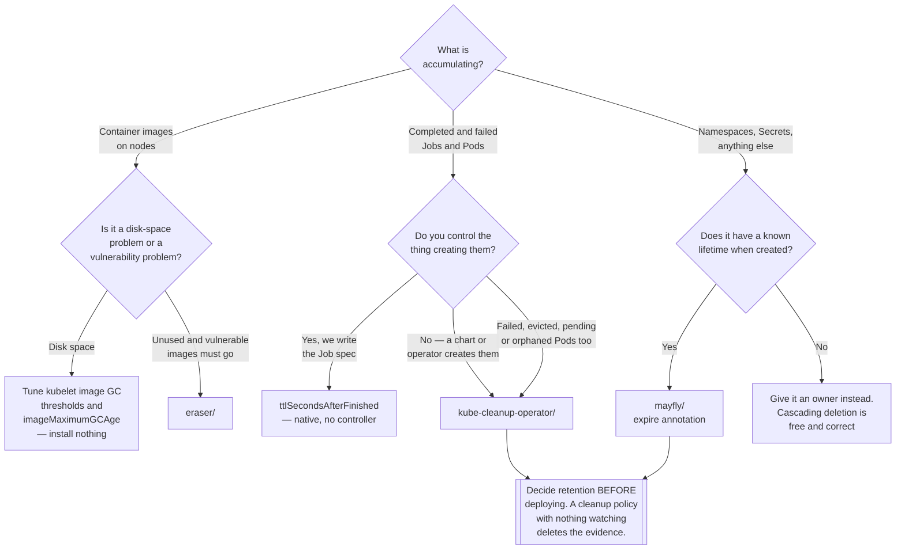

[← DevOps](../README.md)

# Cleanup

Clusters accumulate. Nothing in Kubernetes is responsible for removing what is no longer needed.

Tools covered: [`eraser/`](eraser/README.md) ·
[`kube-cleanup-operator/`](kube-cleanup-operator/README.md) · [`mayfly/`](mayfly/README.md)

## Contents

1. [The problem](#1-the-problem)
2. [What Kubernetes already does](#2-what-kubernetes-already-does)
3. [The three tools, and what each is for](#3-the-three-tools-and-what-each-is-for)
4. [Decision tree](#4-decision-tree)
5. [The risk nobody plans for](#5-the-risk-nobody-plans-for)
6. [Anti-patterns](#6-anti-patterns)
7. [How this applies to pikakube](#7-how-this-applies-to-pikakube)

---

## 1. The problem

Kubernetes creates things eagerly and deletes them reluctantly. Both behaviours are deliberate —
keeping a failed Pod is how you find out why it failed — and the combination means that a cluster
left alone gets steadily worse in four specific ways:

| What accumulates | Why nothing removes it | What it eventually costs |
|---|---|---|
| **Completed Jobs and their Pods** | a `CronJob` running every five minutes creates a Job every five minutes | thousands of objects per namespace; `kubectl get pods` becomes useless; etcd carries dead state |
| **Failed and evicted Pods** | kept deliberately, so somebody can diagnose them | nobody does, and the failures that matter are hidden among four hundred that do not |
| **Container images on nodes** | the kubelet only removes them under disk pressure | nodes fill up at 03:00; unused vulnerable images stay on disk for months |
| **Test namespaces and one-off resources** | created by a human who intended to clean up | they are still there a year later, and nobody dares delete them |

The fourth is the worst, because the cost is not resources — it is that nobody can tell which parts
of the cluster are load-bearing. A namespace called `test-migration-2` with a running Deployment
could be anything. That uncertainty is what makes clusters hard to change.

## 2. What Kubernetes already does

Before adding a controller, know what is native — this is a category where a meaningful part of the
problem is solved in the API and people install tools anyway.

| Native mechanism | What it covers | What it does not |
|---|---|---|
| **`ttlSecondsAfterFinished`** on a `Job` | deletes the Job, and its Pods, a set time after it finishes | only `Job`. Not failed Pods, not evicted Pods, not anything else |
| **`spec.successfulJobsHistoryLimit` / `failedJobsHistoryLimit`** on a `CronJob` | caps how many Job objects a CronJob keeps | only Jobs created by that CronJob |
| **Kubelet image garbage collection** (`imageGCHighThresholdPercent`, `imageGCLowThresholdPercent`) | evicts images when disk usage crosses a threshold | reactive — it acts at the point disk is already a problem |
| **`imageMaximumGCAge`** (recent Kubernetes versions) | evicts images unused for longer than a set age | still node-local and unaware of vulnerability status |
| **`OwnerReference` and cascading deletion** | deleting a parent removes its children | only helps when there is a parent, and when someone deletes it |

**`ttlSecondsAfterFinished` is the important row.** If Jobs are the whole problem, set the field and
install nothing. It is native, it travels with the object that created the Job, and it needs no
controller to be running for the cluster to behave correctly.

A tool earns its place where the native mechanisms do not reach:

- **failed, evicted, pending and orphaned Pods** — no native TTL exists for any of them
- **Jobs created by third parties** — a chart or an operator that does not set the field, which you
  would otherwise have to patch
- **arbitrary resources** — namespaces, Secrets, Deployments, anything with a lifetime
- **images that are unused *and* vulnerable**, rather than merely occupying disk

## 3. The three tools, and what each is for

| Tool | Operates on | Trigger | Native equivalent |
|---|---|---|---|
| [eraser](eraser/README.md) | **node state** — container images | scheduled scan, or an explicit image list | kubelet image GC covers the disk-space half |
| [kube-cleanup-operator](kube-cleanup-operator/README.md) | **API objects** — Jobs and Pods | time in a terminal state | `ttlSecondsAfterFinished` covers successful Jobs only |
| [mayfly](mayfly/README.md) | **API objects** — anything | an annotation naming a lifetime | none |

The split worth holding on to: **eraser is the only one that deals with what is on a machine.** The
other two delete API objects. A cluster can need one and not the other, and the failures are
different — a full disk versus an unreadable namespace.

The second split is about *what decides*: kube-cleanup-operator understands **terminal states**
(succeeded, failed, evicted, orphaned) and applies a policy per state. mayfly understands only
**elapsed time**, on anything. That makes mayfly far more general and correspondingly blunter.

## 4. Decision tree

## 5. The risk nobody plans for

Every tool in this folder deletes things, on a timer, without asking. That is the point, and it is
also the whole risk. Two failure modes are worth naming before adopting any of them:

**Deleting the evidence.** Set `--delete-failed-after=60m` and failures are gone an hour after they
happen. If nothing alerts on failed Jobs, that hour is the entire window in which anyone could have
noticed — and the cluster now looks healthy, because the record of it not being healthy was cleaned
up on schedule. **Retention is only safe when something else is watching.** Metrics and alerting
must come first; cleanup second.

**The annotation that spreads.** `mayfly.cloud.namecheap.com/expire: 5m` in a template that gets
copied is a deletion policy propagating by accident. Annotations are inherited casually and read
rarely.

The rule that avoids both: **decide the retention window deliberately, and make sure something
observes what is being removed.** A cleanup policy is a data-retention decision wearing operational
clothing.

## 6. Anti-patterns

| Anti-pattern | Why it is bad | What to do instead |
|---|---|---|
| Installing a controller to delete completed Jobs | `ttlSecondsAfterFinished` is native and needs nothing running | set the field on the Job |
| Deleting failed Jobs quickly with no alerting | the failure record is removed before anyone sees it | alert first, then set retention |
| A `CronJob` running `kubectl delete` on a schedule | the intent lives in a script; nothing declares it; it fails silently | a controller, or a native TTL field |
| Raising kubelet GC thresholds to stop disk alerts | treats the symptom and shortens the warning | find what is filling the nodes; [eraser](eraser/README.md) if it is images |
| A TTL annotation copied into a shared template | resources start expiring where nobody intended | keep expiry annotations out of anything reusable |
| Cleanup as the answer to "the cluster is untidy" | untidiness is usually unowned resources, not undeleted ones | ownership labels first; deletion is safe only once ownership is known |
| Two cleanup controllers with overlapping scope | when something vanishes, nobody can say which one did it | one tool per class of object |
| Deploying mayfly to delete finished Jobs | it deletes on elapsed time and knows nothing about completion | `ttlSecondsAfterFinished`, or [kube-cleanup-operator](kube-cleanup-operator/README.md) |

## 7. How this applies to pikakube

Two of the three are **deployed**, which is unusual for a folder in this discipline:

| Tool | State |
|---|---|
| [kube-cleanup-operator](kube-cleanup-operator/README.md) | deployed via Flux, chart `1.0.4`, cluster-wide, with an explicit per-state policy |
| [mayfly](mayfly/README.md) | deployed via Flux, with a `ScheduledResource` example exercising all three schedule forms |
| [eraser](eraser/README.md) | mapped only — no manifests |

The configured retention on kube-cleanup-operator is a set of judgements worth revisiting rather
than defaults worth ignoring: successful Jobs go after **3 minutes**, failed after **60 minutes**,
and pending, evicted and orphaned Pods after **15 minutes**.

Three minutes for successes is right — a successful Job is evidence of nothing. **Sixty minutes for
failures is the one to argue about**, per section 5. On a platform running
[Airflow](../../data-engineering/orchestration/airflow/README.md) and other batch workloads, a
failed Job deleted an hour later is a failed Job that must be caught by alerting within the hour or
not at all. That alerting is the prerequisite this setting quietly assumes.

**The gap worth naming:** node image accumulation is unaddressed. eraser is documented and not
deployed, and the kubelet's thresholds are whatever the distribution set. On a platform where CI
builds a new image tag per commit, that is the accumulation most likely to cause a real incident,
and the cheapest first step is not eraser — it is checking what `imageGCHighThresholdPercent` and
`imageMaximumGCAge` are currently set to.

---

[← DevOps](../README.md)
