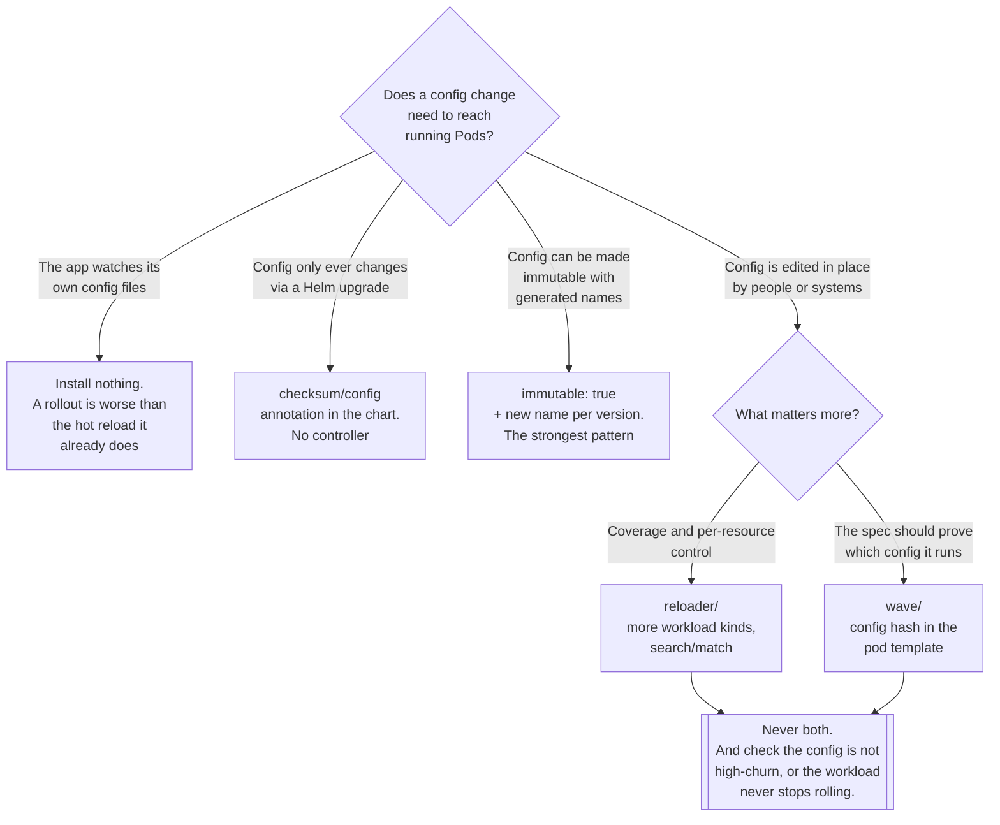

[← DevOps](../README.md)

# Config reload

A ConfigMap changes and the Pods using it carry on with the old values. Nothing reports an error.

Tools covered: [`reloader/`](reloader/README.md) · [`wave/`](wave/README.md)

## Contents

1. [The problem, precisely](#1-the-problem-precisely)
2. [Why the annotation-checksum approach is the right one](#2-why-the-annotation-checksum-approach-is-the-right-one)
3. [Reloader or Wave](#3-reloader-or-wave)
4. [When you need neither](#4-when-you-need-neither)
5. [Decision tree](#5-decision-tree)
6. [Anti-patterns](#6-anti-patterns)
7. [How this applies to pikakube](#7-how-this-applies-to-pikakube)

---

## 1. The problem, precisely

Update a ConfigMap. `kubectl get configmap` shows the new value. The Deployment references it. The
Pods are `Running` and `Ready`. Everything reports healthy.

The application is still using the old value, and will be until something restarts it.

This is not a bug — it follows from how configuration reaches a container, and the details differ by
mechanism:

| How the config is consumed | What happens on update | Why |
|---|---|---|
| `env` / `envFrom` | **nothing, ever** | environment variables are set at process start and are immutable for the life of the process |
| Volume mount | the file on disk is updated eventually | the kubelet refreshes it on its sync interval — typically around a minute, plus cache TTL |
| `subPath` volume mount | **nothing, ever** | a `subPath` mount is not refreshed at all; this catches people who thought volume mounts were safe |

So even in the volume case, the file changes and **nothing tells the application**. Unless the
process watches the file itself — and most do not — the outcome is identical to the environment
variable case.

What makes this genuinely dangerous is that it fails **silently and asymmetrically**. Every
indicator says the change was applied. It usually is applied, later, when something unrelated
causes a restart — a node drain, a scale event, an image bump — at which point behaviour changes
for a reason nobody connects to a ConfigMap edited three weeks earlier. Debugging that from the
other end is genuinely hard.

For Secrets it is worse than confusing: a rotated database credential or a renewed certificate that
running Pods never pick up is an outage scheduled for whenever the old one expires.

## 2. Why the annotation-checksum approach is the right one

There is an obvious solution — watch for changes and delete the Pods — and it is wrong. Deleting
Pods bypasses the Deployment's rollout strategy entirely: no surge control, no `maxUnavailable`, no
readiness gating between replicas, no respect for a `PodDisruptionBudget`. Under a controller doing
this at scale, "a ConfigMap changed" and "the service went down" become the same event.

Both tools here instead **change the pod template**, by writing a value into an annotation on
`spec.template.metadata.annotations`:

```
1. configuration changes
2. the controller writes a new value into a pod-template annotation
3. the pod template hash changes
4. the Deployment controller sees a new desired ReplicaSet
5. an ordinary rolling update happens
```

The whole benefit is in step 5. Everything the platform already knows about safe rollouts applies
unchanged, because from Kubernetes' point of view this is not a special operation — it is the same
thing that happens when you change an image tag. Surge and unavailability limits are respected,
readiness probes gate each replica, disruption budgets hold, `kubectl rollout status` reports it,
`kubectl rollout undo` reverses it, and the change is visible in the Deployment's revision history.

That last point is worth dwelling on: because the annotation is part of the pod template, the
rollout is **auditable**. There is a revision recording that the workload restarted, with a
different annotation value than the revision before it. A controller that deleted Pods would leave
no such trace.

The two tools differ only in **what value they write**:

| | What goes in the annotation | What it means |
|---|---|---|
| [Reloader](reloader/README.md) | a change marker, written when a watched resource changes | *"something changed, roll"* |
| [Wave](wave/README.md) | a **SHA-256 hash of the referenced configuration** | *"this workload is running exactly this configuration"* |

Wave's is a statement about state; Reloader's is a record of an event. That difference is the whole
of section 3.

## 3. Reloader or Wave

| | [Reloader](reloader/README.md) | [Wave](wave/README.md) |
|---|---|---|
| Model | **reacts** to a change | **encodes** the configuration into the spec |
| Annotation value | change marker | SHA-256 of all referenced ConfigMaps and Secrets |
| Workload kinds | Deployment, StatefulSet, DaemonSet, Rollout, CronJob | Deployment, StatefulSet, DaemonSet |
| Selecting what triggers a reload | `auto`, or named ConfigMaps/Secrets, or `search`/`match` from both sides | automatic — whatever the pod spec references |
| Opt-in | annotation on the workload | annotation on the workload |
| Side effects | none on the configuration resources | adds an `OwnerReference` from the workload onto them |
| Answers "is this Pod running current config?" | no — you infer it from restart time | **yes, by comparing the hash** |

**Reloader is the better default**, on coverage and control: more workload kinds, and the
`search`/`match` pair, which lets the owner of a shared ConfigMap decide whether editing it may
restart other people's workloads. On a multi-tenant cluster that is a real property.

**Wave is the better model**, for a GitOps platform. GitOps asserts that the cluster matches the
repository. A workload whose spec does not change when its configuration does is a hole in that
assertion — the Deployment is identical in both cases, and only the running Pods differ. Wave's hash
closes it: the desired state now includes a fingerprint of the configuration, so a stale workload is
visible by inspection rather than by inference.

Which to pick depends on which question gets asked more often. "Why didn't my change take effect?"
argues for Reloader's coverage. "Is this workload running the current configuration?" argues for
Wave's hash.

**Do not run both.** Two controllers annotating the same pod template means two competing sources of
rollout, and no clear answer when a workload restarts.

## 4. When you need neither

This folder is easy to over-apply. Three cases where the right answer is no tool at all:

**The application already hot-reloads.** Reverse proxies, log collectors, most controllers and many
Go services watch their configuration files and apply changes in place. Restarting them on change is
strictly worse than what they already do — it converts a zero-downtime update into a rollout.

**The configuration is generated as part of the deployment.** Helm's `checksum/config` annotation
pattern — a `sha256sum` of the ConfigMap template written into the pod template — does exactly what
Wave does, at template-render time, with no controller. If configuration only ever changes via a
chart upgrade, that is a complete solution:

```
annotations:
  checksum/config: {{ include (print $.Template.BasePath "/configmap.yaml") . | sha256sum }}
```

**The configuration is immutable by design.** `immutable: true` on a ConfigMap or Secret means it
cannot be updated at all — a new one is created with a new name, the workload is updated to
reference it, and the rollout happens because the pod spec changed. That is the strongest pattern
in this whole area: no controller, no annotation, no watching, and the reference in the Deployment
is always an honest statement of what is running. It also removes load from the API server, since
the kubelet stops watching immutable resources for changes.

If the platform can adopt immutable configuration with generated names, it should, and this folder
becomes unnecessary. Most cannot, because something somewhere edits a ConfigMap in place.

## 5. Decision tree



## 6. Anti-patterns

| Anti-pattern | Why it is bad | What to do instead |
|---|---|---|
| Assuming a volume-mounted ConfigMap is picked up | the file updates, but nothing tells the process — and with `subPath` the file does not update either | a tool here, or an app that watches the file |
| `kubectl rollout restart` by hand after every edit | works until somebody forgets, and somebody forgets | annotate the workload once |
| A controller that deletes Pods on config change | bypasses surge, maxUnavailable, readiness and PDBs | the annotation-checksum approach — section 2 |
| Running Reloader and Wave together | two controllers annotating the same template; no clear cause for a restart | pick one |
| `auto` reload on a high-churn ConfigMap | the workload restarts continuously and never stabilises | name the specific resources, or reconsider the design |
| Reloading an app that hot-reloads already | turns a zero-downtime update into a rollout | leave it alone |
| Rotating a Secret and assuming Pods picked it up | the outage arrives when the old credential expires | this folder exists for exactly this case |
| A shared ConfigMap with `auto` on every consumer | one edit restarts a dozen unrelated workloads | Reloader's `search`/`match`, so the source consents |
| Editing ConfigMaps in place under GitOps | the repository and the cluster agree, while the Pods disagree with both | immutable ConfigMaps with generated names |

## 7. How this applies to pikakube

Both tools are **deployed** via Flux — [Reloader](reloader/README.md) from the Stakater Helm
repository, and [Wave](wave/README.md) as chart `wave-k8s` version `4.5.0`.

Per section 3, that is the one configuration this folder advises against. Running both is not
harmful in itself — each only acts on workloads carrying its own annotation — but it means two
mechanisms for the same job, and when a workload restarts unexpectedly, working out which controller
did it is a step nobody should have to take. **This is worth resolving to one**, and the argument in
section 3 points at Wave for a GitOps platform and at Reloader for coverage.

**The with/without demonstration under [`reloader/`](reloader/README.md) is the most valuable thing
in this folder.** Two identical Flask Deployments — `flask-with` and `flask-without` — both consume
a ConfigMap (`database_url`) and a Secret (`db_password`) as environment variables. The only
difference between them is one line:

```
reloader.stakater.com/auto: "true"
```

Both use `strategy: Recreate`, so the difference is immediate and unambiguous rather than blended
into a rolling update. Editing the ConfigMap rolls one and leaves the other serving stale values.

That is worth running once, because this is a failure with **no symptom**. Every other problem in
this discipline announces itself — a Pod crashes, a build fails, an alert fires. This one produces a
healthy cluster serving the wrong configuration, and the only way to develop an instinct for it is
to watch it happen side by side.

**The gap worth naming:** neither tool addresses the case in section 4 that would remove the need for
either. Nothing in this repository uses immutable ConfigMaps with generated names, which is the
pattern that makes the whole category unnecessary and makes the Deployment spec an honest record of
what is running. For configuration managed through
[Flux](../../platform-engineering/gitops/flux/README.md) that is a realistic option, and it is
strictly better than annotating workloads and hoping a controller is healthy.

---

[← DevOps](../README.md)
