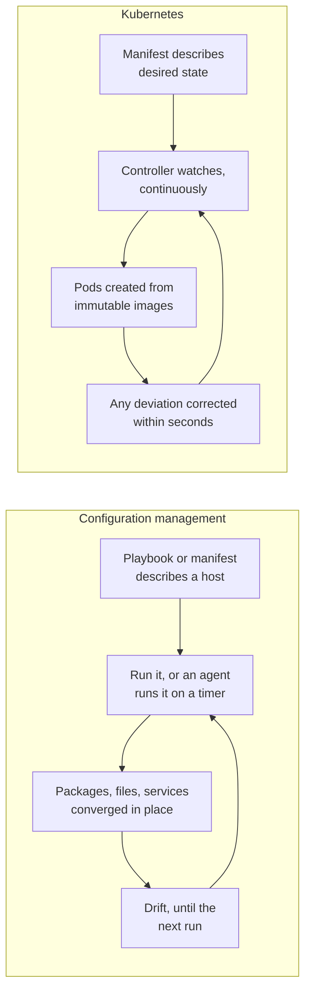
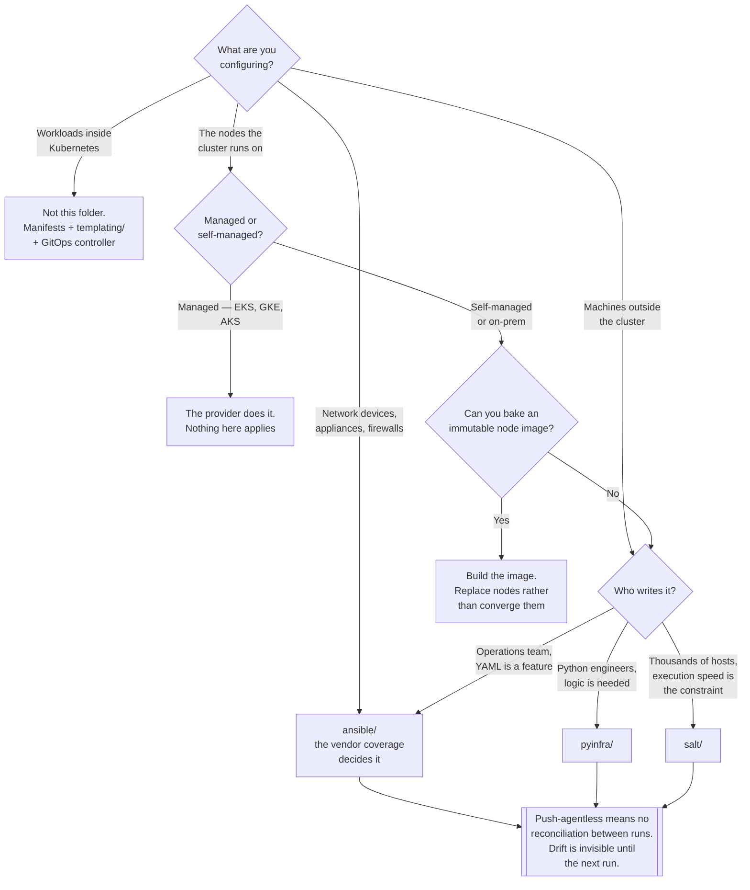

[← DevOps](../README.md)

# Configuration management

The pre-Kubernetes answer to configuration drift. Mostly not how you configure a Kubernetes platform.

Tools covered: [`ansible/`](ansible/README.md) · [`pyinfra/`](pyinfra/README.md) ·
[`salt/`](salt/README.md) · [`puppet/`](puppet/README.md) · [`chef/`](chef/README.md)

## Contents

1. [The honest framing](#1-the-honest-framing)
2. [The two models, side by side](#2-the-two-models-side-by-side)
3. [Where these tools still legitimately apply](#3-where-these-tools-still-legitimately-apply)
4. [The five tools, ranked by relevance](#4-the-five-tools-ranked-by-relevance)
5. [Push and pull, agent and agentless](#5-push-and-pull-agent-and-agentless)
6. [Decision tree](#6-decision-tree)
7. [Anti-patterns](#7-anti-patterns)
8. [How this applies to pikakube](#8-how-this-applies-to-pikakube)

---

## 1. The honest framing

This folder needs a warning at the top, because the tools in it are famous and the instinct to reach
for them is strong.

Ansible, Chef, Puppet and Salt were built for a world of **mutable, long-lived servers**. A machine
existed for years, was modified in place, and drifted — someone patched a package by hand, someone
edited `/etc/nginx/nginx.conf` during an incident, someone installed a debugging tool and left it.
These tools solve that: they describe the desired state of a host and converge it, repeatedly.

**That problem does not exist inside Kubernetes.** The model there is different in every dimension
that mattered:

| Configuration management | Kubernetes |
|---|---|
| The server is long-lived and mutated in place | the container is immutable; you replace it, you do not patch it |
| Desired state is described per host | desired state is described per workload, and the scheduler decides which host |
| Convergence is a tool you run, or an agent on a timer | reconciliation is a controller, running continuously, as the core design of the system |
| Drift is corrected on the next run | drift is corrected within seconds, because a controller is watching |
| The unit of change is a package or a file | the unit of change is an image tag |

Kubernetes is, in a real sense, a configuration-management system that won by moving the boundary:
instead of converging the contents of a machine, it converges the *set of things running*, and makes
the contents of each thing immutable so there is nothing left to converge.

**So say it plainly: these tools are not how you configure a Kubernetes platform.** Using Ansible to
manage what runs in a cluster means running a push-based tool against a system whose controllers are
already asserting state, which produces a fight — and it defeats GitOps, where the repository is
supposed to be the source of truth and a controller is supposed to be the only thing applying it.

This folder is not a graveyard, though, and section 3 is why.

## 2. The two models, side by side

The shapes are similar and the loop tightness is not. That gap — minutes and drift versus seconds
and no drift — is the whole reason one displaced the other.

## 3. Where these tools still legitimately apply

Kubernetes configures what runs **inside** the cluster. Something has to exist for the cluster to run
on, and that something is not Kubernetes:

| Where | Why Kubernetes cannot do it | Typical tool |
|---|---|---|
| **Bootstrapping the nodes** | kernel modules, sysctls, container runtime, disks, kubeadm or k3s installation, `/etc/hosts` — all of this happens *before* there is a cluster | [Ansible](ansible/README.md), or an image-building pipeline |
| **On-prem and bare metal** | BIOS settings, RAID, bonded interfaces, local storage layout | [Ansible](ansible/README.md) |
| **Network devices** | switches, routers, firewalls and load balancers have no Kubernetes representation | [Ansible](ansible/README.md), which has by far the best vendor coverage |
| **Machines outside the cluster** | bastion hosts, build agents, database servers, the monitoring box nobody containerised | any of them |
| **Day-two operations across a fleet** | rotate a credential everywhere, apply an emergency patch, collect a file from every host | [Ansible](ansible/README.md) or [Salt](salt/README.md) |

The first row is the one that matters on a self-managed cluster, and it is not a marginal case.
`kubeadm` does not install a container runtime, configure `br_netfilter`, disable swap, or set up
the disks. Something must, and the honest options are a configuration-management tool or a pile of
shell scripts — of which the former is better.

**On managed Kubernetes, even that disappears.** The provider builds the nodes and none of this
folder is needed. The relevance of these tools is almost exactly proportional to how much
infrastructure you own below the API server.

The stronger alternative worth naming: **bake the node configuration into an image** and provision
from it. An immutable node image extends the Kubernetes model downwards — machines are replaced
rather than converged — and it removes the drift problem instead of correcting it. Where that is
possible, it beats every tool in this folder.

## 4. The five tools, ranked by relevance

They are not equally relevant, and pretending otherwise would be the main failure of a page like
this.

| Tool | Relevance today | Why |
|---|---|---|
| [Ansible](ansible/README.md) | **High** | agentless, push, enormous module ecosystem. The default for node bootstrapping and for anything with a network interface and no API |
| [pyinfra](pyinfra/README.md) | **High, and rising** | the same architecture as Ansible, in Python instead of YAML-plus-Jinja, faster, with a real dry-run plan. The right choice for a Python team starting fresh |
| [Salt](salt/README.md) | **Niche** | still the fastest at fleet-wide remote execution, and its Reactor is genuinely interesting. Carries a heavy master and a bad security history |
| [Puppet](puppet/README.md) | **Receded** | strong resource model, but Perforce's 2025 changes to open-source development produced the OpenVox fork, and "Puppet" now names three different things |
| [Chef](chef/README.md) | **Receded** | competent, Ruby DSL, but licensing changes and the move under Progress pushed adoption down sharply |

**Chef and Puppet are here for completeness.** There is no scenario in which a new Kubernetes
platform should start with either. They are documented because "how was this solved before?" is a
question worth being able to answer, and because Chef and Puppet's continuous-convergence agents are
the direct intellectual ancestor of what a Kubernetes controller does.

**pyinfra is the interesting one.** It is the only tool here designed after the constraints changed:
Python instead of a templating language, agentless, fast, and with a two-phase execution model that
makes `--dry` a computed command plan rather than a guess. If the choice is being made fresh and the
targets are Linux hosts rather than network appliances, it beats Ansible on every axis except
ecosystem — and ecosystem is exactly what decides it when the targets are not Linux hosts.

## 5. Push and pull, agent and agentless

The architectural split that separates the five, and it maps onto a distinction this repository
cares about elsewhere:

| | Agentless (SSH) | Agent-based |
|---|---|---|
| **Push** — you run it | [Ansible](ansible/README.md), [pyinfra](pyinfra/README.md), `salt-ssh` | — |
| **Pull** — it runs itself | — | [Chef](chef/README.md), [Puppet](puppet/README.md), [Salt](salt/README.md) |

Push-agentless is easy to adopt: nothing to install, nothing to run, an inventory file and SSH
access. Its cost is that **there is no continuous reconciliation** — the tool knows the state of a
host at the moment you ran it and nothing afterwards. Drift between runs is invisible.

Pull-agent gives you continuous convergence and charges for it: an agent on every node, a server to
run, certificates to manage, and — in Salt's case — a master that can execute arbitrary commands as
root on every machine that talks to it.

That trade is the same one argued in [`platform-engineering/gitops/`](../../platform-engineering/gitops/README.md)
for deploying to clusters, and it comes out the same way for the same reasons: **pull with
continuous reconciliation is the stronger model**, and it is the model Kubernetes adopted. Which is
precisely why the agent-based tools in this folder look, in hindsight, like they were solving the
right problem one layer too low.

## 6. Decision tree

## 7. Anti-patterns

| Anti-pattern | Why it is bad | What to do instead |
|---|---|---|
| Ansible managing workloads inside Kubernetes | a push tool mutating a system whose controllers already assert state | manifests, [templating/](../templating/README.md), and a GitOps controller |
| `ansible-playbook` running `kubectl apply` from CI | a push pipeline dressed as configuration management; nothing reconciles | [Flux](../../platform-engineering/gitops/flux/README.md) |
| Choosing Chef or Puppet for a new platform | both have receded, and Puppet now names three different things | [Ansible](ansible/README.md) or [pyinfra](pyinfra/README.md), for the node layer only |
| Configuration management for cloud provisioning | no state file, no plan, no drift detection for cloud resources | Terraform or OpenTofu, under [platform engineering](../../platform-engineering/README.md) |
| Converging nodes in place when an image could be baked | keeps the drift problem and adds a tool to correct it | an immutable node image |
| A Salt master reachable from the internet | it executes arbitrary commands as root on every minion — see [salt/](salt/README.md) | never expose it; treat it as tier-zero |
| Assuming agentless means reconciled | Ansible knows the host's state only at the moment it ran | either accept it, or use something that watches |
| Shell scripts instead of any of these, for node bootstrap | not idempotent; works on a clean machine and breaks on the second run | one of these tools, or a baked image |
| A playbook nobody has run in six months | untested convergence code is wrong convergence code | run it on a schedule, or delete it |

## 8. How this applies to pikakube

**Nothing here is deployed, and nothing should be.** All five folders contain a single link to the
project repository and nothing else — no playbooks, no manifests, no inventories. That is the
correct state for this folder in this repository, and it is worth saying why rather than treating it
as an omission.

pikakube is a Kubernetes platform. Everything it runs is described in manifests, rendered by the
tools in [`templating/`](../templating/README.md), and reconciled by
[Flux](../../platform-engineering/gitops/flux/README.md). There is no legitimate role for a
push-based configuration-management tool inside that boundary, and adding one would undermine the
property the whole platform is built on: that the repository is the source of truth and a controller
is the only thing applying it.

The folder is mapped for two reasons.

**First, the node layer is real and is not documented anywhere else.** If the clusters here are ever
self-managed or on-prem, something has to configure the machines, and the honest options are
[Ansible](ansible/README.md), [pyinfra](pyinfra/README.md), or a baked image — with the baked image
being the best answer if it is available.

**Second, the history explains the present.** Continuous reconciliation, declarative desired state,
convergence rather than instruction — Chef and Puppet were doing all of it a decade before
Kubernetes, on servers. Understanding what those tools were for makes it much clearer what a
Kubernetes controller actually is, and why
[GitOps](../../platform-engineering/gitops/README.md) settled on pull rather than push. This folder
is the ancestry of the model the rest of the repository takes for granted.

If one were ever needed here, **pyinfra** is the recommendation: agentless, fast, Python — which is
what this platform is written in — and honest about the fact that it does not reconcile between
runs.

---

[← DevOps](../README.md)
