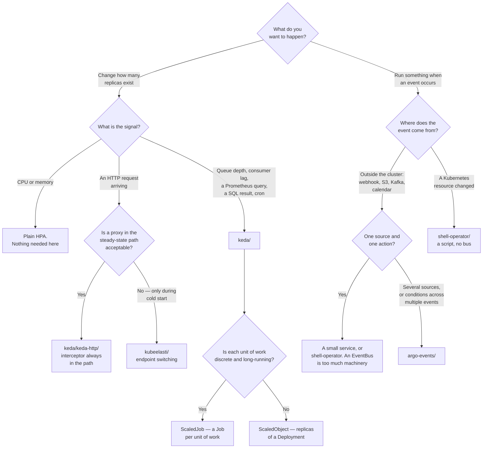

[← DevOps](../README.md)

# Event-driven

Something happened outside the cluster. Scale for it, or run something because of it.

Tools covered: [`keda/`](keda/README.md) · [`argo-events/`](argo-events/README.md) ·
[`kubeelasti/`](kubeelasti/README.md) · [`shell-operator/`](shell-operator/README.md)

## Contents

1. [Two different questions, regularly confused](#1-two-different-questions-regularly-confused)
2. [KEDA is the important one](#2-keda-is-the-important-one)
3. [Scale to zero, and why it is a cost lever](#3-scale-to-zero-and-why-it-is-a-cost-lever)
4. [Scaling HTTP to zero is a separate problem](#4-scaling-http-to-zero-is-a-separate-problem)
5. [The other two: routing and reacting](#5-the-other-two-routing-and-reacting)
6. [Decision tree](#6-decision-tree)
7. [Anti-patterns](#7-anti-patterns)
8. [How this applies to pikakube](#8-how-this-applies-to-pikakube)

---

## 1. Two different questions, regularly confused

Everything in this folder reacts to something that happened. They divide cleanly into two groups
that are asked about interchangeably and are not interchangeable at all:

| Question | Meaning | Tools |
|---|---|---|
| **"How many replicas should exist?"** | an external signal decides the size of a workload | [KEDA](keda/README.md), [KubeElasti](kubeelasti/README.md) |
| **"What should happen now?"** | an event triggers an action | [argo-events](argo-events/README.md), [shell-operator](shell-operator/README.md) |

The confusion is understandable — both are "event-driven" — and it produces two specific, wasteful
mistakes:

- deploying **argo-events** to scale something, then discovering it has no concept of a replica
  count and writing a Sensor that patches a Deployment by hand
- deploying **KEDA** to run a workflow when a webhook fires, then discovering it only decides how
  many Pods should exist

The distinction to hold on to: **KEDA reads a source to decide a number. Argo Events delivers an
event to cause an action.** One is a control loop; the other is a pipeline.

## 2. KEDA is the important one

If only one tool from this folder is adopted, it is [KEDA](keda/README.md), and the reason is
narrow and concrete: **the built-in HPA scales on CPU and memory, and almost nothing that needs
scaling correlates with CPU and memory.**

A queue consumer is the canonical example. It sits at 8% CPU because it is blocked on I/O, while a
hundred thousand messages pile up behind it. Every CPU-based scaling signal says everything is fine.
The signal that matters — queue depth — lives in RabbitMQ, not in the cluster.

KEDA supplies that signal. It registers as a Kubernetes external metrics adapter, so an HPA can
scale on:

| Source | Example signal |
|---|---|
| **Queues and brokers** | RabbitMQ queue length, Kafka consumer group lag, NATS, SQS, Azure Service Bus |
| **Prometheus** | any query — request rate, latency, error rate, custom application metrics |
| **Databases** | a SQL query result, which is how the Airflow scheduler gets scaled here |
| **Cron** | a schedule and a timezone, with a target replica count |
| **Object storage** | the number of objects under a prefix |
| **Kubernetes itself** | the number of Pods matching a selector |

Around seventy scalers ship built in, and where none fits there is a gRPC
[external scaler interface](keda/keda-custom-external-scaler/README.md) — though the first question
to ask there is always whether the signal could simply be a Prometheus metric.

Two resources cover the two shapes of work:

| Resource | Shape | Why |
|---|---|---|
| `ScaledObject` | scale a Deployment's replicas | continuous consumers |
| `ScaledJob` | create **a Job per unit of work** | discrete long-running tasks that must not be interrupted mid-flight — scaling a Deployment down can kill a consumer halfway through |

## 3. Scale to zero, and why it is a cost lever

The HPA cannot scale to zero. `minReplicas: 0` is not valid, and the reason is circular: with no
Pods there is no metric to read, so there is nothing to scale up from.

KEDA breaks the circle by owning the **0 → 1** transition itself. It polls the trigger directly —
not through the HPA — and when the source becomes *active*, it scales the workload to one and hands
control to the HPA from there. This is encoded in the trigger fields:

| Field | Governs |
|---|---|
| `activationValue` | the **0 → 1** decision, made by KEDA |
| `value` | the **1 → N** target, pursued by the HPA |
| `cooldownPeriod` | how long the source must stay inactive before returning to zero |

**Why this matters financially.** The cost of a Kubernetes platform is dominated by workloads that
exist without doing anything. A dozen dev-environment consumers, a nightly batch worker, an internal
tool used twice a week, six per-team staging deployments — each one holds resource *requests*
against the scheduler around the clock. Requests are what the scheduler reserves, so nodes are
provisioned for capacity that is idle most of the time, and the cluster autoscaler cannot remove a
node that has Pods on it.

Scale-to-zero removes the Pods, which returns the capacity, which lets the autoscaler remove the
node, which is where the money actually is. Requests-versus-usage is the single largest source of
waste on most clusters, and this is one of the few levers that addresses it **without touching any
application code**. That is the point of contact between this folder and the FinOps discipline: the
optimisation is a `ScaledObject`, not a project.

The costs are real and should be stated:

- **Cold start.** The first unit of work waits for a scheduling decision, possibly an image pull,
  container start and readiness. Seconds at best
- **Thrashing.** A short `cooldownPeriod` on a bursty source produces continuous scale up and down,
  which costs more in scheduling churn than it saves
- **Debuggability.** A workload at zero replicas has no logs, no exec, and nothing to inspect. "Is it
  broken or is it idle?" becomes a question that needs answering

## 4. Scaling HTTP to zero is a separate problem

Queues work because the queue holds the work and can be measured while the workload is at zero.

HTTP has no queue. The work *is* the arriving request, and there is nothing to measure until it
arrives — at which point there are no Pods, and the caller gets a connection refused. Scale-to-zero
and HTTP are in direct conflict unless something sits in the request path to hold the first request
while a Pod starts.

Two approaches are mapped here, and they differ in where that something sits:

| | [KEDA HTTP add-on](keda/keda-http/README.md) | [KubeElasti](kubeelasti/README.md) |
|---|---|---|
| Position | an interceptor proxy **permanently** in front of the service | a resolver in the path **only while scaled to zero** |
| When scaled up | every request goes through the interceptor | traffic goes straight to the workload |
| Mechanism | interceptor queues requests and reports pending count to KEDA | controller switches the Service's endpoints between workload and resolver |
| Scale-down signal | pending request count | a Prometheus query |
| Scale above one | KEDA | delegated to KEDA or an HPA |
| Maturity | `0.x` for a long time | young project |

KubeElasti's design is the more attractive one — no steady-state overhead — and the trade is that a
controller is mutating Service endpoints, which is a sharper edge than a proxy: a bug there affects
traffic routing rather than just scaling.

Both share the property that decides whether either is appropriate: **the first request after idle
is slow**. That is fine for an internal dashboard with a human waiting and not fine for a
synchronous dependency of a production service.

## 5. The other two: routing and reacting

**[Argo Events](argo-events/README.md)** is event routing and triggering. Three resources:
`EventSource` listens to the outside world (webhooks, S3, Kafka, calendar, resource changes),
`EventBus` transports (NATS JetStream by default), and `Sensor` subscribes, evaluates dependencies
and fires triggers — an Argo Workflow, a Kubernetes resource, an HTTP call, a Lambda.

Its distinctive capability is the Sensor's **dependency logic**: waiting on more than one event,
combining them with boolean conditions, filtering by payload content, and extracting fields from the
payload into whatever it creates. "When both the upload finished and the approval webhook fired" is
a declared condition rather than a state machine somebody wrote.

Its cost is that it is real infrastructure. An EventBus is stateful, and when it is unhealthy events
are lost quietly — which is the worst failure mode in this category. For a single webhook starting a
single Job, it is far too much machinery.

**[shell-operator](shell-operator/README.md)** is the opposite end. It runs a **script** in response
to Kubernetes events, and that is all it is: hooks declare their bindings (a `kubernetes` watch, a
`schedule`, or `onStartup`) as JSON, and shell-operator handles the informers, filtering,
deduplication and queueing. It is the simplest possible operator — no Go, no CRDs beyond its own
configuration, no build pipeline.

It defines the **floor** of this category, and knowing the floor exists is what stops someone
deploying an event bus to solve a fifteen-line problem. Its limits are equally clear: no status
subresource, no meaningful finalizers, no conditions. If users will interact with the thing being
built, build a real operator.

One distinction worth stating explicitly: **argo-events reacts to events from outside the cluster;
shell-operator reacts to events inside it.** There is overlap — argo-events has a resource
EventSource — but that is the bias each was built with.

## 6. Decision tree

## 7. Anti-patterns

| Anti-pattern | Why it is bad | What to do instead |
|---|---|---|
| Scaling a queue consumer on CPU | it is blocked on I/O at 8% CPU while the backlog grows | a queue-depth or consumer-lag scaler — [keda/](keda/README.md) |
| Argo Events used to scale something | it triggers actions; it has no notion of replica count | [keda/](keda/README.md) |
| KEDA used to route events | it decides a number, it does not deliver anything | [argo-events/](argo-events/README.md) |
| Scale-to-zero on a latency-sensitive service | the first request pays scheduling, image pull and readiness | keep `minReplicaCount: 1` where latency matters |
| A short cooldown on a bursty source | continuous scale up and down; churn costs more than the saving | tune `cooldownPeriod` against the real arrival pattern |
| Connection strings written into a `ScaledObject` | credentials in a resource everyone can read — the RabbitMQ example here does exactly this | `TriggerAuthentication` referencing a Secret |
| `ScaledObject` for discrete long-running tasks | scaling down kills a consumer mid-task | `ScaledJob` — one Job per unit of work |
| A custom external scaler before trying Prometheus | a gRPC service to build, deploy, secure and keep alive, replacing one field | export the signal as a metric and use the `prometheus` scaler |
| An EventBus for one webhook and one Job | stateful infrastructure for a fifteen-line problem | [shell-operator/](shell-operator/README.md), or a small service |
| shell-operator for something users interact with | no status, no finalizers, no conditions | build a real operator |
| Giving a triggered workflow the Sensor's permissions | every triggered workflow inherits the trigger's blast radius | separate ServiceAccounts — the argo-events example does this correctly |
| A Prometheus rate query without `or vector(0)` | with no traffic the query returns no series, not zero, so scale-down never fires | append `or vector(0)`, as the KubeElasti examples do |

## 8. How this applies to pikakube

**[KEDA](keda/README.md) is deployed and genuinely used**, which makes it one of the few folders in
this discipline with recorded operating experience rather than a catalogue. The scaler examples are
the valuable part:

| Example | What it demonstrates |
|---|---|
| `cron` | `minReplicaCount: 0`, `America/Sao_Paulo`, with the intended production shape commented in: up at 08:00 on weekdays, down at 18:00 |
| `rabbitmq` | scaling from zero on `QueueLength`, with `activationValue` distinct from `value` — the clearest illustration of the 0→1 versus 1→N split |
| `postgresql` | scaling the **Airflow scheduler** on a SQL query counting running and queued task instances. `minReplicaCount: 1` — this one is about capacity, not cost |
| `kafka`, `prometheus`, `mongodb` and others | placeholder folders — mapped, not configured |

The Airflow example is the one that connects this folder to the rest of the platform. Scheduler
capacity driven by actual task backlog, read straight out of the metadata database, is a better
signal than anything CPU-based could offer.

**[KubeElasti](kubeelasti/README.md) has the most complete setup in the folder** — a working test
environment with a Deployment, Service and Ingress, two `ElastiService` variants (Istio-based and
NGINX-ingress-based triggers), a Grafana dashboard, and a recorded PromQL query for discovering what
metrics the project actually exports. That is somebody having genuinely worked out how a tool
behaves, which is worth more than its documentation.

**[Argo Events](argo-events/README.md) is deployed with a complete example**: EventBus, EventSource,
Sensor, and — importantly — two separate RBAC files, one for the Sensor and one for the triggered
Workflow. That separation is the part most first attempts get wrong.

**[shell-operator](shell-operator/README.md) is mapped only**, with the recorded opinion that its
documentation is bad. The same complaint appears against
[KEDA's external scalers](keda/keda-custom-external-scaler/README.md) — *"doc meio merda"* — which
together are a fair signal about this corner of the ecosystem: simple concepts, poorly written up.

**Two findings worth carrying forward.**

The first is structural: **KEDA's Helm charts are not available as OCI artefacts**
([charts#20](https://github.com/kedacore/charts/issues/20),
[charts#363](https://github.com/kedacore/charts/issues/363), both open). In a
[Flux](../../platform-engineering/gitops/flux/README.md) setup the natural source is an
`OCIRepository`, and KEDA has to be consumed through a classic `HelmRepository` pointing at GitHub
Pages instead. That is why the manifests in this folder are inconsistent about source kinds —
KubeElasti uses `OCIRepository`, KEDA cannot.

The second is a defect: **the RabbitMQ scaler example has a plaintext password in the `host`
field.** It works, and `TriggerAuthentication` exists precisely to prevent it. Anything beyond a
scratch cluster should reference a Secret.

**The gap worth naming:** scale-to-zero is demonstrated and not applied. The `cron` and `rabbitmq`
examples prove the mechanism against test workloads, and no production workload here uses it. Per
section 3, that is the cheapest cost reduction available on a Kubernetes platform — a `ScaledObject`
per idle workload, with no application changes. The candidates are the ones that are obvious once
named: development-environment consumers, batch workers between runs, and internal tools nobody uses
at night.

---

[← DevOps](../README.md)
