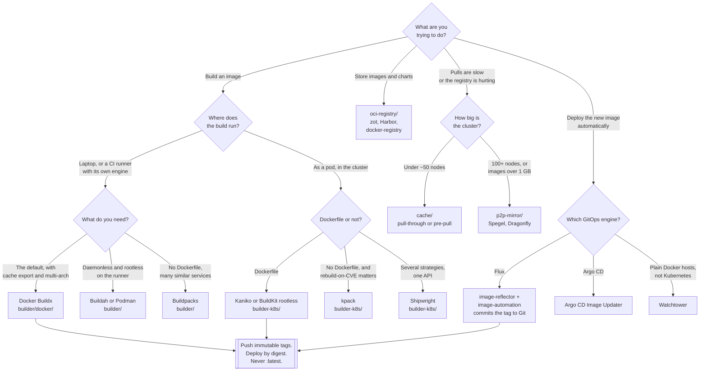

[← DevOps](../README.md)

# Container images

The whole life of an image — built, cached, stored, distributed, and replaced — and the one
problem that makes all of it harder on Kubernetes.

Subfolders: [`builder/`](builder/README.md) — building where a daemon exists ·
[`builder-k8s/`](builder-k8s/README.md) — building inside the cluster, without one ·
[`cache/`](cache/README.md) — keeping images close to the nodes ·
[`oci-registry/`](oci-registry/README.md) — where artefacts live ·
[`p2p-mirror/`](p2p-mirror/README.md) — distribution at scale ·
[`update/`](update/README.md) — replacing a running image automatically

## Contents

1. [The lifecycle](#1-the-lifecycle)
2. [Building without a Docker daemon](#2-building-without-a-docker-daemon)
3. [Layer caching is the build time](#3-layer-caching-is-the-build-time)
4. [The registry is not just storage](#4-the-registry-is-not-just-storage)
5. [Tags lie, digests do not](#5-tags-lie-digests-do-not)
6. [Keeping deployed images current](#6-keeping-deployed-images-current)
7. [Getting the image onto the node](#7-getting-the-image-onto-the-node)
8. [Size, base images and reproducibility](#8-size-base-images-and-reproducibility)
9. [Decision tree](#9-decision-tree)
10. [Anti-patterns](#10-anti-patterns)
11. [How this applies to pikakube](#11-how-this-applies-to-pikakube)

---

## 1. The lifecycle

An image is not one concern, it is five, and each folder here owns one of them:

| Stage | Question it answers | Here |
|---|---|---|
| **Build** | how do bytes become an image, and with what privileges | [`builder/`](builder/README.md), [`builder-k8s/`](builder-k8s/README.md) |
| **Store** | where does the image live, along with charts and other artefacts | [`oci-registry/`](oci-registry/README.md) |
| **Distribute** | how does it reach every node without melting the registry | [`p2p-mirror/`](p2p-mirror/README.md), [`cache/`](cache/README.md) |
| **Deploy** | which exact image is running, and can that be proven | tags and digests, [§5](#5-tags-lie-digests-do-not) |
| **Update** | how does a new image become the running one | [`update/`](update/README.md) |

The stages are coupled in ways that only show up later. A build that does not use a shared cache
is slow forever. A registry that is a single pod is a cluster-wide outage waiting to happen. A
deployment pinned to `:latest` cannot be rolled back, because there is nothing to roll back *to*.

## 2. Building without a Docker daemon

**This is the central problem, and everything in [`builder-k8s/`](builder-k8s/README.md) exists
because of it.**

`docker build` is not a program that builds an image. It is a client that hands a build context
to a daemon, and that daemon runs as **root on the host**. On a laptop that is a shrug. Inside a
Kubernetes cluster it is the whole security model.

The tempting shortcut is to mount the node's Docker socket into a build pod:

```
volumeMounts:
  - name: docker-sock
    mountPath: /var/run/docker.sock    # do not do this
```

What that actually grants: anything that can talk to the socket can start a container with
`--privileged`, with the host filesystem mounted, in the host PID and network namespaces. **It is
root on the node**, handed to whatever CI job happens to run there — which, in a shared cluster,
means whoever can open a merge request. The pod's own `securityContext` is irrelevant; the
container it asks for is created by the daemon, not by the kubelet.

The same argument applies to Docker-in-Docker, which needs `privileged: true` to work at all, and
to any `hostPath` route to the container runtime's socket. Modern clusters do not even run Docker
— containerd and CRI-O are the runtimes — so the socket usually is not there to abuse, which
turns the shortcut from dangerous into merely broken.

So a different class of tool exists: builders that construct an image **in userspace**, without a
daemon and, in the good cases, without root.

| Tool | How it avoids the daemon | Root needed |
|---|---|---|
| [Kaniko](builder-k8s/kaniko/README.md) | executes the Dockerfile inside its own container and snapshots the filesystem | no, but it is destructive inside its container |
| [BuildKit](builder/buildkit/README.md) rootless | user namespaces, no privileged operations | no |
| [Buildah](builder/buildah/README.md) | builds via the OCI libraries directly, one command per layer | no, in rootless mode |
| [img](https://github.com/genuinetools/img) | unprivileged wrapper around BuildKit; effectively dormant | no |
| [kpack](builder-k8s/kpack/README.md) | buildpacks, no Dockerfile at all | no |
| [Shipwright](builder-k8s/shipwright/README.md) | a framework that runs any of the above as a strategy | depends on the strategy |

The split between the two folders here is exactly this:
[`builder/`](builder/README.md) is for **where a daemon or a local engine is available** — a
developer machine, a CI runner with its own engine — and
[`builder-k8s/`](builder-k8s/README.md) is for **building as a pod, in the cluster, with no
daemon to borrow**.

## 3. Layer caching is the build time

Build duration is decided almost entirely by how many layers are reused. A Dockerfile ordered so
that dependency installation comes before the application source will reuse the dependency layer
on every commit; ordered the other way round, it reinstalls everything on every commit. That
single ordering decision is usually worth more than any tooling change.

The complication on Kubernetes: **a build pod is ephemeral**. It starts with nothing and is
deleted afterwards, so the local layer cache that makes a laptop build fast does not exist. The
first build and the thousandth build cost the same.

The fix is to put the cache **in the registry**:

| Mechanism | Tool |
|---|---|
| `--cache=true --cache-repo=<repo>` — layers pushed to a registry repository | [Kaniko](builder-k8s/kaniko/README.md) |
| `--cache-to type=registry` / `--cache-from` — inline or manifest-based cache export | [BuildKit](builder/buildkit/README.md), [Docker Buildx](builder/docker/README.md) |
| Base image and buildpack layers, reused across builds by the operator | [kpack](builder-k8s/kpack/README.md) |

This is what makes ephemeral runners viable at all, and it is the reason the registry appears in
the *build* story and not only in the storage one. It also means cache pulls become registry
traffic — a real cost, and one more argument for the registry being close to the cluster.

Two caveats worth knowing before enabling it:

- a registry cache is a **network round trip per layer**. For small builds it can be slower than
  no cache at all.
- the cache repository grows without limit unless something prunes it. Registry garbage
  collection and retention policies are not optional here.

## 4. The registry is not just storage

An OCI registry started as a place to put images. It is now the generic artefact store for the
whole ecosystem, and that changes how load-bearing it is.

| Artefact | How it is stored |
|---|---|
| Container images | manifests and layers, the original case |
| **Helm charts** | as OCI artefacts — `oci://registry/charts/name` |
| Signatures and attestations | Cosign, SLSA provenance, stored as referring artefacts |
| SBOMs | attached to the image they describe |
| WASM modules, Flux manifests, ML models | increasingly, as generic OCI artefacts |

The Helm line matters here specifically. The classic model was an HTTP chart repository — an
`index.yaml` and a pile of tarballs, which is what [ChartMuseum](oci-registry/chartmuseum/README.md)
serves and what Flux consumes as a `HelmRepository`. The OCI model replaces it: charts are pushed
into the same registry as the images, with the same authentication, the same retention, and the
same signing story.

**This repository is moving from `HelmRepository` to `OCIRepository` in Flux.** The consequence is
plain and worth stating before it is discovered: once charts come from the registry, the registry
is in the path of every reconciliation, not just of every deployment. It stops being infrastructure
you can afford to run as one pod on one node.

The options are in [`oci-registry/`](oci-registry/README.md), and they are genuinely far apart —
[zot](oci-registry/zot/README.md) is a small OCI-native daemon,
[Harbor](oci-registry/harbor/README.md) is a platform with projects, replication, scanning and
policy, and [Artifactory](oci-registry/jfrog-artifactory/README.md) is a universal artefact
manager that happens to speak OCI.

## 5. Tags lie, digests do not

A tag is a mutable pointer. `myapp:1.2.3` can be repushed to point at different content tomorrow,
and nothing in the image records that it changed. A digest — `myapp@sha256:…` — is the content
hash, so it names exactly one image forever.

| | Tag | Digest |
|---|---|---|
| Stable | no, it can be moved | yes, by construction |
| Readable | yes | no |
| Rollback target | only if the tag was never moved | always |
| Answers "what is running" | approximately | exactly |

`:latest` is the extreme case and the one to ban outright: two nodes pulling `:latest` an hour
apart can run different code with no way to tell. The failure it produces is the worst kind —
intermittent, not reproducible, and invisible in the manifest.

The workable position:

- **build and push an immutable tag** — a commit SHA, or a timestamp, or a semantic version that
  is never repushed
- **deploy by digest** where it matters, and let the update automation write the digest into Git
  ([`update/`](update/README.md) does exactly this)
- set `imagePullPolicy: IfNotPresent` with immutable tags, because there is nothing to re-fetch;
  `Always` only makes sense when the tag can move, which is the problem
- enforce it at the registry where the registry supports it — Harbor has immutability rules

## 6. Keeping deployed images current

A new image exists in the registry. Something has to make it the running one. There are two
answers, and the difference is where the truth lives.

| | **CI pushes the change** | **A controller watches the registry** |
|---|---|---|
| Who edits the manifest | the pipeline, after the build | an in-cluster controller |
| Where the desired state is | Git, written by CI | Git, written by the controller |
| Needs write credentials | CI needs a Git token | the controller needs a Git token |
| Works without CI knowing the cluster | yes | yes |
| Handles images built elsewhere | awkwardly | naturally |
| Tools | any pipeline | [Flux image automation](update/flux-image-update/README.md), [Argo CD Image Updater](update/argo-image-updater/README.md) |

**The GitOps-native answer is the second one.** Flux splits it into two controllers:
`image-reflector` scans a registry and records the tags it finds, and `image-automation` applies a
policy — newest semver, newest timestamp — and **commits the new tag back to the Git repository**.
The deployment then happens because Git changed, which is the same mechanism as every other change
in the cluster. Nothing deploys from outside; there is no pipeline holding cluster credentials.

The trade-off is real and not always in favour of automation: a controller that commits a new tag
whenever one appears will deploy an image nobody asked for, at a moment nobody chose. Constrain it
with a tight tag policy and confine it to the environments where that is acceptable.

The counter-example in the same folder is [Watchtower](update/watchtower/README.md), which pulls
and restarts containers directly. It belongs to plain Docker hosts, and on Kubernetes it is the
wrong model entirely — it mutates the running state without touching Git, which is precisely what
GitOps exists to prevent.

## 7. Getting the image onto the node

Below a certain size this is not a problem. Above it, it is the problem.

Rolling out one 2 GB image to 200 nodes is 400 GB pulled from one registry in the same few
seconds. What breaks first is not the registry's CPU but its network egress and, on public
registries, the rate limit. Symptoms are `ImagePullBackOff` at scale, a rollout that takes twenty
minutes instead of one, and a scale-up event that stalls because new nodes cannot pull.

Three strategies, in increasing order of commitment:

| Strategy | What it does | Folder |
|---|---|---|
| **Pre-pull** | put the image on the node before anything needs it | [`cache/`](cache/README.md) |
| **Local mirror** | proxy or copy upstream images into the cluster | [`cache/`](cache/README.md) |
| **Peer-to-peer** | nodes serve layers to each other | [`p2p-mirror/`](p2p-mirror/README.md) |

**Peer-to-peer is the one people reach for too early.** [Spegel](p2p-mirror/spegel/README.md),
[Dragonfly](p2p-mirror/dragonfly/README.md) and [Kraken](p2p-mirror/kraken/README.md) turn the
pull into a swarm: a node that already has a layer serves it to a node that does not, so the
registry is hit once rather than two hundred times. It genuinely works, and it genuinely is not
free — it is a `DaemonSet` on every node, in the path of every image pull, requiring the container
runtime to be configured to use it as a mirror.

Where the threshold sits, concretely:

| Signal | Reading |
|---|---|
| Under ~20 nodes | not worth it; a pull-through cache is enough |
| 50–100 nodes, images under 500 MB | probably still not worth it |
| **100+ nodes, or images over 1 GB, or both** | the registry is the bottleneck; P2P starts to pay |
| Frequent scale-out, spot or autoscaled nodes | pull time is startup time; P2P pays sooner |
| Registry egress billed by the gigabyte | the arithmetic makes the case on its own |

Below that, the cheaper fixes come first: a pull-through cache close to the cluster, smaller
images, and `imagePullPolicy: IfNotPresent` with immutable tags so nodes stop re-fetching what
they already have.

## 8. Size, base images and reproducibility

Three properties that are decided at build time and cannot be fixed later.

**Size** is pull time, and pull time is startup time — it is felt on every scale-up, every node
replacement, every rollout. The levers are the usual ones and they are not subtle: multi-stage
builds so that compilers and build dependencies never reach the final layer; a small base; and
not copying the whole repository in when three files are needed.
[dive](https://github.com/wagoodman/dive) is the tool for finding where the megabytes actually
went, and [slim](https://github.com/slimtoolkit/slim) will strip an image down automatically.

**Base images** decide most of the size and nearly all of the vulnerability surface.
`debian:bookworm` and `alpine` and
[distroless](https://github.com/GoogleContainerTools/distroless) are different bargains:
distroless has no shell, which is excellent for attack surface and irritating the first time
something needs debugging. The **security** side of base images — provenance, scanning, admission
control, minimal and hardened bases — is a separate discipline and lives under
`infrastructure/security/3-container/`, not here. This folder cares about how the image is
produced and moved; that one cares about whether it should be allowed to run.

**Reproducibility** is the property that the same source produces the same image. It is broken by
default, and by very ordinary things: `apt-get install` without pinned versions, `FROM
python:3.12` resolving to a different patch build next month, timestamps baked into layer
metadata, network fetches during the build. Full bit-for-bit reproducibility is a serious project;
the achievable 80% is pinning the base image **by digest**, pinning dependency versions in a lock
file, and not downloading anything during the build that is not pinned.

## 9. Decision tree



## 10. Anti-patterns

| Anti-pattern | Why it is bad | What to do instead |
|---|---|---|
| Mounting `/var/run/docker.sock` into a build pod | it is root on the node, granted to anyone who can run a pipeline | a daemonless builder — [`builder-k8s/`](builder-k8s/README.md) |
| Docker-in-Docker with `privileged: true` | same escalation, wrapped in a container that looks isolated and is not | Kaniko, BuildKit rootless, Buildah |
| Deploying `:latest` | non-reproducible, unrollbackable, and different per node | immutable tags, deploy by digest |
| Repushing an existing tag | the tag now means two things and nothing records which | a new tag; enable registry immutability rules |
| No layer cache in CI | every build is a cold build, forever | a registry-backed cache — [§3](#3-layer-caching-is-the-build-time) |
| A cache repository nobody prunes | registry storage grows until it fills | retention policy plus garbage collection |
| Pulling directly from Docker Hub in production | rate limits and an availability dependency you do not control | a pull-through cache or a mirrored copy |
| The registry as a single pod on one node | it is now a single point of failure for reconciliation too | replicas and real object storage |
| Build secrets passed as `ARG` or `ENV` | they are baked into the layer and readable by anyone with the image | BuildKit secret mounts, or a secret store |
| Installing build toolchains into the runtime image | pull time and attack surface, both permanent | multi-stage builds |
| Reaching for P2P distribution on a 10-node cluster | a `DaemonSet` in the path of every pull, solving nothing | smaller images and `IfNotPresent` first |
| `imagePullPolicy: Always` with immutable tags | a registry round trip per pod start for content that cannot have changed | `IfNotPresent` |
| Unpinned base images | the same source builds a different image next month | pin the base by digest |

## 11. How this applies to pikakube

This folder is a **map of the alternatives**, deeper in some places than others, and the mapping
follows what the cluster actually needs.

**Builders.** [Kaniko](builder-k8s/kaniko/README.md) is the one with working manifests here — a
build `Pod`, a `PersistentVolume` and claim for the build context, secrets for Docker Hub and for
a Git token, and a second variant that fetches the context straight from a Git URL with
`--context-sub-path`. It also has `--cache=true --cache-repo=` set, which is
[§3](#3-layer-caching-is-the-build-time) in practice. The caveat recorded in
[`kaniko/`](builder-k8s/kaniko/README.md) — the project's maintenance status — is the reason to
read [BuildKit](builder/buildkit/README.md) and [Buildah](builder/buildah/README.md) alongside it
rather than after it.

**Registry.** Six options are mapped, and the one to be honest about is Harbor's recorded
limitation: its own Helm chart is not distributed as an OCI artefact
([goharbor/harbor-helm#2265](https://github.com/goharbor/harbor-helm/issues/2265)), so it must be
installed from a classic `HelmRepository` even in a repository that is moving everything else to
`OCIRepository`. [zot](oci-registry/zot/README.md) is the small OCI-native alternative, and
[docker-registry](oci-registry/docker-registry/README.md) the minimum that works.

**Distribution.** All three P2P options are mapped —
[Spegel](p2p-mirror/spegel/README.md), [Dragonfly](p2p-mirror/dragonfly/README.md),
[Kraken](p2p-mirror/kraken/README.md) — and by the threshold in
[§7](#7-getting-the-image-onto-the-node), none of them is warranted at this cluster's size. They
are mapped because the threshold is a property of the cluster, not of the tool, and the
alternatives should be understood before it is crossed. [`cache/`](cache/README.md) is the layer
that is worth having first.

**Updates.** [`update/flux-image-update/`](update/flux-image-update/README.md) is a complete
worked example rather than a mapping: a Flask application with its `Dockerfile`, an
`ImageRepository` watching `andreyolv/flask-flux`, an `ImagePolicy` extracting a timestamp out of
tags shaped `main-<sha>-<timestamp>`, and an `ImageUpdateAutomation` that commits the result back
to `main` as `fluxcdbot`. That is the GitOps-native update loop from
[§6](#6-keeping-deployed-images-current), running end to end.

Everything security-shaped about images — scanning, signing, admission policy, hardened bases —
belongs to `infrastructure/security/3-container/` and is deliberately not duplicated here.

---

[← DevOps](../README.md)
