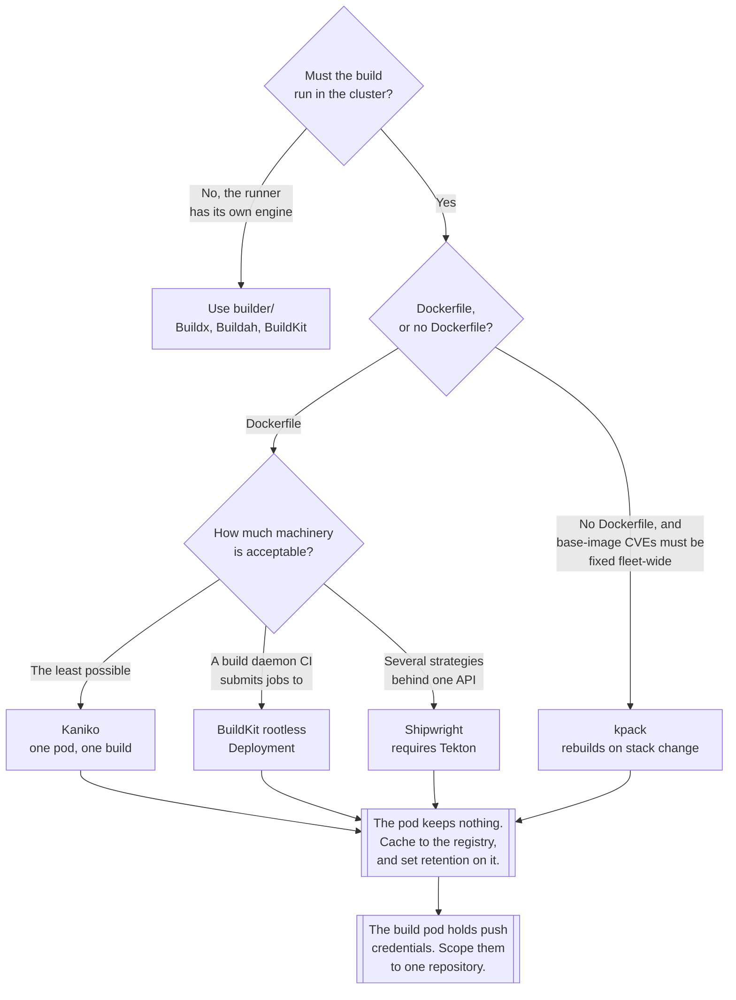

[← Container images](../README.md)

# Building inside Kubernetes

Building an image as a pod, on a cluster with no Docker daemon to borrow — and without handing
the build root on the node.

Tools covered: [`kaniko`](kaniko/README.md) · [`kpack`](kpack/README.md) ·
[`shipwright`](shipwright/README.md)

For building where an engine already exists — a laptop, or a CI runner that owns its runtime —
see [`builder/`](../builder/README.md).

## Contents

1. [Why this folder exists](#1-why-this-folder-exists)
2. [What the socket actually grants](#2-what-the-socket-actually-grants)
3. [The tools](#3-the-tools)
4. [Cache, context and credentials](#4-cache-context-and-credentials)
5. [What triggers the build](#5-what-triggers-the-build)
6. [Decision tree](#6-decision-tree)
7. [Anti-patterns](#7-anti-patterns)
8. [How this applies to pikakube](#8-how-this-applies-to-pikakube)

---

## 1. Why this folder exists

`docker build` is a client. It packages a build context, sends it to a daemon over a socket, and
the **daemon** — running as root on the host — does the work. Every `RUN` instruction is a
container that the daemon creates, with whatever privileges it decides to give it.

On a Kubernetes cluster that model has nowhere to live. Modern clusters run containerd or CRI-O,
not Docker, so there usually is no daemon to talk to; and where one exists, reaching it from a
pod means mounting the node's socket, which is a privilege escalation rather than a convenience
([§2](#2-what-the-socket-actually-grants)).

So a class of builders exists that does the same work **in userspace**: unpack the base image,
execute each instruction inside the builder's own container or in a user namespace, snapshot the
filesystem, assemble the layers, push. No daemon, and in the good cases no root either.

That is the whole reason [Kaniko](kaniko/README.md), [BuildKit
rootless](../builder/buildkit/README.md), [Buildah](../builder/buildah/README.md) and `img`
exist. They are not alternative build engines chosen on taste; they are the answer to a
specific security problem.

## 2. What the socket actually grants

Worth being concrete, because the shortcut looks harmless in a YAML review:

```yaml
volumes:
  - name: docker-sock
    hostPath:
      path: /var/run/docker.sock     # this is the escalation
```

Anything that can write to that socket can ask the daemon to run a container with
`--privileged`, with `/` from the host bind-mounted, in the host PID and network namespaces. From
there: read every secret mounted on the node, read the kubelet's credentials, write to the host
filesystem, and start processes outside any container. **That is root on the node**, and in a
shared cluster it is available to anyone who can cause a pipeline to run — which usually means
anyone who can open a merge request.

The pod's own `securityContext` does not constrain any of this, because the privileged container
is created by the daemon and never passes through the kubelet's admission path.

| Route | What it needs | Verdict |
|---|---|---|
| Mounting `/var/run/docker.sock` | a `hostPath` volume | root on the node |
| Docker-in-Docker | `privileged: true` | root on the node, with extra steps |
| Mounting the containerd socket | a `hostPath` volume | the same, via a different API |
| **Kaniko** | a normal pod; root inside its own container | acceptable, with the caveat below |
| **BuildKit rootless** | user namespaces, `seccomp`/`AppArmor` annotations | the cleanest option |
| **Buildah** rootless | user namespaces, `fuse-overlayfs` | equivalent to BuildKit |

Kaniko's caveat is specific and often misread: it does **not** need privileges on the node, but it
does extract and modify the filesystem of its own container, so it must run in a container it is
allowed to destroy. That is fine in a dedicated build pod and dangerous nowhere else — running the
Kaniko executor outside a container is explicitly unsupported.

## 3. The tools

| Tool | Model | Needs | Detail |
|---|---|---|---|
| **Kaniko** | executes a Dockerfile in-container and snapshots each layer | a pod, a context, registry credentials | [→](kaniko/README.md) |
| **kpack** | an operator that builds with **Cloud Native Buildpacks** and **rebuilds on base-image change** | CRDs, a builder, a registry | [→](kpack/README.md) |
| **Shipwright** | a framework: `BuildStrategy` CRDs wrapping Kaniko, Buildah, BuildKit or buildpacks | Tekton, plus its own CRDs | [→](shipwright/README.md) |

Plus the two that live in [`builder/`](../builder/README.md) but run perfectly well as a pod:
[BuildKit](../builder/buildkit/README.md) in rootless mode — usually as a `Deployment` or
`StatefulSet` that CI submits builds to — and [Buildah](../builder/buildah/README.md) in a
one-shot pod.

The three differ in what they take over:

- **Kaniko** is a single container that does one build. Everything around it — trigger, context,
  credentials, cleanup — is yours to arrange. It is the simplest thing that works and the least
  opinionated.
- **kpack** is a controller with a continuous responsibility: it watches an `Image` resource and
  rebuilds whenever the source, the buildpacks or the **stack** change. Its distinguishing
  feature is not building; it is **rebuilding a whole fleet when a base image is patched**.
- **Shipwright** is an abstraction over the others: a `Build` and a `BuildRun`, executed by
  Tekton, with the actual builder selected as a `BuildStrategy`. It earns its place when several
  build styles must coexist behind one API, and it costs a Tekton installation.

## 4. Cache, context and credentials

The three things that turn a working example into something usable, and all three are more
awkward in a pod than on a laptop.

**Context** — the build needs the source. Four options, in increasing order of tidiness:

| Option | Notes |
|---|---|
| A `PersistentVolumeClaim` mounted at `/workspace` | works, and something must populate it first |
| A Git URL — `--context=git://github.com/org/repo.git` | no volume at all; needs a token for private repositories |
| An object-store tarball — `s3://`, `gs://` | the usual CI hand-off |
| An init container that clones | explicit and easy to reason about |

**Cache** — a build pod starts empty and is deleted afterwards, so there is no local layer cache.
Without a registry-backed cache every build is a cold build. Kaniko takes `--cache=true` and
`--cache-repo=<repository>`; BuildKit takes `--cache-to type=registry`; kpack manages its own
cache volume and reuses buildpack layers across builds. The consequence to plan for: **the cache
repository grows forever** unless retention is configured on the registry.

**Credentials** — the build must push, so it needs registry credentials, which means a
`kubernetes.io/dockerconfigjson` secret mounted where the builder looks for it
(`/kaniko/.docker/config.json` for Kaniko). Two things follow. First, a build pod holds
push credentials, so whoever can schedule a build pod can push to that registry — scope the
credential to one repository. Second, short-lived credentials are much better than a long-lived
token, and on a cloud registry that means workload identity rather than a static secret.

## 5. What triggers the build

Building in the cluster does not answer *when*, and the options differ in how much of CI moves
inside the cluster:

| Trigger | Shape |
|---|---|
| CI creates the pod | the pipeline runs `kubectl apply`; simplest, and CI needs cluster credentials |
| A pipeline engine in-cluster | Tekton or Argo Workflows own the whole build; both are mapped under `infrastructure/devops/cicd/` |
| **A controller reconciles it** | kpack's `Image` resource, or a Shipwright `BuildRun`; the cluster decides |
| A webhook | the forge calls in; needs an endpoint and authentication |

The controller model is the one that fits GitOps, and kpack is the clearest example: the desired
state is "an image built from this source with this builder", and the controller keeps it true —
including when the base image changes and nothing in the source did.

## 6. Decision tree



## 7. Anti-patterns

| Anti-pattern | Why it is bad | What to do instead |
|---|---|---|
| Mounting the node's Docker or containerd socket | root on the node for anyone who can run a build | Kaniko, BuildKit rootless, Buildah |
| Docker-in-Docker with `privileged: true` | the same escalation, in a container that looks isolated | a daemonless builder |
| Running the Kaniko executor outside a container | it modifies the filesystem it runs on — that is the host's | always a pod |
| No `--cache-repo` in an ephemeral pod | every build is cold, forever | a registry-backed cache |
| A cache repository with no retention | registry storage grows until something fills | lifecycle rules plus garbage collection |
| A push credential valid for the whole registry | anyone who can schedule a build can push anywhere | one repository per credential, short-lived where possible |
| Build pods with no resource limits | a build saturates a node shared with production workloads | requests and limits, and a dedicated node pool if it matters |
| Building on every commit with no dedup | the queue and the registry both grow faster than anyone watches | build on tags, or coalesce |
| `--destination=...:latest` | the build output cannot be pinned or rolled back | an immutable tag per build |
| A `hostPath` build context on a multi-node cluster | the pod schedules onto a node where the path is empty | a real volume, a Git context, or object storage |

## 8. How this applies to pikakube

[Kaniko](kaniko/README.md) is the one with a working setup here rather than a mapping: a build
`Pod`, a `Namespace`, a `PersistentVolume` and `PersistentVolumeClaim` for the context, and
secrets for Docker Hub and for a GitHub token. Two variants are recorded — one taking the context
from the mounted volume with `--cache=true --cache-repo=andreyolv/kaniko-cache`, and one taking it
straight from a Git URL with `--context-sub-path` to build from a subdirectory. Both push to
Docker Hub using a `dockerconfigjson` secret mounted at `/kaniko/.docker`.

Two things about that setup are worth carrying forward. The `PersistentVolume` is a `hostPath`,
which works on a single-node cluster and stops working the moment there are two nodes — the Git
context variant is the one that generalises. And the destinations end in `:latest`, which is fine
for an experiment and is exactly what [§5 of the parent](../README.md#5-tags-lie-digests-do-not)
argues against for anything that gets deployed.

[kpack](kpack/README.md) is mapped with its release manifest, a service account and a registry
credential secret. [Shipwright](shipwright/README.md) is references only — the build controller,
the operator, and the OLM package.

The recorded caveat that shapes the whole folder is [Kaniko's maintenance
status](kaniko/README.md): it is the tool most of the examples here are written against, and it is
not the one to build a long-lived platform on today. **BuildKit rootless is the successor to plan
for**, with Buildah as the equally credible alternative — the manifests change, the model does
not.

---

[← Container images](../README.md)
