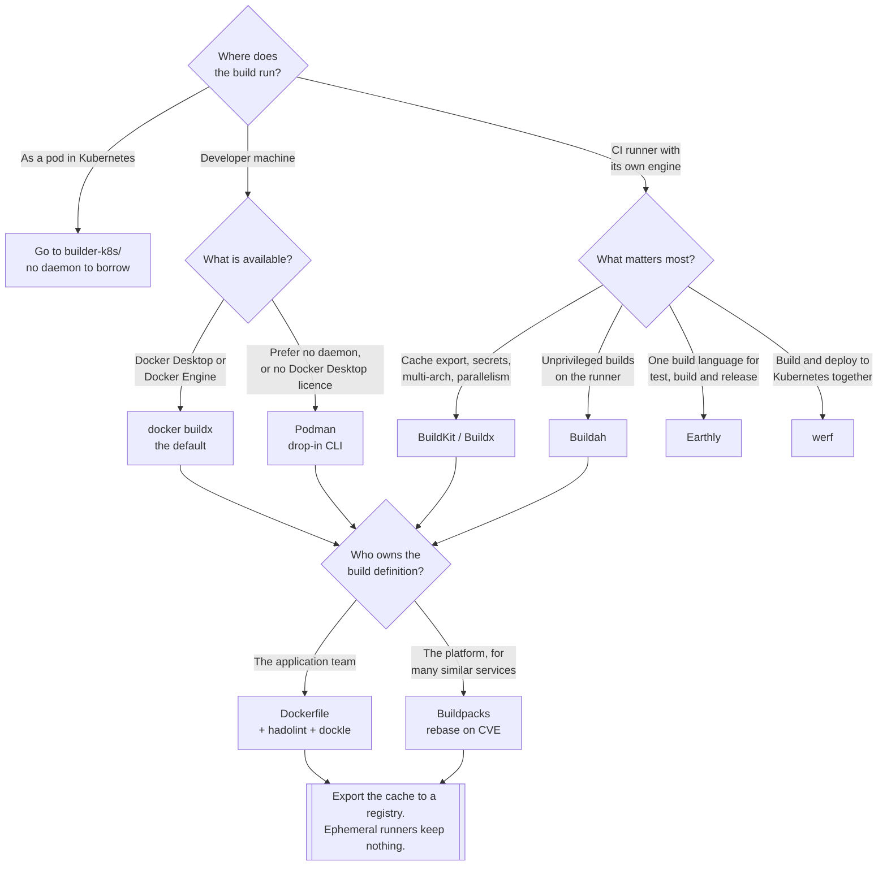

[← Container images](../README.md)

# Builders

Turning a source tree into an image, where an engine is available to do it — a laptop, or a CI
runner that owns its own runtime.

Tools covered: [`docker`](docker/README.md) · [`buildkit`](buildkit/README.md) ·
[`buildah`](buildah/README.md) · [`podman`](podman/README.md) ·
[`buildpacks`](buildpacks/README.md) · [`earthly`](earthly/README.md) ·
[`werf`](werf/README.md)

For building **as a pod, with no daemon to borrow**, see
[`builder-k8s/`](../builder-k8s/README.md) — that is a different problem and it has its own tools.

## Contents

1. [What a builder actually does](#1-what-a-builder-actually-does)
2. [The tools](#2-the-tools)
3. [Dockerfile or no Dockerfile](#3-dockerfile-or-no-dockerfile)
4. [Writing a Dockerfile that builds fast](#4-writing-a-dockerfile-that-builds-fast)
5. [Multi-architecture builds](#5-multi-architecture-builds)
6. [Linting and inspecting what you built](#6-linting-and-inspecting-what-you-built)
7. [Decision tree](#7-decision-tree)
8. [Anti-patterns](#8-anti-patterns)
9. [How this applies to pikakube](#9-how-this-applies-to-pikakube)

---

## 1. What a builder actually does

Every builder here does the same four things, and they differ only in *how*:

1. read a build definition — a `Dockerfile`, or something that generates one, or nothing at all
2. run each step in an isolated filesystem
3. capture the difference each step made as a **layer**
4. assemble the layers plus a JSON config into an **OCI image**, and push it

The image format itself is standardised —
[image-spec](https://github.com/opencontainers/image-spec) and
[distribution-spec](https://github.com/opencontainers/distribution-spec) — so an image built by
Buildah runs under containerd exactly like one built by Docker. **The builder is a genuinely
swappable component**, which is what makes the choice low-risk.

Step 2 is where the differences live, and where the privilege question comes from: running a
`RUN` instruction means executing arbitrary code in a container, and the traditional way to get
that is a root daemon. See [§2 of the parent](../README.md#2-building-without-a-docker-daemon) for
why that becomes a hard problem the moment the build moves inside a cluster.

## 2. The tools

| Tool | What it is | Daemon | Rootless | Detail |
|---|---|---|---|---|
| **Docker / Buildx** | the default; a CLI plus a root daemon, with BuildKit underneath | yes | no | [→](docker/README.md) |
| **BuildKit** | the modern build engine — parallel DAG, cache export, secret mounts | as a daemon or one-shot | **yes** | [→](buildkit/README.md) |
| **Buildah** | build via OCI libraries, one command per layer, no daemon | **no** | **yes** | [→](buildah/README.md) |
| **Podman** | daemonless container engine; a drop-in for the `docker` CLI | **no** | **yes** | [→](podman/README.md) |
| **Buildpacks** | no Dockerfile — detect the language and produce an image | no | yes | [→](buildpacks/README.md) |
| **Earthly** | a build language combining `Dockerfile` and `Makefile` semantics | uses BuildKit | via BuildKit | [→](earthly/README.md) |
| **werf** | build **and** deploy to Kubernetes, with registry cleanup as a first-class feature | uses BuildKit or Docker | partly | [→](werf/README.md) |

Two of these are not really builders and are placed here anyway, deliberately:
**Podman** is a container *engine* whose build command is Buildah, and **werf** is a delivery tool
whose build stage is one part of a larger loop. Both are here because that is where you go looking
for them.

The Docker folder also holds the two **linters** — [hadolint](docker/hadolint/README.md) for the
Dockerfile and [dockle](docker/dockle/README.md) for the resulting image — because that is where
their input comes from.

## 3. Dockerfile or no Dockerfile

The real fork in this folder, and it is a platform decision rather than a per-project one.

| | **Dockerfile** | **Buildpacks** |
|---|---|---|
| Who writes the build | each application team | the platform, once |
| Control | total | limited, by design |
| Base image updates | every repository edits its own `FROM` | rebase, centrally |
| **CVE in the base image** | a pull request in every repository | one rebuild, everywhere |
| Consistency across services | whatever people wrote | identical by construction |
| Unusual requirements | fine | usually needs an escape hatch |
| Reproducibility | as good as the discipline applied | high |

The argument for buildpacks is not developer convenience, it is **fleet maintenance**. With fifty
services and a Dockerfile each, a base-image CVE is fifty pull requests and a month of nagging.
With buildpacks, the runtime layer is separable from the application layer, so the same fix is a
rebuild — and [kpack](../builder-k8s/kpack/README.md) will do it automatically when the base
image changes.

The argument against is equally real: buildpacks are opinionated, and the first application that
needs a system library or a strange build step spends a day fighting the abstraction. Below a
handful of services the maintenance benefit does not exist yet, and a Dockerfile is simply
clearer.

## 4. Writing a Dockerfile that builds fast

Almost all build time is decided by two things: layer ordering and what ends up in the context.

**Order from least to most frequently changing.** The dependency install must come before the
application source, because the cache invalidates from the first changed layer downwards:

```dockerfile
COPY requirements.txt .
RUN pip install -r requirements.txt   # cached until requirements.txt changes
COPY . .                              # invalidated on every commit
```

Reversed, every commit reinstalls every dependency. This one ordering is usually worth more than
any tooling change in this folder.

**Use multi-stage builds.** Compilers, headers and package caches belong to a build stage that is
discarded; only the artefact is copied into the final image. This is simultaneously the biggest
lever on image size and on attack surface — a runtime image with no compiler in it is a runtime
image an attacker cannot compile in.

**Keep the context small.** `docker build .` sends the entire directory to the builder before
anything runs. A `.dockerignore` excluding `.git`, `node_modules`, virtualenvs and build output
frequently removes hundreds of megabytes from the wire.

The rest, briefly:

| Practice | Why |
|---|---|
| Pin the base image, ideally by digest | otherwise the same source builds a different image next month |
| Combine `apt-get update` and `install` in one `RUN` | a cached `update` layer plus a fresh `install` fetches stale package lists |
| Clean package caches in the same `RUN` | deleting in a later layer does not shrink the earlier one |
| `USER` a non-root account | the runtime default is root, and nothing forces you to keep it |
| Never put secrets in `ARG` or `ENV` | they are baked into the layer; use BuildKit secret mounts |
| `COPY` specific paths, not `.` | fewer cache invalidations, smaller images |

References recorded here:
[Docker's build best practices](https://docs.docker.com/build/building/best-practices/) and
[build checks](https://docs.docker.com/reference/build-checks/), which flag several of the above
during the build itself.

## 5. Multi-architecture builds

`arm64` is no longer exotic — Apple Silicon on the desks, Graviton and Ampere in the cloud — so
an image built only for `amd64` will fail to start somewhere. Two ways to produce both:

| Approach | How | Trade-off |
|---|---|---|
| **Native builders** | build on a machine of each architecture, then join with a manifest list | fast, needs a machine per architecture |
| **Emulation** | QEMU via [binfmt](https://github.com/tonistiigi/binfmt), one machine builds both | simple, and **very slow** for compilation |

`docker buildx build --platform linux/amd64,linux/arm64` produces a manifest list — a single tag
under which the runtime picks the matching image. Emulated builds are fine for interpreted
languages where nothing is compiled and painful for anything that is; the honest advice is to
start with emulation and move to native builders when the build time stops being acceptable.

## 6. Linting and inspecting what you built

Three different questions, three tools, and they are not interchangeable:

| Question | Tool | Where |
|---|---|---|
| Is this Dockerfile well written? | **hadolint** | [→](docker/hadolint/README.md) |
| Is the resulting image well built and configured? | **dockle** | [→](docker/dockle/README.md) |
| Where did the megabytes go? | **dive** | [dive](https://github.com/wagoodman/dive) |

hadolint reads the source and flags unpinned versions, `apt-get` without `--no-install-recommends`,
`ADD` where `COPY` belongs, and shell issues via ShellCheck. dockle reads the *image* and checks
what the Dockerfile does not show — running as root, credentials left in layers, world-writable
files, CIS Docker Benchmark items. dive is interactive, and the fastest way to discover that a
2 GB image is 1.7 GB of build cache nobody deleted.

**Vulnerability scanning is a different discipline** and lives under
`infrastructure/security/3-container/`. hadolint and dockle catch construction mistakes; they do
not tell you that `libssl` has a CVE.

## 7. Decision tree



## 8. Anti-patterns

| Anti-pattern | Why it is bad | What to do instead |
|---|---|---|
| Mounting the Docker socket into a CI container | root on the host, granted to any pipeline | a rootless builder, or [`builder-k8s/`](../builder-k8s/README.md) |
| `COPY . .` before installing dependencies | every commit reinstalls everything | copy the manifest, install, then copy the source |
| No `.dockerignore` | `.git` and `node_modules` shipped to the builder on every build | exclude them |
| Single-stage builds for compiled languages | the compiler and its toolchain ship to production | multi-stage |
| `apt-get update` in its own `RUN` | the cached layer fetches package lists that are months stale | one `RUN` with `update && install` |
| Secrets in `ARG` or `ENV` | baked into a layer and readable from the image | BuildKit `--mount=type=secret` |
| `FROM python:3.12` with no digest | the base changes underneath you between builds | pin by digest |
| Running as root because nothing complained | the container starts with more than it needs | `USER`, and let dockle check it |
| No cache export in ephemeral CI | cold builds forever | `--cache-to`/`--cache-from`, or Kaniko's `--cache-repo` |
| Emulated multi-arch builds for compiled code | QEMU turns a two-minute build into twenty | native builders, joined by a manifest list |
| Buildpacks adopted for three services | the fleet-maintenance benefit does not exist yet | a Dockerfile, until it does |
| `latest` as the build output tag | nothing downstream can be pinned or rolled back | an immutable tag per build |

## 9. How this applies to pikakube

This folder is **reference material rather than deployed infrastructure** — nothing here runs in
the cluster, which is correct, because a builder that runs in the cluster belongs to
[`builder-k8s/`](../builder-k8s/README.md).

[`docker/`](docker/README.md) is the substantial one: a long collection of references covering
Buildx, the GitHub build-and-push action, base-image choices, distroless, `dive`, `slim`,
Docker's own best-practice and build-check documentation, the OCI specifications, the US DoD
container hardening guide, and the commands that are needed regularly and never remembered —
`docker system prune -a`, and the `usermod -aG docker` step the installation instructions omit.
It also holds the two linters and a small `build.sh` showing the plain build-tag-push loop.

The rest are mapped as alternatives with the trade-off recorded. The one with an explicit verdict
is [Podman](podman/README.md): **no advantage for CI/CD, a good local alternative to Docker
Desktop** — which is a reasonable reading, since in CI the interesting property is rootlessness,
and Buildah or BuildKit provide it more directly.

For this repository the practical path is Buildx locally,
[Kaniko](../builder-k8s/kaniko/README.md) or BuildKit rootless in the cluster, hadolint in CI, and
the cache exported to whichever registry from [`../oci-registry/`](../oci-registry/README.md) ends
up deployed.

---

[← Container images](../README.md)
