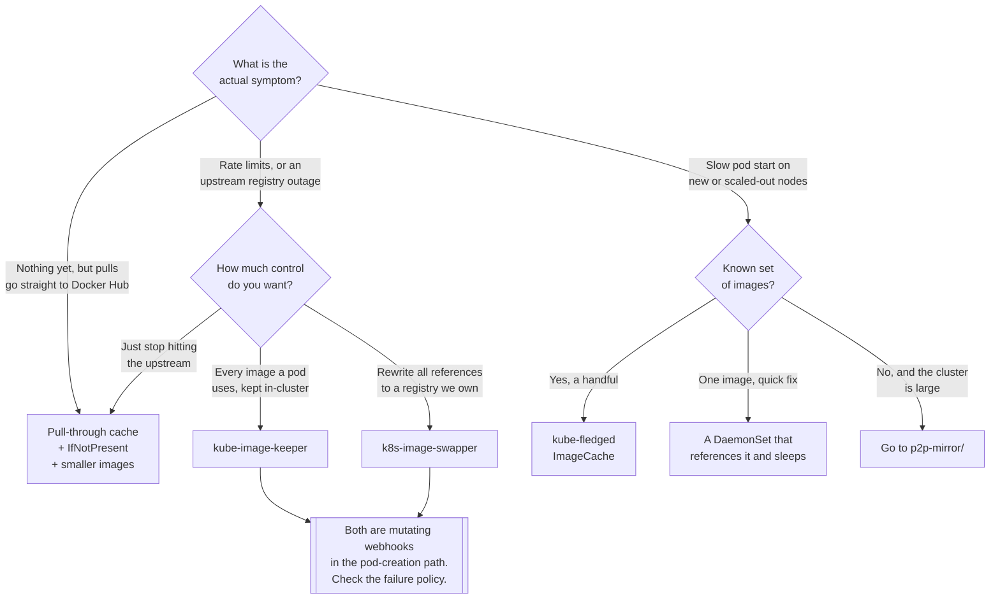

[← Container images](../README.md)

# Image caching

Keeping images close to the nodes, so that a pull is local, survives an upstream outage, and does
not count against somebody's rate limit.

Tools covered: [`kube-image-keeper`](kube-image-keeper/README.md) ·
[`kube-fledged`](kube-fledged/README.md) ·
[`k8s-image-swapper`](k8s-image-swapper/README.md)

When caching stops being enough because the cluster is large, the next step is
[`../p2p-mirror/`](../p2p-mirror/README.md).

## Contents

1. [Three different problems](#1-three-different-problems)
2. [The tools](#2-the-tools)
3. [The cheap fixes first](#3-the-cheap-fixes-first)
4. [Pre-pulling, and what it costs](#4-pre-pulling-and-what-it-costs)
5. [Decision tree](#5-decision-tree)
6. [Anti-patterns](#6-anti-patterns)
7. [How this applies to pikakube](#7-how-this-applies-to-pikakube)

---

## 1. Three different problems

"Caching images" gets used for three concerns that have different symptoms and different fixes.

| Problem | Symptom | Fix |
|---|---|---|
| **Slow cold start** | a pod is `ContainerCreating` for minutes on a fresh node | **pre-pull** the image before it is needed |
| **Upstream dependency** | `ImagePullBackOff` because Docker Hub is rate-limiting or down | a **local copy** of every image in use |
| **Upstream disappearance** | an image tag that existed last month has been deleted or moved | a local copy that is authoritative |

The second and third are the ones people underestimate. A cluster whose workloads reference
`docker.io/library/postgres:16` directly has an availability dependency on Docker Hub, an
anonymous pull rate limit shared across the cluster's egress IP, and no protection against the
tag being repushed or removed. None of that is visible until a node pool scales out and half the
pods fail to start.

The first is a scheduling problem: pull time is startup time. It hurts most where nodes are
short-lived — autoscaling, spot instances, a `DaemonSet` that must be ready before anything else
schedules.

## 2. The tools

| Tool | What it does | Mechanism | Detail |
|---|---|---|---|
| **kube-image-keeper** | copies every image a pod uses into an **in-cluster registry**, and serves it from there afterwards | mutating webhook plus a registry and a per-node proxy | [→](kube-image-keeper/README.md) |
| **kube-fledged** | pre-pulls a declared list of images onto declared nodes, and keeps them there | an `ImageCache` CRD and pull jobs | [→](kube-fledged/README.md) |
| **k8s-image-swapper** | rewrites image references to a registry you control, copying on first use | mutating webhook | [→](k8s-image-swapper/README.md) |

They answer the three problems above in order, and they are complementary rather than competing:

- **kube-image-keeper** protects against upstream going away. Its promise is that an image that
  ran once can always run again, because a copy is held in the cluster.
- **kube-fledged** attacks start latency for a known set of images — the ones whose cold pull is
  actually painful.
- **k8s-image-swapper** is about *where images are pulled from*, centrally: nothing pulls from
  Docker Hub any more, because every reference is rewritten to the mirror before the pod is
  created. It was built around AWS ECR and shows it.

Two of the three are **mutating admission webhooks**, which is worth naming as a shared risk: they
sit in the pod-creation path, so if the webhook is unavailable and its failure policy is `Fail`,
no pods are created at all. Read the failure policy before deploying either.

## 3. The cheap fixes first

Before deploying a controller, three changes cost nothing and remove most of the pain:

| Fix | Effect |
|---|---|
| **`imagePullPolicy: IfNotPresent`** with immutable tags | a node that already has the image stops asking the registry for it |
| **Smaller images** | the pull is shorter for every node, forever — see [`../builder/`](../builder/README.md) |
| **A pull-through cache** in front of the upstream | one registry pull per image instead of one per node, and rate limits stop mattering |

The pull-through cache is the highest-value item and it does not need any tool in this folder: the
[distribution](https://github.com/distribution/distribution/) registry runs in proxy mode, and
several of the registries in [`../oci-registry/`](../oci-registry/README.md) — Harbor, zot —
provide it as a feature. Configure the container runtime's mirror settings to point at it and
nothing in any manifest changes.

The `imagePullPolicy` point is worth repeating because the default surprises people:
`imagePullPolicy` defaults to `Always` when the tag is `:latest` or absent. So the same habit that
makes deployments non-reproducible also makes every pod start a registry round trip.

## 4. Pre-pulling, and what it costs

Pre-pulling means the image is on the node before anything needs it. Two ways to do it:

| Approach | How | Trade-off |
|---|---|---|
| **A `DaemonSet` that sleeps** | a pod on every node whose only job is to reference the image | trivially simple, one pod per node forever, one image per `DaemonSet` |
| **kube-fledged** | an `ImageCache` resource listing images and node selectors | a controller and a CRD, but declarative and multi-image |

The `DaemonSet` trick is the folk version and it works: Kubernetes pulls the image to schedule the
pod, so the image is now in the node's content store. It costs a running pod per node — small, but
permanent — and it does not scale past a couple of images before the manifests become silly.

What pre-pulling actually costs, either way:

- **node disk**. Cached images are not free; a node with fifty pre-pulled images can run out of
  space, and the kubelet's garbage collection will start evicting images under disk pressure —
  possibly the ones just pre-pulled.
- **staleness**. A pre-pulled mutable tag is a *stuck* tag: the node has `:latest` from three
  weeks ago and `IfNotPresent` will never replace it. Immutable tags make this a non-issue, which
  is one more reason for them.
- **cluster-wide pull storms** at the moment the pre-pull itself runs, which is the problem it was
  supposed to avoid — worth staggering.

## 5. Decision tree

## 6. Anti-patterns

| Anti-pattern | Why it is bad | What to do instead |
|---|---|---|
| Pulling production images straight from Docker Hub | rate limits and an availability dependency you do not control | a pull-through cache, or a mirrored copy |
| A caching webhook with `failurePolicy: Fail` and one replica | the webhook becomes a cluster-wide single point of pod creation | replicas, or `Ignore`, deliberately chosen |
| Pre-pulling a mutable tag | the node keeps a stale image and `IfNotPresent` never refreshes it | immutable tags |
| Pre-pulling everything | node disk fills and the kubelet evicts images under pressure | pre-pull the images whose cold pull actually hurts |
| `imagePullPolicy: Always` with immutable tags | a registry round trip per pod start for content that cannot have changed | `IfNotPresent` |
| A cache instead of smaller images | the pull is still large, just from closer by | fix the image first |
| Reaching for P2P distribution on a small cluster | a `DaemonSet` in the path of every pull, for a problem a cache solves | [`../p2p-mirror/`](../p2p-mirror/README.md) only past the threshold |
| A cached copy nobody prunes | in-cluster registry storage grows without limit | retention policy plus garbage collection |

## 7. How this applies to pikakube

All three tools are mapped as Flux `HelmRelease`s, and the folder also holds a bare
`daemonset.yaml` — the folk pre-pull trick from [§4](#4-pre-pulling-and-what-it-costs): an
`image-prepull` `DaemonSet` running `ubuntu:20.04` with `sleep 3600`, `tolerations: operator:
Exists` so it lands everywhere, and `nodeSelector: spot: "true"` so it targets spot nodes
specifically. That last detail is the whole rationale in one line — spot nodes are replaced
constantly, so pull time is felt constantly.

[kube-image-keeper](kube-image-keeper/README.md) is the most complete of the three here: chart
`1.5.0`, with an explicit Flux `dependsOn` cert-manager (its webhook needs certificates) and the
bundled registry UI enabled. [kube-fledged](kube-fledged/README.md) is chart `v0.10.0` with an
example `ImageCache` showing both forms — images cached on every node, and images cached only on
nodes matching a selector, with `imagePullSecrets` for private repositories.
[k8s-image-swapper](k8s-image-swapper/README.md) is chart `1.11.0`, and carries the recorded
limitation that it does **not support Azure Container Registry**
([estahn/k8s-image-swapper#572](https://github.com/estahn/k8s-image-swapper/issues/572)).

For this cluster the ordering in [§3](#3-the-cheap-fixes-first) is the honest one: a pull-through
cache in front of Docker Hub, provided by whichever registry from
[`../oci-registry/`](../oci-registry/README.md) is deployed, removes most of the problem before
any of these controllers is needed. kube-image-keeper is the one that adds something a plain cache
does not — a guarantee that an image which ran once can run again.

---

[← Container images](../README.md)
