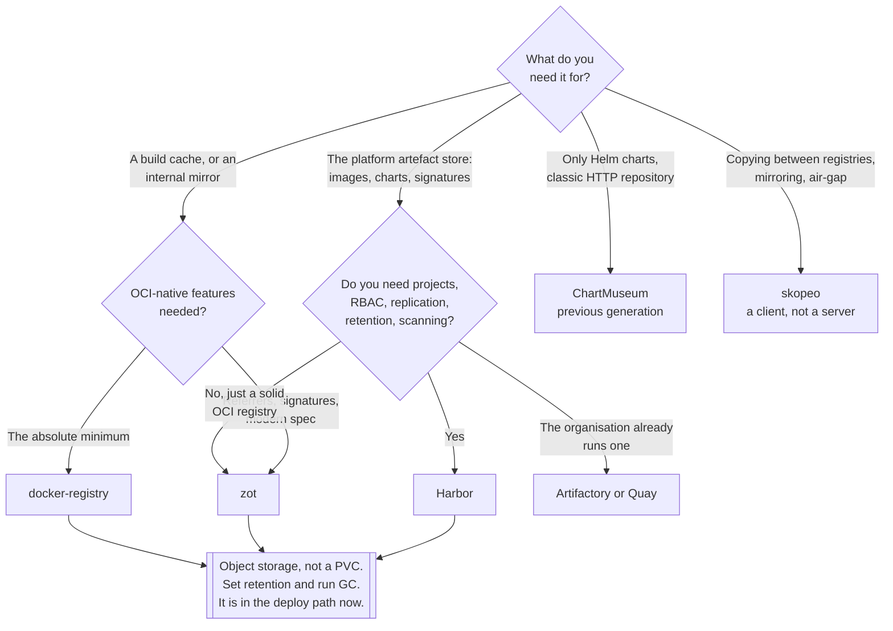

[← Container images](../README.md)

# OCI registry

Where images live — and, increasingly, Helm charts, signatures, SBOMs and everything else that
can be addressed by a digest.

Tools covered: [`harbor`](harbor/README.md) · [`zot`](zot/README.md) ·
[`docker-registry`](docker-registry/README.md) ·
[`jfrog-artifactory`](jfrog-artifactory/README.md) · [`quay`](quay/README.md) ·
[`chartmuseum`](chartmuseum/README.md) · [`skopeo`](skopeo/README.md)

## Contents

1. [What a registry actually is](#1-what-a-registry-actually-is)
2. [Not just images any more](#2-not-just-images-any-more)
3. [Helm: from HelmRepository to OCIRepository](#3-helm-from-helmrepository-to-ocirepository)
4. [The options](#4-the-options)
5. [Storage, garbage collection and retention](#5-storage-garbage-collection-and-retention)
6. [Availability, because it is now load-bearing](#6-availability-because-it-is-now-load-bearing)
7. [Decision tree](#7-decision-tree)
8. [Anti-patterns](#8-anti-patterns)
9. [How this applies to pikakube](#9-how-this-applies-to-pikakube)

---

## 1. What a registry actually is

A registry is a **content-addressed blob store with a naming layer on top**, speaking one HTTP
API — the [OCI distribution spec](https://github.com/opencontainers/distribution-spec).

| Concept | What it is |
|---|---|
| **Blob** | a layer or a config, addressed by `sha256` digest, stored once |
| **Manifest** | a JSON document listing a config and an ordered set of layer digests |
| **Index** | a manifest of manifests — the multi-architecture case |
| **Tag** | a mutable name pointing at a manifest digest |
| **Repository** | a namespace of tags and digests, such as `library/postgres` |

Two properties fall out of this and explain most registry behaviour. **Blobs are deduplicated by
digest**, so ten images sharing a base image store that base once — which is why registry storage
grows more slowly than the sum of image sizes, and why deleting a tag frees nothing until garbage
collection runs. And **the tag is the only mutable part**, which is exactly the problem described
in [§5 of the parent](../README.md#5-tags-lie-digests-do-not).

Because the API is standardised, the registries below are interchangeable at the protocol level.
They differ entirely in what they add around it.

## 2. Not just images any more

The important shift: the same API now stores anything.

| Artefact | How |
|---|---|
| Container images | the original case |
| **Helm charts** | pushed as OCI artefacts — `helm push chart.tgz oci://registry/charts` |
| **Signatures** | Cosign writes them as artefacts alongside the image |
| **SBOMs and attestations** | attached to the image they describe, via the referrers API |
| Flux and Kustomize manifests | `flux push artifact oci://...` |
| WASM modules, Terraform modules, ML models | generic artefacts with their own media types |

This is why the folder is called `oci-registry` and not `docker-registry`. **A registry is
becoming the artefact store for the whole platform**, and choosing one is no longer only a
question about images. The practical consequence: check that a candidate registry supports the
**referrers API** and arbitrary media types, not just image manifests — an older registry will
reject a Cosign signature or an SBOM it does not recognise.

## 3. Helm: from HelmRepository to OCIRepository

Worth its own section, because it is the change under way in this repository.

| | **Classic chart repository** | **OCI** |
|---|---|---|
| What it is | an HTTP server with `index.yaml` and tarballs | charts as artefacts in a registry |
| Discovery | the whole index is downloaded and parsed | pull the tag you want |
| Index size | grows with every version of every chart | not applicable |
| Authentication | whatever the HTTP server does | registry authentication, the same as images |
| Signing | provenance files, rarely used | Cosign, the same as images |
| In Flux | `HelmRepository` | **`OCIRepository`** |
| Server needed | [ChartMuseum](chartmuseum/README.md), or a static site | the registry you already run |

The OCI model wins on the argument that matters for a platform: **one artefact store, one
authentication mechanism, one retention policy, one signing story**. A chart repository was a
second thing to run, secure and back up, for no reason other than history.

The consequence is the one to internalise: **as charts move into the registry, the registry moves
into the reconciliation path**. A `HelmRepository` outage delayed a chart download; an
`OCIRepository` outage stops Flux applying releases. Whatever availability the registry has is now
the availability of deployment itself — see [§6](#6-availability-because-it-is-now-load-bearing).

ChartMuseum remains in this folder because it is what a classic `HelmRepository` is served by, and
because plenty of upstream charts are still published that way. It is the previous generation, not
a mistake.

## 4. The options

| Registry | What it is | Weight | Detail |
|---|---|---|---|
| **Harbor** | the CNCF registry platform — projects, RBAC, replication, scanning, signing, quotas | heavy: core, jobservice, portal, registry, Redis, PostgreSQL | [→](harbor/README.md) |
| **zot** | a minimal, **OCI-native** registry; no legacy Docker manifest support | one binary | [→](zot/README.md) |
| **docker-registry** | the reference [distribution](https://github.com/distribution/distribution/) implementation | one binary | [→](docker-registry/README.md) |
| **JFrog Artifactory** | a universal artefact manager that also speaks OCI | very heavy | [→](jfrog-artifactory/README.md) |
| **Quay** | Red Hat's registry, with an operator | heavy | [→](quay/README.md) |
| **ChartMuseum** | a classic Helm chart repository server, not an image registry | light | [→](chartmuseum/README.md) |
| **skopeo** | not a registry — the **client** for copying and inspecting between them | a CLI | [→](skopeo/README.md) |

The honest split:

- **docker-registry** is the minimum that works. No UI, no users, no scanning, no replication. For
  a build cache or an internal mirror that is not a criticism, it is the point.
- **zot** is the modern minimum: OCI-native, small, supports the referrers API and signatures.
  It is the right default when the requirement is "a registry", not "a registry platform".
- **Harbor** is what you deploy when the requirement includes **projects with separate access
  control, replication between environments, immutability and retention rules, and scanning at
  push time**. It costs six components and a PostgreSQL database, and it is the only option here
  that answers those questions properly.
- **Artifactory** and **Quay** are enterprise products; they make sense where the organisation
  already runs them, and rarely as a new decision on a small cluster.

**skopeo** belongs in this folder even though it is not a registry: it is how images are copied
between registries without a daemon and without pulling into a local store, which is the standard
mirror, promote and air-gap workflow.

## 5. Storage, garbage collection and retention

The part that is skipped and then becomes an incident.

Because blobs are content-addressed and shared, **deleting a tag frees nothing**. The manifest is
unreferenced but the blobs remain until garbage collection runs, and in the reference
implementation that historically required read-only mode or a restart. Registry storage therefore
grows monotonically unless three things are configured:

| Control | What it does |
|---|---|
| **Retention / tag-retention policy** | decides which tags survive — keep the last N, keep anything deployed, keep semver |
| **Garbage collection** | actually frees the blobs no manifest references any more |
| **Immutability rules** | forbid repushing a tag, which is a correctness control as much as a storage one |

Harbor provides all three as project-level policy. A plain distribution registry provides garbage
collection and expects you to script the rest.

The two repositories that grow fastest are the ones nobody looks at: the **build cache**
repository from [§3 of the parent](../README.md#3-layer-caching-is-the-build-time), and CI-tagged
images from feature branches. Both deserve an aggressive retention policy from day one.

On the storage backend: filesystem is fine for a laptop cluster and wrong for anything real,
because it pins the registry to one node and makes replicas impossible. **Object storage — S3,
MinIO, GCS — is what makes a registry horizontally scalable**, and it should be the default
assumption for anything expected to survive a node failure.

## 6. Availability, because it is now load-bearing

A registry used to be something you needed at deploy time. With charts as OCI artefacts and image
automation watching tags, it is something you need **continuously**.

| If the registry is down | Consequence |
|---|---|
| Running pods | unaffected — the image is already on the node |
| New pods on nodes without the image | `ImagePullBackOff` |
| **Scale-out and node replacement** | new nodes cannot start anything |
| Flux `OCIRepository` sources | reconciliation fails; releases cannot be applied |
| Image update automation | stops seeing new tags |
| Builds using a registry cache | slow, or failing |

The circularity to avoid is the same one described for forges: **a registry that hosts the charts
Flux uses, deployed by Flux, on the cluster it serves.** Bootstrapping that cluster from scratch
requires the registry, which requires the cluster. It is workable with a documented bootstrap
order, and it must be a decision rather than something discovered during a rebuild.

Practically: object storage rather than a `PersistentVolume`, more than one replica, and — if the
registry is genuinely in the deployment path — a mirror or an external fallback.

## 7. Decision tree

## 8. Anti-patterns

| Anti-pattern | Why it is bad | What to do instead |
|---|---|---|
| The registry as one pod on a `PersistentVolume` | a single point of failure for pulls, charts and reconciliation | object storage plus replicas |
| No retention policy | storage grows until it fills, and nobody notices which repository did it | per-project retention, aggressive on caches |
| Deleting tags and expecting space back | blobs are shared and stay until garbage collection | schedule GC, and verify it ran |
| Mutable tags allowed in production repositories | the same name means different content over time | immutability rules at the registry |
| One credential with push rights everywhere | a build pod that can push anywhere can also overwrite anything | per-repository credentials, read-only where possible |
| Anonymous pull from Docker Hub in production | rate limits and an availability dependency you do not control | a pull-through cache, or mirrored copies |
| Charts in a chart repository and images in a registry | two systems, two authentications, two backups | OCI for both |
| A registry deployed by the Flux that depends on it | the bootstrap depends on itself | host it outside, or document the bootstrap order |
| Running Harbor because it appears in every list | six components and a database for what zot does with one binary | match the tool to the requirement |
| Trusting an image because it is in your registry | a copy of an unvetted image is still unvetted | scanning and signing — `infrastructure/security/3-container/` |

## 9. How this applies to pikakube

Six registries plus one client are mapped, which is more evaluation than deployment — and the
useful outcome is the shape of the trade-off rather than a winner.

[Harbor](harbor/README.md) is the most fully configured: chart `1.19.1`, exposed through Ingress
at `harbor.127.0.0.1.nip.io` with an mkcert TLS secret and Forecastle annotations so it appears in
the dashboard. It also carries the two recorded frustrations that are worth keeping: **its own
Helm chart is not distributed as an OCI artefact**
([goharbor/harbor-helm#2265](https://github.com/goharbor/harbor-helm/issues/2265)), so in a
repository moving to `OCIRepository` Harbor itself has to be installed the old way; and the
default `admin` / `Harbor12345` login **sometimes simply does not work**, which in practice is
Harbor's core still starting up behind an Ingress that is already answering.

[zot](zot/README.md) (chart `0.1.65`) and
[docker-registry](docker-registry/README.md) (the `twuni` chart `2.2.3`) are the small options,
and [zot](zot/README.md) is the one to prefer of the two for anything new — same footprint, modern
spec support. [Artifactory OSS](jfrog-artifactory/README.md) is mapped at chart `107.98.10`, and
[Quay](quay/README.md) carries a blunt verdict on its installation.
[ChartMuseum](chartmuseum/README.md) is documented as the classic chart-repository server, which
is what [§3](#3-helm-from-helmrepository-to-ocirepository) is about moving away from.

**The thing to decide, not drift into**: as this repository converts `HelmRepository` sources to
`OCIRepository`, whichever registry is chosen stops being a convenience and becomes a dependency
of every reconciliation. That argues for object-storage-backed replicas, and against the registry
living on the same cluster it deploys.

---

[← Container images](../README.md)
