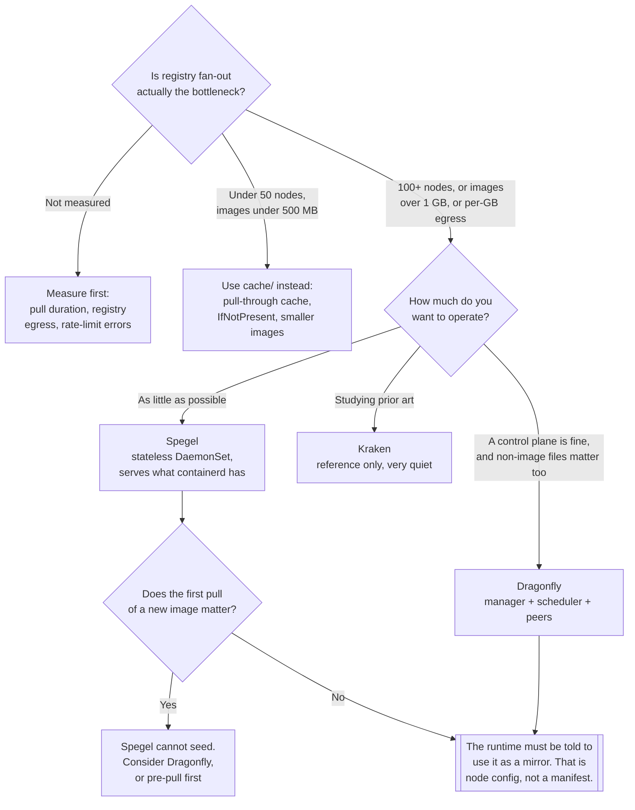

[← Container images](../README.md)

# Peer-to-peer image distribution

Nodes serving image layers to each other, so that a rollout hits the registry once instead of
once per node. A real solution to a real problem — above a threshold, and pure overhead below it.

Tools covered: [`spegel`](spegel/README.md) · [`dragonfly`](dragonfly/README.md) ·
[`kraken`](kraken/README.md)

Below the threshold, the answer is [`../cache/`](../cache/README.md) and smaller images.

## Contents

1. [The problem](#1-the-problem)
2. [Where the threshold is](#2-where-the-threshold-is)
3. [The tools](#3-the-tools)
4. [What it costs](#4-what-it-costs)
5. [Decision tree](#5-decision-tree)
6. [Anti-patterns](#6-anti-patterns)
7. [How this applies to pikakube](#7-how-this-applies-to-pikakube)

---

## 1. The problem

Rolling out one 2 GB image across 200 nodes means **400 GB pulled from one registry inside the
same few seconds**. Every node independently requests the same layers from the same endpoint.

What fails first is not the registry's CPU. It is:

| Bottleneck | Symptom |
|---|---|
| Registry network egress | pulls slow to a crawl for everyone, including unrelated workloads |
| Rate limits, on public registries | `toomanyrequests`, then `ImagePullBackOff` across the cluster |
| The storage backend | S3 request throttling under a simultaneous fan-out |
| Egress cost | a per-gigabyte bill that scales with node count, per rollout |
| Rollout duration | twenty minutes for what should take one, and a scale-out that stalls |

The cluster already holds what it needs, though: after the first few nodes have pulled, the layers
exist **inside the cluster**, on fast local network, many times over. Peer-to-peer distribution
uses that. A node that needs a layer asks its peers first and only falls back to the registry if
no peer has it. Registry load becomes roughly constant instead of linear in node count, and pull
bandwidth becomes the cluster's internal network, which is usually far larger than its egress.

## 2. Where the threshold is

The single most useful thing in this folder, because the tools are all perfectly good and mostly
unnecessary.

| Situation | Verdict |
|---|---|
| Under ~20 nodes | **No.** A pull-through cache is enough, and simpler |
| 20–100 nodes, images under 500 MB | **Probably not.** Fix image size and `imagePullPolicy` first |
| **100+ nodes** | **Yes.** Registry fan-out is now the dominant cost of a rollout |
| **Images over 1 GB**, at any meaningful node count | **Yes.** ML images, JVM monoliths, CUDA base layers |
| Frequent scale-out — autoscaling, spot, batch | **Yes, sooner.** Pull time is startup time, paid constantly |
| Registry egress billed per gigabyte | **Yes.** The arithmetic makes the case on its own |
| Air-gapped or bandwidth-limited edge sites | **Yes.** This is the case P2P was designed for |
| A registry that is already struggling at 30 nodes | **Look at the registry first** — it is probably one pod on a PVC |

The order of remedies matters, because the cheap ones remove the problem entirely at small scale:

1. `imagePullPolicy: IfNotPresent` with immutable tags — stop re-fetching what is already there
2. smaller images — multi-stage builds, a small base ([`../builder/`](../builder/README.md))
3. a **pull-through cache** close to the cluster ([`../cache/`](../cache/README.md))
4. pre-pull the few images whose cold start actually hurts
5. **only then**, peer-to-peer

## 3. The tools

| Tool | Model | Extra components | Detail |
|---|---|---|---|
| **Spegel** | **stateless** — nodes advertise what is already in containerd's content store and serve it to peers | a `DaemonSet`, nothing else | [→](spegel/README.md) |
| **Dragonfly** | a full P2P distribution system with a manager, schedulers and per-node peers | manager, scheduler, seed peers, a database | [→](dragonfly/README.md) |
| **Kraken** | Uber's P2P registry — tracker, origin, build-index, agents | several stateful components | [→](kraken/README.md) |

**Spegel is the one to try first**, and the reason is architectural rather than a preference: it
holds no state of its own. It reads the layers containerd has already stored on the node,
advertises them to a libp2p peer network, and serves them over HTTP when a peer asks. There is
nothing to back up, nothing to seed, and removing it leaves the cluster exactly as it was. The
limitation follows from the same design — **it can only serve what some node has already pulled**,
so the first pull of a new image still goes to the registry, and a cold cluster gets no benefit.

**Dragonfly** is the heavier, more capable option: it is a CNCF project, it handles arbitrary file
distribution and not only images, it can seed content deliberately rather than opportunistically,
and it has a manager with a UI and scheduling policies. That is genuinely more, and it is
genuinely more to operate — a control plane, a database, and a component in the path of every
pull.

**Kraken** is Uber's, built for their scale and open-sourced. It is architecturally interesting —
origin, tracker and build-index, designed around very large clusters — and it is the quietest of
the three by a wide margin; upstream activity has been minimal for years, and it is not published
as a Helm chart, which is why the release here has to point at the chart directory inside the
GitHub repository. Treat it as a reference architecture rather than a candidate.

All three require the **container runtime to be configured to use them as a mirror** — containerd
`hosts.toml` entries, or the equivalent. That configuration is on the node, not in a manifest,
which is the part that makes adoption more than a `helm install`.

## 4. What it costs

Named honestly, because the benefit is easy to see and the cost is not:

| Cost | Detail |
|---|---|
| **A `DaemonSet` in the pull path** | every node runs an agent; if it misbehaves, image pulls misbehave |
| **Node configuration** | containerd mirror settings must be applied on every node, including new ones |
| Failure modes that are new | a peer that advertises a layer and cannot serve it stalls a pull |
| Debugging | "why is this pull slow" now has a distributed answer |
| Memory and disk on every node | modest for Spegel, real for the others |
| Another thing to upgrade | in the path of every workload start |

The one that bites is the second: node-level runtime configuration is easy to apply once and easy
to forget on a new node pool, and the symptom is silent — pulls simply go back to the registry.

## 5. Decision tree

## 6. Anti-patterns

| Anti-pattern | Why it is bad | What to do instead |
|---|---|---|
| Deploying P2P on a small cluster | a `DaemonSet` in the path of every pull, solving a problem that does not exist | [`../cache/`](../cache/README.md) and smaller images |
| P2P instead of fixing a 4 GB image | the pull is still 4 GB, just from a neighbour | multi-stage builds, a small base |
| P2P in front of a registry that is one pod on a PVC | the registry was the problem, and it still is | fix the registry first |
| Deploying it without measuring | no way to tell whether it helped | record pull duration and registry egress before and after |
| Forgetting the runtime mirror configuration on a new node pool | those nodes silently bypass it | manage `hosts.toml` with the node bootstrap |
| Expecting Spegel to help on a cold cluster | it only serves what a node already has | pre-pull, or a seeding system |
| Kraken as a new deployment | effectively unmaintained, no published chart | Spegel or Dragonfly |
| No monitoring on the agents | a broken peer degrades pulls cluster-wide and looks like a registry problem | alert on the `DaemonSet` and on pull latency |

## 7. How this applies to pikakube

All three are mapped as Flux `HelmRelease`s: [Spegel](spegel/README.md) at chart `v0.0.28`,
[Dragonfly](dragonfly/README.md) at chart `1.3.17`, and [Kraken](kraken/README.md) from a
`GitRepository` source pointing at the chart inside `uber/kraken` — because there is no chart
repository to point at — with the replica counts trimmed to one and `testfs` disabled.

**By the threshold in [§2](#2-where-the-threshold-is), none of this is warranted here.** That is
not a criticism of the mapping: the threshold is a property of the cluster, not of the tool, and
the point of documenting all three is that the choice should be understood before it is needed
rather than made during an incident. When it is needed, **Spegel is the one to reach for** — a
stateless `DaemonSet` that adds no storage, no control plane and nothing to back up, and that can
be removed as cleanly as it was added.

The recorded operational notes are small and practical: Dragonfly's manager is reached with
`kubectl port-forward svc/dragonfly-manager 8080` and requires an account to be created before the
UI is usable. Nothing equivalent is recorded for Spegel, which is consistent with it having no UI
and no state to look at.

Before any of this, the cheaper layer is [`../cache/`](../cache/README.md) — and a registry from
[`../oci-registry/`](../oci-registry/README.md) that is not itself the bottleneck.

---

[← Container images](../README.md)
