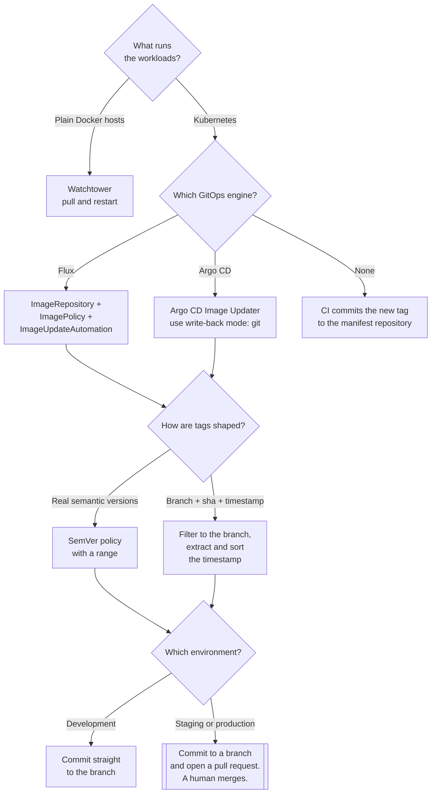

[← Container images](../README.md)

# Image update automation

A new image exists in the registry. Something has to make it the running one — and where that
"something" writes its decision is the whole design question.

Tools covered: [`flux-image-update`](flux-image-update/README.md) ·
[`argo-image-updater`](argo-image-updater/README.md) ·
[`watchtower`](watchtower/README.md)

## Contents

1. [Two answers, and where the truth lives](#1-two-answers-and-where-the-truth-lives)
2. [How Flux does it](#2-how-flux-does-it)
3. [Argo CD Image Updater](#3-argo-cd-image-updater)
4. [Watchtower, and why it is different](#4-watchtower-and-why-it-is-different)
5. [Tag policies, and how they go wrong](#5-tag-policies-and-how-they-go-wrong)
6. [When not to automate](#6-when-not-to-automate)
7. [Decision tree](#7-decision-tree)
8. [Anti-patterns](#8-anti-patterns)
9. [How this applies to pikakube](#9-how-this-applies-to-pikakube)

---

## 1. Two answers, and where the truth lives

| | **CI pushes the change** | **A controller watches the registry** |
|---|---|---|
| Who edits the manifest | the pipeline, after a successful build | an in-cluster controller |
| What triggers it | the build finishing | a new tag appearing |
| Credentials | CI holds a Git token, and often cluster credentials too | the controller holds a Git token |
| Images built elsewhere | awkward — CI has to know about them | handled naturally |
| Coupling | the pipeline knows the deployment repository's layout | the controller knows a tag policy |
| Audit trail | a commit from CI | a commit from the controller |

Both write to Git, and that is the point: **the desired state stays in Git either way**. What
differs is who computes the new value and what has to be true for it to work.

The controller model is the GitOps-native one, and its argument is that the cluster's state is
determined by Git and by nothing else — no pipeline holds cluster credentials, no deployment
happens from outside, and an image built by anything at all is picked up the same way. The
pipeline model is simpler and more explicit, and it is the right answer when the build already
knows exactly which manifest to change.

The third possibility — a controller that changes the cluster **without** writing to Git — is
[Watchtower](watchtower/README.md), and on Kubernetes it is the wrong shape entirely
([§4](#4-watchtower-and-why-it-is-different)).

## 2. How Flux does it

Flux splits the job across two controllers and three resources, which is worth understanding
because the separation is the useful part.

| Resource | Controller | What it does |
|---|---|---|
| **`ImageRepository`** | image-reflector | polls a registry repository and records the list of tags |
| **`ImagePolicy`** | image-reflector | filters and orders those tags, and names **one** as selected |
| **`ImageUpdateAutomation`** | image-automation | writes the selected image into the manifests and **commits to Git** |

The flow, end to end:

```
registry ──▶ ImageRepository ──▶ ImagePolicy ──▶ ImageUpdateAutomation ──▶ git commit
                                                                              │
                                                                              ▼
                                                            Flux reconciles ──▶ cluster
```

The deployment happens because **Git changed**, not because a controller touched the cluster. That
keeps one invariant intact: the repository is still a complete description of what is running, and
a `git revert` is still a rollback.

The mechanism that connects a policy to a manifest is a marker comment in the YAML:

```yaml
image: andreyolv/flask-flux:main-abc1234-2024-01-01T00-00-00Z # {"$imagepolicy": "flux-system:flask-flux"}
```

`update.strategy: Setters` means the automation looks for those markers and rewrites the value in
place. That is deliberately narrow — it edits exactly what it was told to edit and nothing else,
which is what makes a controller with commit access acceptable.

The controller commits as a configured author (`fluxcdbot` by convention) to a configured branch.
Committing straight to the branch Flux reconciles is the fast path; committing to a side branch
and opening a pull request is the reviewed path, and which one is right differs per environment
([§6](#6-when-not-to-automate)).

## 3. Argo CD Image Updater

The same idea for the other GitOps engine, with one significant difference: it can operate in two
modes.

| Mode | Behaviour |
|---|---|
| **`git`** | writes the new image into the Git repository — the same model as Flux |
| **`argocd`** | sets a parameter override on the `Application` directly, **without touching Git** |

The second mode is convenient and produces exactly the drift GitOps exists to remove: the live
`Application` no longer matches what the repository says. It is a reasonable choice for a
throwaway preview environment and a bad one anywhere the repository is meant to be authoritative.

It is an `argoproj-labs` project rather than part of Argo CD proper, which is worth knowing when
weighing its support guarantees against Flux's, where image automation is a first-class part of
the toolkit.

## 4. Watchtower, and why it is different

[Watchtower](watchtower/README.md) watches a registry and, when a tag moves, **pulls the new image
and restarts the container**. It is built for plain Docker hosts and does that job well.

On Kubernetes it is the wrong model on three counts:

| Problem | Detail |
|---|---|
| It mutates running state | nothing in Git records what happened, so the repository is no longer authoritative |
| It requires the Docker socket | which is root on the host — see [§2 of `builder-k8s/`](../builder-k8s/README.md#2-what-the-socket-actually-grants) |
| It requires mutable tags | the mechanism *is* "the tag moved", which is what [§5 of the parent](../README.md#5-tags-lie-digests-do-not) argues against |

It is documented here for completeness and because plenty of small deployments are still a Docker
host with a `docker-compose.yml`. For those it is a genuinely good tool. For a cluster with Flux,
it undoes the property the whole setup exists to provide.

## 5. Tag policies, and how they go wrong

The policy is what decides which of the available tags is "newest", and there are three families:

| Policy | Selects | Fits |
|---|---|---|
| **SemVer** | the highest version matching a range, e.g. `>=1.0.0 <2.0.0` | released software with real version numbers |
| **Alphabetical** | first or last in lexical order — used for timestamps | CI-built tags containing a sortable timestamp |
| **Numerical** | highest number | build numbers |

Alphabetical ordering only works if the tag sorts correctly as text, which is why timestamps in
tags must be zero-padded and ordered largest-unit-first: `2024-01-02T09-05-00Z` sorts after
`2024-01-02T08-05-00Z`, but a tag containing `1/2/2024` sorts arbitrarily. This is the single most
common way an image policy silently selects the wrong tag.

The `filterTags` pattern narrows the candidates before ordering, and the `extract` expression
pulls out the sortable part. A pattern like:

```yaml
filterTags:
  pattern: '^main-[a-f0-9]+-(?P<ts>[0-9-T]+)'
  extract: '$ts'
```

says: consider only tags built from `main` with a commit hash, and order them by the timestamp
inside the tag rather than by the whole string. That is the shape to copy — **filter to a branch,
order by a sortable component** — because it prevents a feature-branch build from ever being
selected for production.

## 6. When not to automate

Automation writing a commit that deploys to production, unattended, is a choice and not always the
right one.

| Situation | Better approach |
|---|---|
| Production, with a change process | automation opens a **pull request**; a human merges it |
| A tag pattern that could match a feature branch | tighten the filter before automating anything |
| Images from a third party | pin, review and bump deliberately — an upstream `:latest` is somebody else's release schedule |
| Database migrations tied to the release | ordering matters; a controller does not know about it |
| Anything with a compliance-mandated approval | the approval is the point |

The general shape that works: **automatic in development, pull request in staging, deliberate in
production.** The same controllers support all three; only the target branch and the policy
change.

## 7. Decision tree



## 8. Anti-patterns

| Anti-pattern | Why it is bad | What to do instead |
|---|---|---|
| Watchtower on Kubernetes | it changes running state without touching Git, and wants the Docker socket | Flux or Argo image automation |
| Argo CD Image Updater in `argocd` write-back mode | the live `Application` no longer matches the repository | write-back mode `git` |
| Automating straight to production | a deploy nobody chose, at a moment nobody chose | open a pull request instead |
| A tag filter that matches feature branches | a feature build reaches production because it sorted highest | anchor the pattern to the release branch |
| Alphabetical ordering on non-sortable timestamps | the "newest" tag is arbitrary and wrong intermittently | zero-padded, largest-unit-first timestamps |
| A SemVer policy with no range | a major version bump deploys itself | pin the range, e.g. `>=1.0.0 <2.0.0` |
| Automation and CI both editing the same manifest | commit conflicts, and two sources of truth | pick one |
| The automation's Git credential as a personal token | it leaves with the person and expires unannounced | a deploy key or a machine account |
| Chasing `:latest` | there is no ordering, so "new" means "whatever moved" | immutable tags |
| No alert when automation stops committing | deployments quietly stop and nobody notices for a week | alert on the automation's reconciliation status |

## 9. How this applies to pikakube

[`flux-image-update/`](flux-image-update/README.md) is a **complete worked example**, not a
mapping, and it is the one to read: a small Flask application with its `Dockerfile` and Kubernetes
manifests, an `ImageRepository` polling `andreyolv/flask-flux` every minute, an `ImagePolicy`
filtering tags shaped `main-<sha>-<timestamp>` and ordering them by the extracted timestamp, and
an `ImageUpdateAutomation` that commits back to `main` as `fluxcdbot` with `strategy: Setters`
over the `./kubernetes` path. That is exactly the loop described in [§2](#2-how-flux-does-it),
running end to end — and its tag pattern is the good shape from
[§5](#5-tag-policies-and-how-they-go-wrong): anchored to `main`, ordered by a sortable timestamp.

**Flux image automation is the right answer for this repository**, because Flux is already the
reconciliation engine and this keeps every change to the cluster visible as a commit.
[Argo CD Image Updater](argo-image-updater/README.md) is mapped at chart `0.11.3` as the Argo-side
equivalent; [Watchtower](watchtower/README.md) is documented as the Docker-host tool it is, and
explicitly not as a candidate here.

The gap worth closing when this moves beyond an experiment is the one in
[§6](#6-when-not-to-automate): the example commits straight to `main`, which is right for a
demonstration and is not the shape to carry into anything that matters. Committing to a branch and
opening a pull request keeps the automation and keeps the decision.

---

[← Container images](../README.md)
