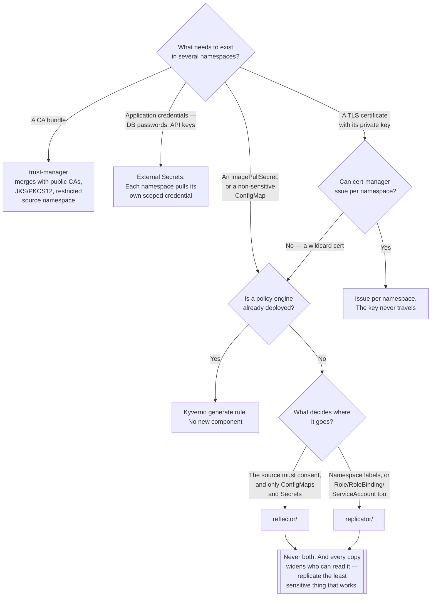

[← DevOps](../README.md)

# Replication

Copying Secrets and ConfigMaps across namespaces — and the isolation you give up by doing it.

Tools covered: [`reflector/`](reflector/README.md) · [`replicator/`](replicator/README.md)

## Contents

1. [The problem](#1-the-problem)
2. [Reflector or Replicator](#2-reflector-or-replicator)
3. [For CA bundles, use trust-manager instead](#3-for-ca-bundles-use-trust-manager-instead)
4. [The isolation you are giving up](#4-the-isolation-you-are-giving-up)
5. [Alternatives that are not replication](#5-alternatives-that-are-not-replication)
6. [Decision tree](#6-decision-tree)
7. [Anti-patterns](#7-anti-patterns)
8. [How this applies to pikakube](#8-how-this-applies-to-pikakube)

---

## 1. The problem

`Secret` and `ConfigMap` are namespaced, and Kubernetes provides no way to make one available in
another namespace. Every platform hits this within weeks of being multi-namespace:

| What is needed everywhere | Why |
|---|---|
| An `imagePullSecret` for a private registry | every namespace that pulls a private image needs it |
| A wildcard TLS certificate | Ingresses in six namespaces, one certificate |
| A CA bundle | every workload validating an internal TLS endpoint |
| A licence key, or shared configuration | one value, many consumers |

Without a tool there are three ways out, all bad: paste the resource into every namespace's
manifests and watch the copies diverge; write a `CronJob` that copies them and discover months later
that it has been failing; or give up and put everything in one namespace.

Replication controllers solve the mechanics. They watch a source resource and maintain synchronised
copies in other namespaces, keeping them updated when the source changes.

The mechanics are the easy part. **The question this folder is really about is whether copying the
resource is the right answer at all**, and section 3 onwards is that argument.

## 2. Reflector or Replicator

They do the same job with different opinions about who decides.

| | [Reflector](reflector/README.md) | [Replicator](replicator/README.md) |
|---|---|---|
| Who declares the intent | the **source**, always | the source (push) **or** the target (pull) |
| Target selection | namespace names and regular expressions | namespace names, regular expressions, **and label selectors** |
| Resource kinds | ConfigMap, Secret | ConfigMap, Secret, **Role, RoleBinding, ServiceAccount** |
| cert-manager awareness | explicit | none |
| Annotation prefix | `reflector.v1.k8s.emberstack.com/` | `replicator.v1.mittwald.de/` |

**Two capabilities decide it in practice.**

*Replicator handles RBAC objects.* If `Role`, `RoleBinding` or `ServiceAccount` need to be identical
across many namespaces, Reflector cannot do it at all.

*Replicator can target by label.* `replicate-to-matching: "team=data"` means a new namespace with
the right label receives the registry credential automatically, with no list to maintain anywhere.
For onboarding, that is genuinely better.

**One property argues the other way.** Reflector's model is source-only: a resource declares
`reflection-allowed` and names the namespaces permitted to receive it. A namespace cannot help
itself to a Secret it was not offered. Replicator's pull mode moves that decision to the consumer —
the source must still set `replication-allowed`, but the habit of setting it broadly and letting
namespaces help themselves is exactly the erosion described in section 4.

Reflector is the safer default. Replicator is the more capable one. **Do not run both** — two
controllers copying Secrets is twice the surface, and when a copy is stale nobody can say which
controller owns it.

## 3. For CA bundles, use trust-manager instead

This is the most important thing on this page, because distributing a CA bundle is one of the most
common reasons people deploy a replication controller, and it is the case where a generic tool is
clearly the wrong choice.

[**trust-manager**](../../security/2-cluster/certificates/trust-manager/README.md) is an official
cert-manager subproject built for exactly this. Its `Bundle` resource is cluster-scoped, declares
sources and targets, and materialises trust bundles into every namespace matching a selector.

Three things it does that a replicator cannot:

| trust-manager | A generic replicator |
|---|---|
| **Merges the private CA with the public (Mozilla) trust store** in one bundle | copies the private CA alone — and mounting only the internal CA breaks TLS to every public endpoint. This is the most common mistake when the bundle is assembled by hand |
| **Converts to JKS and PKCS#12** for JVM workloads | PEM only, so every JVM chart needs a `keytool` initContainer |
| **Reads sources only from a single trusted namespace**, so a compromised namespace cannot inject a CA cluster-wide | whoever controls the source Secret controls everyone's trust |

The third is a security property, not a convenience. On a data platform the second is decisive
independently: Kafka, Spark, Trino and anything speaking JDBC want a JKS truststore, not a PEM file.

trust-manager deliberately refuses to handle **private keys** — it distributes public trust material
only. So it does not replace the tools here for a full TLS Secret, an `imagePullSecret`, or a generic
application ConfigMap. But for the CA case, generic replication is the blunter tool, and reaching
for it is usually a sign that trust-manager was not known about rather than that it was rejected.

## 4. The isolation you are giving up

A namespace is the primary unit of isolation in Kubernetes. RBAC is scoped to it, NetworkPolicies
are scoped to it, and the reason a team's workloads live in their own namespace is that someone
decided the boundary should exist.

**Every replicated Secret is a hole in that boundary.** Copy a database credential into twelve
namespaces and anyone with `get secrets` in any of those twelve can read it — twelve sets of RBAC,
twelve sets of ServiceAccounts, twelve chances for a permissive `Role` to leak it. The Secret is now
only as protected as the weakest of them.

The failure that follows is not dramatic; it is quiet. A Secret is replicated once for a good
reason, the pattern is copied, and two years later nobody can answer "who can read the production
database password?" without an audit. Replication makes the answer unbounded by construction.

Three rules keep it defensible:

**1. Replicate the least sensitive thing that solves the problem.** A registry credential is
different in kind from a database password. Ranked by how defensible replication is:

| Resource | Verdict |
|---|---|
| `imagePullSecret` | **fine.** Needed wherever images are pulled; already effectively cluster-wide |
| Public CA bundle | **fine**, but use [trust-manager](../../security/2-cluster/certificates/trust-manager/README.md) |
| Non-sensitive ConfigMap | **fine** |
| Wildcard TLS Secret | **careful** — it contains a private key. See rule 2 |
| Database credentials, API keys | **usually wrong** — see rule 3 |

**2. Private keys should not travel.** A TLS Secret replicated to ten namespaces is one private key
with ten times the exposure and no way to revoke it from one place. The right answer is not
replication: it is cert-manager **issuing a certificate per namespace**, so each has its own key and
compromising one does not compromise the rest.

**3. For application credentials, the source should be external.** If several namespaces need
database credentials, each should get them **from the secret store** through External Secrets or a
similar operator — separate credentials, separately scoped, separately rotatable. Replicating one
credential everywhere means one rotation event that must succeed in twelve places at once, and one
compromise that reaches all of them.

## 5. Alternatives that are not replication

Before deploying a controller, three options that avoid the problem:

| Alternative | When it is better |
|---|---|
| **A policy engine's `generate` rule** (Kyverno, under `security/2-cluster/policies/`) | if a policy engine is already deployed, it does the same job with **no additional component**, and the rule sits alongside every other cluster policy rather than in its own system |
| **External Secrets, or a secret operator** | for application credentials. Each namespace pulls from the store independently, with its own scoped credential — this is a different and better shape of answer than copying one Secret around |
| **cert-manager issuing per namespace** | for anything containing a private key. The key never travels |

The Kyverno point is worth emphasising because it is frequently missed: on a cluster that already
runs a policy engine, a `generate` rule replaces this entire folder for most cases. The tools here
earn their place when there is no policy engine, or when the source-side consent model
([Reflector](reflector/README.md)) is specifically wanted.

## 6. Decision tree

## 7. Anti-patterns

| Anti-pattern | Why it is bad | What to do instead |
|---|---|---|
| A generic replicator for CA bundles | no merge with the public trust store, no JKS, no restricted source | [trust-manager](../../security/2-cluster/certificates/trust-manager/README.md) |
| Replicating a TLS Secret across many namespaces | one private key, many times the exposure, no single point of revocation | cert-manager issuing per namespace |
| Replicating database credentials | defeats namespace isolation and makes rotation an all-or-nothing event | External Secrets, with a scoped credential per namespace |
| `replicate-to: ".*"` | every namespace, including ones created later, including ones you do not control | name the namespaces, or use a deliberate label |
| Running Reflector and Replicator together | two controllers copying Secrets; no owner when a copy is stale | pick one |
| Deploying a replicator when a policy engine is present | a whole component for what a `generate` rule already does | Kyverno `generate` |
| Pull mode with broad `replication-allowed` | namespaces help themselves; the source has no meaningful say | source-side consent, per namespace |
| Assuming a replicated copy is current | if the controller is down, the copy is silently stale | alert on the controller, as with any reconciler |
| Replication as the answer to "these namespaces need the same thing" | sometimes they should not be separate namespaces | question the boundary before punching a hole in it |

## 8. How this applies to pikakube

**Both tools are deployed** via Flux — [Reflector](reflector/README.md) as chart `7.1.262` from the
emberstack repository, and [Replicator](replicator/README.md) from the mittwald repository. Per
section 2, that is the configuration to resolve: two controllers doing the same job, and no stated
reason to prefer one.

They are not equally exercised. Reflector is deployed with **no example resources at all** —
installed but not demonstrated. Replicator has a worked set under `example/`: two target namespaces
(`foo` and `bar`), and three Secrets showing push mode with `replicate-to: "foo,bar"`.

Those three Secrets are, deliberately or not, a ranking of how defensible each use is, exactly along
the lines of section 4:

| Example | Verdict |
|---|---|
| `acr-secret.yaml` — a container registry credential | **the strong case.** Needed wherever images are pulled; already effectively cluster-wide |
| `example.yaml` — a generic `Opaque` Secret | a fine demonstration; in production it depends entirely on what is in it |
| `tls-secret.yaml` — a TLS Secret | **the one to be careful about.** It contains a private key, and per rule 2 the alternative — cert-manager issuing per namespace — should be weighed every time |

**The most important connection is to certificates.**
[trust-manager](../../security/2-cluster/certificates/trust-manager/README.md) is documented in this
repository, and its README makes the case directly: it names Reflector and Replicator as
alternatives and explains why they do not cover the same ground — no merge with the public CA
bundle, no JKS or PKCS#12 output for JVM workloads, and no restricted source namespace.

For a data platform running JVM workloads, the JKS conversion alone settles it. If CA distribution
is ever the requirement here, it is a
[trust-manager](../../security/2-cluster/certificates/trust-manager/README.md) `Bundle`, not a
replicated ConfigMap — and the
[certificates folder](../../security/2-cluster/certificates/README.md) is where that decision lives.

**The gap worth naming:** neither section 5 alternative is reflected in what is deployed. If a policy
engine is running on this cluster, both of these controllers are components that a Kyverno `generate`
rule would replace — and if application credentials are ever the thing being replicated, the answer
is a secret operator, not either tool in this folder.

---

[← DevOps](../README.md)
