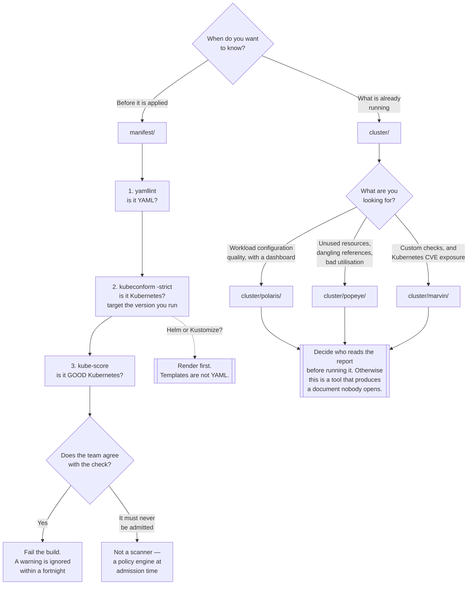

[← DevOps](../README.md)

# Scanners

Checking that manifests are valid and sensible before they land, and that clusters have not drifted after.

Subfolders: [`manifest/`](manifest/README.md) · [`cluster/`](cluster/README.md)

## Contents

1. [Two moments, two questions](#1-two-moments-two-questions)
2. [The three layers of manifest checking](#2-the-three-layers-of-manifest-checking)
3. [The boundary with security](#3-the-boundary-with-security)
4. [Scanning is not enforcement](#4-scanning-is-not-enforcement)
5. [Decision tree](#5-decision-tree)
6. [Anti-patterns](#6-anti-patterns)
7. [How this applies to pikakube](#7-how-this-applies-to-pikakube)

---

## 1. Two moments, two questions

The folder splits on **when** the check runs, and the split matters more than the tool list:

| | [`manifest/`](manifest/README.md) | [`cluster/`](cluster/README.md) |
|---|---|---|
| Runs against | files, in a pull request | a live cluster |
| Answers | *is this correct and sensible before it is applied?* | *what is actually in here, and has it drifted?* |
| Needs a cluster | no | yes |
| Where it belongs | CI | a schedule, or on demand |
| Cost of a finding | a review comment | a change window |
| Tools | [yamllint](manifest/yamllint/README.md), [kubeconform](manifest/kubeconform/README.md), [kubectl-validate](manifest/kubectl-validate/README.md), [kube-score](manifest/kube-score/README.md) | [Polaris](cluster/polaris/README.md), [Marvin](cluster/marvin/README.md), [Popeye](cluster/popeye/README.md) |

Manifest scanning is the higher-value half, for one reason: **a finding before merge costs a
comment, and a finding after deployment costs a change window.** Cluster scanning is still necessary,
because manifests do not describe everything that is in a cluster — things get applied by hand,
operators create resources, and Helm charts install objects nobody reviewed.

The overlap is real. [kube-score](manifest/kube-score/README.md) and
[Polaris](cluster/polaris/README.md) check largely the same things, at different times. That is not
duplication to eliminate; it is the same standard applied at two points. If only one is run, run the
manifest one.

## 2. The three layers of manifest checking

The manifest tools are not alternatives. They are layers, and running them in the wrong order
produces confusing errors:

| Layer | Question | Tool | What it will not catch |
|---|---|---|---|
| **1. Is it YAML?** | syntax, indentation, duplicate keys, truthy values | [yamllint](manifest/yamllint/README.md) | `kind: Deploymnet` passes cleanly |
| **2. Is it Kubernetes?** | valid against the API schemas for a target version | [kubeconform](manifest/kubeconform/README.md) | a Deployment with no probes, no limits and `image: latest` is schema-valid |
| **3. Is it *good* Kubernetes?** | probes, requests, limits, PDBs, anti-affinity, security context | [kube-score](manifest/kube-score/README.md) | anything that is a policy decision rather than a best practice |

The order matters practically: an unparseable file makes layers 2 and 3 report something misleading
about the wrong part of the document. Layer 1 feels trivial and is the one people skip.

Two things are easy to get wrong at layer 2:

- **`-strict` is what catches typos.** Without it, an unknown field is ignored and the manifest
  passes — the same behaviour the API server has, and the reason a misspelled field silently does
  nothing for months
- **CRD schemas must be configured**, or every custom resource is skipped. On a platform built from
  operators, that is most of the interesting manifests

And one thing at every layer: **render first.** Helm templates are Go templates, not YAML. Validate
the output of `helm template` or `kustomize build`, not the sources — otherwise the checks are either
meaningless or absent.

## 3. The boundary with security

This folder overlaps the `security/` discipline heavily, and the boundary is worth stating
because otherwise the same tool gets evaluated twice under two names.

**The question each is asking is different:**

| | Here | Security |
|---|---|---|
| Asks | *is this correct, and will it operate well?* | *is this exploitable?* |
| Typical finding | no readiness probe; no resource requests; a deprecated API version | a privileged container; a hostPath mount; a Pod that can escalate to node root |
| Owner | whoever runs the platform | whoever owns risk |
| Consequence of ignoring | an incident | a breach |

Concretely: `security/2-cluster/manifest-scan/` holds Checkov, kube-linter and kubesec, and
`security/2-cluster/posture/` holds kube-bench, kubeeye and kubescape. Those tools scan the same
files and the same clusters that the tools here do, and they grade them against threat models and
benchmarks — CIS, NSA hardening guidance, known attack techniques.

**There is genuine overlap and it is fine.** [kube-score](manifest/kube-score/README.md) will tell
you that `runAsRoot` is set and that the root filesystem is writable; a security scanner will tell
you the same thing with a severity and a control reference. The useful rule:

- if the finding would appear in an **audit**, it is a security concern
- if the finding would appear in a **post-incident review**, it belongs here

The overlap only becomes a problem when it produces two pipelines with two sets of suppressions and
two sets of exceptions that disagree. One place to record "we accept this finding, here is why" is
worth more than either scanner.

## 4. Scanning is not enforcement

Every tool in this folder **reports**. None of them prevents anything.

That distinction is the most common way this category disappoints. A scanner in CI that only warns
is ignored within a fortnight; a dashboard with a score nobody owns changes nothing at all. The
progression that works:

```
1. Scan, and read the output. Establish what is actually true.
2. Triage once into "fix" and "accepted, with a reason".
3. Fail the build on the checks the team agrees with.
4. For the ones that must never be admitted — enforce at admission time.
```

Step 3 is where behaviour changes. Step 4 is a different discipline: **policy engines** — Kyverno
and Gatekeeper, under `security/2-cluster/policies/` — evaluate at admission and reject. A scanner
tells you a privileged container exists; a policy engine stops it being created.

The natural progression is scan → agree → fail the build → enforce at admission, and skipping to the
end produces a cluster where nothing can be deployed and everyone has an exception.

One note on [Polaris](cluster/polaris/README.md) in particular: it can run as an admission webhook.
If a policy engine is already deployed, do not — it puts a second webhook in the path of every
workload creation to enforce a subset of what the policy engine already does.

## 5. Decision tree



## 6. Anti-patterns

| Anti-pattern | Why it is bad | What to do instead |
|---|---|---|
| Validating unrendered Helm templates | Go template syntax is not YAML; every finding is noise | render with `helm template` or `kustomize build` first |
| `kubeconform` without `-strict` | unknown fields are ignored, so typos pass | always `-strict` |
| Schema validation without CRD schemas | every custom resource is skipped while the pipeline reports success | configure `-schema-location` for the CRDs in use |
| Scanning against the wrong Kubernetes version | deprecated APIs are found during the upgrade instead of months before | target the version you run, and the one you are upgrading to |
| A CI check that only warns | ignored within a fortnight | fail the build on the checks the team agreed to |
| Every check enabled on day one of an existing repo | a wall of failures, and the check is disabled by whoever it blocks | start with the agreed checks, then add |
| Treating a scanner as enforcement | it reports; it does not prevent | a policy engine at admission time |
| Polaris as a second admission webhook | another component in the path of every workload creation, for a subset of the policy engine's job | enforce in one place |
| Popeye wired into CI as pass/fail | a healthy cluster still has deliberate findings; it becomes noise | run it as a periodic audit with a triaged baseline |
| A dashboard nobody owns | a score that moves and changes no behaviour | assign the number to someone, or do not deploy it |
| Two pipelines with two sets of suppressions | exceptions disagree, and nobody knows what was accepted | one place recording accepted findings |
| Skipping yamllint because it is trivial | a parse error makes every later tool report the wrong thing | run it first; it costs nothing |

## 7. How this applies to pikakube

**One tool is deployed. Six are mapped.** [Polaris](cluster/polaris/README.md) runs in the cluster
via Flux, chart `5.17.1`, as a dashboard with one replica. Everything else in this folder is a CLI
documented but not wired into anything.

That means the current state is **the weaker half of section 1**: there is a way to see how many
running workloads are misconfigured, and nothing that stops the number growing. Per section 4, a
dashboard is step 1 of a four-step progression, and steps 2 to 4 have not happened.

**The cheapest improvement is not a new tool — it is putting the tools already documented into CI.**
Everything needed is here:

| Step | Tool | Effort |
|---|---|---|
| Lint YAML | [yamllint](manifest/yamllint/README.md) | a config file and a pre-commit hook |
| Validate schemas | [kubeconform](manifest/kubeconform/README.md) with `-strict` and the cluster's version | a pipeline step |
| Grade workloads | [kube-score](manifest/kube-score/README.md) on rendered output | a pipeline step |
| Audit the cluster | `polaris audit` — the CLI mode of what is already deployed | a scheduled job |

The last row is the clearest gap: Polaris is installed, and only its dashboard mode is used. The CLI
audit mode requires nothing new to be installed and is the mode that changes behaviour.

**On this repository specifically**, rendering matters. The manifests here are Helm releases and
Kustomize overlays reconciled by [Flux](../../platform-engineering/gitops/flux/README.md), so
validating raw sources would check almost nothing. The rendered output is what should be scanned,
and Flux's own tooling can produce it.

**CRD coverage is the second thing to get right.** This platform is built from operators — CNPG,
RabbitMQ, KEDA, Grafana, Argo, KubeElasti and more. Without CRD schemas configured, a schema check
would skip precisely the resources most likely to be wrong, and report success while doing it.

**Two recorded opinions worth carrying forward**, both about documentation and both blunt:

- [kubeconform](manifest/kubeconform/README.md)'s GitHub workflow example is *"fezes puríssima"* —
  pure garbage. Take the flags from it, not the structure. It matters because it is the first thing
  anyone lands on when wiring this into CI
- [kubectl-validate](manifest/kubectl-validate/README.md) *"looks nice and 'official' but is
  completely abandoned, years without a release"*, evidenced by an open issue literally titled
  **"State of the Project"**. The general lesson is worth more than the specific one: living under
  `kubernetes-sigs` is not a guarantee of maintenance

**The boundary to keep in mind**, per section 3: `security/2-cluster/manifest-scan/` and
`security/2-cluster/posture/` hold tools that scan the same artefacts against threat models. They
are not duplicates of these, and they are not substitutes either. This folder asks whether the
platform will operate well; that one asks whether it can be attacked.

---

[← DevOps](../README.md)
