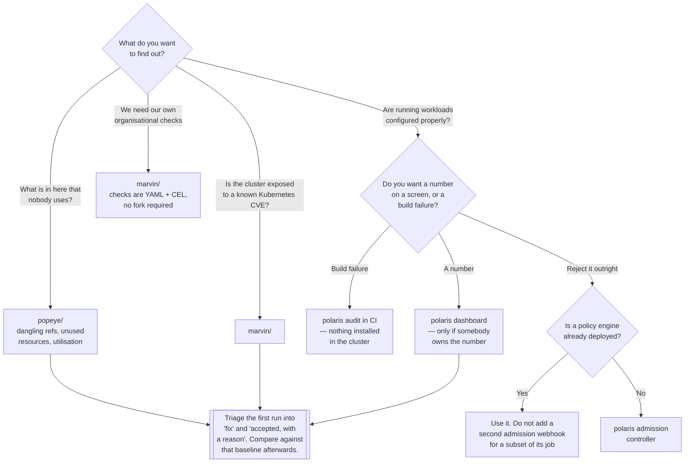

[← Scanners](../README.md)

# Cluster scanners

What is actually running in here, and how far has it drifted from what anyone intended?

Tools covered: [`polaris/`](polaris/README.md) · [`marvin/`](marvin/README.md) ·
[`popeye/`](popeye/README.md)

## Contents

1. [Why scan a cluster at all](#1-why-scan-a-cluster-at-all)
2. [The three tools have different biases](#2-the-three-tools-have-different-biases)
3. [Polaris has three modes, and the choice matters](#3-polaris-has-three-modes-and-the-choice-matters)
4. [The baseline problem](#4-the-baseline-problem)
5. [Decision tree](#5-decision-tree)
6. [Anti-patterns](#6-anti-patterns)
7. [How this applies to pikakube](#7-how-this-applies-to-pikakube)

---

## 1. Why scan a cluster at all

If every manifest is checked in CI — per [`../manifest/`](../manifest/README.md) — it is tempting to
conclude that the cluster must be fine. It is not, for four reasons that have nothing to do with the
quality of the pipeline:

| Why the cluster differs from the repository | Example |
|---|---|
| **Things get applied by hand** | a `kubectl apply` during an incident, never committed |
| **Operators create resources** | CNPG creates Services, Secrets and PVCs nobody wrote |
| **Helm charts install objects nobody reviewed** | a chart's default `ServiceAccount`, its RBAC, its sidecar |
| **Resources outlive what created them** | a Deployment is renamed; its Service, PVC and ConfigMap remain |

The last one is the reason cluster scanning finds things that manifest scanning structurally cannot.
There is no manifest for an orphan. It exists because something else stopped existing.

The second reason is drift over time. A workload that had correct resource requests when it was
written may have grown by a factor of ten since; a Service may point at a selector that stopped
matching after a label change. Both are invisible in the repository and obvious in the cluster.

## 2. The three tools have different biases

They overlap, and the overlap is not the interesting part. What each finds *first* is:

| Tool | Bias | Best at | Runs as |
|---|---|---|---|
| [Polaris](polaris/README.md) | **workload configuration quality** | missing probes, requests, limits, security settings, image tags | dashboard, CLI audit, or admission webhook |
| [Popeye](popeye/README.md) | **cruft and dangling references** | unused ConfigMaps and Secrets, Services with no endpoints, orphaned RBAC, unbound PVCs, over- and under-provisioned containers | CLI, read-only |
| [Marvin](marvin/README.md) | **extensibility and CVE exposure** | custom checks written as YAML with CEL expressions, plus checks derived from known Kubernetes CVEs | CLI |

**Popeye answers a question the other two do not:** *what is in here that shouldn't be?* That is the
direct link between this folder and [`cleanup/`](../../cleanup/README.md) — Popeye finds the
accumulation, and cleanup tooling prevents it. Running Popeye on a cluster nobody has audited is the
fastest way to understand how much has been left behind.

**Marvin's distinguishing feature is that checks are data.** Each check is a YAML document with
[CEL](https://github.com/google/cel-spec) expressions evaluated against selected resources, so a new
organisational check is a file rather than a fork. It is also the only one of the three that looks
at whether the cluster is exposed to a specific published Kubernetes vulnerability, rather than only
at whether your own configuration is sensible.

CEL is worth knowing beyond Marvin: it is the same language used by Kubernetes validating admission
policies and by Kyverno's newer CEL rules, so a check written for Marvin translates conceptually
into enforcement later — which is the progression described in
[`../README.md`](../README.md#4-scanning-is-not-enforcement).

**Polaris is the one with a dashboard**, and that is both why it is usually the one deployed and the
reason it most often ends up producing nothing.

## 3. Polaris has three modes, and the choice matters

This is the decision people skip, because the chart deploys the dashboard by default and that feels
like adopting the tool.

| Mode | What it produces | Does it change behaviour? |
|---|---|---|
| **Dashboard** | a running service scoring the live cluster | only if someone owns the number |
| **CLI audit** | `polaris audit` with an exit code, in CI | **yes** — this is the mode that works |
| **Admission controller** | a validating webhook that rejects non-conforming workloads | yes, and see the caveat |

The CLI audit is the highest-return mode and requires nothing to be installed in the cluster. It is
the same checks, run before merge, where a finding costs a review comment.

The admission mode carries a real caveat: **if a policy engine is already deployed** — Kyverno or
Gatekeeper, under `security/2-cluster/policies/` — do not enable it. It adds a second webhook in the
path of every workload creation to enforce a subset of what the policy engine already does, with a
separate place to record exceptions.

## 4. The baseline problem

Every tool here produces a long report on its first run against a real cluster. Long enough to be
dismissed, which is how this category acquires a reputation for noise.

The findings are not wrong. Some of them are deliberate: a single-replica internal tool genuinely
does not need a `PodDisruptionBudget`; a batch Job genuinely does not need a readiness probe; that
Secret with no consumer is genuinely used by a `CronJob` that runs monthly.

The only way to use these tools well:

```
1. Run once, and read all of it.
2. Triage into "fix" and "accepted, with a written reason".
3. Record the accepted set somewhere durable.
4. From then on, compare against the baseline — only new findings matter.
```

Step 3 is what makes step 4 possible, and step 4 is what makes the tool useful rather than
ceremonial. A report read cold every quarter tells you nothing you did not already ignore last
quarter.

**One place for accepted findings**, per [`../README.md`](../README.md#3-the-boundary-with-security).
If the security scanners have their own suppression list and these have another, the two will
disagree and nobody will know which represents the actual decision.

## 5. Decision tree



## 6. Anti-patterns

| Anti-pattern | Why it is bad | What to do instead |
|---|---|---|
| Deploying the Polaris dashboard and calling it adoption | a score nobody owns changes nothing | `polaris audit` in CI, failing on agreed checks |
| Popeye wired into CI as pass/fail | a healthy cluster still has deliberate findings | a periodic audit against a triaged baseline |
| Reading a first-run report cold and dismissing it | the volume is expected; the signal is in what is new | establish a baseline once, then diff |
| Polaris as a second admission webhook | another component in the creation path for a subset of the policy engine's job | enforce in one place |
| Cluster scanning instead of manifest scanning | a finding after deployment costs a change window | do both, and prioritise [`../manifest/`](../manifest/README.md) |
| Treating any of these as security tools | they ask whether it will operate well, not whether it is exploitable | `security/2-cluster/posture/` for CIS and hardening |
| Two suppression lists in two pipelines | the exceptions disagree and neither is authoritative | one record of accepted findings |
| Deleting what Popeye calls unused, without checking | a monthly `CronJob` also has no current consumer | confirm ownership before deleting |
| Running a scanner with nobody assigned to the output | it produces a document nobody opens | decide who reads it before running it |

## 7. How this applies to pikakube

**[Polaris](polaris/README.md) is deployed** via Flux — chart `5.17.1`, `dashboard.replicas: 1` —
and it is the only tool in the whole [`scanners/`](../README.md) folder that runs anywhere.
[Marvin](marvin/README.md) and [Popeye](popeye/README.md) are mapped as CLIs.

Per section 3, the deployed configuration is **dashboard only**. So what exists today is visibility
into how many running workloads are misconfigured, and no mechanism preventing the number from
growing. The CLI audit mode of the tool that is already installed is the cheapest next step and
requires nothing new.

**Two things would produce immediate value here**, in order:

**Run Popeye once.** This platform runs a lot of operators — CNPG, RabbitMQ, KEDA, Grafana, Argo,
KubeElasti — each of which creates resources nobody wrote and nobody removes when the parent is
reconfigured. Add the demonstration and test workloads mapped across this discipline
([reloader's `with/` and `without/` Deployments](../../config-reload/reloader/README.md),
[KubeElasti's `test/` namespace](../../event-driven/kubeelasti/README.md), the
[replicator example namespaces](../../replication/replicator/README.md)) and the conditions for
accumulation are exactly met. Popeye is a read-only CLI: running it costs one command and changes
nothing.

**Then wire `polaris audit` into CI.** Same checks, before merge, on the rendered manifests.

**The connection to [`cleanup/`](../../cleanup/README.md) is the one worth making explicit.** That
folder deploys controllers that delete finished Jobs, failed Pods and expired resources — the
accumulation it prevents is the accumulation Popeye would find. Scanning tells you the size of the
problem; cleanup tooling stops it recurring. Running the scanner first is the right order, because
it tells you whether the controllers are configured correctly.

**The boundary to respect**, per [`../README.md`](../README.md#3-the-boundary-with-security):
`security/2-cluster/posture/` holds kube-bench, kubeeye and kubescape, which scan the same cluster
against CIS benchmarks and hardening guidance. Those are not substitutes for these, and these are
not substitutes for those. This folder asks whether the platform will operate well; that one asks
whether it can be attacked.

---

[← Scanners](../README.md)
