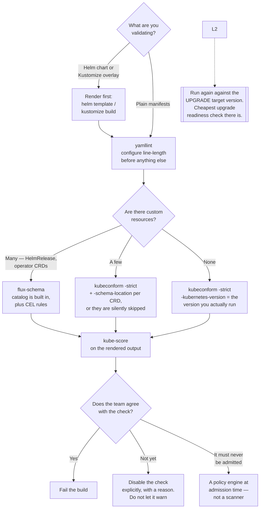

[← Scanners](../README.md)

# Manifest scanners

Checking manifests in the pull request, where a finding costs a comment instead of a change window.

Tools covered: [`yamllint/`](yamllint/README.md) · [`kubeconform/`](kubeconform/README.md) ·
[`flux-schema/`](flux-schema/README.md) · [`kubectl-validate/`](kubectl-validate/README.md) ·
[`kube-score/`](kube-score/README.md)

## Contents

1. [Three layers, in order](#1-three-layers-in-order)
2. [Layer 1: is it YAML?](#2-layer-1-is-it-yaml)
3. [Layer 2: is it Kubernetes?](#3-layer-2-is-it-kubernetes)
4. [Layer 3: is it good Kubernetes?](#4-layer-3-is-it-good-kubernetes)
5. [Render first](#5-render-first)
6. [Decision tree](#6-decision-tree)
7. [Anti-patterns](#7-anti-patterns)
8. [How this applies to pikakube](#8-how-this-applies-to-pikakube)

---

## 1. Three layers, in order

The five tools here are not alternatives. Three of them are **layers**, each catching a class of
problem the one before it cannot see, and two more are alternatives within layer 2:

| Layer | Question | Tool | Catches | Misses |
|---|---|---|---|---|
| **1** | Is it YAML? | [yamllint](yamllint/README.md) | duplicate keys, tabs, the Norway problem, indentation | `kind: Deploymnet` |
| **2** | Is it Kubernetes? | [kubeconform](kubeconform/README.md), [flux-schema](flux-schema/README.md), or [kubectl-validate](kubectl-validate/README.md) | misspelled fields, wrong types, removed API versions | a Deployment with no probes and no limits |
| **3** | Is it *good* Kubernetes? | [kube-score](kube-score/README.md) | missing probes, no requests or limits, `image: latest`, no PDB, `runAsRoot` | anything that is policy rather than practice |

Running them in this order is not stylistic. A file that will not parse makes layers 2 and 3 report
something misleading about the wrong part of the document, and the ten minutes lost to that is
exactly what running layer 1 first prevents.

Only layer 3 has opinions, which is why it is the only one that generates disagreement — and that
disagreement is useful, because it is a conversation about standards happening in a pull request
rather than during an incident.

## 2. Layer 1: is it YAML?

[yamllint](yamllint/README.md) knows nothing about Kubernetes and does not need to. YAML has more
ways to be quietly wrong than any other configuration format in common use:

| Trap | What happens |
|---|---|
| **Duplicate keys** | the last one silently wins; the first is discarded without a warning |
| **The Norway problem** | `no`, `on`, `off`, `yes` parse as booleans, not strings |
| **Version numbers** | `1.10` is a float and becomes `1.1` |
| **Tabs in indentation** | not permitted, with an unhelpful error |

Duplicate keys justify it on their own. A ConfigMap with the same key twice applies cleanly, runs
with the wrong value, and looks correct to anyone reading quickly.

One thing to do immediately: **change the default line-length rule.** The 80-character default fails
on almost every real manifest, and a tool that fails everything on the first run gets dismissed as
noisy rather than configured.

## 3. Layer 2: is it Kubernetes?

Three tools, and the choice turns on **how many custom resources the repository contains**.

| | [kubeconform](kubeconform/README.md) | [flux-schema](flux-schema/README.md) | [kubectl-validate](kubectl-validate/README.md) |
|---|---|---|---|
| Validation source | generated Kubernetes OpenAPI schemas | a **built-in catalog** plus a hosted one | **the API server's own validation code** |
| Speed | very fast, parallel | fast | slower |
| **CRD support** | via `-schema-location`, per CRD | **built in** — Flux ecosystem, Gateway API, OpenShift | native |
| Beyond schema shape | no | **CEL rules** | no |
| Maintained | **yes** | **yes**, by the fluxcd org | **no** — see below |
| Maturity | established | newer |  |

**kubeconform for a repository of core Kubernetes manifests. flux-schema when it is full of custom
resources** — which, for anything Flux-managed, it is. That is not a quality judgement between the
two; it is about which one can see the objects you actually wrote.

kubectl-validate is the better design on paper — it uses the same code paths as
the API server, so there is no drift between what it accepts and what the cluster accepts — and it
has had no release in roughly two years. The recorded evidence is an open issue titled *"State of
the Project"*, which is its own answer.

Two flags decide whether kubeconform is worth running at all:

**`-strict`.** Without it, an unknown field is ignored and the manifest passes — the same behaviour
the API server has, and the reason a misspelled field silently does nothing for months. `-strict`
rejects unknown fields, and that is where the typos are caught.

**`-kubernetes-version`.** Targeting the version actually running turns "this uses a deprecated API"
from a discovery made during a cluster upgrade into a build failure months earlier. Running it a
second time against the *upgrade target* version is the cheapest possible upgrade readiness check.

And one thing that is easy to get silently wrong: **CRD schemas must be configured**, or every
custom resource is skipped. On a platform built from operators that is most of the interesting
manifests, and the pipeline will report success while checking almost nothing.

That caveat is the entire reason [flux-schema](flux-schema/README.md) is worth considering here: it
ships the catalog instead of asking you to assemble one.

## 4. Layer 3: is it good Kubernetes?

[kube-score](kube-score/README.md) is static analysis with opinions. The schema accepts all of the
following, and each has a predictable consequence:

| Accepted by the schema | Consequence in production |
|---|---|
| No resource requests or limits | unschedulable, or a noisy neighbour taking down a node |
| No liveness or readiness probe | traffic to Pods that are not ready; hung Pods never restarted |
| `image: latest` | nobody can say what version is running |
| One replica, no `PodDisruptionBudget` | a routine node drain is an outage |
| No pod anti-affinity | every replica on one node, defeating the point of replicas |
| `runAsRoot`, writable root filesystem | a container escape becomes a node compromise |

Findings can be suppressed per object with annotations, and individual checks disabled globally, so
it can be adopted incrementally. **Do that.** Enabling every check on an existing repository
produces a wall of failures, and the reliable outcome is that the check gets disabled by whoever it
blocks first.

This is the same class of concern as [Polaris](../cluster/polaris/README.md), evaluated before merge
rather than after deployment. If only one is run, run this one.

## 5. Render first

The mistake that invalidates everything above: **Helm templates are Go templates, not YAML.**
Running any of these tools on `templates/deployment.yaml` produces either a parse error or a long
list of meaningless findings.

| Source | Render with |
|---|---|
| Helm chart | `helm template` |
| Kustomize overlay | `kustomize build` |
| Flux-managed repository | Flux's own tooling can produce the same output the controller applies |

What matters is that the thing being validated is **what will actually be applied**. Validating
sources that are transformed before reaching the cluster is a check that reports on something that
never exists.

## 6. Decision tree

## 7. Anti-patterns

| Anti-pattern | Why it is bad | What to do instead |
|---|---|---|
| Validating unrendered Helm templates | Go template syntax is not YAML | render first |
| `kubeconform` without `-strict` | unknown fields are ignored, so typos pass | always `-strict` |
| No CRD schemas on an operator-built platform | custom resources are skipped and the pipeline reports success | `-schema-location` for every CRD in use |
| Not targeting a Kubernetes version | deprecated APIs are found during the upgrade | `-kubernetes-version`, twice: current and target |
| Adopting kubectl-validate because it is under `kubernetes-sigs` | no release in about two years; "State of the Project" is an open issue | [kubeconform](kubeconform/README.md) |
| Copying kubeconform's GitHub workflow example | the recorded verdict on it is unprintable, and deserved | take the flags, write the workflow yourself |
| Skipping yamllint as trivial | a parse error makes every later tool report the wrong thing | run it first |
| yamllint with default rules | the 80-character limit fails everything, and the tool gets dismissed | configure `.yamllint` on day one |
| Every kube-score check on an existing repo | a wall of failures that gets switched off | enable the agreed checks, then add |
| A check that warns instead of failing | ignored within a fortnight | fail the build, or remove the check |
| Treating any of this as enforcement | they report on files; they prevent nothing | a policy engine at admission time |

## 8. How this applies to pikakube

**Nothing here is deployed, and nothing here needs to be** — all five are CLIs that belong in a
pipeline. But nothing here is *wired in* either, and that is the gap.

All five tools are documented. None runs against this repository. Given that this is a
manifest-heavy repository reconciled by
[Flux](../../../platform-engineering/gitops/flux/README.md), that is the highest-value unclaimed
improvement in the whole discipline: the tools are chosen, the flags are known, and the missing part
is a pipeline step.

The order to add them, cheapest first:

| Step | What | Why first |
|---|---|---|
| 1 | [yamllint](yamllint/README.md) as a pre-commit hook, with the line-length rule configured | costs nothing, catches duplicate keys, and gives feedback before the commit |
| 2 | [flux-schema](flux-schema/README.md) on rendered output | its catalog covers the `HelmRelease`, `OCIRepository` and operator CRDs this repository is mostly made of |
| 3 | [kubeconform](kubeconform/README.md) `-strict` against the **upgrade target** version | turns cluster upgrades from archaeology into a build result — version targeting is what it is best at |
| 4 | [kube-score](kube-score/README.md) with a small agreed check set, failing the build | the only one that changes how workloads are written |

**Two things specific to this repository would decide whether it works.**

Rendering, per section 5 — the manifests here are Helm releases and Kustomize overlays, so raw
sources are not what reaches the cluster.

**CRD schemas**, per section 3, and this is the one most likely to be skipped. This platform is
built from operators — CNPG, RabbitMQ, KEDA, Grafana, Argo, KubeElasti and more. Without
`-schema-location` configured for their CRDs, a kubeconform check would skip exactly the resources
most likely to be wrong and report success while doing it.

[flux-schema](flux-schema/README.md) is the direct answer to that, and it is why it now sits at
step 2 rather than kubeconform: its built-in catalog covers the Flux ecosystem, which is what almost
every manifest in this repository is. The two are complementary — flux-schema for coverage of what
is actually here, kubeconform for version-targeted upgrade checks.

**The two recorded opinions** in this folder are both about documentation, and both are worth
keeping:

- [kubeconform](kubeconform/README.md)'s own GitHub workflow example is *"fezes puríssima"* — pure
  garbage. It matters because it is the first thing anyone lands on when wiring this into CI, and
  following it produces a worse pipeline than four lines written from scratch
- [kubectl-validate](kubectl-validate/README.md) *"looks nice and 'official' but is completely
  abandoned"*. The transferable lesson is about `kubernetes-sigs` in general: the organisation name
  is not a maintenance guarantee, and release cadence is the thing to check

---

[← Scanners](../README.md)
