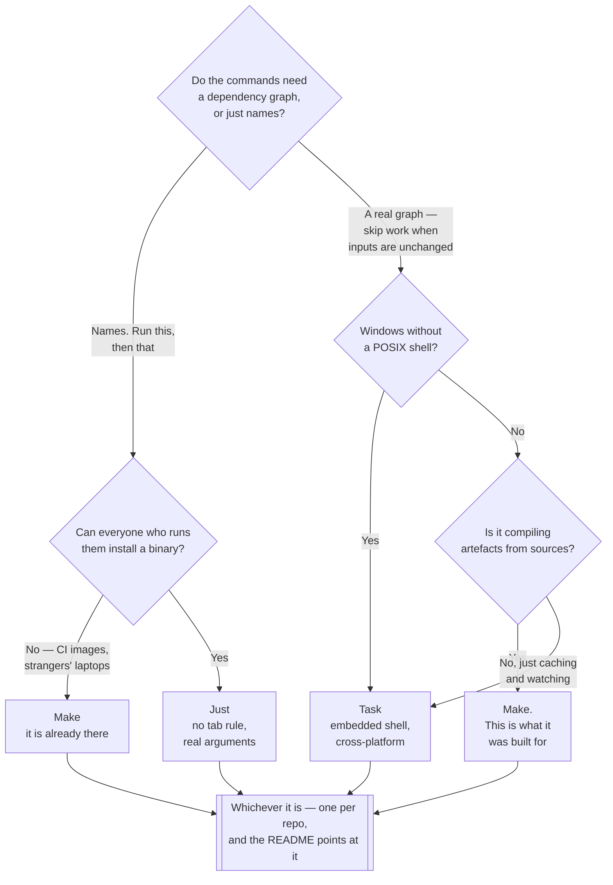

[← DevOps](../README.md)

# Task runners

Every repository accumulates commands. A task runner is where they live so that they are
discoverable, runnable and actually correct.

Tools covered: [`makefile`](makefile/README.md) · [`justfile`](justfile/README.md) ·
[`taskfile`](taskfile/README.md)

## Contents

1. [The problem](#1-the-problem)
2. [The tools](#2-the-tools)
   1. [Make](#21-make)
   2. [Just](#22-just)
   3. [Task](#23-task)
3. [Decision tree](#3-decision-tree)
4. [What a good task file looks like](#4-what-a-good-task-file-looks-like)
5. [The connection to executable documentation](#5-the-connection-to-executable-documentation)
6. [Anti-patterns](#6-anti-patterns)
7. [How this applies to pikakube](#7-how-this-applies-to-pikakube)

---

## 1. The problem

Every project ends up with commands nobody remembers. The port-forward with the right namespace
and the right label selector. The four flags that make the test suite run against a local
database. The rebuild that has to happen before the other rebuild.

They live in three places, and all three fail:

| Where they live | How it fails |
|---|---|
| **README code blocks** | not executed by anything, so they go stale silently and nobody notices until a new joiner follows them |
| **Shell history** | on one machine, belonging to one person |
| **Nowhere** | reconstructed from memory each time, differently each time |

A task runner fixes this by making the command a **named, runnable thing in the repository**. It
is in the diff, so it gets reviewed. It is executed, so if it breaks somebody finds out. And
`just --list` or `task --list` answers "what can I do here?" without reading anything.

That last property is underrated. The value is less about saving keystrokes and more about
**discovery** — a repository whose operations are enumerable is a repository a new person can
work in on day one.

## 2. The tools

| Tool | Defined in | Where it shines | Detail |
|---|---|---|---|
| **Make** | `Makefile` | **already installed everywhere** — zero adoption cost, universally understood | [→](makefile/README.md) |
| **Just** | `justfile` | **built to run commands**, not to build software — no tab rule, real arguments | [→](justfile/README.md) |
| **Task** | `Taskfile.yml` | **YAML and cross-platform**, with dependencies and file watching | [→](taskfile/README.md) |

### 2.1 Make

Make is on every machine, every CI image and every container. Nothing else here can say that, and
for a tool whose entire job is being available when someone types a command, that counts for a
lot.

But Make is a **build system**, and its semantics are build-system semantics:

| Make behaviour | Why it fits badly |
|---|---|
| A target is a **file** | Make skips the target if a file of that name exists and is newer than its prerequisites. `make test` silently does nothing if a file called `test` is lying around |
| `.PHONY` | the fix for the above, needed on every single target that is not a file. Its presence on every line is the symptom that the tool is being used against its design |
| **Tabs, not spaces** | recipe lines must begin with a literal tab. A space produces `missing separator`, and an editor that helpfully converts tabs breaks the file |
| **One shell per line** | `cd foo` on one line and `make` on the next runs in the original directory. Continuations need `\` and `&&` |
| Variable syntax | `$` means Make; passing `$HOME` to the shell needs `$$HOME` |
| Arguments | there are none. `make deploy ENV=prod` is a variable assignment, and positional arguments require the `%` pattern-rule trick |

None of these are bugs. They are correct behaviour for computing a dependency graph over files,
which is what Make is for. They are simply the wrong defaults for "run this command".

### 2.2 Just

Just is Make's syntax with the build system removed. Recipes are commands, always run when
invoked, and the file-target semantics do not exist — so neither does `.PHONY`.

What it fixes, point by point:

- **No tab rule.** Any consistent indentation works.
- **Real arguments.** `recipe target="dev":` with defaults, called as `just recipe prod`.
- **`set shell`**, and per-recipe shebangs, so a recipe can be a whole Python or Bash script
  rather than a sequence of independent lines.
- **Runs from the justfile's directory** by default, so a recipe works no matter where in the
  tree it is invoked.
- **`just --list`** is built in, and doc comments above a recipe become its description.
- **`.env` loading**, and clear error messages naming the recipe and the line.

The cost is one binary that has to be installed. That is the entire downside, and whether it
matters depends on whether the people running the commands are on machines you control.

### 2.3 Task

Task is defined in YAML rather than a bespoke syntax, and it is written in Go with genuine
cross-platform support — including Windows, without a POSIX shell, because it embeds its own
shell interpreter.

What it adds beyond running commands:

| Feature | What it does |
|---|---|
| `deps:` | tasks that must run first, **in parallel** where possible |
| `sources:` / `generates:` | skip a task when its inputs have not changed — Make's actual value, as an opt-in |
| `task --watch` | rerun on file change |
| `includes:` | compose Taskfiles across a monorepo |
| `vars:`, `env:`, `dotenv:` | typed variables, including values computed by a command |

The trade is verbosity. A one-line command becomes several lines of YAML, and the templating uses
Go template syntax inside strings — which is the same fragility that
[Helm](../templating/helm/README.md) is criticised for, in a smaller dose.

## 3. Decision tree



## 4. What a good task file looks like

The tool matters less than these:

| Rule | Why |
|---|---|
| **A default target that lists the others** | `make` or `just` with no arguments should tell you what exists, not do something |
| **Every recipe documented in one line** | `just --list` is the interface; an undocumented recipe is not discoverable |
| **Names that read as verbs** | `test`, `deploy`, `port-forward` — not `t`, `d`, `pf` |
| **No logic beyond a few lines** | past that, call a script that is lintable and testable on its own |
| **Recipes that CI also runs** | if CI reimplements the command, the two drift and the local one is the one that rots |
| **Nothing that needs credentials the reader lacks** | a recipe that only works for its author is a recipe nobody else will trust |

The fifth row is the important one. A task runner earns its place when it is the **single
definition** of how something is done, and CI running the same recipe is what keeps it honest.

## 5. The connection to executable documentation

A task runner and executable documentation are the same idea approached from opposite ends.

A README code block is a command that is documented but not executed, so it rots. A task recipe
is a command that is executed but barely documented, so it works and nobody knows why. Both are
attempts to answer "how is this done here" and each is missing what the other has.

Executable documentation closes that from the documentation side: the commands in the prose are
run, so the prose cannot be wrong. See
[`docs/executable/`](../../docs/executable/README.md).

The pragmatic combination is to pick one home for each command and have the other point at it —
prose that explains *why*, invoking a recipe that defines *what*. What fails is a README that
restates the recipe, because there are now two copies and one of them is already wrong.

## 6. Anti-patterns

| Anti-pattern | Why it is bad | What to do instead |
|---|---|---|
| Commands only in README code blocks | never executed, so they go stale invisibly | a recipe, and let the README point at it |
| A Makefile target without `.PHONY` | a file of the same name makes it silently do nothing | `.PHONY`, or a tool without file-target semantics |
| Two hundred lines of shell inside one recipe | unlintable, untestable, undebuggable | call a script from the recipe |
| CI reimplementing what the recipe does | the two drift, and the local one is the one that rots | CI calls the same recipe |
| Undocumented recipes | `--list` shows names that explain nothing | a doc comment per recipe |
| Several task runners in one repository | now there are two places to look | one, at the root |
| A recipe that only works on the author's machine | hardcoded paths, personal contexts, credentials nobody else has | parameterise, or delete it |
| A recipe that deploys to production | a typo becomes an incident, with no review and no audit trail | the pipeline deploys; the recipe does not |
| Wrapping every command, however trivial | `just ls` is indirection with no payoff | wrap what is hard to remember |
| Recipes that hide what they ran | a failure nobody can reproduce by hand | print the command, or keep it thin |

## 7. How this applies to pikakube

This repository is documentation and manifests, so there is no build to orchestrate — the
dependency-graph half of these tools is irrelevant here. What is relevant is **discovery**.

There are commands worth capturing. Rendering Kustomize examples is one of them, and it is already
recorded as a comment in each overlay in
[`templating/kustomize/examples/`](../templating/kustomize/examples/README.md):

```bash
kustomize build overlays/dev -o output.yaml
```

That is exactly the shape of thing that belongs in a recipe rather than a comment — regenerating
every example's `output.yaml` in one command means the committed output cannot drift from the
overlay that produced it.

The honest position on which tool:

- **Make is already there and works.** For a handful of recipes it needs no decision, no
  installation and no explanation, and `.PHONY` on every line is ugly rather than harmful.
- **Just** is the answer if the tab rule and the `.PHONY` noise are actually bothering you. It is
  the best fit for what this repository would use a runner for — named commands with arguments,
  and a `--list` that documents itself.
- **Task** if YAML is preferred, or if anyone runs these on Windows. Neither applies here.

The one piece of CI this repository would benefit from is **link checking**, and a task recipe
that runs it locally with the same command CI uses is the pattern from
[section 4](#4-what-a-good-task-file-looks-like) doing what it is for.

---

[← DevOps](../README.md)
