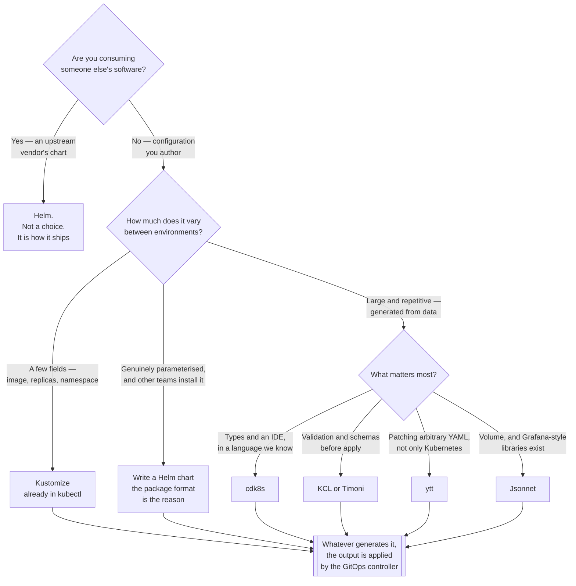

[← DevOps](../README.md)

# Manifest templating

Kubernetes YAML is not written by hand at scale — something generates it, and the choice of
*what* decides how much of the configuration a tool can actually understand.

Tools covered: [`helm`](helm/README.md) · [`kustomize`](kustomize/README.md) ·
[`helmfile`](helmfile/README.md) · [`cdk8s`](cdk8s/README.md) ·
[`jsonnet`](jsonnet/README.md) · [`kcl`](kcl/README.md) ·
[`timoni`](timoni/README.md) · [`ytt`](ytt/README.md) ·
[`kpt`](kpt/README.md)

## Contents

1. [The problem](#1-the-problem)
2. [The fundamental split](#2-the-fundamental-split)
   1. [String templating](#21-string-templating)
   2. [Structured overlays](#22-structured-overlays)
   3. [Real programming languages](#23-real-programming-languages)
3. [Why Helm's string templating hurts](#3-why-helms-string-templating-hurts)
4. [What Helm actually provides beyond templating](#4-what-helm-actually-provides-beyond-templating)
5. [Kustomize's position, and its ceiling](#5-kustomizes-position-and-its-ceiling)
6. [The tools](#6-the-tools)
7. [Decision tree](#7-decision-tree)
8. [Anti-patterns](#8-anti-patterns)
9. [How this applies to pikakube](#9-how-this-applies-to-pikakube)

---

## 1. The problem

One `Deployment` is fine as literal YAML. Ten services across three environments is not: the
manifests are 90% identical, the 10% that differs is scattered across dozens of files, and every
change means the same edit repeated by hand until one copy is missed.

Every tool here solves the same thing — **one definition, many outputs** — and they differ almost
entirely in *how much structure the tool understands* while it does that.

That is not an aesthetic question. It determines when an error surfaces: while you are writing,
at build time, or at `kubectl apply` when the API server rejects something.

## 2. The fundamental split

Three families, and they are genuinely different categories rather than three flavours of the
same idea.

| Family | The tool sees | Errors surface | Tools |
|---|---|---|---|
| **String templating** | text, until the output is parsed | after rendering | Helm |
| **Structured overlays** | real YAML documents | while merging | Kustomize |
| **Real languages** | typed objects and functions | while compiling | cdk8s, Jsonnet, KCL, Timoni, ytt |

### 2.1 String templating

Helm renders **Go templates that produce text**. The engine has no idea it is generating YAML —
it concatenates strings, and only afterwards is the result parsed as a Kubernetes manifest.

Everything that is annoying about Helm follows from that single fact, and everything that makes
it universal is unrelated to it (see [section 4](#4-what-helm-actually-provides-beyond-templating)).

### 2.2 Structured overlays

Kustomize takes **real YAML and patches it**. There is no template language at all: you have a
base of valid manifests and overlays that merge on top of them. Every intermediate state is a
parseable document, so the tool can reason about kinds, names and fields.

### 2.3 Real programming languages

The rest generate manifests from code — TypeScript or Python (cdk8s), Jsonnet, KCL, CUE
(Timoni), or Starlark (ytt). You get functions, types, imports and an editor that autocompletes,
because the configuration is a program rather than a document with holes in it.

The cost is that reading the configuration now requires knowing the language, and `git diff` on
the source no longer tells you what changed in the cluster.

## 3. Why Helm's string templating hurts

The pain is specific and always the same three things:

| Symptom | Cause |
|---|---|
| **Indentation bugs** | the template emits text at whatever column the author typed; `nindent` and `indent` exist because YAML meaning is column-dependent and the engine does not know the column |
| **Whitespace control** | `{{- if }}` versus `{{ if }}` changes whether a newline survives — a chomp marker in the wrong place silently produces a different document |
| **Late errors** | a broken template is not a broken *chart* until it renders; a value combination nobody tested produces invalid YAML at deploy time, not at review time |

The third one is the expensive one. The template is valid Go, the chart installs for everyone
else, and the failure only appears for the one `values.yaml` that takes an untested branch.

Mitigations that actually help: `helm template` in CI over every values file that exists,
`helm lint`, and JSON Schema in `values.schema.json` so bad input is rejected before rendering.
None of them change the underlying model — they just move the discovery earlier.

## 4. What Helm actually provides beyond templating

This is the part that gets lost in every "Helm is bad" argument, and it is why Helm wins anyway.

| Capability | What it means | Do the others have it? |
|---|---|---|
| **Package format** | a chart is a versioned, self-describing unit with dependencies | mostly no |
| **Registry** | charts are published, discovered and pulled — including from OCI registries | no |
| **Release state** | the cluster records what was installed, with what values, at which revision | no |
| **Lifecycle hooks** | pre-install, post-upgrade, test — ordered work around the apply | no |

**Helm the templating engine and Helm the package manager are two different products wearing the
same name.** The templating is the weakest thing in this document. The package manager is close
to irreplaceable — it is how every vendor on earth ships their software for Kubernetes.

Replacing Helm's templating in your own charts is easy. Replacing the ability to type
`helm install prometheus prometheus-community/kube-prometheus-stack` is not, because the
alternative is vendoring and maintaining the manifests yourself.

The practical consequence: you consume upstream charts with Helm regardless of what you think of
Go templates, and the real decision is only about what you write yourself.

Helm also keeps its release state in the cluster, as a `Secret` per revision — which is
recoverable, and occasionally has to be (see [`helm/`](helm/README.md) for the command).

## 5. Kustomize's position, and its ceiling

Kustomize is **built into `kubectl`** (`kubectl apply -k`), which makes it the only option here
with no installation step. It has no template language, no functions and no conditionals — just
bases, overlays, patches and a handful of built-in transformers for the fields people always
change: namespace, name prefix and suffix, labels, annotations, images, replicas.

Its weakness is the direct consequence of having no template language: **there are no
parameters**. Anything that varies needs its own overlay, so as environments and variants
multiply the overlay tree multiplies with them, and shared behaviour ends up copy-pasted across
overlays that were supposed to eliminate copy-paste.

The rule of thumb: Kustomize is excellent for *a small number of environment deltas over one
base*, and poor for *a family of similar-but-parameterised applications*. The second is what
charts are for.

Worked examples of each transformer are in [`kustomize/`](kustomize/README.md).

## 6. The tools

| Tool | Family | Where it shines | Detail |
|---|---|---|---|
| **Helm** | string templating | **the package manager for Kubernetes** — charts, a registry, release state, hooks. Templating is the price of admission | [→](helm/README.md) |
| **Kustomize** | structured overlay | **in `kubectl` already** — patch a base per environment with no new tooling | [→](kustomize/README.md) |
| **Helmfile** | orchestration | declarative management of **many** Helm releases from one file | [→](helmfile/README.md) |
| **cdk8s** | real language | teams who already write **TypeScript or Python** and want types and an IDE | [→](cdk8s/README.md) |
| **Jsonnet** | real language | **large, highly repetitive** configuration — the Grafana ecosystem's tool | [→](jsonnet/README.md) |
| **KCL** | real language | **schemas and validation** as first-class configuration constructs | [→](kcl/README.md) |
| **Timoni** | real language (CUE) | typed, **validated-before-apply** module distribution over OCI | [→](timoni/README.md) |
| **ytt** | real language (Starlark) | **patching and templating arbitrary YAML**, not just Kubernetes | [→](ytt/README.md) |
| **kpt** | package transformation | packages of **plain manifests** mutated in place by functions | [→](kpt/README.md) |

Two of these are commentary rather than candidates:

**Helmfile** solved a problem that has largely moved. It manages a set of Helm releases
declaratively — repositories, values, ordering, environments — which was the missing piece when
the alternative was a shell script full of `helm upgrade --install`. With a GitOps controller in
the cluster that job is already done: Flux and Argo CD both reconcile Helm releases from Git
continuously, which is strictly more than Helmfile does from a laptop or a CI job. It is still
useful where there is no controller; where there is one, it is a second source of truth.

**kpt** is Google's take: a package is a directory of **ordinary, valid manifests** — no template
markers — and customisation happens by running functions that mutate the files in place. It is
an interesting model, because the package you read is the package that applies. It has struggled
to find adoption, which matters more than the merits: a configuration tool with a small community
means few packages, few examples and few people who can review your work.

## 7. Decision tree

## 8. Anti-patterns

| Anti-pattern | Why it is bad | What to do instead |
|---|---|---|
| A chart with a `values.yaml` field for every property | it becomes a worse API for the Kubernetes API | expose what varies; patch the rest |
| Templating whole manifests as strings | indentation and quoting bugs the engine cannot see | template values, not documents |
| No `values.schema.json` | bad input renders invalid YAML instead of being rejected | schema-validate values |
| `helm template` never run in CI | the broken branch is discovered at deploy | render every values file on every pull request |
| An overlay per environment per service | Kustomize has no parameters, so the tree explodes | a chart, or generate the overlays |
| Kustomize patches by line position | JSON Patch by index breaks the moment the base is reordered | strategic merge patches on named fields |
| Both a chart *and* a Kustomize overlay over its output | two layers of indirection to find where a field came from | pick one boundary and hold it |
| A programming language for configuration nobody else knows | the person who wrote it becomes the only person who can change it | count the readers before choosing |
| Rendered output committed to Git | it drifts from the source that generated it | commit the source; render in CI |
| Helm and a GitOps controller both installing the same release | two owners fighting over the same resources | one applier — the controller |
| `--set` in scripts as the real configuration | the actual deployed values live in shell history | values files in Git |
| Editing live resources that a chart owns | the next upgrade reverts it, silently | change the source |

## 9. How this applies to pikakube

**This is not an open choice here.** Everything in this repository is deployed as a Flux
`HelmRelease` or a Flux `Kustomization` — see
[`platform-engineering/gitops/`](../../platform-engineering/gitops/README.md). Helm and Kustomize
are not two options among nine; they are **the substrate**, and the controller expects them.

That splits the nine tools into two groups:

| | Tools | Status |
|---|---|---|
| **Substrate** | Helm, Kustomize | what the cluster actually reconciles — learn them properly |
| **Alternatives** | cdk8s, Jsonnet, KCL, Timoni, ytt, kpt, Helmfile | documented to be evaluated, not to be swapped in |

The working split in practice:

- **Third-party software** — a `HelmRelease` pointing at the vendor's chart, with a values file
  in Git. Nothing else is worth the maintenance.
- **Our own manifests** — plain YAML with a `kustomization.yaml`, reconciled by a Flux
  `Kustomization`. No templating, no chart to version, and `kubectl apply -k` reproduces locally
  exactly what the controller does.

The one entry that has a live hook into this stack is [KCL](kcl/README.md), which ships a Flux
controller of its own — so it is the only alternative here that could be added without displacing
anything. That is a note about feasibility, not a recommendation.

The rest is worth knowing so the trade-off is understood rather than inherited: Helm's templating
is the weakest part of the stack, it is used anyway because the *package manager* around it is
the ecosystem, and Kustomize covers the gap for anything we write ourselves.

---

[← DevOps](../README.md)
