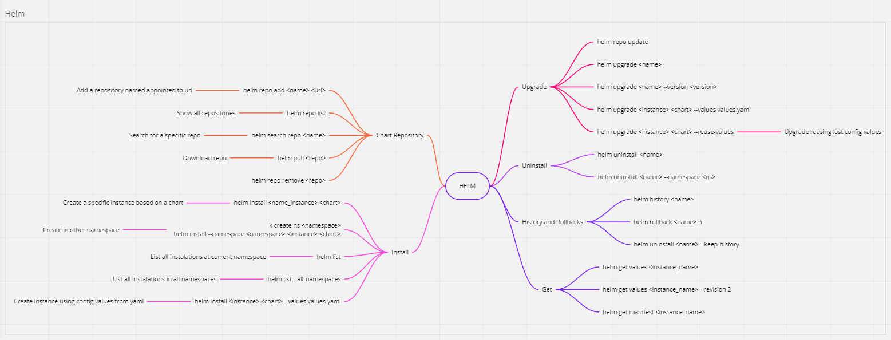

[← Manifest templating](../README.md)

# Helm

<https://github.com/helm/helm>

<https://github.com/helm/chart-releaser>

<https://github.com/Masterminds/sprig>

<https://github.com/helm/helm-mapkubeapis>

---

## The problem it solves

Helm is two products under one name, and only one of them is hard to replace.

**The templating engine** renders Go templates into text, which is then parsed as YAML. It is the
weakest part of Helm and the part everyone complains about.

**The package manager** is the reason Helm is everywhere:

| Piece | What it gives you |
|---|---|
| **Chart** | a versioned, self-describing package with its own dependencies |
| **Repository / OCI registry** | somewhere to publish and pull it from |
| **Release** | the cluster remembers what was installed, with which values, at which revision |
| **Hooks** | `pre-install`, `post-upgrade`, `test` — ordered work around the apply |
| **Rollback** | because the previous revision's manifest is stored |

Every vendor ships their Kubernetes software as a chart. That, not the template syntax, is what
makes Helm non-optional.

## When to use it

- **Installing third-party software.** This is the dominant case and there is nothing to decide:
  the chart is what upstream publishes and maintains.
- **Distributing something to other teams or externally.** The versioning, dependencies and
  registry story has no real competitor.
- **Configuration that is genuinely parameterised** — the same application installed many times
  with different inputs, where the differences are values rather than structural edits.

## When not to use it

- **Manifests only you deploy, in one or two variants.** A chart adds a template language, a
  version number and a values API to solve a problem that
  [Kustomize](../kustomize/README.md) solves with a patch.
- **When a GitOps controller already owns the release.** Running `helm upgrade` by hand against
  something Flux reconciles produces two owners and a fight. Change the `HelmRelease`.
- **As a general YAML generator.** Go templates do not understand YAML, so indentation and
  quoting bugs are yours to find. Something in the
  [structured or programmatic families](../README.md#2-the-fundamental-split) is better at it.

## Notes

The recorded links, and what each is for:

| Link | What it is |
|---|---|
| [helm/helm](https://github.com/helm/helm) | Helm itself |
| [helm/chart-releaser](https://github.com/helm/chart-releaser) | turns a GitHub repository into a chart repository — packages charts and publishes them as GitHub releases with an `index.yaml`. This is how you host your own charts without running a registry |
| [Masterminds/sprig](https://github.com/Masterminds/sprig) | the template function library Helm embeds. Every `default`, `quote`, `b64enc`, `toYaml` in a chart comes from here — when the Helm docs do not explain a function, this is where it is documented |
| [helm/helm-mapkubeapis](https://github.com/helm/helm-mapkubeapis) | rewrites deprecated API versions inside a stored release. Needed when a cluster upgrade removes an API group that an old release's manifest still references, and `helm upgrade` fails because it cannot read its own history |

A command map of the day-to-day Helm surface, recorded with these notes:



### Reading the stored release

```bash
kubectl get secrets sh.helm.release.v1.airflow.v1 -o jsonpath='{.data.release}' | base64 -d | base64 -d | gzip -d
```

Helm stores each revision as a `Secret` named `sh.helm.release.v1.<release>.v<revision>` in the
release's namespace. The payload is **base64-encoded twice and then gzipped** — hence the two
`base64 -d` and the `gzip -d`. The result is the full JSON record: chart, values and rendered
manifest.

Worth knowing for two reasons. It is the ground truth when the cluster and the repository
disagree about what is deployed, and those Secrets are the release history — deleting them makes
Helm forget the release exists.

### Finding what a repository contains

```bash
helm repo add strimzi https://strimzi.io/charts/
helm search repo strimzi
helm search repo strimzi/strimzi-drain-cleaner --versions
```

Adding a repository only fetches its index. `helm search repo` then lists the charts in it, and
`--versions` lists **every published version of one chart** instead of just the latest — which is
what you need when pinning a version, or checking whether an upgrade path exists.

### Finding releases that were installed by hand

```bash
helm list -A
```

`-A` is all namespaces. In a GitOps cluster this is a drift check: anything listed here that does
not correspond to a `HelmRelease` in Git was installed manually and is not reconciled by anything.

### Recovering the values of a manual release

```bash
helm get values retina -n kube-system
```

Prints the user-supplied values of an installed release. This is the first step in adopting a
hand-installed release into Git — read what it was actually installed with, put that in a values
file, then let the controller take it over.

### Manual upgrade

```bash
helm upgrade --install airbyte airbyte/airbyte --version 1.8.1 -n airbyte -f values-new.yaml --debug
```

`--install` makes it create the release if it does not exist, so the same command works for the
first install and every upgrade — which is why it is the idiomatic form. `--version` pins the
chart version explicitly; without it you silently get whatever is latest. `--debug` prints the
rendered manifest and the full error, which is the difference between a usable failure and
"template: error at line 42".

Use this for debugging and for one-off clusters. In this repository the same operation is a
change to a `HelmRelease`.

---

[← Manifest templating](../README.md)
