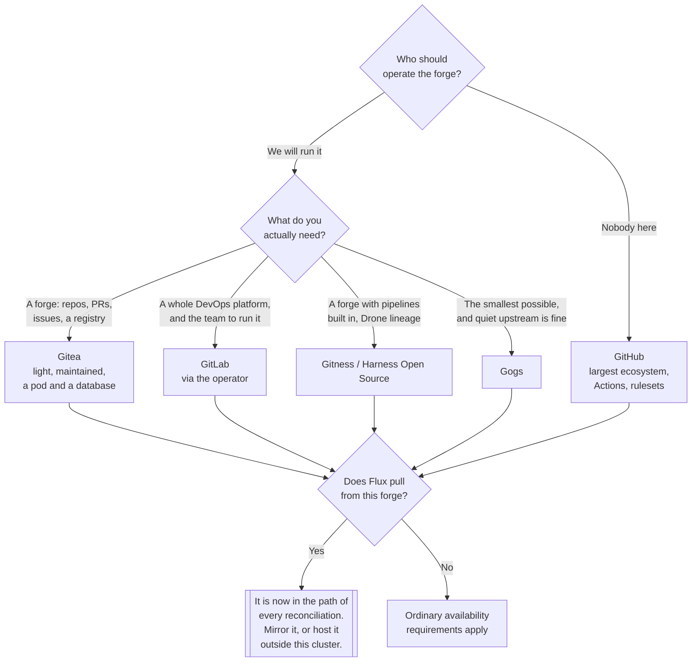

[← DevOps](../README.md)

# Version control

Git is not the choice. The forge is — and in a GitOps cluster the forge is a production
dependency.

Tools covered: [`git`](git/README.md) · [`github`](github/README.md) ·
[`gitlab`](gitlab/README.md) · [`gitea`](gitea/README.md) ·
[`gitness`](gitness/README.md) · [`gogs`](gogs/README.md)

## Contents

1. [The protocol and the forge](#1-the-protocol-and-the-forge)
2. [The forges](#2-the-forges)
3. [Self-hosted or SaaS](#3-self-hosted-or-saas)
4. [The GitOps consequence](#4-the-gitops-consequence)
5. [Branching strategies](#5-branching-strategies)
6. [Monorepo or polyrepo](#6-monorepo-or-polyrepo)
7. [Conventions that are worth enforcing](#7-conventions-that-are-worth-enforcing)
8. [Decision tree](#8-decision-tree)
9. [Anti-patterns](#9-anti-patterns)
10. [How this applies to pikakube](#10-how-this-applies-to-pikakube)

---

## 1. The protocol and the forge

Two different things share one word, and conflating them is what makes migrations sound harder
than they are.

| | **Git** | **The forge** |
|---|---|---|
| What it is | a distributed version control system and its wire protocol | a server with a web interface built around it |
| Who wrote it | one project, one implementation everybody uses | six or more competing products |
| What it gives you | commits, branches, merges, history | pull requests, issues, permissions, CI, a registry, an API |
| Is it a choice | not really | **yes, and it is the one that matters** |
| Here | [`git/`](git/README.md) | the rest of this folder |

Nobody evaluates Git. Every repository is a Git repository, every clone is a full copy of the
history, and the protocol is the same whether the other end is GitHub or a Gitea pod. **The
decision is which forge**, and that decision buys — or costs — code review, access control,
CI/CD, a container registry, an artefact store, an API to automate against, and a webhook
mechanism the rest of the platform reacts to.

The good news that falls out of Git being distributed: the *history* is never trapped in a forge.
Every developer machine and every CI runner holds a complete copy. What is trapped is everything
the forge added — pull requests, review comments, issues, CI configuration, permissions and
webhooks. When people say "migrating forges is painful", that is the part they mean.

## 2. The forges

| Forge | What it actually is | Weight | Detail |
|---|---|---|---|
| **GitHub** | the default SaaS forge; the largest ecosystem, Actions, Copilot, Advanced Security | none to run | [→](github/README.md) |
| **GitLab** | a **whole DevOps platform** that contains a forge | very heavy self-hosted | [→](gitlab/README.md) |
| **Gitea** | a light, fast, self-hosted forge; the maintained fork of Gogs | one pod plus a database | [→](gitea/README.md) |
| **Gitness** | Harness's open-source forge with built-in pipelines, from Drone | moderate | [→](gitness/README.md) |
| **Gogs** | the original light forge; still alive but far quieter than Gitea | one pod | [→](gogs/README.md) |

Three things are worth stating plainly, because they decide most evaluations.

**Gitea is the maintained fork of Gogs.** Gitea was forked from Gogs in late 2016 by contributors
who wanted a faster, community-governed development pace rather than a single-maintainer
bottleneck. Since then Gitea has accumulated the great majority of the activity, the releases and
the features — Actions-compatible CI, a package registry, a Helm chart maintained by the project.
Gogs still receives commits and is not abandoned, but it is markedly quieter and has far less
around it. Choosing Gogs today needs a specific reason; **Gitea is the default of the two**. (For
completeness: Gitea was itself forked into Forgejo in 2022, after Gitea's governance moved to a
company. That is a live project too, and not mapped in this repository.)

**GitLab is not a git forge.** It is a DevOps platform — forge, CI, container registry, package
registry, security scanning, Kubernetes integration, issue tracking and portfolio management, in
one product. Self-hosting it means running Rails application servers, Sidekiq workers, Gitaly,
PostgreSQL, Redis, an object store and, if CI is used, a fleet of runners. The
[GitLab Operator](gitlab/README.md) makes that tractable on Kubernetes; it does not make it small.
This is a serious operational commitment, and it only makes sense when the platform features are
actually wanted. Using self-hosted GitLab purely as a place to keep repositories is a large amount
of machinery for a job Gitea does with a pod and a database.

**Gitness is Harness's, and its history matters.** Harness acquired Drone — the CI engine — in
2020, and Gitness was built as the successor: a source-code forge with Drone's pipeline engine
built into it, rather than bolted alongside. The project has since been renamed **Harness Open
Source**, and the repository moved from `harness/gitness` to
[`harness/harness`](https://github.com/harness/harness). Two consequences for anyone evaluating
it: existing Drone knowledge transfers directly, and the project is a single vendor's open-source
edition, so its direction follows that vendor's commercial product.

## 3. Self-hosted or SaaS

The interesting question is not features. It is **who operates it, and what happens when it is
down**.

| | **SaaS** — GitHub, GitLab.com | **Self-hosted** — Gitea, GitLab, Gitness |
|---|---|---|
| Availability | someone else's problem, and someone else's status page | yours |
| Backups | mostly theirs; your metadata export is your responsibility | **entirely yours, and easy to get wrong** |
| Upgrades | happen to you | you schedule them and you own the breakage |
| Data residency | wherever they are | wherever you put it |
| Code leaves the network | yes | no |
| Ecosystem | enormous — Actions, apps, integrations | smaller, and some things simply do not exist |
| Cost | per seat, predictable | infrastructure plus the engineer time nobody counts |

The self-hosting argument is usually made on cost and lost on **recovery**. A forge holds three
things, and they are not equally easy to restore:

| What | Where it lives | Restorable from |
|---|---|---|
| Git history | bare repositories on disk | any clone, in principle; a volume backup, in practice |
| **Metadata** | the database — PRs, issues, reviews, permissions, tokens | **only a database backup** |
| Configuration | the chart values and the secrets | the Git repository, if it is stored there |

Backing up the volumes and forgetting the database is the classic failure: the code comes back,
and every review, every issue and every access grant does not. The self-hosted question therefore
reduces to a very concrete one — **is there a tested restore?** Not a backup job; a restore that
has been performed.

## 4. The GitOps consequence

This is the part specific to a Kubernetes platform, and it is easy to walk into by accident.

Under GitOps, the cluster's desired state is a Git repository, and a controller reconciles against
it continuously. Flux clones the repository on an interval — typically every minute — and applies
what it finds. That makes the forge **an in-path dependency of the control loop**, not a
development convenience.

**If Flux pulls from a self-hosted forge, that forge is in the critical path of every
reconciliation.** Say it plainly, because the failure modes follow from it:

| If the forge is down | What happens |
|---|---|
| Reconciliation | stops; `GitRepository` sources go `Fetch failed` |
| Already-running workloads | keep running — the cluster does not roll back |
| New deployments | impossible, including the fix for whatever is broken |
| Drift correction | stops; manual changes are no longer reverted |
| Recovery of the cluster from scratch | blocked entirely — there is no state to reconcile from |

The last row is the one that turns an inconvenience into an outage. And the circular version of it
is worse: **a forge running inside the cluster it deploys**. If Gitea runs on the cluster and Flux
pulls from Gitea, then a cluster rebuild cannot start, because the source of truth is one of the
things that has to be rebuilt. The same knot appears with a registry: if
[`image/oci-registry/`](../image/oci-registry/README.md) is where the charts live and it is also
deployed by Flux, the bootstrap depends on itself.

The ways out, in order of how much they actually help:

| Approach | Effect |
|---|---|
| **A push mirror to an external forge** | the cheapest real fix — every push replicated to a second forge; point Flux at the surviving one |
| Forge outside the cluster it deploys | breaks the circularity, at the cost of another thing to operate |
| SaaS for the GitOps repository specifically | the forge's availability stops being yours, even if other repositories are self-hosted |
| Bootstrap from a local clone | works, and is a manual procedure someone must have written down |

A `GitRepository` source pointing at a forge nobody has assessed for availability is a decision,
whether or not it was made deliberately. This applies equally to Flux `HelmRelease` sources backed
by a `GitRepository`: two of them in this repository —
[Gitness](gitness/README.md) and
[Kraken](../image/p2p-mirror/kraken/README.md) — pull their charts straight out of a GitHub
repository, so GitHub is already an in-path dependency for those releases.

## 5. Branching strategies

Recorded in [`git/`](git/README.md) as [git-flow](https://github.com/nvie/gitflow); worth putting
next to the alternatives, because the choice interacts directly with how deployment works.

| Strategy | Shape | Fits |
|---|---|---|
| **Trunk-based** | one long-lived branch, short-lived branches merged fast, releases cut by tag | continuous delivery, and **GitOps** |
| GitHub flow | `main` plus feature branches, merge and deploy | small teams, continuous deployment |
| **git-flow** | `develop`, `release/*`, `hotfix/*`, `feature/*`, `main` | versioned software with real release windows |
| Release branches | `main` plus a long-lived branch per supported version | products supporting several versions at once |

The honest position: **git-flow is more machinery than most teams need**, and its author has said
as much — it was designed for software with explicit, versioned releases, not for a service
deployed several times a day. Its `develop` and `release/*` branches exist to stage work for a
release event that continuous delivery does not have.

For a GitOps repository specifically, trunk-based wins for a structural reason: the branch **is**
the environment's desired state. A long-lived `develop` branch that is never reconciled by
anything is a branch that drifts from every cluster and gets merged into `main` full of surprises.
Environments are better expressed as directories or overlays inside one branch than as branches,
because then a promotion is a reviewable diff rather than a merge.

## 6. Monorepo or polyrepo

| | **Monorepo** | **Polyrepo** |
|---|---|---|
| Atomic cross-project change | yes, one commit | no, coordinated pull requests |
| Access control | coarse; path-based rules if the forge supports them | per repository, naturally |
| CI cost | needs path filters or every build runs | scoped by construction |
| Tooling demands | high at scale — sparse checkout, build graphs | ordinary |
| Discoverability | everything in one place | needs a catalogue |
| Clone size | grows forever | bounded |

For **application code** this is genuinely contested and mostly a question of scale and tooling.

For a **GitOps repository** it is much less contested: one repository for the cluster's desired
state, or a small number split by blast radius — for example infrastructure separated from
applications, so that a mistake in an application manifest cannot take out the platform. Splitting
a GitOps repository per team gives every team a `GitRepository` source, a set of credentials and a
reconciliation interval to own, and the coordination cost of that shows up quickly.

This repository is the monorepo case, and its size makes one of the costs concrete: the CI that
runs against it must be filtered by path, or every change to any document runs everything.

## 7. Conventions that are worth enforcing

The notes in [`git/`](git/README.md) are largely about this, and they form a coherent chain
rather than a list of tools:

```
Conventional Commits  →  commitlint  →  semantic-release / standard-version  →  SemVer tag  →  CHANGELOG
```

The point of the chain is that the commit message becomes **machine-readable input**. `feat:`
produces a minor version, `fix:` a patch, `BREAKING CHANGE:` a major one, and the changelog is
generated rather than written. That only works if the format is enforced — which is what
`commitlint` in a hook or in CI is for, and why the convention is worth adopting as a rule and
not as a suggestion.

Alongside it, the controls that catch mistakes before they are permanent:

| Control | What it prevents | Tool |
|---|---|---|
| **Pre-commit hooks** | badly formatted or unlinted code entering history | [pre-commit](https://github.com/pre-commit/pre-commit) |
| **Secret scanning at commit time** | credentials in history, which are effectively permanent | [git-secrets](https://github.com/awslabs/git-secrets) |
| Branch protection | direct pushes to `main`, unreviewed merges | forge rulesets — [`github/`](github/README.md) |
| Required review | code merged by one person alone | `CODEOWNERS` plus a ruleset |
| PR templates | reviews with no context and no test evidence | [`github/`](github/README.md) |
| `.gitignore` | build output, credentials and IDE state in the repository | [github/gitignore](https://github.com/github/gitignore) |

The secret-scanning row deserves the emphasis it gets. A credential pushed to a repository is
compromised even after the commit is removed — history is replicated to every clone and, on a
public repository, to scrapers within seconds. Rotation is the only real remediation, so the
control that matters is the one that runs **before** the commit.

## 8. Decision tree



## 9. Anti-patterns

| Anti-pattern | Why it is bad | What to do instead |
|---|---|---|
| The GitOps forge running on the cluster it deploys | a rebuild cannot start; the source of truth is one of the casualties | host it elsewhere, or push-mirror to a second forge |
| Self-hosting with no tested restore | the code returns from clones; PRs, issues and permissions do not | back up the **database**, and rehearse the restore |
| Backing up volumes but not the database | the same failure, discovered later | both, together, consistently |
| Secrets committed to a repository | history is replicated everywhere; removal does not undo exposure | `git-secrets` pre-commit, and rotate anything that landed |
| Direct pushes to `main` | no review, no ruleset, no audit trail | branch protection with required review |
| Long-lived environment branches in a GitOps repository | they drift from every cluster and merge badly | directories or overlays on one branch |
| git-flow for a continuously deployed service | `develop` and `release/*` stage for a release event that does not exist | trunk-based |
| Self-hosting GitLab purely to store repositories | Rails, Sidekiq, Gitaly, PostgreSQL, Redis and object storage, for `git push` | Gitea |
| Unenforced commit conventions | the automation downstream silently produces wrong versions | `commitlint` in CI |
| Mutable release tags | a tag that moves breaks every artefact built from it | tags are immutable; cut a new one |
| One GitOps repository per team, by default | credentials, sources and reconciliation intervals multiply | split by blast radius, not by org chart |
| A personal access token as the forge credential for Flux | it leaves with the person and expires unannounced | a deploy key or a machine account, scoped read-only |

## 10. How this applies to pikakube

**GitHub is where this repository lives, and it is the folder with real content.**
[`github/`](github/README.md) carries three exported organisation and repository **rulesets** —
branch protection with `CODEOWNERS` review required, an org-wide ruleset enabling automatic
Copilot review on `main` and `release`, and a GHAS ruleset that requires code scanning and is
targeted by a **custom repository property** rather than by repository name. That last mechanism
is the interesting one: it lets a security level be attached to a repository as metadata and have
the rules follow automatically. There are also pull-request templates, including GitHub's
multi-template selector, and a small script that lists starred repositories through the API.

**Four self-hosted forges are mapped as Flux `HelmRelease`s** —
[Gitea](gitea/README.md) (chart `10.0.2`, with PostgreSQL enabled and Redis disabled),
[GitLab](gitlab/README.md) (the `gitlab-operator` chart `1.3.1`, plus an example `GitLab` custom
resource), [Gitness](gitness/README.md) (chart pulled from a `GitRepository`, because it is not
published to a chart repository) and [Gogs](gogs/README.md) (documented only). None of them is the
forge this repository is served from, which is the right way round: by
[§4](#4-the-gitops-consequence), a self-hosted forge in this cluster holding this cluster's
desired state would be circular. **Gitea is the one to reach for** if that changes — it is the
maintained fork, the chart is straightforward, and the operational footprint is a pod and a
database.

[`git/`](git/README.md) is not a tool to deploy but the collected conventions —
Conventional Commits, semantic-release, pre-commit, `git-secrets`, changelog generation and the
SSH setup — and it is the folder most likely to change how work actually happens day to day.

---

[← DevOps](../README.md)
