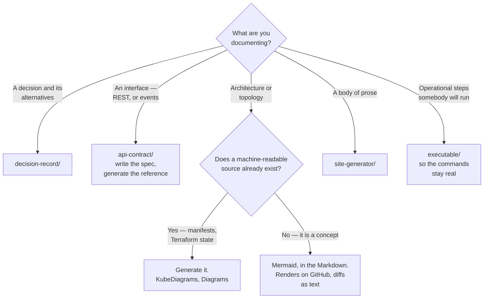

# Documentation

Documentation as code — the tooling that turns knowledge into something versioned, reviewable
and current.

Capabilities: [`site-generator/`](site-generator/README.md) ·
[`diagram/`](diagram/README.md) · [`decision-record/`](decision-record/README.md) ·
[`api-contract/`](api-contract/README.md) · [`presentation/`](presentation/README.md) ·
[`authoring/`](authoring/README.md) · [`executable/`](executable/README.md)

## Contents

1. [Why this is a platform capability](#1-why-this-is-a-platform-capability)
2. [The capabilities](#2-the-capabilities)
3. [Decision tree](#3-decision-tree)
4. [The principle that decides most of it](#4-the-principle-that-decides-most-of-it)
5. [Anti-patterns](#5-anti-patterns)
6. [How this applies to pikakube](#6-how-this-applies-to-pikakube)

---

## 1. Why this is a platform capability

Documentation fails in a specific, predictable way: it is written once, in a place separate from
the thing it describes, and it is wrong within a month. Nobody notices, because nothing checks
it.

Documentation as code is the response — the same treatment every other artefact in this
repository gets:

| Property | Consequence |
|---|---|
| **Lives beside the code** | changing one and not the other is visible in the diff |
| **Reviewed in pull requests** | wrong documentation can be caught before it is published |
| **Generated where possible** | diagrams, API references and schema docs cannot drift from their source |
| **Built in CI** | a broken link or a failed build is a pipeline failure, not a discovery |
| Versioned | the documentation for v2 is not the documentation for v3 |

The word that does the work is **generated**. Anything hand-maintained that describes a machine-
readable source — an API, a schema, a cluster topology — will diverge from it. The only reliable
fix is to stop maintaining it by hand.

## 2. The capabilities

| Capability | The question it answers | Tools |
|---|---|---|
| [`site-generator/`](site-generator/README.md) | how does Markdown in a repository become a site people read? | MkDocs, Docusaurus, Docsify, Sphinx, GitBook |
| [`diagram/`](diagram/README.md) | how are architecture diagrams kept current? | Mermaid, Diagrams, KubeDiagrams, awsdac, Excalidraw |
| [`decision-record/`](decision-record/README.md) | why was this decided, and what was rejected? | MADR, Log4brains |
| [`api-contract/`](api-contract/README.md) | what is the interface, precisely? | OpenAPI, AsyncAPI, Swagger UI, Redoc, EventCatalog |
| [`presentation/`](presentation/README.md) | how is this explained to a room? | Slidev, Marp |
| [`authoring/`](authoring/README.md) | how is the Markdown itself kept consistent, and how does existing material get in? | markdownlint, Pandoc |
| [`executable/`](executable/README.md) | how do runbook commands stay real? | Runme |

Two of these are the ones that separate a documented platform from a described one:

**`decision-record/`** captures the *why*. Code shows what was built; the alternatives that were
rejected and the constraints that forced the choice exist only in people's memory unless
written down. This is also the single most legible signal of seniority in a repository like this
one.

**`api-contract/`** is where documentation stops being prose. An OpenAPI or AsyncAPI document is
machine-readable, so it generates the reference, validates requests, and can be diffed for
breaking changes — documentation that participates in CI rather than describing it.

## 3. Decision tree

## 4. The principle that decides most of it

**Prefer the format that lives closest to the thing it describes.**

Applied consistently, it settles nearly every choice in this folder:

| Instead of | Use | Because |
|---|---|---|
| A diagram in a drawing tool | Mermaid in the Markdown | it diffs, and it is edited by whoever edits the text |
| A hand-drawn cluster topology | generated from the manifests | it cannot be out of date |
| An API reference written by hand | generated from OpenAPI | the spec is the source, and it is already there |
| A separate documentation repository | Markdown beside the code | one review, one diff, one moment to notice |
| A wiki page of commands | a runbook that executes | commands that are never run are commands that no longer work |

The counter-case is worth naming so the principle does not become dogma: **Excalidraw and
hand-drawn diagrams are better for explaining an idea to a human**. A generated topology is
complete and unreadable; a sketch is incomplete and understood. Both are legitimate, for
different jobs — see [`diagram/`](diagram/README.md).

## 5. Anti-patterns

| Anti-pattern | Why it is bad | What to do instead |
|---|---|---|
| Documentation in a separate repository | it is not in the diff, so nobody updates it | beside the code |
| Hand-drawn architecture diagrams as the source of truth | correct on the day they are drawn | generate from manifests where possible |
| A hand-written API reference | it drifts from the implementation immediately | OpenAPI, generated |
| A wiki nobody can edit without asking | knowledge accumulates in Slack instead | pull requests |
| No ADRs | every decision gets relitigated, annually | record the decision and what was rejected |
| Documenting *what* the code does | the code already says that, and says it correctly | document *why* |
| Screenshots of terminal output | stale, unsearchable, and unusable by anyone copying from them | fenced code blocks |
| Links never checked | a documentation site full of 404s | link checking in CI |
| A tool chosen for its themes | the constraint is never the theme | choose for the workflow |

## 6. How this applies to pikakube

This repository **is** the argument for the folder. Every capability under
[`infrastructure/`](../) carries a README with the trade-offs, the decision tree and the
anti-patterns — which is documentation as code applied to a tooling catalogue.

Where things stand:

| Capability | Status here |
|---|---|
| **Mermaid** | used throughout — decision trees in every capability README, rendered natively by GitHub |
| **MkDocs Material** | the [portfolio site](../../portfolio/), and the tooling is under [`site-generator/`](site-generator/README.md) |
| Diagrams, awsdac | mapped, with working examples and their recorded failures |
| **ADRs** | **the real gap** — decisions are explained inside the capability READMEs, but there is no record of the ones that were rejected |
| API contracts | mapped only; AsyncAPI is discussed in [apicurio-registry](../data-streaming/schema-registry/apicurio-registry/README.md), which is a related concern in a different discipline |

The ADR gap is the one worth closing. A repository that catalogues alternatives for every
capability and never records which were chosen, or why, is answering half the question — and
the unanswered half is the one that demonstrates judgement rather than coverage.

Two loose ends recorded here rather than left implicit:

- [`docs/mermaid/`](../../docs/mermaid/) at the repository root holds 21 `.mmd` files
  disconnected from any text. Mermaid renders inline in Markdown, so these are diagrams with no
  document
- [`diagram/excalidraw/`](diagram/excalidraw/README.md) contains `logo.JPG`, which is a
  repository asset rather than a diagram

---

[← infrastructure/](../)
