[← Documentation](../README.md)

# API contracts

Where documentation stops being prose and starts being machine-readable.

Tools covered: [`openapi`](openapi/README.md) · [`asyncapi`](asyncapi/README.md) ·
[`swagger-ui`](swagger-ui/README.md) · [`redoc`](redoc/README.md) ·
[`eventcatalog`](eventcatalog/README.md)

## Contents

1. [Why a spec beats a written reference](#1-why-a-spec-beats-a-written-reference)
2. [Two specifications](#2-two-specifications)
3. [Spec-first or code-first](#3-spec-first-or-code-first)
4. [The tools](#4-the-tools)
5. [Decision tree](#5-decision-tree)
6. [Anti-patterns](#6-anti-patterns)
7. [How this applies to pikakube](#7-how-this-applies-to-pikakube)

---

## 1. Why a spec beats a written reference

A hand-written API reference is wrong the first time an endpoint changes and nobody edits the
page. That is not a discipline problem — it is structural, because nothing connects the document
to the implementation.

A specification is a machine-readable description of the interface, and because it is
machine-readable it can do things prose cannot:

| Capability | What it means |
|---|---|
| **Generate the reference** | the published documentation is derived, never written |
| **Generate clients and servers** | the types in the consumer come from the contract |
| **Validate at runtime** | a request that violates the contract is rejected, not misinterpreted |
| **Detect breaking changes** | diff two versions in CI and fail the build |
| Mock the API | consumers develop against the contract before it is implemented |
| Contract testing | verify the implementation still matches |

The fourth row is the one that changes team behaviour. "Is this a breaking change?" stops being
a judgement call in review and becomes a pipeline result.

## 2. Two specifications

They are siblings, and the second is far less used than it should be:

| | **OpenAPI** | **AsyncAPI** |
|---|---|---|
| Describes | request/response HTTP APIs | **event-driven interfaces** |
| The unit | paths and operations | channels and messages |
| Covers | REST | Kafka, MQTT, AMQP, WebSockets, SSE |
| Adoption | near-universal | **rare, and that is the problem** |

**AsyncAPI is the interesting one for a data platform.** Kafka topics have owners, schemas,
delivery guarantees and semantics — and in most organisations all of that lives in people's
heads. REST endpoints get documented as a matter of course; the event that carries the same
data does not.

The consequence is that "what is in this topic, who owns it, and what happens if I change the
shape" is a conversation rather than a query. AsyncAPI is the format that makes it a document —
see [`asyncapi/`](asyncapi/README.md).

This connects directly to schema registries: a registry enforces the *payload* shape, while
AsyncAPI describes the *interface* around it — the channel, the ownership, the guarantees. Both
are needed, and [Apicurio](../../data-streaming/schema-registry/apicurio-registry/README.md)
stores both in one place, which is its actual argument.

## 3. Spec-first or code-first

The recurring debate, and it has a defensible answer.

| | **Spec-first** | **Code-first** |
|---|---|---|
| The contract is | written, then implemented | generated from annotations |
| Consumers can start | before implementation exists | after it does |
| Drift | prevented by validation | impossible by construction |
| Design | deliberate, reviewed | emergent from implementation |
| Cost | discipline, and a review step | none |

**Spec-first when more than one team is involved**, because the contract becomes something that
can be reviewed and agreed before either side builds. That is the whole value: the expensive
part of an integration is discovering the mismatch late.

**Code-first for internal services** with one team on both ends, where the annotation approach
costs nothing and cannot drift.

The failure mode of code-first is worth naming: the generated spec documents whatever was built,
including the accidents. Nobody ever designed the API, so its inconsistencies become its contract.

## 4. The tools

| Tool | Role | Where it shines | Detail |
|---|---|---|---|
| **OpenAPI** | the specification | the standard for HTTP APIs; everything else in this row builds on it | [→](openapi/README.md) |
| **AsyncAPI** | the specification | **event-driven interfaces** — the one that is missing everywhere | [→](asyncapi/README.md) |
| **Swagger UI** | renderer | **interactive** — the try-it-out console, which is what makes an API explorable | [→](swagger-ui/README.md) |
| **Redoc** | renderer | **readable reference** — three-panel, clean, better for documentation than for exploration | [→](redoc/README.md) |
| **EventCatalog** | catalogue | events, services, producers and consumers as a **browsable domain map** | [→](eventcatalog/README.md) |

**Swagger UI or Redoc** is a genuine choice and comes down to the reader's job: Swagger UI lets
someone call the endpoint from the page, which is how an API gets learned; Redoc produces a
document that is pleasant to read end to end. Publishing both is common and not unreasonable.

**EventCatalog** is a different category. It consumes AsyncAPI documents and produces a site
showing which services produce which events and who consumes them — a domain map rather than a
reference. For an event-driven platform that is the artefact people actually need, because the
question is rarely "what fields does this message have" and usually "who breaks if I change it".

## 5. Decision tree

```mermaid
flowchart TD
    START{What kind of<br/>interface?}

    START -->|HTTP request/response| OA[OpenAPI]
    START -->|Events — Kafka,<br/>MQTT, WebSockets| AA[AsyncAPI]

    OA --> Q1{Who reads<br/>the output?}
    Q1 -->|Developers integrating,<br/>who want to call it| SW[Swagger UI<br/>interactive]
    Q1 -->|Anyone reading<br/>a reference| RD[Redoc]

    AA --> Q2{One interface,<br/>or a landscape?}
    Q2 -->|A single service| AAR[AsyncAPI renderer]
    Q2 -->|Many services and<br/>their events| EC[EventCatalog<br/>producers, consumers,<br/>the domain map]

    AA --> SR[[Pair it with a schema registry.<br/>The spec describes the interface;<br/>the registry enforces the payload.]]
```

## 6. Anti-patterns

| Anti-pattern | Why it is bad | What to do instead |
|---|---|---|
| A hand-written API reference | wrong the first time an endpoint changes | generate it from a spec |
| The spec committed but not validated | it becomes a plausible fiction | validate requests, or contract-test |
| No breaking-change detection | consumers find out in production | diff the spec in CI |
| Events undocumented while REST is | the same data, half of it invisible | AsyncAPI |
| A schema registry treated as documentation | it enforces payloads; it does not say who owns the topic | AsyncAPI alongside it |
| Code-first with nobody reviewing the output | the API's accidents become its contract | review the generated spec |
| Spec-first with nobody validating conformance | two artefacts that disagree | contract testing |
| Version in the path and no versioning strategy | `/v2` appears and `/v1` is never removed | a deprecation policy |
| Examples that do not work | copy-paste fails, and trust goes with it | generate examples from the spec |

## 7. How this applies to pikakube

Mapped rather than deployed — and the honest assessment is that the **AsyncAPI** side is the one
with real value for this platform.

The connection already exists in the repository:
[Apicurio Registry](../../data-streaming/schema-registry/apicurio-registry/README.md) stores
AsyncAPI documents alongside Avro and Protobuf schemas, and that folder already makes the
argument — event-driven contracts are almost universally undocumented, and Kafka topic semantics
live in people's heads.

What this folder adds is the other half: the registry is where contracts are **stored and
enforced**; [`api-contract/`](.) is where they are **written and published**. A topic with a
registered Avro schema and no AsyncAPI document has an enforced payload and an undocumented
interface.

For a platform whose streaming layer is under
[`data-streaming/`](../../data-streaming/README.md), the sequence that would actually pay off:

1. **AsyncAPI documents** for the topics that cross a team boundary
2. **EventCatalog** to render them into a map of producers and consumers
3. Compatibility enforced by the registry, ownership and semantics by the spec

None of that requires deploying anything to the cluster — the specs are files in the repository,
and the catalogue is a static site.

---

[← Documentation](../README.md)
