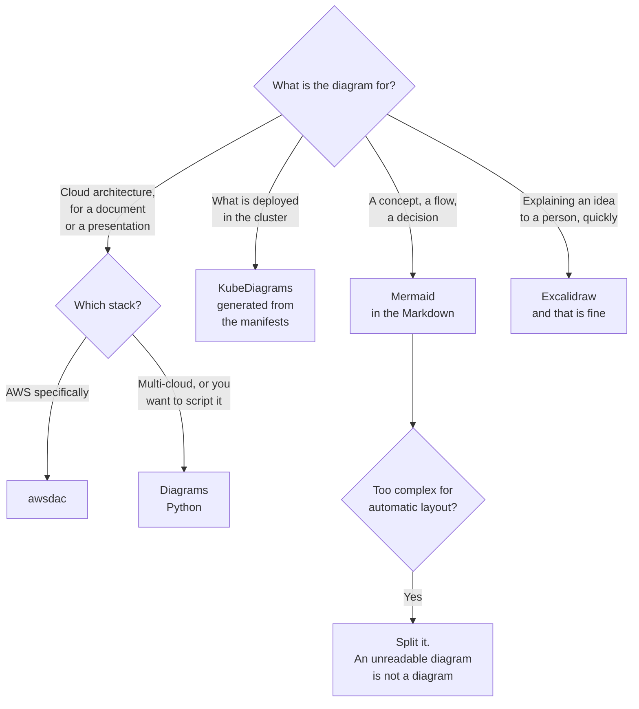

[← Documentation](../README.md)

# Diagrams

The documentation that goes stale fastest — and the approaches that stop it.

Tools covered: [`mermaid`](mermaid/README.md) · [`diagrams`](diagrams/README.md) ·
[`kubediagrams`](kubediagrams/README.md) · [`aws-dac`](aws-dac/README.md) ·
[`excalidraw`](excalidraw/README.md)

## Contents

1. [Why diagrams rot](#1-why-diagrams-rot)
2. [Three approaches](#2-three-approaches)
3. [The tools](#3-the-tools)
4. [Decision tree](#4-decision-tree)
5. [The case for hand-drawn](#5-the-case-for-hand-drawn)
6. [Anti-patterns](#6-anti-patterns)
7. [How this applies to pikakube](#7-how-this-applies-to-pikakube)

---

## 1. Why diagrams rot

A diagram drawn in a graphical tool is a binary file. It cannot be diffed, it is edited by
whoever has the tool installed, and nothing connects it to the system it describes.

The result is predictable: it is accurate on the day it is drawn, and it is quietly wrong within
a quarter. Worse, it keeps being shown — an out-of-date architecture diagram is more damaging
than none, because people act on it.

Two properties fix this, and they are different fixes:

| Property | What it gets you |
|---|---|
| **Text-based** | it diffs, it is reviewed in the pull request, and anyone can edit it |
| **Generated** | it *cannot* be out of date, because it is derived from the source |

The second is strictly stronger and only available when a machine-readable source exists.

## 2. Three approaches

| Approach | Source | Stays current | Good for |
|---|---|---|---|
| **Diagram as text** | you write it | it diffs, so drift is visible | concepts, flows, decisions |
| **Diagram as code** | a program you write | same, and it is programmable | consistent architecture diagrams at scale |
| **Generated** | the manifests themselves | **automatically** | what is actually deployed |
| Hand-drawn | a canvas | no | explaining an idea to a person |

The distinction between the first two is smaller than the names suggest. Mermaid is a small
declarative syntax; Diagrams is Python. Both are text in the repository. The difference is that
one embeds in Markdown and the other produces an image file to commit.

## 3. The tools

| Tool | Approach | Where it shines | Detail |
|---|---|---|---|
| **Mermaid** | text | **embeds in Markdown and renders natively on GitHub** — flowcharts, sequence, ER, state | [→](mermaid/README.md) |
| **Diagrams** | code, Python | polished cloud architecture diagrams with real provider icons | [→](diagrams/README.md) |
| **KubeDiagrams** | generated | **from Kubernetes manifests or a live cluster** — what is actually there | [→](kubediagrams/README.md) |
| **awsdac** | code, YAML | AWS architecture from a declarative file, AWS's own icon set | [→](aws-dac/README.md) |
| **Excalidraw** | hand-drawn | **explaining an idea** — deliberately sketchy, and the right tool for that job | [→](excalidraw/README.md) |

**Mermaid is the default, and by a wide margin.** It renders inside Markdown on GitHub, in most
IDEs, and in every site generator in [`site-generator/`](../site-generator/README.md). Nothing to
install, nothing to build, no image to keep in sync — the diagram lives inside the sentence that
introduces it.

Its limit is real: complex layouts are not controllable, and past a certain node count the
automatic layout produces something unreadable. That limit is also a useful signal — a diagram
Mermaid cannot lay out is usually a diagram nobody can read either.

**KubeDiagrams** is the one that deserves attention here, because it is the only *generated*
option in the list. Pointed at manifests or a live cluster, it draws what exists rather than
what someone remembers. That is a categorically different guarantee.

## 4. Decision tree

## 5. The case for hand-drawn

Worth making explicitly, because "diagrams as code" becomes dogma easily.

A generated cluster diagram is complete and unreadable. It shows every object, every
relationship, at uniform weight — which is exactly what you want when the question is *"what is
actually deployed?"* and exactly wrong when the question is *"how does this work?"*.

Explaining an idea requires **leaving things out**: the three components that matter, the arrow
that carries the interesting data, and none of the sidecars. Excalidraw is good at this partly
because it is deliberately sketchy — a hand-drawn box does not claim to be authoritative, which
is honest.

The rule that follows:

| Question | Diagram |
|---|---|
| "How does this work, conceptually?" | hand-drawn or Mermaid — **incomplete on purpose** |
| "What is actually deployed?" | generated — complete, and treated as a reference rather than an explanation |

Trouble comes from using one where the other belongs: a sketch presented as the source of truth,
or a generated topology handed to someone trying to understand the system.

## 6. Anti-patterns

| Anti-pattern | Why it is bad | What to do instead |
|---|---|---|
| Diagrams in a binary format as the source of truth | cannot be diffed or reviewed; stale within a quarter | text, or generated |
| A screenshot of a diagram in the documentation | the source is somewhere else, or nowhere | commit the source |
| An architecture diagram nobody owns | it is shown for years after it stopped being true | date it, or generate it |
| Everything in one diagram | 40 boxes communicate nothing | one diagram, one question |
| Mermaid for a layout it cannot handle | the automatic layout produces a knot | split it, or use a code-based tool |
| Generated topology used to explain the system | complete, uniform, and unreadable | a sketch that leaves things out |
| A diagram with no caption | the reader has to infer what they are looking at | say what it shows and what it omits |
| Icons chosen for accuracy over legibility | precise vendor icons at 12 pixels are grey squares | legibility first |

## 7. How this applies to pikakube

**Mermaid is used throughout.** Every capability README under
[`infrastructure/`](../../) carries a decision tree in it, rendered by GitHub without a build
step. That is the approach working as intended — the diagram is in the same file as the prose,
reviewed in the same diff.

[`diagrams/`](diagrams/README.md) and [`aws-dac/`](aws-dac/README.md) are mapped with working
examples, including awsdac's recorded font-loading failure — the kind of detail that is only
learned by running it.

Two things worth acting on:

**KubeDiagrams is the notable absence.** This repository is a large collection of manifests, and
nothing generates a picture from them. It is the one tool here that would produce documentation
that cannot go stale.

**[`docs/mermaid/`](../../../docs/mermaid/) at the repository root holds 21 `.mmd` files** that
belong inside the documents that should be showing them. Mermaid's whole advantage is living
inline; a folder of standalone `.mmd` files gives that up and keeps none of the benefits of an
image.

Also recorded: [`excalidraw/`](excalidraw/README.md) contains `logo.JPG`, which is a repository
asset rather than a diagram and is in the wrong place.

---

[← Documentation](../README.md)
