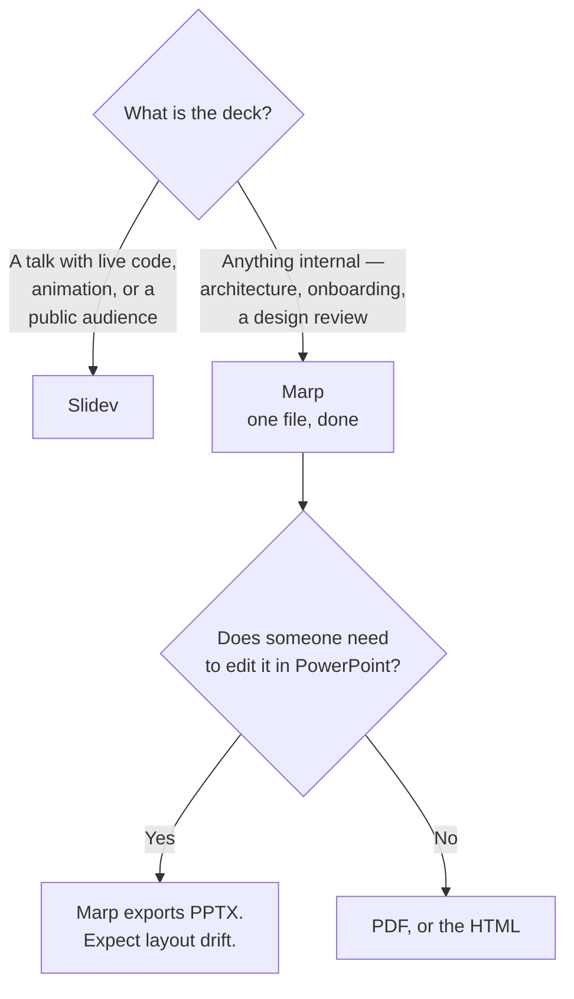

[← Documentation](../README.md)

# Presentations

Slides from Markdown — the same treatment as everything else in this folder.

Tools covered: [`slidev`](slidev/README.md) · [`marp`](marp/README.md)

---

## The problem it solves

Slides live in a binary file on somebody's laptop. They cannot be diffed, reviewed or
regenerated, and the architecture diagram inside them is a screenshot of a diagram that has since
changed.

For a platform team this matters more than it looks, because the same content gets presented
repeatedly — an onboarding deck, an architecture walkthrough, a design review. Each time it is
copied and edited, and each copy drifts.

Markdown-based slides fix the mechanics: the deck is text in the repository, reviewed in a pull
request, built in CI, and able to embed the **same Mermaid diagram** as the documentation rather
than a picture of it.

## The two tools

| | **Slidev** | **Marp** |
|---|---|---|
| Stack | Vue | Markdown plus a small CSS layer |
| Complexity | a project | **a file** |
| Live coding | **yes** — Monaco editor, runnable snippets | no |
| Mermaid | yes | yes |
| Presenter notes, drawing | yes | basic |
| Export | PDF, PNG, hosted SPA | PDF, PPTX, HTML |
| Editor integration | dev server | **a VS Code extension, previewing as you type** |
| Learning curve | real | none |

**Marp for most decks.** One Markdown file, `---` between slides, a VS Code extension that
previews live, and PDF or PPTX out. Nothing to scaffold, and the PPTX export matters in
organisations where a deck has to be handed to someone who will open it in PowerPoint.

**Slidev when the deck is a technical talk.** Embedded editors, runnable code, animations and
component-level control. It is a Vue project, and that cost is worth paying for a conference
talk and not worth paying for a sprint review.

## Decision tree

## What makes it worth doing

The mechanics are the smaller half. The reason to keep slides in the repository:

| Property | Consequence |
|---|---|
| **Same source as the documentation** | the diagram in the deck is the diagram in the README, not a screenshot of it |
| Reviewed | someone catches the wrong number before the meeting rather than during it |
| Rebuilt | a deck reused next quarter regenerates from current content |
| Diffed | "what changed since last time" is answerable |

The first row is the one that pays off repeatedly. Both tools render Mermaid, so a decision tree
written once in a capability README can appear in a talk without being redrawn — and it cannot
be a stale copy, because it is not a copy.

## Anti-patterns

| Anti-pattern | Why it is bad | What to do instead |
|---|---|---|
| Screenshots of diagrams in slides | stale, low-resolution, and disconnected from the source | embed Mermaid |
| Slidev for a five-slide internal update | a Vue project to say three things | Marp |
| The deck as the only record of a decision | slides are not documentation, and nobody reads them later | an [ADR](../decision-record/README.md) |
| Content duplicated from the documentation | two versions, and one is wrong | reference or embed the source |
| Built only when it is needed | a broken build discovered an hour before presenting | build in CI |
| Slides as a substitute for a written document | a deck without its speaker communicates very little | write the document, then present it |

The third and last rows are the same point from different directions: a presentation is a
*delivery mechanism*. The durable artefact belongs in
[`decision-record/`](../decision-record/README.md) or in the capability documentation, and the
deck should be built from it.

## How this applies to pikakube

Nothing here is used yet, and the case is straightforward: this repository already contains the
content a platform talk would need — capability trade-offs, decision trees, anti-patterns — all
in Markdown, all with Mermaid diagrams that both tools render.

**Marp** is the fit. A deck built from the existing READMEs, in one file, with the same diagrams,
and no possibility of showing an architecture that stopped being true.

The realistic use is an **onboarding walkthrough** of the platform: the capability structure,
what runs where, and why the choices were made — which is exactly the material that would
otherwise be a Confluence page written once and never revisited.

---

[← Documentation](../README.md)
