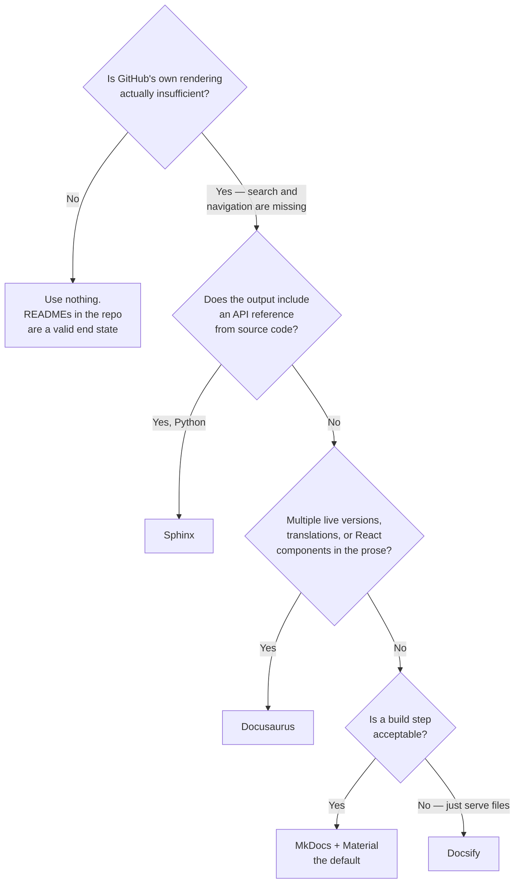

[← Documentation](../README.md)

# Site generators

Markdown in a repository becomes a site people can read — and the choice is mostly about
ecosystem, not output.

Tools covered: [`mkdocs`](mkdocs/README.md) · [`docusaurus`](docusaurus/README.md) ·
[`docsify`](docsify/README.md) · [`sphinx`](sphinx/README.md) ·
[`gitbook`](gitbook/README.md)

## Contents

1. [The problem](#1-the-problem)
2. [The tools](#2-the-tools)
3. [Decision tree](#3-decision-tree)
4. [Hosting](#4-hosting)
5. [What to set up beyond the build](#5-what-to-set-up-beyond-the-build)
6. [Anti-patterns](#6-anti-patterns)
7. [How this applies to pikakube](#7-how-this-applies-to-pikakube)

---

## 1. The problem

Markdown in a repository is readable on GitHub and unusable as documentation at any size:
no search, no navigation, no versions, and no way to send someone a link that means anything.

A generator adds the parts that make it a **product** rather than a folder — search, a
navigation tree, versioning, and a URL — while keeping the source as plain Markdown next to the
code.

The corollary is that if GitHub's own rendering is sufficient, no generator is needed. A
repository of READMEs that people navigate by clicking through folders is a legitimate
end state, and adding a build pipeline to it buys nothing.

## 2. The tools

| Tool | Stack | Where it shines | Detail |
|---|---|---|---|
| **MkDocs** | Python | **technical documentation with the least ceremony** — YAML config, Markdown in, static site out. Material is the theme everyone uses | [→](mkdocs/README.md) |
| **Docusaurus** | React | documentation **products** — versioning, i18n, blog, and React components inside MDX | [→](docusaurus/README.md) |
| **Docsify** | JavaScript | **no build step at all** — renders Markdown in the browser at runtime | [→](docsify/README.md) |
| **Sphinx** | Python | **API documentation from source** — docstrings, cross-references, and the Python ecosystem's standard | [→](sphinx/README.md) |
| **GitBook** | hosted | teams who want an editor rather than a repository | [→](gitbook/README.md) |

**MkDocs with the Material theme is the default recommendation** for a platform repository. The
configuration is one YAML file, the source stays Markdown, and Material provides search,
navigation, dark mode and versioning without any of it being a project.

**Docusaurus** earns its extra weight when the documentation is a product with an audience —
multiple versions live simultaneously, translations, or components embedded in the prose. For an
internal platform, that weight is usually unrewarded.

**Sphinx** is a different category despite the overlap. Its purpose is generating reference
documentation **from source code** — docstrings, signatures, cross-references — which none of the
others do. If the output includes a Python API reference, this is the tool; if it is prose,
MkDocs is less work.

**Docsify** is worth knowing about for its one distinctive property: there is no build. It ships
an `index.html` that fetches and renders the Markdown client-side, so publishing is copying
files. That makes it excellent for an internal site and bad for anything that needs to be
indexed by a search engine.

## 3. Decision tree

## 4. Hosting

The generator decides the build; this decides whether anyone reads it.

| Option | Fits | Note |
|---|---|---|
| **GitHub Pages** | a public repository's documentation | `mkdocs gh-deploy` publishes in one command; free, and versioned with the repo |
| **Read the Docs** | open-source packages | builds per commit and per version, with a pull-request preview |
| Internal ingress | private platform documentation | a static site behind the cluster's existing authentication |
| **Confluence** | organisations where Confluence is where people look | [confluence-docs-as-code](https://github.com/Workable/confluence-docs-as-code) publishes Markdown into it from CI |

The Confluence row is the pragmatic one and worth taking seriously in a corporate context.
Documentation nobody finds is documentation that does not exist, and if the organisation's
habit is to search Confluence, publishing there from the repository is better than being right
about where it should live.

## 5. What to set up beyond the build

The generator is the easy part. These decide whether the site stays useful:

| Concern | What to do |
|---|---|
| **Link checking in CI** | a documentation site accumulates 404s silently; this is the single highest-value check |
| **Search** | Material ships it client-side; anything larger wants an index |
| **Versioning** | `mike` for MkDocs, built in for Docusaurus — only if versions genuinely coexist |
| Navigation | maintained by hand in most generators, so it drifts as files are added |
| Preview on pull requests | so review means reading the rendered page, not the diff |
| Lint | see [`authoring/`](../authoring/README.md) |

Navigation is the recurring maintenance cost and the one people underestimate. In MkDocs the
`nav` block is written by hand; a new page that nobody adds to it is invisible.
[mkdocs-section-index](https://github.com/oprypin/mkdocs-section-index) helps by making section
landing pages real, and awareness of the problem helps more.

## 6. Anti-patterns

| Anti-pattern | Why it is bad | What to do instead |
|---|---|---|
| A generator for a handful of pages | a build pipeline to publish what GitHub already renders | READMEs |
| Documentation in a separate repository | it is not in the diff, so nobody updates it | beside the code |
| No link checking | the site fills with 404s and nobody knows | check links in CI |
| Chosen for the theme | the constraint is the workflow, never the appearance | choose for the workflow |
| Versioning enabled without needing it | every change must be applied to several versions | one version, until two genuinely coexist |
| Content written in the generator's own syntax | migrating later means rewriting everything | plain Markdown, extensions sparingly |
| A build that only runs on release | a broken build discovered when it is urgent | build on every pull request |
| Hand-maintained nav that nobody updates | new pages exist and cannot be found | check it, or generate it |

## 7. How this applies to pikakube

**MkDocs with Material** is what the [portfolio site](../../../portfolio/) is built on, and the
working configuration is recorded in [`mkdocs/`](mkdocs/README.md) — including the Poetry
workflow and the `gh-deploy` publishing path.

The rest of this repository takes the other branch of the decision tree deliberately: the
capability documentation under [`infrastructure/`](../../README.md) is **READMEs rendered by GitHub**,
with Mermaid inline. No build, no site, no navigation to maintain — and it works because the
folder structure *is* the navigation.

That is worth stating as a decision rather than an accident. The catalogue is browsed by walking
the tree, so a generator would add a build step and take away the thing that makes it navigable.

The gap, if the documentation ever outgrows that: **link checking**. It is the one piece of CI
that this repository would benefit from immediately, with or without a generator — the tree is
large enough now that a moved folder breaks links nobody will notice.

---

[← Documentation](../README.md)
