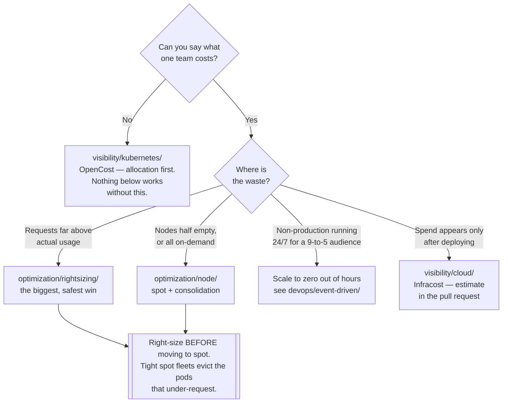

[← infrastructure/](../README.md)

# FinOps

Knowing what the platform costs, attributing it to whoever caused it, and removing the spend that
buys nothing.

Capabilities: [`visibility/`](visibility/README.md) · [`optimization/`](optimization/README.md)

## Contents

1. [Inform, optimise, operate — and why the order is not negotiable](#1-inform-optimise-operate--and-why-the-order-is-not-negotiable)
2. [Showback and chargeback](#2-showback-and-chargeback)
3. [The allocation problem in Kubernetes](#3-the-allocation-problem-in-kubernetes)
4. [Requests, limits and usage — cost follows requests](#4-requests-limits-and-usage--cost-follows-requests)
5. [Idle cost, the spend nobody sees](#5-idle-cost-the-spend-nobody-sees)
6. [Spot capacity, and what tolerates it](#6-spot-capacity-and-what-tolerates-it)
7. [The capabilities](#7-the-capabilities)
8. [Decision tree](#8-decision-tree)
9. [Where this connects to the rest of the platform](#9-where-this-connects-to-the-rest-of-the-platform)
10. [Anti-patterns](#10-anti-patterns)
11. [Notes](#11-notes)
12. [How this applies to pikakube](#12-how-this-applies-to-pikakube)

---

## 1. Inform, optimise, operate — and why the order is not negotiable

The FinOps Foundation splits the discipline into three phases, and they are a sequence rather than
a menu:

| Phase | The question | What it produces | Folder |
|---|---|---|---|
| **Inform** | what do we spend, and who caused it? | attribution people believe | [`visibility/`](visibility/README.md) |
| **Optimise** | what of that buys nothing? | right-sized requests, cheaper capacity | [`optimization/`](optimization/README.md) |
| **Operate** | how does it stay that way? | budgets, alerts, review as routine | everywhere, continuously |

**You cannot optimise what you cannot attribute.** Without allocation, every optimisation is a
guess with no owner: the platform team sees a large bill, cannot say which workload produced it,
and ends up either cutting nothing or cutting the wrong thing. The first team to be told "your
namespace costs €4,000 a month" usually fixes it themselves — that is the whole mechanism, and it
does not work until the number exists and is trusted.

The reverse order is the standard failure. Someone deploys an autoscaler, spend drops for a
quarter, nobody can show which workload got cheaper, and the change is silently reverted the first
time a pod is evicted.

**Operate** is the phase most platforms never reach. Attribution and optimisation are projects;
operating is a habit — a monthly number per team, an alert when spend moves, a request review when
a service is deployed. Without it, everything regresses to where it was within two quarters,
because requests only ever get raised.

## 2. Showback and chargeback

Two ways of putting the number in front of the team that caused it, and they are not
interchangeable:

| | **Showback** | **Chargeback** |
|---|---|---|
| What happens | the team is *shown* what they cost | the cost is *billed* to their budget |
| Accuracy needed | good enough to be directional | defensible to the last euro |
| Argument it triggers | "that seems high, why?" | "your allocation model is wrong" |
| Prerequisite | a cost tool and a namespace convention | agreed rules for shared and idle cost |
| Failure mode | nobody acts, because nothing is at stake | months spent arguing about the model |

**Start with showback.** It is cheap, it changes behaviour more often than people expect, and it
surfaces the disagreements about the model *before* real money depends on them. Chargeback is only
worth the effort when teams have real budgets and real authority to spend them differently.

The trap in chargeback is section 5: shared and idle cost. The moment a euro is billed, every team
has an incentive to argue that the idle capacity belongs to somebody else.

## 3. The allocation problem in Kubernetes

This is the entire reason Kubernetes-specific cost tooling exists, and it is worth being precise
about.

A cloud bill is a list of resources: virtual machines, disks, load balancers, egress. That is the
finest granularity the provider knows. On a normal VM estate that is enough — one VM belongs to one
service, tag it, done.

**Kubernetes breaks that assumption.** One node runs forty pods from eight teams. The bill says
*one virtual machine, €0.42/hour*. Nothing in the invoice knows a pod exists. So the question "what
does this team cost" cannot be answered by any cloud cost tool, however good — the data simply is
not there.

Answering it requires splitting the node's hourly rate across the pods that shared it:

| Input | Where it comes from |
|---|---|
| Node hourly price, by instance type, region and **capacity type** (on-demand vs spot) | cloud pricing API |
| What each pod **reserved**, and for how long | Kubernetes API — requests, pod lifetimes |
| Which namespace, label or team each pod belongs to | Kubernetes API — metadata |
| Storage, load balancers, egress attached to a workload | cloud API plus PV and Service objects |
| What to do with the rest | **a decision, not a measurement** — see section 5 |

The tools in [`visibility/kubernetes/`](visibility/kubernetes/README.md) do exactly this, and
nothing else does. [OpenCost](visibility/kubernetes/opencost/README.md) is the CNCF specification
and reference implementation of the model; [Kubecost](visibility/kubernetes/kubecost/README.md) is
the commercial product built on it.

Two consequences that catch people out:

- **Cost per pod is an allocation, not a measurement.** It is arithmetic performed on a shared
  bill. Two defensible models produce two different numbers for the same pod, and both are correct
  under their own rules. This is why chargeback arguments are really arguments about the model.
- **The allocation is only as good as the metadata.** Pods with no owning label land in
  `__unallocated__`, and a report that is 30% unallocated convinces nobody. Namespace and label
  conventions are a FinOps prerequisite, not a tidiness preference.

## 4. Requests, limits and usage — cost follows requests

The single most valuable thing to understand about Kubernetes cost:

| | What it is | What it affects |
|---|---|---|
| **Requests** | what the scheduler **reserves** on a node | **how many nodes you run — this is the cost** |
| **Limits** | the ceiling before throttling (CPU) or OOM kill (memory) | reliability and latency, not the bill |
| **Usage** | what the container actually consumed | reality, and the input to right-sizing |

A pod requesting 2 CPU and using 0.1 occupies 2 CPU of schedulable capacity. The node fills up on
reservations, the cluster autoscaler adds another node, and the bill goes up — for capacity nobody
touched. The container was never throttled, no alert fired, and every dashboard looks fine.

**Over-requesting is the single biggest source of waste on Kubernetes**, and it is structural
rather than careless. Requests are copied from another manifest, doubled after one incident, and
never lowered — because lowering them is the only change in this list that has any downside risk.
Nothing in the system pushes back.

This is what [`optimization/rightsizing/`](optimization/rightsizing/README.md) exists to fix: take
the observed usage, produce a defensible request, and close the gap.

Note that cost models generally attribute the **greater of request and usage** — a pod that bursts
above its request still consumed the node's resources and is charged for it. So under-requesting
does not make a workload free, it just makes it unreliable *and* still billed.

## 5. Idle cost, the spend nobody sees

A node with 8 CPU whose pods request 5 has 3 CPU of idle capacity. You pay for 8. That waste
appears nowhere:

- **the cloud bill** shows one fully-priced virtual machine
- **the cost-per-namespace report** shows the 5 that were requested
- the 3 exist only if someone deliberately computes `node capacity − allocated`

Idle is the difference between what you buy and what you hand out. Its usual causes are worth
separating, because they have different fixes:

| Cause | Fix |
|---|---|
| Node sizes that do not divide into pod sizes — a 16-CPU node holding 11 CPU of pods | consolidation and heterogeneous instance types — [`node/`](optimization/node/README.md) |
| Headroom held for a scale-up that happens twice a year | smaller nodes, faster provisioning |
| Whole environments idle overnight and at weekends | scale to zero out of hours — section 9 |
| Reservations far above usage | right-sizing — this is section 4's waste, not idle |

Every cost tool exposes a decision about idle, usually called *sharing*: spread it proportionally
across tenants, charge it to the platform team, or report it separately. **Reporting it separately
is the honest default** — it keeps the number visible and owned by whoever controls node
provisioning, instead of dissolving it into everyone's bill where nobody can act on it.

## 6. Spot capacity, and what tolerates it

Cloud providers sell the same machine three ways:

| Model | Discount vs on-demand | Commitment | Fits |
|---|---|---|---|
| **On-demand** | baseline | none | unpredictable or short-lived usage |
| **Reserved / savings plan** | roughly 30–40% | 1–3 years, a fixed machine class | a predictable floor of continuous usage |
| **Spot / preemptible** | roughly 90% | none, and **no SLA** | anything that can be interrupted |

Spot is the largest single lever in this entire discipline, and the only one where the trade-off is
availability rather than effort. The provider can reclaim the machine at any time, typically with
30 seconds to two minutes of warning.

**Tolerates spot:**

- stateless backend and frontend services with more than one replica and a working PodDisruptionBudget
- batch jobs and short workflow tasks that can be retried from the start
- development, QA and staging environments in general
- CI runners and build agents
- data processing where the framework already handles losing a worker

**Does not tolerate spot:**

- long-running tasks with no checkpointing — the risk of interruption grows with duration, and a
  six-hour job restarted at hour five has cost more than on-demand would have
- single-replica stateful workloads, especially databases: the pod restart takes every dependent
  application down with it
- anything holding state in memory that cannot be rebuilt
- workloads whose requests are wrong, which is the non-obvious one: on generously sized on-demand
  nodes a pod using far more than it requests survives on the slack. Spot fleets are provisioned
  tightly to what was requested, and the same pod is evicted. **Right-sizing is a prerequisite for
  spot, not an alternative to it.**

Handling interruption well is a tooling problem, and it is what
[`optimization/node/`](optimization/node/README.md) covers.

## 7. The capabilities

| Capability | The question it answers | Note |
|---|---|---|
| [`visibility/`](visibility/README.md) | what do we spend, and who caused it? | **start here** — everything else depends on it |
| [`visibility/cloud/`](visibility/cloud/README.md) | what does the cloud account cost, before and after deployment? | includes cost estimation in pull requests |
| [`visibility/kubernetes/`](visibility/kubernetes/README.md) | what does this namespace, team or workload cost? | the allocation problem in section 3 |
| [`optimization/`](optimization/README.md) | what of that spend buys nothing? | two independent levers |
| [`optimization/rightsizing/`](optimization/rightsizing/README.md) | are the requests anywhere near the usage? | the biggest and least risky win |
| [`optimization/node/`](optimization/node/README.md) | is the capacity underneath cheap and well packed? | spot, consolidation, instance choice |

The two optimisation levers multiply rather than overlap: right-sizing reduces what you ask the
cluster for, node optimisation reduces what that costs to supply. Doing only the second means
buying cheap capacity for reservations nobody uses.

## 8. Decision tree

## 9. Where this connects to the rest of the platform

**Cost tooling is built on the metrics pipeline.** It is not a parallel stack. OpenCost, Kubecost
and Crane all read from Prometheus and write metrics back into it; the value of that is that cost
becomes a series like any other, graphable next to the deploy that caused it.

| Connection | Why |
|---|---|
| [`observability/metrics/`](../observability/metrics/README.md) | the storage and query layer every cost tool here depends on |
| [`cloudcost-exporter`](../observability/metrics/exporters/cloudcost-exporter/README.md) | cloud pricing and cost as Prometheus series — the *"why did spend change at 14:00"* question that a monthly invoice cannot answer |
| [`spot-price-exporter`](../observability/metrics/exporters/spot-price-exporter/README.md) | spot prices by instance type and zone, so the capacity strategy is chosen from data |
| [`spot-termination-exporter`](../observability/metrics/exporters/spot-termination-exporter/README.md) | interruption notices as metrics — how you find out whether spot is actually hurting |
| [`alerting/`](../observability/alerting/README.md) | where a cost anomaly should arrive, alongside every other platform alert |

**Scaling non-production down outside working hours** is the cheapest optimisation available and it
belongs in `devops/event-driven/` rather than here. A development cluster serving people in one
timezone is idle roughly 128 hours of every 168 — around 75% of its cost buys nothing at all. KEDA
supports a cron scaler that scales a workload to zero on a schedule and back up before the working
day; `kubeelasti` in the same folder scales to zero and restores on the first request. Neither is a
FinOps tool, and both are worth more than most of the tools that are.

Two caveats that decide whether this actually saves money:

- scaling **pods** to zero saves nothing on its own — the nodes must go away too, which needs a
  node autoscaler that consolidates. See [`optimization/node/`](optimization/node/README.md).
- the cluster must come back up reliably before people arrive, or the schedule is removed after the
  first bad morning.

## 10. Anti-patterns

| Anti-pattern | Why it is bad | What to do instead |
|---|---|---|
| Optimising before attributing | no owner, no baseline, and no way to prove it worked | allocation first — [`visibility/`](visibility/README.md) |
| Reading the cloud bill for Kubernetes cost | it stops at the virtual machine; pods do not exist in it | a cost model that splits the node — section 3 |
| Chargeback as the first step | months arguing about the model before anything is saved | showback, then chargeback if budgets exist |
| Optimising usage instead of requests | the bill follows what was reserved, not what was used | right-size the requests |
| Setting requests equal to limits everywhere | reserves peak capacity permanently to avoid throttling | request the realistic load, limit the tolerable peak |
| Copying requests from another manifest | the number was never right for either workload | derive it from observed usage |
| Idle cost spread silently across tenants | the waste becomes everybody's and therefore nobody's | report idle separately and own it |
| Moving to spot before right-sizing | tight fleets evict the pods that under-request | right-size first, then spot |
| Databases with one replica on spot | one reclaimed node takes down everything that queries it | on-demand, or a genuinely distributed database |
| Long unretryable jobs on spot | interruption risk grows with duration; the restart costs more than the discount | on-demand for long jobs, spot for short ones |
| A cost dashboard nobody opens | reporting is not a control | a number per team, monthly, plus alerts on movement |
| Cost tooling on its own metrics stack | a second Prometheus to operate and reconcile | the existing one — [`observability/metrics/`](../observability/metrics/README.md) |
| Namespaces and labels without an owner convention | a large `__unallocated__` bucket, and nobody believes the report | enforce ownership labels before adopting a cost tool |
| Non-production running 24/7 | roughly three quarters of its cost buys nothing | scale to zero on a schedule — section 9 |
| A commercial cost platform bought before the free one is understood | paying for a model you cannot explain to the teams being billed | OpenCost first; buy when its limits are the actual problem |

## 11. Notes

Original notes recorded for this folder, translated and explained.

**<https://github.com/FinOps-Open-Cost-and-Usage-Spec/FOCUS_Spec>** — FOCUS, the FinOps Open Cost
and Usage Specification. A vendor-neutral schema for billing data: every provider exports cost in
its own format with its own column names, and comparing or combining them is a per-provider
integration. FOCUS defines one set of columns and semantics that all of them can export to. This
matters here because it is the standard that makes multi-cloud cost reporting a query rather than a
project, and adoption by the providers is what determines whether the tools in
[`visibility/cloud/`](visibility/cloud/README.md) need custom parsers per account.

**<https://github.com/microsoft/finops-toolkit>** — Microsoft's FinOps tooling for Azure: cost
export pipelines ("FinOps hubs"), Power BI reports, Bicep templates and a PowerShell module.
Azure-specific and Microsoft-maintained. Relevant to this platform because the clusters here are
AKS; it covers the *cloud account* side, not the Kubernetes allocation side, and does not replace
[`visibility/kubernetes/`](visibility/kubernetes/README.md).

**<https://github.com/electrolux-oss/infrawallet>** — a Backstage plugin that shows cloud cost
inside the developer portal. The idea is placing the number where engineers already are rather than
in a FinOps tool they have no reason to open. This platform has Backstage under
`platform-engineering/idp/`, so the integration point exists.

**<https://github.com/electrolux-oss/azure-cost-exporter>** — exports Azure cost data as Prometheus
metrics. Same shape and purpose as
[`cloudcost-exporter`](../observability/metrics/exporters/cloudcost-exporter/README.md), scoped to
Azure; the point of both is turning cost into a time series that lives beside the workload metrics
instead of in a billing console.

**<https://github.com/electrolux-oss/kubernetes-cost-exporter>** — the Kubernetes-side companion:
exports allocated Kubernetes cost as Prometheus metrics. Lighter than a full cost platform and
useful when the requirement is a cost series in Grafana rather than a product with a UI.

**<https://github.com/ctrox/zeropod>** and **<https://github.com/checkpoint-restore/criu>** — the
speculative entry, and the most interesting. zeropod is a containerd shim that **checkpoints an
idle container to disk and frees its memory**, restoring it when a connection arrives. CRIU
(Checkpoint/Restore In Userspace) is the Linux mechanism underneath: it freezes a running process
tree, writes its full state — memory, open files, sockets — to disk, and restores it later.

The reason to care is that it attacks idle cost at a granularity nothing else reaches. Scale-to-zero
tools like KEDA and `kubeelasti` remove the *pod* and pay a full cold start on the next request;
zeropod keeps the pod and restores process state, so recovery is fast enough to hide behind a single
request. That makes "scale to zero" viable for services where a cold start would be unacceptable —
internal tools, dev-namespace services, anything with sparse traffic. It is a container runtime
change, which is a serious operational commitment, so treat it as a thing to watch rather than a
thing to deploy.

## 12. How this applies to pikakube

This is a **broadly mapped discipline with real deployment history**, and the visibility side has
more recorded operational scar tissue than anything else in the folder.

**Where the platform actually is:**

| Area | State |
|---|---|
| Kubernetes allocation | [OpenCost](visibility/kubernetes/opencost/README.md) and [Kubecost](visibility/kubernetes/kubecost/README.md) both configured against the existing Prometheus, with cloud integration and a cluster ID per environment |
| Node capacity | [Karpenter](optimization/node/karpenter/README.md) mapped for **both AWS and Azure**, with `spotToSpotConsolidation` enabled, plus the commercial alternatives [CAST AI](optimization/node/castai/README.md) and [Spot Ocean](optimization/node/spot-ocean/README.md) |
| Right-sizing | [VPA](optimization/rightsizing/vpa/README.md) and [Goldilocks](optimization/rightsizing/goldilocks/README.md) deployed; [KRR](optimization/rightsizing/krr/README.md) and the commercial options mapped |
| Cloud visibility | [Infracost](visibility/cloud/infracost/README.md), [Komiser](visibility/cloud/komiser/README.md), [OptScale](visibility/cloud/optscale/README.md) evaluated, with the limits of each recorded |
| Cost metrics | three cost exporters documented in [`observability/metrics/exporters/`](../observability/metrics/exporters/README.md) |

**The good decisions already visible in the configuration.** Both cost tools point at the platform's
existing Prometheus rather than shipping their own — Kubecost's chart explicitly disables its
bundled Prometheus, Grafana, node-exporter and kube-state-metrics. That is exactly right, and it is
the mistake most Kubecost installations make. Both also set an explicit cluster identifier, which is
what makes multi-cluster aggregation possible later.

**The gaps worth naming:**

- **Spot is documented as strategy, not as policy.** The Spot Ocean notes describe a full workload
  classification — what belongs on spot, what does not, and the process for opting a namespace in —
  and that thinking is the valuable part regardless of which tool ends up running. It is not
  reflected anywhere as an actual default.
- **Cost is not wired to alerting.** Allocation exists; nothing detects that it moved. The path is
  [`alerting/`](../observability/alerting/README.md), and the OpenCost notes record that alerting on
  cost by label has been a long-standing gap in the tool itself.
- **Nothing scales down out of hours**, which is the largest untaken saving on the non-production
  clusters and needs no FinOps tool at all — see section 9.
- **Right-sizing is deployed but not closed as a loop.** VPA and Goldilocks produce recommendations;
  what turns a recommendation into a merged pull request is a process, not a chart.

---

[← infrastructure/](../README.md)
