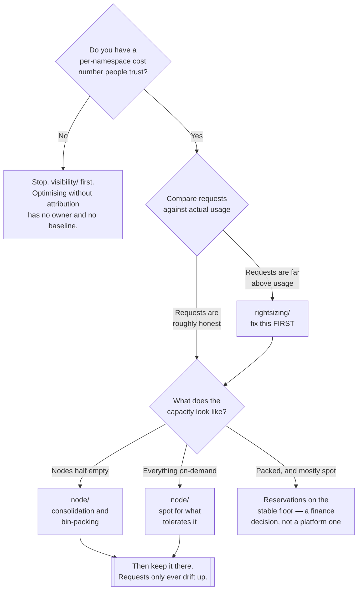

[← FinOps](../README.md)

# Optimization

Two independent levers: ask the cluster for less, and make what you ask for cheaper to supply.

Capabilities: [`rightsizing/`](rightsizing/README.md) · [`node/`](node/README.md)

## Contents

1. [The two levers](#1-the-two-levers)
2. [The order that works](#2-the-order-that-works)
3. [What each lever is actually worth](#3-what-each-lever-is-actually-worth)
4. [What optimisation costs you](#4-what-optimisation-costs-you)
5. [Decision tree](#5-decision-tree)
6. [The third lever nobody deploys](#6-the-third-lever-nobody-deploys)
7. [Anti-patterns](#7-anti-patterns)
8. [How this applies to pikakube](#8-how-this-applies-to-pikakube)

---

## 1. The two levers

Kubernetes cost is a product of two numbers, and each folder here attacks one of them:

```
cost  ≈  (what workloads reserve)  ×  (what capacity costs to supply)
             ↑                              ↑
      rightsizing/                        node/
```

| Lever | Folder | Changes | Owned by |
|---|---|---|---|
| **Demand** — what pods request | [`rightsizing/`](rightsizing/README.md) | the manifests of the workloads | application teams, with platform evidence |
| **Supply** — what the capacity underneath costs | [`node/`](node/README.md) | instance types, capacity type, packing | the platform team |

They multiply. Halving requests on capacity that costs half as much is a quarter of the bill.
Doing only the supply side means buying cheap machines for reservations nobody uses — the
efficiency of a well-packed cluster full of pods requesting four times what they use is still
close to zero.

The asymmetry worth noticing is ownership. The platform team can change the supply side unilaterally
on a Tuesday afternoon. The demand side requires convincing dozens of teams to lower a number that
protects them, which is why it is the lever that stalls — and why the evidence has to be
irrefutable before the conversation starts.

## 2. The order that works

**Right-size first. Then change the capacity underneath.**

This is not a preference, it is a dependency. Node optimisation packs workloads tightly onto
machines sized to what they *reserved*. Today's over-provisioned on-demand nodes carry a large
margin of unrequested slack, and any workload using more than it requests is quietly living on that
slack. Remove it — by consolidating, by moving to right-sized instance types, by moving to spot —
and those workloads start being throttled and OOM-killed.

The failure looks like a platform problem and is actually a manifest problem: "we moved to spot and
everything broke". What broke is the set of workloads whose requests were always wrong; on-demand
nodes were hiding it.

So the sequence is:

1. **Attribute.** [`visibility/`](../visibility/README.md) — a per-namespace number nobody disputes.
2. **Right-size.** [`rightsizing/`](rightsizing/README.md) — requests within sight of usage, including limits that are set deliberately.
3. **Optimise capacity.** [`node/`](node/README.md) — consolidation, instance choice, spot.
4. **Keep it there.** Requests only ever drift upward. Without a recurring review, step 2 is undone within two quarters.

## 3. What each lever is actually worth

Order-of-magnitude, not a promise — the numbers depend entirely on where you start:

| Change | Typical effect | Risk | Effort |
|---|---|---|---|
| Right-sizing over-provisioned requests | large, and it is the most common source of waste | low, if driven by observed percentiles | **high — it is a per-team negotiation** |
| Moving suitable workloads to spot | up to ~90% off those nodes | medium — interruption must be handled | medium |
| Consolidation and bin-packing | removes the idle gap between what you buy and what you hand out | low | low, once an autoscaler does it |
| Right instance family for the workload | meaningful for memory- or compute-skewed workloads | low | low |
| Reserved instances / savings plans on the stable floor | 30–40% | **commits you for 1–3 years** | low technically, high politically |
| Scaling non-production to zero out of hours | around 75% of non-production | low | low — see section 6 |

The two rows worth staring at are the ones with *high effort, low risk* and *low effort, low risk*:
right-sizing and out-of-hours scaling. Almost everyone starts with spot, because it is the most
interesting engineering problem.

## 4. What optimisation costs you

Every lever here trades something. Stating it plainly is what stops the first incident from
reverting the whole programme:

| Lever | What you give up |
|---|---|
| Lower requests | headroom for traffic the workload has not seen yet |
| Tighter limits | burst capacity — throttled CPU or an OOM kill instead of a slow response |
| Spot capacity | the machine can vanish with under two minutes of notice |
| Aggressive consolidation | pods are evicted and rescheduled during normal operation, not just during incidents |
| Reservations | a multi-year commitment to a capacity shape you may not want |
| Scale to zero | a cold start on the first request after idle |

None of these are reasons not to do it. They are reasons to decide *per workload* rather than
per cluster, which is what PodDisruptionBudgets, node pools, taints and the
`karpenter.sh/do-not-disrupt` annotation exist to express.

## 5. Decision tree



## 6. The third lever nobody deploys

Neither folder here covers it, and it is the cheapest saving available: **turn non-production off
when nobody is using it.**

A development cluster serving one timezone is idle for roughly 128 of every 168 hours. That is
about 75% of its cost buying nothing, and removing it requires no cost tool, no negotiation with
application teams and no interruption tolerance.

The tooling lives in `devops/event-driven/` — KEDA has a cron scaler that takes a workload to zero
on a schedule and back up before the working day, and `kubeelasti` scales to zero and restores on
the first request instead of on a clock.

Two things decide whether it saves real money:

- **the nodes must go away.** Scaling pods to zero on a cluster with a fixed node pool saves
  nothing at all — it needs a node autoscaler that consolidates empty capacity, which is
  [`node/`](node/README.md).
- **it must come back reliably.** One bad Monday morning and the schedule is deleted permanently.

## 7. Anti-patterns

| Anti-pattern | Why it is bad | What to do instead |
|---|---|---|
| Spot before right-sizing | tightly-provisioned nodes evict the pods that under-request | right-size first — section 2 |
| Optimising without attribution | no baseline, no owner, and no way to prove the saving | [`visibility/`](../visibility/README.md) first |
| Treating this as a one-off project | requests drift upward after every incident | a recurring review, with a number per team |
| Only the supply side | cheap machines running reservations nobody uses | both levers, in order |
| Only the demand side | perfectly-sized pods on half-empty on-demand nodes | both levers, in order |
| A cluster-wide policy for interruption tolerance | some workloads genuinely cannot take it | per-workload: node pools, taints, PDBs |
| No PodDisruptionBudgets, then enabling consolidation | consolidation and spot both evict; without a PDB, all replicas can go at once | PDBs before any disruption-causing change |
| Reservations bought before right-sizing | a three-year commitment to today's waste | right-size, observe the floor, then commit |
| Automatic request changes with no guard rails | a recommender that shrinks a workload before its peak season | recommendations reviewed, or bounded with min/max |
| Measuring success in cost only | a 30% saving that caused two incidents is not a saving | track cost **and** the reliability signals next to it |

## 8. How this applies to pikakube

Both levers are mapped, and both have real deployments behind them.

**Supply side** is the more developed. [Karpenter](node/karpenter/README.md) is configured for
**both AWS and Azure**, with `spotToSpotConsolidation` enabled on each — that feature gate is what
allows a spot node to be replaced by a cheaper spot node, without which spot fleets calcify at
whatever they were first provisioned as. The Azure NodePool example is explicit about the shape:
spot capacity type, `WhenEmptyOrUnderutilized` consolidation, a 7-day node expiry, and a SKU family
restriction. The commercial alternatives, [CAST AI](node/castai/README.md) and
[Spot Ocean](node/spot-ocean/README.md), are mapped alongside.

**Demand side** has [VPA](rightsizing/vpa/README.md) and [Goldilocks](rightsizing/goldilocks/README.md)
deployed, with [KRR](rightsizing/krr/README.md) and two commercial products evaluated. The tools are
there; what is missing is the loop — a recommendation only becomes a saving when it is merged, and
nothing in this repository turns one into the other.

**The ordering risk is live here.** Karpenter with consolidation and spot is exactly the
configuration that exposes every workload whose requests are wrong. The Spot Ocean notes already
recorded this from experience — that non-spot VMs were provisioned with enough slack to absorb
badly-sized workloads, and that moving to tightly-sized capacity breaks them. That warning applies
identically to Karpenter, and right-sizing is the mitigation.

**The unclaimed saving** is section 6: nothing scales down out of hours, and `devops/event-driven/`
already has KEDA and `kubeelasti` mapped.

---

[← FinOps](../README.md)
