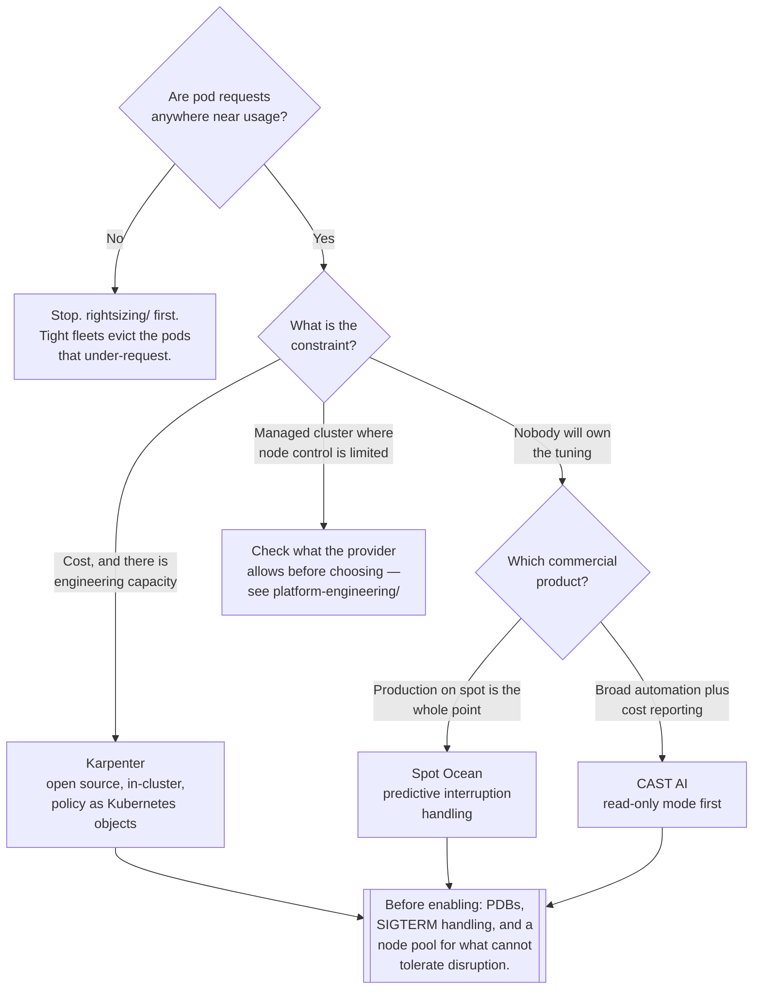

[← Optimization](../README.md)

# Node optimization

Making the capacity underneath the cluster cheaper: the right machines, well packed, mostly spot.

Tools covered: [`karpenter`](karpenter/README.md) · [`castai`](castai/README.md) ·
[`spot-ocean`](spot-ocean/README.md)

## Contents

1. [The four jobs](#1-the-four-jobs)
2. [Why node groups are the problem](#2-why-node-groups-are-the-problem)
3. [Consolidation, and why it is the underrated half](#3-consolidation-and-why-it-is-the-underrated-half)
4. [Surviving interruption](#4-surviving-interruption)
5. [The tools](#5-the-tools)
6. [Decision tree](#6-decision-tree)
7. [What you must configure before turning any of this on](#7-what-you-must-configure-before-turning-any-of-this-on)
8. [Anti-patterns](#8-anti-patterns)
9. [How this applies to pikakube](#9-how-this-applies-to-pikakube)

---

## 1. The four jobs

"Node autoscaler" covers four distinct jobs. Tools differ mostly in how many of them they do:

| Job | The question | Consequence of doing it badly |
|---|---|---|
| **Provisioning** | a pod is unschedulable — add capacity | pods stay Pending, or capacity arrives minutes late |
| **Instance selection** | *which* machine should that be? | a 16-CPU node bought for a 2-CPU pod |
| **Consolidation** | these nodes are half empty — can workloads be packed onto fewer? | permanent idle cost, invisible in the bill |
| **Capacity type** | on-demand, or spot? | the largest discount in cloud, unclaimed |

The classic **cluster-autoscaler** does the first well and the others barely: it scales pre-defined
node groups up and down, so instance selection was decided by whoever created the group, and
consolidation is limited to removing nodes that are essentially empty.

**Karpenter** and the commercial products here do all four, which is the reason they exist.

## 2. Why node groups are the problem

A node group is a fixed answer — one instance type, one capacity type, one zone — chosen before the
workloads existed. Everything awkward about scaling on Kubernetes follows from that:

| Symptom | Cause |
|---|---|
| A pod requesting 2 CPU triggers a 16-CPU node | the group only knows one machine size |
| A memory-heavy workload runs on compute-optimised machines | the group was created for something else |
| Ten groups, to cover the combinations | each one carries its own idle margin |
| Spot capacity unavailable, so nothing scales | one instance type in one zone, and no fallback |
| Nodes never shrink after a peak | the group scales down only when a node is empty |

Group-less provisioning inverts it: look at the pending pods, work out what would actually fit, and
ask the cloud for **that machine**, from a broad set of types and zones. Breadth is also what makes
spot reliable — the more instance types are acceptable, the less likely all of them are reclaimed at
once.

## 3. Consolidation, and why it is the underrated half

Provisioning gets the attention; consolidation is where the recurring money is. Clusters do not
drift toward efficiency on their own — a day of scaling up and back down leaves nodes each holding a
fraction of their capacity, and nothing puts them back together.

Consolidation continuously asks whether the current pods would fit on fewer or cheaper nodes, and if
so, drains and replaces. Three forms, increasingly aggressive:

| Form | What it does |
|---|---|
| **Empty** | delete nodes with no workload pods |
| **Underutilised** | pack pods from several partly-used nodes onto fewer, delete the rest |
| **Replacement** | swap a node for a cheaper one that still fits everything — including spot-to-spot |

**The trade-off is honest and must be stated:** consolidation evicts running pods during normal
operation. That is a feature — it is what proves your workloads survive disruption — but it means
PodDisruptionBudgets and graceful shutdown stop being paperwork. See section 7.

Spot-to-spot replacement deserves separate mention. Without it, a spot fleet freezes at whatever
instance types it first acquired and never moves to the cheaper capacity that appears later. In
Karpenter it is a feature gate (`spotToSpotConsolidation`), and it is off by default.

## 4. Surviving interruption

Spot is worth roughly 90%, and the entire cost of that discount is a machine that can disappear with
30 seconds to two minutes of notice. Whether that hurts is decided by configuration, not by luck:

| Mechanism | What it buys |
|---|---|
| **Interruption handling** — consuming the provider's termination notice | the node is cordoned and drained during the warning window instead of vanishing mid-request |
| **Diversification** across instance types and zones | reclamation events hit part of the fleet, not all of it |
| **PodDisruptionBudgets** | the eviction is refused when it would take the last healthy replica |
| **`terminationGracePeriodSeconds`** and handling SIGTERM | in-flight work finishes instead of being cut |
| **Spot and on-demand node pools, with scheduling rules** | the workloads that cannot take it do not have to |
| **Predictive replacement** (commercial tools) | a replacement is requested *before* the reclamation, not after |

The last row is the main thing the commercial products in this folder sell over Karpenter: they
model interruption probability per instance family and pre-empt it. Whether that is worth a
percentage of the savings is the actual buy decision.

Interruption notices are also a metric worth having —
[`spot-termination-exporter`](../../../observability/metrics/exporters/spot-termination-exporter/README.md)
is what turns "spot feels risky" into a number.

## 5. The tools

| Tool | Model | Where it shines | Detail |
|---|---|---|---|
| **Karpenter** | open source, CNCF, runs in your cluster | **group-less provisioning and consolidation**, configured as Kubernetes objects in Git; the default answer on AWS and increasingly on Azure | [→](karpenter/README.md) |
| **CAST AI** | commercial SaaS, agent in-cluster | automated optimisation across clusters with a reporting product on top; starts read-only, which makes evaluation cheap | [→](castai/README.md) |
| **Spot Ocean** (NetApp) | commercial SaaS, controller in-cluster | **predictive spot interruption handling** and heterogeneous fleets; the most mature product specifically for running production on spot | [→](spot-ocean/README.md) |

**Karpenter** is the default recommendation, and not only on price. Node pools are Kubernetes
objects, so capacity policy is reviewed and versioned like everything else on the platform, and
there is no external control plane holding the ability to delete your nodes.

**CAST AI** and **Spot Ocean** are both SaaS: an agent in the cluster, decisions made outside it,
and a bill that is usually a share of the savings. What they sell is that nobody has to own the
tuning. Both are genuinely good at it. The questions to answer before buying are (1) whether an
external service should hold node-deletion authority in production, (2) what happens when its
control plane is unreachable, and (3) whether the same outcome is reachable with Karpenter and a
week of work — because after the first year, that week is much cheaper.

## 6. Decision tree

## 7. What you must configure before turning any of this on

Every tool here makes nodes come and go during normal operation. That is the point, and it breaks
clusters that were built assuming nodes are permanent:

| Prerequisite | Why |
|---|---|
| **PodDisruptionBudgets** on anything with replicas | without one, consolidation may evict every replica at once |
| **More than one replica** for anything that matters | a single-replica Deployment on a disrupted node is downtime, by construction |
| **SIGTERM handled**, with a realistic grace period | otherwise every drain is an abrupt kill |
| **Requests that reflect reality** | tight packing removes the slack that hid bad requests |
| **A refuge for what cannot be disrupted** | a small on-demand pool, taints, or `karpenter.sh/do-not-disrupt` on the pod |
| **Topology spread constraints** | so replicas do not all land on the node that is about to be reclaimed |
| Node expiry set deliberately | bounded node lifetime keeps images and kernels current — but it also means nodes are replaced on a timer |

The pattern to notice: **these are all reliability practices, not cost practices.** A cluster that
cannot survive losing a node had a latent availability problem before anyone mentioned FinOps.

## 8. Anti-patterns

| Anti-pattern | Why it is bad | What to do instead |
|---|---|---|
| Spot before right-sizing | tightly-sized nodes evict the pods that under-request | [`rightsizing/`](../rightsizing/README.md) first |
| A single instance type in the node pool | one reclamation event drains the whole fleet | diversify across families and zones |
| No PodDisruptionBudgets | consolidation can take every replica at once | a PDB on everything with replicas |
| Single-replica workloads on spot | interruption equals downtime, by definition | on-demand, or add replicas |
| Databases with one replica on spot | the pod restart takes down everything that queries it | on-demand, or a distributed database |
| Long unretryable jobs on spot | interruption risk grows with duration | on-demand for long jobs |
| Consolidation disabled because an eviction happened | the idle cost is permanent, and the underlying fragility stays hidden | fix the PDB and grace period; keep consolidation |
| Spot-to-spot consolidation left off | the fleet never moves to cheaper capacity that appears later | enable the feature gate |
| No interruption handling | the node disappears mid-request instead of draining | run the provider's interruption handling |
| Both a node autoscaler and cluster-autoscaler on the same nodes | two controllers making conflicting decisions | one owner per node pool |
| A commercial optimiser bought before trying the free one | a share of savings paid forever for a week of work | Karpenter first; buy when its limits are the real problem |
| Node pools defined outside Git | capacity policy nobody can review or roll back | node pools as Kubernetes objects, reconciled by Flux |

## 9. How this applies to pikakube

[Karpenter](karpenter/README.md) is the centre of gravity here, mapped for **both AWS and Azure**,
which is unusual and useful — the same node pool model, two providers, with the differences
recorded. `spotToSpotConsolidation` is enabled in both HelmReleases, which is the right call and
frequently missed.

The Azure NodePool example shows a considered configuration rather than a copied one:
`WhenEmptyOrUnderutilized` consolidation, spot capacity type, a 7-day `expireAfter`, SKU families
restricted to D/E/L, a memory ceiling below 512 GiB, and a single zone. It also carries a note about
`karpenter.sh/do-not-disrupt` as the escape hatch for pods that must not be moved — that annotation
is exactly the "refuge" in section 7.

Both commercial alternatives are mapped with their real evaluation notes: [CAST AI](castai/README.md)
with the read-only agent install, and [Spot Ocean](spot-ocean/README.md) with what remains the most
valuable document in this folder — a full workload classification of what belongs on spot, what does
not, and why, written from operating it in production.

**The gap:** the tooling for capacity is well ahead of the discipline around it. There is no record
of PodDisruptionBudgets, topology spread or grace periods being treated as a prerequisite, and
section 7 says that is the part that decides whether any of this is safe. Interruptions are also not
observable — [`spot-termination-exporter`](../../../observability/metrics/exporters/spot-termination-exporter/README.md)
is documented in the observability tree and would answer "is spot actually costing us anything" with
a number instead of an opinion.

---

[← Optimization](../README.md)
