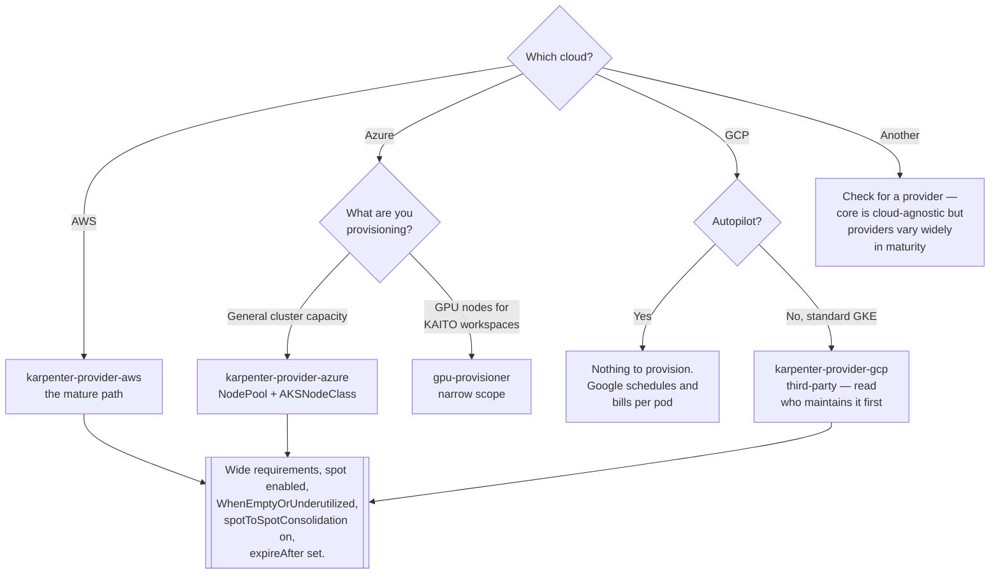

[← Node optimization](../README.md)

# Karpenter

Group-less node provisioning: look at the pending pods, buy the machine that actually fits.

Tools covered: [`karpenter-aws`](karpenter-aws/README.md) ·
[`karpenter-azure`](karpenter-azure/README.md) · [`karpenter-gcp`](karpenter-gcp/README.md) ·
[`gpu-provisioner`](gpu-provisioner/README.md)

## Contents

1. [What it replaces](#1-what-it-replaces)
2. [Core plus provider](#2-core-plus-provider)
3. [The object model](#3-the-object-model)
4. [Disruption — the part that surprises people](#4-disruption--the-part-that-surprises-people)
5. [The providers](#5-the-providers)
6. [Decision tree](#6-decision-tree)
7. [What it does not do](#7-what-it-does-not-do)
8. [Anti-patterns](#8-anti-patterns)
9. [Notes](#9-notes)
10. [How this applies to pikakube](#10-how-this-applies-to-pikakube)

---

## 1. What it replaces

The cluster-autoscaler scales **node groups** — a fixed instance type, capacity type and zone,
decided before the workloads existed. Karpenter deletes that layer: it watches unschedulable pods,
computes what machine would satisfy them, and asks the cloud provider for it directly.

| | cluster-autoscaler | Karpenter |
|---|---|---|
| Unit | a node group with fixed shape | an individual node, shaped per demand |
| Instance selection | whatever the group was created as | chosen from a permitted set, per batch of pending pods |
| Adding a new machine shape | create and manage another group | widen the `requirements` in one object |
| Consolidation | remove empty nodes | pack, replace with cheaper, including **spot to spot** |
| Provisioning latency | scale a group, wait for the ASG/VMSS | request the instance directly — usually faster |
| Configuration | cloud-side, per provider | Kubernetes objects, in Git |

That last row is the underrated one. Capacity policy becomes a reviewable, revertible Kubernetes
manifest instead of console state or a Terraform module in another repository.

## 2. Core plus provider

Karpenter is deliberately split:

- **<https://github.com/kubernetes-sigs/karpenter>** — the core controller: scheduling simulation,
  disruption logic, the `NodePool` and `NodeClaim` APIs. No cloud code.
- **a provider** — implements "create this machine" for one cloud, and adds a cloud-specific
  NodeClass type.

You always install a provider; the core is a library. The consequence worth knowing is that
behaviour that feels like a bug is often owned by one side or the other, and issues have to be
raised in the right repository. It is also why AWS and Azure differ in maturity while the scheduling
logic is identical.

## 3. The object model

Three objects, and understanding the split is most of learning Karpenter:

| Object | Owns | Analogy |
|---|---|---|
| **NodePool** | *what is permitted* — instance families, architectures, zones, capacity type, limits, disruption policy, expiry | the policy |
| **NodeClass** (`EC2NodeClass`, `AKSNodeClass`) | *how the machine is built* — image family, disk, networking, cloud identity | the machine template |
| **NodeClaim** | one concrete node Karpenter decided to create | the instance, as a Kubernetes object |

NodeClaims are normally created by the controller, not by you. Writing one by hand is how you
provision a specific machine deliberately — which is exactly what the
[gpu-provisioner](gpu-provisioner/README.md) example does.

The key design point in the NodePool is that `requirements` are **constraints, not choices**. You
say what is acceptable — architectures, families, zones, size bounds, capacity type — and Karpenter
picks the cheapest acceptable machine for the pods that are pending. **Narrow requirements are the
most common self-inflicted problem**: pinning one instance type gives up both the price optimisation
and the spot diversification that make the tool worth running.

## 4. Disruption — the part that surprises people

Karpenter removes and replaces nodes during normal operation, for four separate reasons:

| Reason | Trigger | Control |
|---|---|---|
| **Consolidation** | the pods would fit on fewer or cheaper nodes | `consolidationPolicy`, `consolidateAfter` |
| **Drift** | the node no longer matches its NodePool or NodeClass — for example after a template change | edit the objects deliberately; the fleet rolls |
| **Expiry** | the node reached `expireAfter` | set it; bounded lifetime keeps images current |
| **Interruption** | the cloud is reclaiming a spot instance | the provider's interruption handling |

`consolidationPolicy: WhenEmptyOrUnderutilized` is the setting that saves money and the setting that
moves pods. `WhenEmpty` is the timid alternative: it only deletes nodes with no workload pods, which
gives up most of the benefit.

The escape hatches, in order of granularity:

- **`karpenter.sh/do-not-disrupt: "true"` on a pod** — its node will not be drained or consolidated.
  Note the nuance: the node's *unused* capacity is still counted when deciding whether other nodes
  can be consolidated onto it.
- **PodDisruptionBudgets** — the general mechanism; Karpenter respects them.
- **A separate on-demand NodePool with a taint** — the right answer for a whole class of workloads
  rather than a handful of pods.

Without PDBs and handled SIGTERM, consolidation looks like random pod restarts. With them, it looks
like nothing at all.

## 5. The providers

| Provider | Maintainer | State | Detail |
|---|---|---|---|
| **AWS** | AWS, `aws/karpenter-provider-aws` | the original and the most mature; the default node autoscaler on EKS | [→](karpenter-aws/README.md) |
| **Azure** | Microsoft, `Azure/karpenter-provider-azure` | production-capable and moving fast; also the engine behind AKS Node Auto Provisioning | [→](karpenter-azure/README.md) |
| **GCP** | **CloudPilot AI**, `cloudpilot-ai/karpenter-provider-gcp` — **not Google** | third-party, young, Apache 2.0, derived from the AWS provider | [→](karpenter-gcp/README.md) |
| **gpu-provisioner** | Microsoft (KAITO) | **not general-purpose** — a Karpenter-derived controller for provisioning GPU nodes for AI workloads on AKS | [→](gpu-provisioner/README.md) |

**The maintainer column is the one to read.** AWS and Azure ship a provider for their own platform
and stand behind it; Google does not, and a third party fills that gap. "Karpenter works on all
three clouds" is true and slightly misleading — on two of them the cloud provider is accountable
for it, and on the third a startup is.

The last row is a different thing wearing the same API, and worth flagging: it uses the Karpenter
object model but exists to serve [KAITO](https://github.com/kaito-project/kaito) GPU workspaces, not
to run a cluster's general capacity. Do not reach for it as "Karpenter for GPUs on Azure" — the
Azure provider handles GPU SKUs in a normal NodePool.

## 6. Decision tree

## 7. What it does not do

Naming the boundaries prevents the usual disappointments:

- **it does not right-size pods.** Karpenter buys machines to fit the requests it is given. Bad
  requests produce a well-optimised bill for the wrong amount of capacity — see
  [`rightsizing/`](../../rightsizing/README.md).
- **it does not allocate cost.** Attribution is [`visibility/`](../../../visibility/README.md).
- **it does not schedule pods.** The kube-scheduler still decides placement; Karpenter only decides
  what capacity exists.
- **it does not fix workloads that cannot tolerate disruption.** It exposes them.
- **it does not manage the system node pool.** Karpenter itself has to run somewhere that Karpenter
  is not managing — a small provider-managed pool, or the control plane side on a managed cluster.

## 8. Anti-patterns

| Anti-pattern | Why it is bad | What to do instead |
|---|---|---|
| A NodePool pinned to one instance type | loses price selection and spot diversification at once | broad `requirements`, bounded by size and family |
| `consolidationPolicy: WhenEmpty` only | leaves permanent idle capacity between nodes | `WhenEmptyOrUnderutilized` |
| `spotToSpotConsolidation` left off | the spot fleet never moves to cheaper capacity | enable the feature gate |
| No PodDisruptionBudgets | consolidation and drift look like random restarts | PDBs before enabling disruption |
| Karpenter running on nodes Karpenter manages | it can evict itself and stall | a small system pool it does not own |
| No `limits` on the NodePool | one runaway Deployment provisions an unbounded fleet | CPU and memory limits per NodePool |
| One NodePool for everything | no way to keep sensitive workloads off spot | separate pools with taints and scheduling rules |
| `expireAfter` never set | nodes accumulate stale images and kernels indefinitely | set it, and accept that nodes roll |
| Editing NodePool or NodeClass casually | any change is drift, and drift rolls the fleet | treat template changes as a rollout |
| Running it alongside cluster-autoscaler on the same nodes | two controllers, conflicting decisions | one owner per pool |

## 9. Notes

Original notes recorded for this folder, translated and explained.

**<https://github.com/kubernetes-sigs/karpenter>** — the upstream core project, cloud-agnostic. This
is where the scheduling and disruption behaviour lives, and where a bug that is not about a specific
cloud belongs. The provider repositories are separate; see section 2.

**<https://github.com/kubernetes-sigs/karpenter/issues/1177>** — *"Ability to Scale Karpenter
Provisioned Nodes To 0 On Demand Or By Schedule During Off Hours"* (opened April 2024, now closed).
The request is for Karpenter to take a cluster's nodes to zero on a schedule — the out-of-hours
saving described in [`optimization/`](../../README.md). The reason this matters as a note: Karpenter
scales capacity in response to **pending pods**, so it has no schedule concept of its own. Nodes go
away when the pods do. The working pattern is therefore to scale the *workloads* down on a schedule —
KEDA's cron scaler in `devops/event-driven/` — and let Karpenter's consolidation remove the now-empty
nodes. A NodePool's `limits` can also be set to zero to force it, but the pod-driven route is the one
that composes with everything else.

**<https://github.com/kubernetes-sigs/karpenter/issues/2582>** — *"Question: How do we know from the
metrics of which node terminated due to which reason?"* (October 2025, closed). Exactly the question
you ask the first time consolidation is enabled and someone reports a restart: was this node removed
by consolidation, by drift, by expiry, or reclaimed as spot? Karpenter exposes disruption metrics
labelled by reason, and this is the thread that pins down which series to graph. Worth acting on
before enabling disruption rather than after — the answer is a dashboard, and it is what turns "pods
keep restarting" into "expiry rolled four nodes at 03:00".

## 10. How this applies to pikakube

Karpenter is mapped for **all three major clouds**, which is the useful part — the same NodePool
model against three providers, with the provider-specific pain recorded separately in
[karpenter-aws](karpenter-aws/README.md) (IAM permissions),
[karpenter-azure](karpenter-azure/README.md) (node bootstrap and identity) and
[karpenter-gcp](karpenter-gcp/README.md) (a third-party provider rather than Google's).

Only AWS and Azure have manifests here; GCP is catalogued, not deployed.

Both HelmReleases enable `spotToSpotConsolidation`, deployed through Flux — AWS from the public ECR
OCI repository pinned at chart 0.36.0, Azure from `mcr.microsoft.com` at 1.4.0. The version gap is
worth noting on its own: those are two quite different generations of the API, and the AWS side is
pinned well behind the v1 APIs the Azure examples use.

The Azure `NodePool` example is the most complete configuration in the folder and reads like
something that was actually run: spot capacity, `WhenEmptyOrUnderutilized`, `expireAfter: 168h`, SKU
families constrained to D/E/L, a memory ceiling below 512 GiB, a single zone, and NodePool limits of
100 CPU / 1000 GiB. It also carries a `do-not-disrupt` note and an open question about whether Azure
applies the spot taint automatically — both of which are section 4 material.

**The gap** is the same one as the parent folder: disruption is enabled, and the prerequisites that
make disruption invisible — PDBs, grace periods, topology spread — are not recorded anywhere. Issue
2582 in the notes above is the cheapest first step: know which reason removed which node before the
first person asks.

---

[← Node optimization](../README.md)
