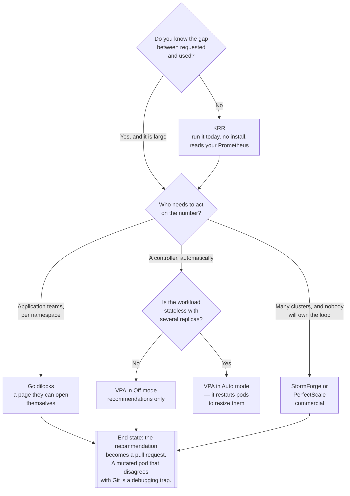

[← Optimization](../README.md)

# Right-sizing

Requests are what you pay for. Almost nobody sets them from evidence.

Tools covered: [`vpa`](vpa/README.md) · [`goldilocks`](goldilocks/README.md) · [`krr`](krr/README.md) ·
[`stormforge`](stormforge/README.md) · [`perfectscale`](perfectscale/README.md)

## Contents

1. [Why this is the biggest lever](#1-why-this-is-the-biggest-lever)
2. [CPU and memory are not symmetric](#2-cpu-and-memory-are-not-symmetric)
3. [What "right" means](#3-what-right-means)
4. [Recommend, or enforce](#4-recommend-or-enforce)
5. [Where it collides with HPA](#5-where-it-collides-with-hpa)
6. [The tools](#6-the-tools)
7. [Decision tree](#7-decision-tree)
8. [Making it stick](#8-making-it-stick)
9. [Anti-patterns](#9-anti-patterns)
10. [How this applies to pikakube](#10-how-this-applies-to-pikakube)

---

## 1. Why this is the biggest lever

The scheduler reserves **requests**. A pod requesting 2 CPU occupies 2 CPU of a node whether it uses
2 or 0.02. Nodes fill up on reservations, the autoscaler buys more, and the bill follows — for
capacity nobody touched.

Nothing in Kubernetes pushes back on this. There is no signal for over-requesting: no throttling, no
eviction, no alert, no failing probe. The workload is perfectly healthy. The only way it surfaces is
if somebody deliberately compares requests against usage.

And the incentives run one way. Requests get **raised** after an incident, and never lowered — the
downside of a too-high request is a number on a bill that nobody is measured on; the downside of a
too-low one is being paged. So a cluster's requests only ever drift upward, and the ratio between
requested and used capacity gets worse every quarter unless something forces it back.

That is what this folder is for: turn observed usage into a defensible number, and close the gap.

## 2. CPU and memory are not symmetric

The most common right-sizing mistake is treating them the same. They fail differently:

| | **CPU** | **Memory** |
|---|---|---|
| Kind of resource | compressible | **incompressible** |
| What happens over the limit | throttled — the process runs slower | **OOM-killed** — the container dies |
| What happens over the request | scheduled elsewhere or scheduler pressure; still works | eviction risk under node pressure |
| Safe request | around p90–p95 of observed usage | near the observed **peak**, with margin |
| Should there be a limit? | **usually not** — see below | **yes, always** |

**Memory needs headroom because there is no graceful degradation.** A container that needs 5% more
memory than its limit does not run 5% slower; it is killed. So memory requests should sit near
observed peak plus margin, and the memory limit close behind — an unlimited container with a leak
takes the whole node with it.

**CPU limits are the controversial one.** A CPU limit throttles the container at the end of every
scheduling period, which produces latency spikes even when the node is entirely idle. The common
position — not universal, but well argued — is to set CPU **requests** carefully and leave CPU
**limits** off, so a container may burst into unused node capacity instead of being throttled while
CPU sits idle beside it. The counter-argument is that unlimited CPU makes one noisy workload able to
degrade its neighbours. Decide per cluster, and decide deliberately, rather than copying
`requests == limits` from a template.

## 3. What "right" means

A recommendation is a percentile plus a margin, and the choices are the whole game:

| Question | Reasonable answer |
|---|---|
| Over what window? | long enough to include the real peak — a week minimum, longer for weekly or monthly cycles |
| Which statistic? | CPU: a high percentile of observed usage. Memory: peak. **Never the mean** |
| How much margin? | enough to absorb growth between reviews — and less than the 3× nobody admits to |
| What about startup? | JVM and similar runtimes peak at start; a recommendation from steady state alone OOM-kills on the next restart |
| What about seasonality? | a window that misses Black Friday produces a recommendation that fails at Black Friday |

The three failure modes to watch for are all about the window: too short and you miss the peak; too
recent and you learn from a period the workload was already broken in; too long and you never adapt.

**The startup case deserves special attention** because it is the one that makes right-sizing look
dangerous. A service can run all week at 300 MiB and need 900 MiB for eight seconds while it warms
up. A recommender that never saw a restart recommends 350 MiB, the request is applied, and the
service dies on its next rollout — at which point the whole exercise is blamed.

## 4. Recommend, or enforce

The fundamental split in this folder, and it is a trust decision more than a technical one:

| Mode | What happens | Risk | Tools |
|---|---|---|---|
| **Recommend** | a number appears in a dashboard or a report; a human changes the manifest | none | Goldilocks, KRR, VPA in `Off` mode |
| **Enforce** | the controller mutates the pod's resources | it can shrink a workload before its peak | VPA in `Auto`, commercial products |
| **Automate the pull request** | the recommendation becomes a diff in the repository | reviewed like any other change | not a tool — a pipeline |

**Recommend is where to start, and the third row is where to end up.** GitOps is the reason: if the
manifest in Git says 2 CPU and a controller sets 200m in the cluster, the two disagree permanently
and every subsequent debugging session starts with confusion about which number is real.

Enforcement also has a mechanical cost worth knowing: historically, changing a pod's resources meant
**recreating the pod**. VPA in `Auto` mode evicts and restarts containers to resize them, which is
fine for a stateless Deployment with several replicas and disruptive for anything else. In-place pod
resizing has been maturing in Kubernetes and removes that restart, but it is recent enough that the
restart behaviour is still what you should plan around.

## 5. Where it collides with HPA

The classic conflict: **do not run VPA and the HorizontalPodAutoscaler on the same resource.**

HPA adds replicas when average CPU per pod is high. VPA raises the CPU request when usage is high.
Both react to the same signal and each one's action changes the other's input — the result is a
control loop oscillating against itself.

The combinations that work:

| Setup | Verdict |
|---|---|
| HPA on CPU + VPA on CPU | **broken** — do not |
| HPA on CPU + VPA on **memory only** | fine, and common |
| HPA on a custom or external metric (queue depth, RPS) + VPA on CPU and memory | fine — the signals are independent |
| VPA in recommendation mode + HPA on anything | fine — nothing is being mutated |

Scaling on a queue or request-rate metric rather than CPU is the cleanest resolution, and
`devops/event-driven/` has KEDA for exactly that.

## 6. The tools

| Tool | Model | Where it shines | Detail |
|---|---|---|---|
| **VPA** | open source, in-cluster controller | the Kubernetes-native mechanism; also **the recommendation engine other tools consume** | [→](vpa/README.md) |
| **Goldilocks** | open source (Fairwinds) | **a UI over VPA recommendations** — the fastest way to show teams the gap, per namespace | [→](goldilocks/README.md) |
| **KRR** | open source (Robusta), CLI | **no controller at all** — reads history straight from Prometheus and prints a report | [→](krr/README.md) |
| **StormForge** | commercial SaaS + in-cluster agent | machine-learned recommendations covering **both requests and limits**, with a target reliability level | [→](stormforge/README.md) |
| **PerfectScale** | commercial SaaS | continuous right-sizing with reliability-vs-cost framing and multi-cluster reporting | [→](perfectscale/README.md) |

**Start with KRR.** It installs nothing, runs against the Prometheus you already have, and prints
the gap between requested and used per workload. That output is usually enough to decide whether any
of the rest is worth deploying — and often enough to produce the first wave of pull requests.

**Goldilocks is the second step**, because right-sizing is a social problem: a per-namespace page a
team can open themselves changes more behaviour than a spreadsheet from the platform team.

**VPA is the substrate.** Goldilocks is a UI over it, and its recommender is the algorithm most of
this ecosystem is measured against. Deploying it in `Off` mode to produce recommendations is a
reasonable end state on its own.

**The commercial products** sell two things over the open-source set: recommendations that account
for a stated reliability target rather than a raw percentile, and the ongoing loop across many
clusters. Both are real. Both are also a recurring fee against a problem whose expensive part is
convincing teams to merge the change, which no vendor solves.

## 7. Decision tree



## 8. Making it stick

Right-sizing regresses. The tooling is the easy half; these are what keep it:

- **A number per namespace, visible to the team that owns it.** Attribution from
  [`visibility/`](../../visibility/README.md) is what makes the conversation possible at all.
- **Requests reviewed when a service is deployed**, not only in an annual sweep. The cheapest moment
  to set a request correctly is the first one.
- **A default for new workloads** that is small and deliberate, rather than copied from whichever
  manifest was open.
- **`LimitRange` and `ResourceQuota`** on namespaces, so "no requests at all" and "requests larger
  than any node" are both impossible.
- **A recurring report of the biggest gaps.** Ten workloads account for most of the waste in most
  clusters; the list is short and it changes slowly.

## 9. Anti-patterns

| Anti-pattern | Why it is bad | What to do instead |
|---|---|---|
| Requests copied from another manifest | the number was never right for either workload | derive it from observed usage |
| `requests == limits` everywhere by default | reserves peak capacity permanently, and adds CPU throttling for free | request the realistic load; limit memory, think hard about CPU |
| No CPU limit **and** no memory limit | one leaking container takes the node down | always limit memory |
| Sizing from the mean | the mean is not what has to fit | high percentile for CPU, peak for memory |
| A window that misses the peak | a recommendation that fails at the busiest moment of the year | a window covering the real cycle |
| Ignoring startup spikes | the service dies on its next rollout, not today | include restarts in the window, or set a floor |
| VPA `Auto` plus HPA on CPU | two controllers fighting over the same signal | HPA on a custom metric, or VPA on memory only |
| VPA `Auto` on single-replica workloads | resizing restarts the pod | recommendation mode, and a human |
| A mutating controller against GitOps | the cluster and the repository disagree permanently | recommendations into pull requests |
| Recommendations nobody merges | the report is not the saving | a review cadence, and an owner per namespace |
| Right-sizing once | requests drift up after every incident | a recurring report |
| Right-sizing after moving to spot | tight capacity evicts the workloads that under-request | right-size **first** |
| Applying recommendations in bulk without review | one of them will be for a workload with a seasonal peak | biggest gaps first, reviewed |

## 10. How this applies to pikakube

Both open-source paths are deployed and both commercial options are evaluated, which is a good map
of the space:

| Tool | State here |
|---|---|
| [VPA](vpa/README.md) | Flux HelmRelease, Fairwinds chart 4.7.2, into `kube-system`; a `hamster` example with `updateMode: Auto` and min/max bounds |
| [Goldilocks](goldilocks/README.md) | Flux HelmRelease, chart 9.0.0, own namespace |
| [KRR](krr/README.md) | mapped, no deployment needed — it is a CLI |
| [StormForge](stormforge/README.md) | Flux HelmRelease from the vendor's OCI registry, agent 2.3.0, cluster named `k8s-platform` |
| [PerfectScale](perfectscale/README.md) | evaluated |

**The most interesting detail is a commented-out block in the VPA values:**

```yaml
#recommender:
#  extraArgs:
#    storage: prometheus
#    prometheus-address: http://kube-prometheus-stack-prometheus.monitoring.svc.cluster.local:9090
```

That switch matters more than it looks. By default the VPA recommender keeps its history in its own
in-memory store with checkpoints, so **a recommender restart loses the history** and recommendations
start from a cold, short window — which is precisely the "window too short, misses the peak" failure
in section 3. Pointing it at the platform's existing Prometheus gives it real history immediately and
survives restarts. It is commented out; it should not be.

**The VPA example is deliberately bounded** — `minAllowed` 100m/50Mi, `maxAllowed` 1 CPU/500Mi with
`updateMode: Auto`. Bounding an enforcing recommender is exactly right, and worth generalising: the
`resourcePolicy` floor is what protects against the startup-spike failure.

**The gaps:**

- **The loop is not closed.** Three recommendation sources are deployed and nothing turns a
  recommendation into a merged change. That is a pipeline and a review cadence, not another tool.
- **Nothing enforces a floor at the namespace level** — no `LimitRange` or `ResourceQuota` recorded,
  so a workload with no requests at all is still possible, and those are invisible to cost
  attribution as well.
- **Right-sizing has not been sequenced against the spot work.** [Karpenter](../node/karpenter/README.md)
  with consolidation and spot is deployed, and the [Spot Ocean](../node/spot-ocean/README.md) notes
  already record — from experience — that badly-sized workloads break when capacity gets tight. This
  folder is the mitigation for that, and it should lead rather than follow.

---

[← Optimization](../README.md)
