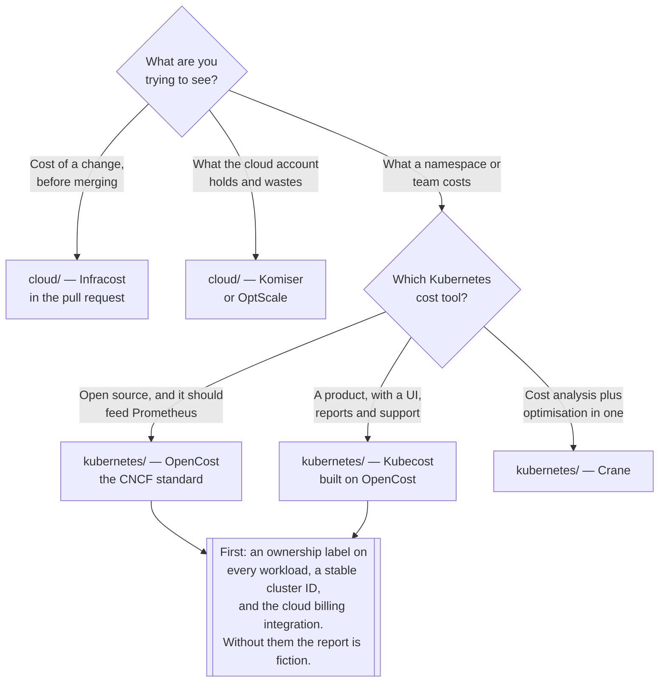

[← FinOps](../README.md)

# Visibility

You cannot optimise what you cannot attribute. This is the phase everything else depends on.

Capabilities: [`kubernetes/`](kubernetes/README.md) · [`cloud/`](cloud/README.md)

## Contents

1. [Three different questions](#1-three-different-questions)
2. [Why the cloud bill cannot answer the Kubernetes question](#2-why-the-cloud-bill-cannot-answer-the-kubernetes-question)
3. [Estimating before spending](#3-estimating-before-spending)
4. [What good attribution requires](#4-what-good-attribution-requires)
5. [The decisions in the model](#5-the-decisions-in-the-model)
6. [Decision tree](#6-decision-tree)
7. [Where this connects to observability](#7-where-this-connects-to-observability)
8. [Anti-patterns](#8-anti-patterns)
9. [How this applies to pikakube](#9-how-this-applies-to-pikakube)

---

## 1. Three different questions

"Cost visibility" covers three questions that need different tools, and conflating them is the usual
reason a FinOps effort produces a dashboard nobody uses:

| Question | When it is asked | Where |
|---|---|---|
| **What will this change cost?** | in the pull request, before it exists | [`cloud/`](cloud/README.md) — Infracost |
| **What does the cloud account cost, and where is the waste?** | monthly, by whoever owns the account | [`cloud/`](cloud/README.md) — Komiser, OptScale |
| **What does this namespace, team or workload cost?** | continuously, by whoever caused it | [`kubernetes/`](kubernetes/README.md) — OpenCost, Kubecost, Crane |

The first is preventive, the second is inventory, and the third is attribution. Only the third
changes behaviour week to week, because it is the only one that reaches the people who create the
cost.

## 2. Why the cloud bill cannot answer the Kubernetes question

A cloud bill's finest granularity is a **resource**: a virtual machine, a disk, a load balancer.
That is enough on a normal estate, where one VM belongs to one service — tag it and the report
writes itself.

Kubernetes destroys that assumption. One node runs forty pods from eight teams. The invoice says
*one virtual machine*. There is no line item for a pod, because the provider has no idea pods exist.

So answering "what does this team cost" means splitting the node's hourly price across the pods that
shared it, weighted by what each reserved and how long it lived, plus its storage, load balancers
and egress. That computation is what the tools in [`kubernetes/`](kubernetes/README.md) do, and it is
the only reason Kubernetes-specific cost tooling exists at all. The full version of this argument is
in [`finops/`](../README.md) section 3.

The practical consequence: **the two folders here are complements, not alternatives.** Cloud tools
see everything outside the cluster and treat the cluster as a few large VMs. Kubernetes tools see
inside the cluster and need a cloud integration to know what those VMs cost. A complete picture
needs both, and the join between them is the cloud billing export.

## 3. Estimating before spending

The cheapest cost conversation is the one that happens before the resource exists.

Cost is normally discovered after the fact: something is merged, deployed, and shows up on next
month's invoice — by which point it is running, depended upon, and awkward to remove. Estimating in
the pull request moves the conversation to the moment when changing the answer costs nothing.

That is what [Infracost](cloud/infracost/README.md) does for infrastructure as code: parse the
Terraform plan, price the resources, and comment the delta on the pull request. "This adds €340 a
month" next to the diff is a different conversation from the same number a month later.

Its limit is structural and worth stating up front: it prices what the plan declares. It does not
know that the cluster's node count is driven by pod requests, so on Kubernetes it prices the node
pools and nothing about what fills them.

## 4. What good attribution requires

Cost tools are usually blamed for problems that are actually metadata problems. Before adopting one:

| Requirement | Why it decides everything |
|---|---|
| **A namespace convention** | the default aggregation dimension; namespaces that map to nothing produce a report that maps to nothing |
| **An ownership label on every workload** | the join between a pod and a team. Without it, aggregation is by namespace only, forever |
| **A stable cluster identifier per cluster** | multi-cluster aggregation is impossible retroactively, and renaming orphans history |
| **A cloud billing integration** | without it, the tool prices nodes from public list prices — ignoring discounts, reservations and spot, which is where most of the money is |
| **Enough metrics retention** | cost is computed from the same time series as everything else; 15 days of retention means no month-on-month comparison |

The number to watch when the first report appears is **what fraction is unallocated**. A report that
is 30% `__unallocated__` will not survive its first review meeting, and no amount of tuning the cost
model fixes it — the fix is labels.

## 5. The decisions in the model

Every Kubernetes cost tool exposes the same handful of choices. They are policy decisions, not
settings, and it is worth making them once, explicitly:

| Decision | Options | The honest default |
|---|---|---|
| **Idle capacity** — the gap between node capacity and what pods requested | share it across tenants, charge it to the platform, or report it separately | **report it separately**, so it stays visible and owned by whoever provisions nodes |
| **Shared services** — ingress, monitoring, the control plane | split proportionally, split evenly, or a platform overhead line | proportional, and stated |
| **Requests or usage** as the basis | requests reflect what was reserved; usage reflects what was consumed | the **greater of the two** — the standard, and it is fair in both directions |
| **List price or actual invoice** | list is easy; invoiced reflects discounts, reservations and spot | invoiced, via the billing integration — otherwise the numbers are fiction on any discounted account |

The moment any of these numbers is billed rather than shown, every one of these decisions becomes an
argument. That is the main reason to start with showback — see [`finops/`](../README.md) section 2.

## 6. Decision tree

## 7. Where this connects to observability

Kubernetes cost tools are **built on the metrics pipeline**, not beside it. They read pod, node and
usage series from Prometheus and write cost series back into it. That is why the strongest
recommendation in this whole folder is a negative one: *do not let a cost tool install its own
Prometheus.* Kubecost and Crane both bundle one, and accepting it gives you a second monitoring stack
to operate, with its own retention, its own storage, and cost data that cannot be joined to anything
else.

| Connection | What it gives you |
|---|---|
| [`observability/metrics/`](../../observability/metrics/README.md) | the store every tool here queries and writes to |
| [`cloudcost-exporter`](../../observability/metrics/exporters/cloudcost-exporter/README.md) | cloud cost as Prometheus series — the *"why did spend change at 14:00"* question no monthly report answers |
| [`spot-price-exporter`](../../observability/metrics/exporters/spot-price-exporter/README.md) | spot prices by instance type and zone, so capacity choices are made from data |
| [`alerting/`](../../observability/alerting/README.md) | where a cost anomaly should arrive, in the same path as everything else |

Once cost is a Prometheus series, it is graphable next to the deploy that caused it and alertable
when it moves. That is worth more than any vendor dashboard.

## 8. Anti-patterns

| Anti-pattern | Why it is bad | What to do instead |
|---|---|---|
| Reading the cloud bill for Kubernetes cost | it stops at the virtual machine | a cost model that splits the node — section 2 |
| Deploying a cost tool before labels exist | a large unallocated bucket, and nobody believes the report | ownership labels first |
| Letting the cost tool bring its own Prometheus | a second monitoring stack, and cost data joined to nothing | point it at the existing one |
| List prices on a discounted account | the numbers are wrong by whatever your discount is | wire up the cloud billing integration |
| Idle silently spread across tenants | the waste becomes everyone's and nobody's | report it separately |
| A dashboard with no owner | reporting is not a control | a number per team, monthly, plus alerts |
| Chargeback before the model is agreed | months arguing about allocation before anything is saved | showback first |
| No cluster identifier, or one that changes | multi-cluster history cannot be reconstructed | set it once, per cluster, permanently |
| Cost visible only in the cost tool | nobody logs into it | into Grafana, next to everything else |
| Estimating cloud cost in the pull request and stopping there | it prices node pools, not the pods that drive their number | pair it with in-cluster allocation |

## 9. How this applies to pikakube

Both halves are mapped, and the Kubernetes half has real deployments with real recorded pain — the
[OpenCost](kubernetes/opencost/README.md) and [Kubecost](kubernetes/kubecost/README.md) notes are the
densest collection of operational findings in `finops/`.

**What is configured well.** Both cost tools point at the platform's existing Prometheus rather than
their own — Kubecost's release explicitly disables its bundled Prometheus, Grafana, node-exporter and
kube-state-metrics, which is exactly the anti-pattern in section 8 being avoided on purpose. Both set
an explicit cluster identifier (`AKS_DEV`, `ANDREYOLV_DEV`), which is what makes multi-cluster
aggregation possible later. Both reference a `cloud-integration-secret`, so pricing comes from the
billing export rather than list prices.

**On the cloud side**, all three tools were evaluated with their limits recorded rather than their
features:  [Infracost](cloud/infracost/README.md) (no Crossplane support, and a poor GitHub Actions
path), [Komiser](cloud/komiser/README.md) (effectively AWS-only, which matters on an Azure platform),
and [OptScale](cloud/optscale/README.md). That is the useful form of evaluation.

**The gaps:**

- **Two tools solving the same problem.** OpenCost and Kubecost are both deployed and Kubecost is
  built on OpenCost. Running both is defensible while choosing; as a steady state it is two things to
  operate for one answer.
- **Cost is not alerted on.** Allocation exists and nothing notices when it moves. The OpenCost notes
  record that cost alerting by label has been a long-standing gap in the tool itself, which makes
  [`alerting/`](../../observability/alerting/README.md) on the exported metrics the practical route.
- **Nothing is recorded about labels.** Section 4 says this decides whether any of it works, and it
  is the one prerequisite with no manifest.

---

[← FinOps](../README.md)
