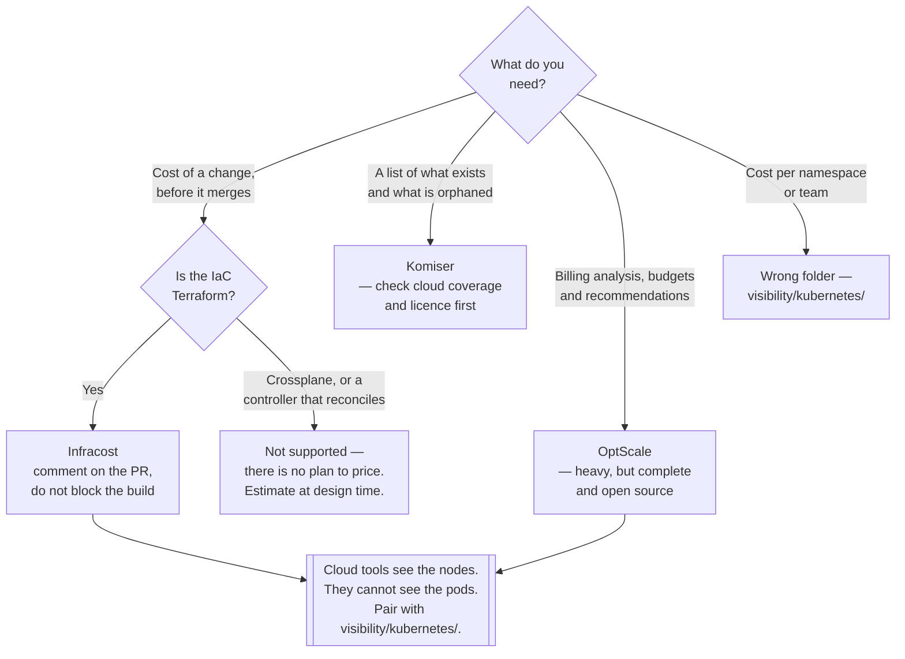

[← Visibility](../README.md)

# Cloud cost visibility

What the account holds, what it costs, and what a change will cost before it is merged.

Tools covered: [`infracost`](infracost/README.md) · [`komiser`](komiser/README.md) ·
[`optscale`](optscale/README.md)

## Contents

1. [Three jobs, not one](#1-three-jobs-not-one)
2. [Shift left: cost in the pull request](#2-shift-left-cost-in-the-pull-request)
3. [Inventory: what is actually running](#3-inventory-what-is-actually-running)
4. [Where these tools stop](#4-where-these-tools-stop)
5. [The tools](#5-the-tools)
6. [Decision tree](#6-decision-tree)
7. [Anti-patterns](#7-anti-patterns)
8. [How this applies to pikakube](#8-how-this-applies-to-pikakube)

---

## 1. Three jobs, not one

"Cloud cost tool" covers three different jobs. Choosing badly usually means having bought one and
expected another:

| Job | Question | Timing | Tool shape |
|---|---|---|---|
| **Estimation** | what will this change cost? | in the pull request | a CLI in CI, reading the plan |
| **Inventory** | what exists, who owns it, what is idle? | continuous | an agent reading cloud APIs |
| **Analysis and recommendation** | where is the waste, and what should we do? | monthly | a platform over the billing export |

Estimation is the one with the best return and the least adoption, because it is the only one that
acts *before* the money is committed.

Analysis is the one people buy first and read twice.

## 2. Shift left: cost in the pull request

Cloud cost is normally discovered after the fact: merged, deployed, and visible on an invoice weeks
later — by which point the resource is running and something depends on it.

Pricing the Terraform plan in CI moves the conversation to the moment when changing the answer is
free. A comment on the diff saying *"this adds €340/month"* gets a different response than the same
number a month later, from someone who did not write it.

What makes it work in practice:

- **it must comment on the pull request**, not print in a log. A number in CI output is a number
  nobody sees
- **the delta matters, not the total.** "+€340/month" is actionable; "this stack costs €12,000" is
  wallpaper
- **it must not block.** A cost gate that fails builds gets bypassed within a fortnight; a comment
  that informs the reviewer survives
- **it needs the plan**, so it works for Terraform and not for tools that reconcile continuously —
  see section 4

[Infracost](infracost/README.md) is effectively the only serious option in this space.

## 3. Inventory: what is actually running

The other half is knowing what exists. Cloud accounts accumulate: the volume detached six months
ago, the load balancer for a service that was deleted, the snapshot from a migration nobody
finished, the reserved IP nobody released.

None of it appears as a problem. Each one is a small line on a large invoice, and there is no owner
because the owner left.

An inventory tool reads the cloud APIs and lists resources with their cost and tags, which turns
"the bill went up" into a list. The value is entirely in the follow-through — a list of orphaned
resources nobody deletes is just a longer list next month.

## 4. Where these tools stop

Everything in this folder treats a Kubernetes cluster as a small number of large virtual machines.
That is all the cloud APIs expose.

| Question | Answered here? |
|---|---|
| What does this node pool cost? | yes |
| What does this namespace cost? | **no** — [`kubernetes/`](../kubernetes/README.md) |
| Which team caused the node count to grow? | **no** |
| What will adding a node pool cost? | yes, before it is merged |
| Which pods drove the autoscaler to add nodes? | **no** |

The gap is structural, not a missing feature: pods do not exist in a cloud bill. Infracost prices
what the plan declares, so on a Kubernetes platform it prices node pools and nothing about what
fills them — and what fills them is what actually determines the number. See
[`finops/`](../../README.md) section 3.

Use both folders. They answer different halves of the same question, and the join between them is
the cloud billing export.

## 5. The tools

| Tool | Job | Where it shines | Detail |
|---|---|---|---|
| **Infracost** | estimation | **cost of a Terraform change, commented on the pull request** — the only tool here that acts before the spend | [→](infracost/README.md) |
| **Komiser** | inventory | a resource inventory with cost and tags, self-hosted | [→](komiser/README.md) |
| **OptScale** | analysis and recommendation | a full open-source FinOps platform: billing analysis, recommendations, budgets, and a Kubernetes cost collector | [→](optscale/README.md) |

**Infracost** is the one worth adopting first, and it is close to unique in what it does. Its two
recorded limits — no Crossplane support, and an awkward GitHub Actions integration — are in its
notes and are worth reading before planning around it.

**Komiser** is inventory, and the recorded finding here is that it is effectively AWS-first. On an
Azure platform that is close to disqualifying. The project has also moved out of the Tailwarden
organisation back to its original author, and its licence is not a standard OSI one — check both
before adopting.

**OptScale** is the most complete and the heaviest. Hystax's platform covers multi-cloud cost
analysis, recommendations and budgets, plus a Kubernetes cost collector — genuinely broad, and a
substantial number of services to run. Self-hosting a FinOps platform is a platform commitment, so
weigh it against a managed alternative honestly.

## 6. Decision tree

## 7. Anti-patterns

| Anti-pattern | Why it is bad | What to do instead |
|---|---|---|
| Expecting cloud tools to answer Kubernetes questions | pods do not exist in a cloud bill | [`kubernetes/`](../kubernetes/README.md) |
| Cost estimation that fails the build | it gets bypassed, then removed | comment on the pull request |
| Estimation output only in CI logs | nobody reads CI logs | comment on the diff, with the delta |
| An inventory nobody acts on | the orphaned volume is still there next month | an owner and a deletion cadence |
| Self-hosting a heavy FinOps platform for one account | more operational surface than the saving | start with the billing console and one focused tool |
| A cost tool chosen without checking cloud coverage | an AWS-first tool on an Azure platform reports very little | verify the provider first |
| Assuming a GitHub project is open source | licences change, and some are source-available only | read the LICENSE file |
| Tagging policy left to convention | untagged resources aggregate to nothing | enforce tags at creation |
| Cloud cost visible only in a vendor UI | it is disconnected from every other signal | export it to Prometheus — [`cloudcost-exporter`](../../../observability/metrics/exporters/cloudcost-exporter/README.md) |

## 8. How this applies to pikakube

All three tools were evaluated, and — as elsewhere in this repository — the valuable part is the
recorded limits rather than the feature lists.

| Tool | Recorded finding |
|---|---|
| [Infracost](infracost/README.md) | **no Crossplane support**; the GitHub App path is preferred but needs GitHub organisation ownership; the Actions integration is judged abandoned and badly abstracted |
| [Komiser](komiser/README.md) | **limited to AWS**, which on an Azure platform is close to fatal |
| [OptScale](optscale/README.md) | mapped with the vendor's Kubernetes guide; only the `kube-cost-metrics-collector` chart is deployed |

Only OptScale has manifests, and only its **collector** — the piece that ships Kubernetes cost
metrics to an OptScale instance. The platform itself is not deployed here, which means the collector
currently has nowhere to send data. That is a decision waiting to be made rather than a bug.

The Infracost findings are the most consequential, because they are about adoption rather than
capability: the recommended integration route requires organisation-level GitHub ownership that the
person adopting it did not have, and the fallback route is judged unusable. That is why cost
estimation is not running anywhere — not because the tool is wrong.

The Kubernetes half of this question is much further along; see
[`kubernetes/`](../kubernetes/README.md).

---

[← Visibility](../README.md)
