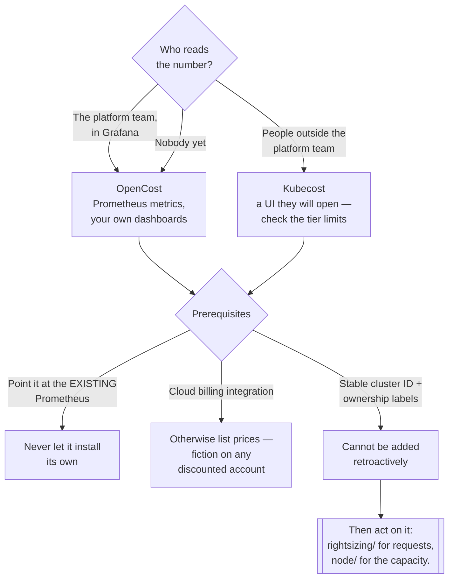

[← Visibility](../README.md)

# Kubernetes cost visibility

Splitting a node's bill across the pods that shared it. This is the question no cloud tool can answer.

Tools covered: [`opencost`](opencost/README.md) · [`kubecost`](kubecost/README.md) ·
[`crane`](crane/README.md)

## Contents

1. [Why this folder exists](#1-why-this-folder-exists)
2. [How the model works](#2-how-the-model-works)
3. [OpenCost and Kubecost](#3-opencost-and-kubecost)
4. [The tools](#4-the-tools)
5. [Decision tree](#5-decision-tree)
6. [Getting the numbers right](#6-getting-the-numbers-right)
7. [Turning a number into behaviour](#7-turning-a-number-into-behaviour)
8. [Anti-patterns](#8-anti-patterns)
9. [How this applies to pikakube](#9-how-this-applies-to-pikakube)

---

## 1. Why this folder exists

A cloud invoice's smallest unit is a resource: one virtual machine, €0.42/hour. One node runs forty
pods from eight teams. Nothing in the bill knows a pod exists.

So "what does this team cost" is not a reporting question, it is a **computation**: take the node's
hourly price, split it across the pods that shared it in proportion to what each reserved, for the
fraction of time each existed, and add their storage, load balancers and network. Repeat for every
node, every hour.

That computation is the entire content of this folder. It is why Kubernetes-specific cost tooling
exists, and it is not something a cloud cost tool can be configured into doing — the input data
lives in the Kubernetes API, not in the billing export. The full argument is in
[`finops/`](../../README.md) section 3.

## 2. How the model works

Every tool here does approximately the same thing, and understanding it makes the disagreements
between them legible:

| Step | Input | Source |
|---|---|---|
| Price each node per hour | instance type, region, **capacity type** (spot changes it by ~90%) | cloud pricing API, or the billing export |
| Measure what each pod held | CPU and memory **requests**, and usage | Prometheus, from kube-state-metrics and cAdvisor |
| Weight by time | pod start and end timestamps | the same series |
| Attribute | namespace, controller, labels | pod metadata |
| Add attached resources | PersistentVolumes, load balancers, egress | cloud APIs plus Kubernetes objects |
| Decide the leftovers | idle capacity, shared services, unlabelled pods | **policy, not measurement** |

Two properties fall out of this that cause most of the confusion:

- **cost is computed from `max(request, usage)`.** A pod that reserves 2 CPU and uses 0.1 is charged
  for 2 — it occupied the node. A pod that reserves 0.1 and bursts to 2 is charged for 2 — it
  consumed the node. That is why over-requesting shows up as cost, which is exactly what makes
  [`rightsizing/`](../../optimization/rightsizing/README.md) the follow-on action.
- **it is an allocation, not a measurement.** Two defensible models give two different numbers for
  the same pod. Both are correct under their own rules. This is what chargeback arguments are
  actually about.

## 3. OpenCost and Kubecost

The relationship confuses people and it is simple:

| | **OpenCost** | **Kubecost** |
|---|---|---|
| What it is | CNCF project — the **specification and reference implementation** of the model | a commercial product **built on** OpenCost |
| Licence | Apache-2.0 | free tier with limits; paid tiers for the rest |
| Interface | API, Prometheus metrics, a minimal UI | full UI, reports, alerting, budgets, multi-cluster views |
| Retention | whatever your Prometheus keeps | its own store, longer, in the paid tiers |
| Multi-cluster | you aggregate it yourself | a product feature |
| Good at | being the cost engine underneath your own reporting | being the thing a finance-adjacent person opens |

Kubecost's free tier is genuinely usable for a single cluster with limited retention; the features
people end up wanting — multi-cluster aggregation, long retention, saved reports, alerting — are the
paid ones. Check current terms rather than trusting any summary, including this one.

**The decision, honestly stated:** if the cost data is going into Grafana next to everything else,
OpenCost is the right answer and Kubecost's UI is redundant. If someone outside the platform team
needs to open a page and get a report, Kubecost is what they will actually use. Running both is
defensible while choosing and wasteful as a steady state.

## 4. The tools

| Tool | Model | Where it shines | Detail |
|---|---|---|---|
| **OpenCost** | CNCF, Apache-2.0 | **the standard**: allocation as an API and as Prometheus metrics, feeding your own dashboards | [→](opencost/README.md) |
| **Kubecost** | commercial, free tier | **the product**: UI, reports, budgets, multi-cluster, network cost breakdown | [→](kubecost/README.md) |
| **Crane** | CNCF sandbox, Apache-2.0 | cost analysis **plus** an optimisation side — recommendations, predictive HPA, colocation | [→](crane/README.md) |

**OpenCost** is the default. It is the model everything else is measured against, it exports
Prometheus metrics so cost joins the rest of the platform's telemetry, and it has no licence
question.

**Kubecost** is what to add when the audience is not the platform team. Its network cost breakdown —
traffic between zones, between clusters, and out to the internet — is a genuine differentiator, since
egress is invisible in every other tool here.

**Crane** is a broader ambition: cost analysis, resource and HPA recommendations, prediction-driven
autoscaling and QoS-based colocation in one project. That breadth overlaps
[`optimization/rightsizing/`](../../optimization/rightsizing/README.md) rather than complementing it.
Check its activity before adopting — see its notes.

## 5. Decision tree

## 6. Getting the numbers right

Four things decide whether the first report survives its first review:

**1. Point it at the existing Prometheus.** Both Kubecost and Crane bundle one. Accepting it gives
you a second monitoring stack with its own retention and storage, and cost data that cannot be joined
to any other series. Disable it and set the fully-qualified name of the real one.

**2. Wire up the cloud billing integration.** Without it, nodes are priced from public list prices —
so reservations, committed-use discounts, enterprise agreements and spot are all ignored. On a
discounted account the resulting numbers are not approximate, they are wrong, and the first person to
compare them with the invoice will say so.

**3. Set a stable cluster identifier.** It is how multi-cluster aggregation works, and it cannot be
reconstructed later. Renaming it orphans the history.

**4. Enforce ownership labels before the first report.** Aggregation by namespace is free;
aggregation by team, product or cost centre requires a label on every workload. What determines
whether the report is believed is the size of the unallocated bucket, and no tuning of the cost model
reduces it — only labels do.

## 7. Turning a number into behaviour

Allocation is not the goal; it is the input. What makes it worth the effort:

| Practice | Why |
|---|---|
| **A monthly number per team**, sent to them | the mechanism by which teams fix their own requests |
| **An alert when cost moves**, not a monthly discovery | anomalies are cheapest to fix on the day they start |
| **The number next to the deploy that caused it** | Prometheus series, in Grafana, on the same timeline |
| **A follow-on action** | attribution points at [`rightsizing/`](../../optimization/rightsizing/README.md) and [`node/`](../../optimization/node/README.md) |
| An owner for idle and shared cost | otherwise it dissolves into everyone's bill and nobody acts |

Cost alerting is where these tools are weakest — it is a paid feature in Kubecost and has been a
long-standing gap in OpenCost. The route that works on any of them is to alert on the **exported
Prometheus metrics** through the platform's existing
[`alerting/`](../../../observability/alerting/README.md), rather than waiting for the tool to grow
the feature.

## 8. Anti-patterns

| Anti-pattern | Why it is bad | What to do instead |
|---|---|---|
| Letting the cost tool install its own Prometheus | a second monitoring stack, joined to nothing | point it at the existing one |
| No cloud billing integration | list prices, so every number is wrong by your discount | wire it up before publishing anything |
| No cluster identifier, or one that changes | multi-cluster history cannot be rebuilt | set it once, permanently |
| Deploying before ownership labels exist | a large unallocated bucket, and no credibility | labels first |
| Idle silently shared across tenants | the waste becomes nobody's problem | report it separately |
| Running OpenCost and Kubecost permanently | two systems, one answer | choose, once the audience is known |
| Attribution with no follow-on action | a dashboard, not a control | wire it to right-sizing and to alerting |
| Chargeback on a model nobody agreed | every team disputes the allocation rules | showback first |
| Believing pod cost is a measurement | it is arithmetic over a shared bill | state the model with the number |
| Short metrics retention | no month-on-month comparison, which is the only view finance wants | retention that covers a billing cycle |

## 9. How this applies to pikakube

This is the most operationally developed corner of `finops/`, and the tool notes carry more recorded
failures than anywhere else in the folder — which is what makes them worth reading.

| Tool | State |
|---|---|
| [OpenCost](opencost/README.md) | Flux HelmRelease, chart 1.28.0, cluster ID `AKS_DEV`, cloud integration secret, `cloudCost` enabled, pointed at the existing Prometheus. Five upstream issues recorded |
| [Kubecost](kubecost/README.md) | Flux HelmRelease, `cost-analyzer` 1.104.1, cluster `ANDREYOLV_DEV`, bundled Prometheus/Grafana/exporters explicitly disabled, network costs enabled for Azure |
| [Crane](crane/README.md) | Flux HelmRelease, chart 0.11.0, default values |

**What is right.** Both cost tools point at the platform's existing Prometheus, both set an explicit
cluster identifier, and both reference a `cloud-integration-secret` so pricing comes from the billing
export rather than list prices. That is sections 6.1 to 6.3 done correctly, and it is more than most
installations manage.

Kubecost's release goes further and disables the chart's bundled Prometheus, Grafana, node-exporter,
kube-state-metrics **and** their service accounts individually — that is someone who has been bitten
by the bundled stack before.

**The open questions:**

- **Two tools, one answer.** OpenCost and Kubecost are both deployed, and Kubecost is built on
  OpenCost. Section 3 is the decision that has not been made.
- **The OpenCost image is a custom tag** (`kubecost1/opencost:cloudcost`) rather than an upstream
  release — a workaround for cloud cost support that is worth revisiting against current versions.
- **Nothing alerts.** Section 7 is unimplemented, and the OpenCost notes record that this gap is
  partly upstream's. The metrics are already in Prometheus, so
  [`alerting/`](../../../observability/alerting/README.md) is the route.
- **Nothing is recorded about labels**, which section 6.4 says decides whether the report is
  believed at all.

---

[← Visibility](../README.md)
