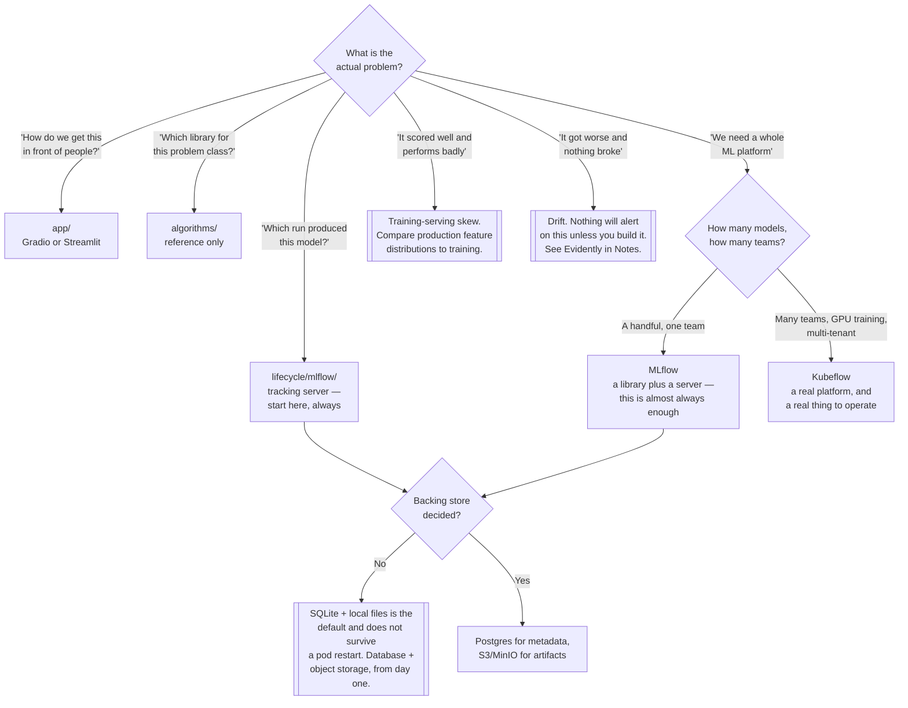

[← infrastructure/](../)

# MLOps

The lifecycle of a model — experiment, track, register, deploy, monitor, retrain — and the
operational discipline that keeps it honest.

Capabilities: [`lifecycle/`](lifecycle/README.md) · [`app/`](app/README.md) ·
[`algorithms/`](algorithms/README.md)

## Contents

1. [The problem](#1-the-problem)
2. [The boundary with ai/](#2-the-boundary-with-ai)
3. [Why ML is operationally different from software](#3-why-ml-is-operationally-different-from-software)
   1. [The artefact is data + code + weights](#31-the-artefact-is-data--code--weights)
   2. [Reproducibility needs four things pinned](#32-reproducibility-needs-four-things-pinned-and-teams-pin-one)
   3. [Training-serving skew](#33-training-serving-skew)
   4. [Model drift vs data drift](#34-model-drift-vs-data-drift)
   5. [Monitoring a model is not monitoring a service](#35-monitoring-a-model-is-not-monitoring-a-service)
   6. [Experiment tracking](#36-experiment-tracking-or-which-run-produced-this)
   7. [The registry is the handoff point](#37-the-registry-is-the-handoff-point)
4. [The capabilities](#4-the-capabilities)
5. [Decision tree](#5-decision-tree)
6. [Anti-patterns](#6-anti-patterns)
7. [Notes](#7-notes)
8. [How this applies to pikakube](#8-how-this-applies-to-pikakube)

---

## 1. The problem

MLOps is to models what `../devops/` is to software: the set of practices that take something
that works on one machine and make it something an organisation can run, change and trust.

The difference is what is being shipped. A software deployment is code, and code is text in git.
A model deployment is **data plus code plus weights**, and only one of those three is in git.
That single fact generates almost every problem in this discipline:

| Question a team is asked | Why it is hard for a model |
|---|---|
| Which version is in production? | the container tag says nothing about which training run produced the weights |
| Can you reproduce this result? | the code is pinned; the data, the seed and the environment usually are not |
| Why is it worse than last month? | nothing broke — the world moved |
| Is it working right now? | the service is healthy and the predictions are wrong |
| Who approved this model? | there was no artefact to approve, only a notebook |

None of these are answered by a CI pipeline, a Deployment and a dashboard. They need
experiment tracking, a registry, and monitoring that looks at predictions rather than at
latency.

## 2. The boundary with ai/

These two folders are adjacent and get confused constantly, so the split is stated explicitly:

| | **`mlops/`** (this folder) | **`../ai/`** |
|---|---|---|
| Concern | the **lifecycle** of a model | the **application and serving** layer |
| Contents | tracking, registry, pipelines, model apps | LLM serving, agents, AI gateways, MCP |
| Question | how did this model come to exist, and is it still good? | how does a request reach a model and get an answer? |
| Typical artefact | an experiment run, a registered model version | a gateway route, an agent graph, an inference server |

The rule of thumb: if it happens **before** a model is considered ready, it is MLOps. If it
happens **on the request path**, it is `../ai/`.

**The one genuine overlap is `ai/llm/`.** Serving a model — vLLM, Ollama, KAITO — is classically
an MLOps concern; it is the deploy step of the lifecycle. It lives in `../ai/` here because in
practice those tools are operated as part of the LLM application platform, not as the tail of a
training pipeline. That is a filing decision, not a claim that model serving stopped being MLOps.

## 3. Why ML is operationally different from software

This section is the whole discipline. Everything below is a failure mode that has no equivalent
in normal service operations.

### 3.1 The artefact is data + code + weights

Versioning the code reproduces the *program*, not the *result*. Two runs of identical code on
different data snapshots produce different models, and nothing in git records which snapshot was
used. This is why data versioning tools exist at all (DVC, Pachyderm — see
[Notes](#7-notes)), and why "it is in the repo" is not an answer to "can you rebuild this".

### 3.2 Reproducibility needs four things pinned, and teams pin one

To rebuild a model bit-for-bit you need:

| Pinned | Usually pinned? | What goes wrong if not |
|---|---|---|
| Code | yes | — |
| **Data** | rarely | the table has been appended to since; the result cannot be recreated |
| **Random seed** | sometimes | initialisation and shuffling differ; metrics move for no reason |
| **Environment** | sometimes | a minor library bump silently changes numerics or defaults |
| **Hyperparameters** | often, in a notebook cell nobody kept | the run that produced the good number is gone |

Most teams pin code and consider the job done. The result is a model that scored 0.91 once and
never again.

### 3.3 Training-serving skew

**This is the single most common cause of a model that scored well in evaluation and performs
badly in production.**

At training time features are computed by one piece of code — a notebook, a Spark job, a SQL
query. At inference time they are computed by a different piece of code — the application, in a
different language, under a latency budget. The two drift apart: a different null handling, a
different timezone, a different rounding, a category encoded in a different order.

The model is fine. The inputs it receives in production are not the inputs it was trained on.
Nothing errors, and the metric that would reveal it is not being collected.

The structural fix is to compute features once and read them from the same place in both paths —
a feature store, or at minimum a shared library rather than two reimplementations. The cheap
first step is to log production feature distributions and compare them to the training set.

### 3.4 Model drift vs data drift

Two different things, often collapsed into one word:

| | **Data drift** | **Model drift (concept drift)** |
|---|---|---|
| What changed | the distribution of the **inputs** | the **relationship** between inputs and the target |
| Example | a new customer segment starts arriving | fraud tactics change, so the same signals no longer mean fraud |
| Detectable from | inputs alone, immediately | only from outcomes, once labels arrive |
| Speed | can be sudden | usually gradual |

Both degrade a model without anything breaking. There is no exception, no failed pod, no 500.
**Nothing alerts on this unless you build the alert**, and the label needed to prove it often
arrives weeks after the prediction.

### 3.5 Monitoring a model is not monitoring a service

`../observability/` will tell you the inference service is up, that p99 latency is 40 ms and
that the error rate is zero. All three can be true while every prediction is wrong.

Service monitoring and model monitoring are different signals collected for different reasons:

| Service monitoring | Model monitoring |
|---|---|
| latency, error rate, saturation | prediction distribution, input distribution |
| "is it responding?" | "is it right?" |
| alerts in seconds | alerts in days or weeks |
| owned by the platform | owned by whoever owns the model |

You need both. The mistake is deploying a model with only the first and calling it observable —
see [`../observability/`](../observability/README.md) for the service half, and
[Evidently](#7-notes) for the model half.

### 3.6 Experiment tracking, or "which run produced this?"

Without a tracking server, the record of an experiment is a notebook, a filename with a date in
it, and somebody's memory. The question *"which run produced the model we deployed, and what were
its hyperparameters?"* becomes unanswerable — **and it becomes unanswerable within days**, not
months. Nobody notices at the time, because the person who ran it still remembers.

This is the cheapest capability in the discipline and the one most often skipped, because at the
moment it would cost nothing to add, nothing appears to be wrong.

### 3.7 The registry is the handoff point

A model registry is where experimentation stops and deployment starts. It is the artefact that
can be named, versioned, staged, approved and rolled back — the thing a deployment pipeline
refers to instead of referring to a file somebody produced.

Without it the handoff is a person sending a file, and the deployed model has no lineage back to
the run that created it. With it, "promote version 7 to production" is a reviewable action.

## 4. The capabilities

| Capability | The question it answers | Note |
|---|---|---|
| [`lifecycle/`](lifecycle/README.md) | how are experiments tracked, models registered and pipelines run? | MLflow vs Kubeflow — the real decision in this folder |
| [`app/`](app/README.md) | how does a person actually use this model? | Gradio and Streamlit — demos and data apps |
| [`algorithms/`](algorithms/README.md) | what problem class is this, and what is the standard tooling? | reference and orientation, **not deployable infrastructure** |

## 5. Decision tree

## 6. Anti-patterns

| Anti-pattern | Why it is bad | What to do instead |
|---|---|---|
| No experiment tracking | "which run produced this?" is unanswerable within days | an MLflow tracking server, from the first experiment |
| Versioning code but not data | the result cannot be reproduced, only the program | pin the data snapshot alongside the run |
| Features computed twice, in two languages | training-serving skew — the top cause of production underperformance | compute once, read from one place |
| Deploying a model with only service monitoring | latency is green while every prediction is wrong | monitor prediction and input distributions too |
| Assuming a deployed model stays good | drift degrades it silently, with nothing to page on | build the drift check; nothing else will |
| Handing over a model as a file | no lineage, no version, no rollback | a model registry as the handoff artefact |
| MLflow on SQLite and local artifacts on Kubernetes | the default configuration, and it loses everything on a pod restart | Postgres backend, object-storage artifacts |
| Adopting Kubeflow for three models | you now operate a platform instead of shipping models | MLflow until the platform is genuinely the bottleneck |
| A Gradio or Streamlit app exposed with no auth | it is a public endpoint to an internal model and dataset | an auth proxy in front of it |
| Retraining on a schedule nobody validates | a bad retrain replaces a working model automatically | gate promotion on evaluation, not on the calendar |
| Treating `algorithms/` as platform capability | it is a bookmark list, and mistaking it for infrastructure hides that nothing is deployed | read it as orientation |

## 7. Notes

The original notes for this folder were a list of GitHub links with no commentary — the solution
space as it was being surveyed. None of these are deployed here. They are recorded with what each
one is and where it would fit, so the list stays useful.

**Pipelines and workflow frameworks**

| Link | What it is | Where it fits |
|---|---|---|
| <https://github.com/zenml-io/zenml> | an MLOps pipeline framework that abstracts over the backends (orchestrator, tracker, registry) | an alternative to wiring MLflow, an orchestrator and a registry together by hand |
| <https://github.com/Netflix/metaflow> | Netflix's pipeline framework, built around making data-science code runnable at scale without rewriting it | same slot as ZenML, with a stronger "keep it Python" bias |
| <https://github.com/kedro-org/kedro> | structure and conventions for data-science code — a project layout, a data catalog, pipeline nodes | earlier than the others: it is about making the code maintainable, not about running it |
| <https://github.com/pachyderm/pachyderm> | data-versioned pipelines: steps re-run when their input data changes | the "version the data, not just the code" problem from section 3, as a product |

**Data versioning and caching**

| Link | What it is | Where it fits |
|---|---|---|
| <https://github.com/iterative/dvc> | git-like versioning for datasets and model files, with the large objects in object storage | the cheapest fix for the reproducibility gap — data pinned next to the commit |
| <https://github.com/Alluxio/alluxio> | a distributed caching layer between compute and object storage | training jobs that re-read the same data from S3 repeatedly; relevant when data loading, not GPU, is the bottleneck |

**Distributed training and compute**

| Link | What it is | Where it fits |
|---|---|---|
| <https://github.com/kubeflow/training-operator> | Kubernetes CRDs for distributed training jobs (PyTorchJob, TFJob and friends) | usable on its own, without the rest of Kubeflow — see [`lifecycle/kubeflow/`](lifecycle/kubeflow/README.md) |
| <https://github.com/ray-project/ray> | a general distributed-compute framework with ML libraries on top (training, tuning, serving) | the serious answer when a single machine stops being enough |
| <https://github.com/ray-project/kuberay> | the Kubernetes operator for Ray clusters | how Ray is run here, if it is run |
| <https://github.com/ray-project/kuberay-helm> | Helm charts for KubeRay | the install path for the operator |
| <https://github.com/NVIDIA/k8s-device-plugin> | exposes GPUs to the kubelet so pods can request `nvidia.com/gpu` | **the prerequisite for any GPU work on this cluster** — without it, GPUs are invisible to the scheduler |

**Model serving**

| Link | What it is | Where it fits |
|---|---|---|
| <https://github.com/kserve/kserve> | Kubernetes-native model serving: an `InferenceService` CRD, autoscaling, canaries, multiple runtimes | the deploy step of the lifecycle; overlaps with `../ai/` for LLM workloads |
| <https://github.com/SeldonIO/seldon-core> | the other Kubernetes serving platform, with inference graphs and explainers | same slot as KServe; note the licence change in Seldon Core v2 before adopting |
| <https://github.com/bentoml/BentoML> | packages a model plus its Python dependencies into a servable container ("a Bento") | the packaging step that KServe and Seldon assume has already happened |

**Tracking and monitoring**

| Link | What it is | Where it fits |
|---|---|---|
| <https://github.com/allegroai/clearml> | experiment tracking, orchestration and data management as one product | the main alternative to MLflow; broader scope, one vendor |
| <https://github.com/evidentlyai/evidently> | data-drift, target-drift and model-quality reports, as a library and as a monitoring service | **the missing half of section 3** — this is the tool that produces the drift signal nothing else emits |

**Packaging standards**

| Link | What it is | Where it fits |
|---|---|---|
| <https://github.com/modelpack/model-spec> | a specification for distributing models as OCI artifacts, so a registry can store weights the way it stores images | promising, still early; it would make model distribution reuse existing registry infrastructure |

## 8. How this applies to pikakube

This is a **partly deployed discipline**, and the shape of what is deployed is worth stating
plainly.

**What exists.** Two MLflow deployments in [`lifecycle/`](lifecycle/README.md), which is the
right first capability — tracking and a registry are the foundation everything else refers to.
[`mlflow2/`](lifecycle/mlflow2/README.md) is the current one and it is well built: the official
image, a [CloudNativePG](../databases/sql/postgresql/operator/cnpg/README.md) cluster for the
backend store, a generated password through `external-secrets`, S3 artifact storage and
Prometheus metrics exposed. That configuration avoids the SQLite trap named in section 6 by
construction.

**What is documented but not deployed.** [`app/`](app/README.md) and Kubeflow — both are
surveyed, neither is running. [`algorithms/`](algorithms/README.md) is explicitly a reading list,
not a capability.

**The gaps worth naming**, in the order they will hurt:

1. **Nothing monitors drift.** Section 3 argues that a model degrades silently and that only a
   deliberately built check catches it. There is no such check here. Evidently is in the notes and
   not deployed, and MLflow does not do this.
2. **There is no serving path.** MLflow registers models; nothing here takes a registered version
   and serves it. KServe, Seldon and BentoML are all in the notes. Today the deploy step is manual.
3. **No GPU device plugin.** Any deep-learning work in [`algorithms/`](algorithms/README.md)
   is CPU-only on this cluster until `k8s-device-plugin` is installed.
4. **No data versioning.** DVC and Pachyderm are noted; neither is in use, so the reproducibility
   gap from section 3 is fully open.

The honest summary: the tracking and registry foundation is solid and correctly built, and
everything downstream of "the model is registered" is still manual.

---

[← infrastructure/](../)
