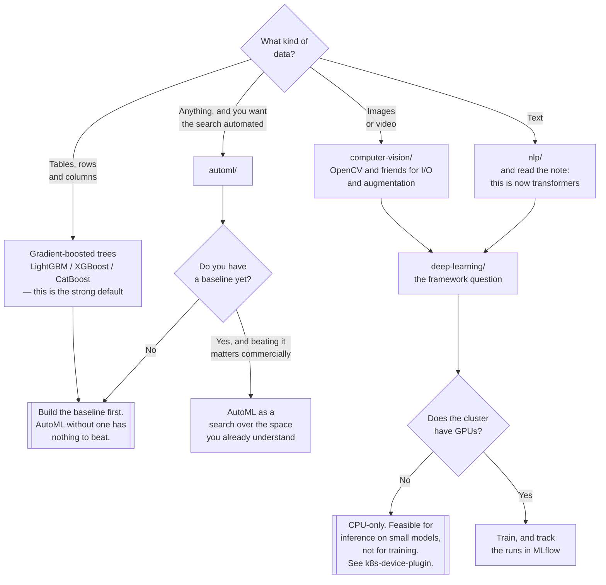

[← MLOps](../README.md)

# Algorithms

A reading list, not a platform: orientation to the problem classes and the libraries that solve
them.

Problem classes: [`automl/`](automl/README.md) ·
[`computer-vision/`](computer-vision/README.md) ·
[`deep-learning/`](deep-learning/README.md) · [`nlp/`](nlp/README.md)

## Contents

1. [What this folder is, and is not](#1-what-this-folder-is-and-is-not)
2. [The problem classes](#2-the-problem-classes)
3. [The one thing that generalises: start with a baseline](#3-the-one-thing-that-generalises-start-with-a-baseline)
4. [Decision tree](#4-decision-tree)
5. [Anti-patterns](#5-anti-patterns)
6. [Notes](#6-notes)
   1. [DataFrames](#61-dataframes)
   2. [Machine Learning](#62-machine-learning)
   3. [Visualization](#63-visualization)
   4. [Papers](#64-papers)
7. [How this applies to pikakube](#7-how-this-applies-to-pikakube)

---

## 1. What this folder is, and is not

**It is a bookmark collection.** Libraries, documentation links and paper-reading resources,
grouped by problem class. There are no manifests here and nothing is deployed. Read it as
orientation — what problem class is this, and what would a competent person reach for.

**It is not platform capability.** Everything else under [`../`](../README.md) is about running
things: [`../lifecycle/`](../lifecycle/README.md) has manifests, [`../app/`](../app/README.md)
describes a deployment shape. This folder has neither, and the distinction matters because a full
list of ML libraries can look like a capability when it is a set of intentions.

The reason it is worth keeping anyway: the choice of library determines what the platform is later
asked for. A PyTorch decision means GPU nodes and a device plugin. An AutoML decision means CPU
capacity and a time budget. A transformer decision means model weights measured in gigabytes and an
inference server. **The library choice is an infrastructure decision made by somebody who is not
thinking about infrastructure**, which is a good reason for it to be documented next to the
infrastructure.

## 2. The problem classes

| Folder | The problem | The honest summary |
|---|---|---|
| [`automl/`](automl/README.md) | search model and hyperparameter space automatically | often beaten by a gradient-boosted baseline you could have written in an hour |
| [`computer-vision/`](computer-vision/README.md) | images and video — read, transform, augment, model | the classical libraries are still load-bearing, mostly as preprocessing |
| [`deep-learning/`](deep-learning/README.md) | neural networks, and the framework question | PyTorch has won research and most production |
| [`nlp/`](nlp/README.md) | text | the classical stack has largely been displaced by transformers and LLMs — see `../../ai/` |

Two of these four are living folders and two are largely historical, which is worth saying
plainly rather than presenting all four as equally current. The classical NLP pipeline is mostly
gone; classical computer vision survives as the preprocessing layer under deep models.

## 3. The one thing that generalises: start with a baseline

Every folder here restates the same lesson from a different angle, so it belongs at the top.

**Build the dumbest thing that could work, measure it, then decide whether anything more is
justified.** For tabular problems that is a gradient-boosted tree — LightGBM, XGBoost or CatBoost
with default parameters. For text classification it is a linear model over TF-IDF. For most
business problems it is a rule or a historical average.

This matters for three reasons:

| Reason | Detail |
|---|---|
| It is often good enough | on tabular data, a tuned GBM is a genuinely strong result, not a placeholder |
| It defines "better" | without a baseline number, "the model works" is unfalsifiable |
| It is the cheapest thing to operate | one small artefact, CPU inference, seconds to retrain — compare with a GPU-served transformer |

The failure this prevents is reaching for the most sophisticated available method first, spending
weeks on it, and never learning that a 40-line baseline was within two percent.

## 4. Decision tree

## 5. Anti-patterns

| Anti-pattern | Why it is bad | What to do instead |
|---|---|---|
| Deep learning on tabular data by default | gradient-boosted trees usually win, train in minutes and cost nothing to serve | GBM first, always |
| AutoML before a baseline | there is nothing to beat, so any output looks like success | baseline, then search |
| Choosing a framework by popularity in a blog post | the choice determines your GPU, serving and hiring story | see [`deep-learning/`](deep-learning/README.md) |
| Building a classical NLP pipeline in 2026 | tokenise-stem-TF-IDF has been displaced for most tasks | a transformer, or an LLM via `../../ai/` |
| Treating this folder as capability | it is a bookmark list; mistaking it for infrastructure hides that nothing is deployed | read section 1 |
| Assuming GPU availability | this cluster has no device plugin, so GPUs are invisible to the scheduler | check before planning training |
| Untracked experiments | "which run produced this?" is unanswerable within days | [`../lifecycle/`](../lifecycle/README.md), from the first run |
| Pinning a library and not the data | the code reproduces, the result does not | see [`../README.md`](../README.md#3-why-ml-is-operationally-different-from-software) |
| A library list that nobody prunes | dead projects accumulate and mislead the next reader | note what is historical, as section 2 does |

## 6. Notes

The original note for this folder was a curated link collection with no commentary. Every link is
preserved below, with what it is and why it was worth bookmarking. Several are historical — that is
recorded rather than hidden.

### 6.1 DataFrames

Preprocessing and exploration, the step before any model.

| Link | What it is |
|---|---|
| [pandas-profiling](https://pandas-profiling.github.io/pandas-profiling/docs/master/rtd/pages/examples.html) | one function that generates a full HTML report on a dataframe — distributions, correlations, missing values, warnings. The fastest way to understand an unfamiliar dataset. Now renamed **ydata-profiling**; this link is the old project name. |
| [missingno](https://github.com/ResidentMario/missingno) | visualises *missing data patterns* — where the nulls are and whether they are correlated. Missingness is usually structural, and seeing the pattern tells you whether dropping rows is safe. |
| [Category Encoders](https://contrib.scikit-learn.org/category_encoders/) | scikit-learn-compatible encoders for categorical variables beyond one-hot: target, ordinal, binary, hashing. Matters because high-cardinality categoricals are where naive one-hot encoding falls apart. |
| [pandas-datareader](https://pydata.github.io/pandas-datareader/remote_data.html) | pulls remote data sources (financial, economic) straight into a dataframe. A convenience for time-series and finance work. |
| [Imbalanced-learn](https://imbalanced-learn.org/stable/user_guide.html) | resampling for imbalanced classes — SMOTE, under- and over-sampling. Directly relevant to fraud, churn and any rare-event problem, where accuracy is meaningless and the sampling strategy decides the result. |

### 6.2 Machine Learning

| Link | What it is |
|---|---|
| [scikit-learn](https://scikit-learn.org/stable/user_guide.html) | the reference library for classical ML. Its real contribution is the **API convention** — `fit`/`predict`/`transform` and `Pipeline` — which almost everything else here implements. |
| [mlxtend](https://rasbt.github.io/mlxtend/USER_GUIDE_INDEX/) | extensions to scikit-learn: stacking, feature selection, association rules, plotting helpers. |
| [LightGBM](https://lightgbm.readthedocs.io/en/latest/Python-API.html) | Microsoft's gradient-boosting library. Fast, handles categoricals natively, low memory. **The default baseline for tabular problems.** |
| [XGBoost](https://xgboost.readthedocs.io/en/latest/python/python_api.html) | the gradient-boosting library that made the technique standard. Slightly slower than LightGBM, extremely well tested, everywhere. |
| [CatBoost](https://catboost.ai/en/docs/concepts/python-quickstart) | Yandex's gradient boosting, specialised in categorical features and good with default parameters — the least tuning required of the three. |
| [baikal](https://baikal.readthedocs.io/en/stable/index.html) | ML pipelines as directed graphs rather than linear sequences, for models whose steps do not form a straight line. Niche, and largely inactive. |
| [scikit-optimize](https://scikit-optimize.github.io/stable/auto_examples/index.html) | Bayesian hyperparameter optimisation — a model of the objective, so it searches far fewer points than grid search. Related to [`automl/`](automl/README.md); largely superseded by Optuna. |
| [NGBoost](https://stanfordmlgroup.github.io/ngboost/1-useage.html) | gradient boosting that predicts a **distribution** instead of a point. The reason to care: you get calibrated uncertainty, so a prediction can say how confident it is. |
| [xLearn](https://xlearn-doc.readthedocs.io/en/latest/python_api/index.html) | fast factorisation machines and field-aware FM, for high-dimensional sparse data — the classic click-through and recommendation setting. Inactive. |
| [libFM in Keras](https://github.com/jfpuget/LibFM_in_Keras/blob/master/keras_blog.ipynb) | a notebook implementing factorisation machines in Keras. A worked explanation of how FM works, not a library. |

### 6.3 Visualization

| Link | What it is |
|---|---|
| [matplotlib](https://matplotlib.org/stable/gallery/index.html) | the foundation. Verbose, and everything else is built on it or compared to it. |
| [seaborn](https://seaborn.pydata.org/api.html) | statistical plotting over matplotlib — distributions, categorical comparisons, correlation heatmaps in one call. The usual answer for exploration. |
| [plotly](https://plotly.com/python/) | interactive charts that render in a browser: zoom, hover, pan. The right choice when the output is a dashboard rather than a paper. |
| [ipywidgets](https://ipywidgets.readthedocs.io/en/latest/index.html) | interactive controls inside notebooks — sliders and dropdowns bound to code. Notebook-scoped precursor to what [`../app/`](../app/README.md) does properly. |
| [Graphviz](https://graphviz.readthedocs.io/en/stable/index.html) | graph and tree rendering. Used for decision trees, pipeline diagrams and model structure. |
| [Cufflinks](https://github.com/santosjorge/cufflinks) | binds Plotly to pandas so a dataframe plots interactively with `.iplot()`. Convenience wrapper; effectively unmaintained. |
| [Scikit-plot](https://scikit-plot.readthedocs.io/en/stable/Quickstart.html) | one-line ROC curves, confusion matrices, lift charts. The evaluation plots you draw every time. Inactive. |
| [Yellowbrick](https://www.scikit-yb.org/en/latest/quickstart.html) | "visual diagnostics" for scikit-learn — model selection, residuals, class balance, feature importance, as scikit-learn-style visualizers. The maintained version of the Scikit-plot idea. |
| [Altair](https://altair-viz.github.io/gallery/index.html) | declarative grammar-of-graphics plotting (Vega-Lite). You describe the mapping from data to visual properties, not the drawing. |
| [bokeh](https://docs.bokeh.org/en/latest/docs/gallery.html) | interactive browser visualisation aimed at larger datasets and streaming updates. |

### 6.4 Papers

Keeping-up resources, recorded because staying current in ML is a documented workflow rather than
an occasional activity.

| Link | What it is |
|---|---|
| [paperswithcode](https://paperswithcode.com/sota) | state-of-the-art leaderboards per task, each linked to a paper **and its code**. The fastest way to find what currently works on a problem and whether it is reproducible. |
| [Papers Explained — Aladdin Persson](https://www.youtube.com/playlist?list=PLhhyoLH6IjfwqKKZhVLp7diKFxTmj4Q6s) | paper walkthroughs with implementations built up in code. |
| [W&B Paper Reading Group — Weights & Biases](https://www.youtube.com/playlist?list=PLD80i8An1OEG_vpqwQgwH1gIxeb9r30u5) | a recorded reading group; practitioner framing rather than research framing. |
| [Papers Explained — Yannic Kilcher](https://www.youtube.com/playlist?list=PL1v8zpldgH3pR7LPuidEZK68kS6AaU1y7) | detailed and critical paper reviews; strong on why a result may not mean what it claims. |
| [Kaggle Reading Group — Kaggle](https://www.youtube.com/playlist?list=PLqFaTIg4myu8t5ycqvp7I07jTjol3RCl9) | competition-practitioner reading of papers — what transfers to real problems. |

## 7. How this applies to pikakube

**This is a reference folder and it should be read as one.** No manifests, no deployments, nothing
the cluster runs. Section 1 argues it is still worth keeping, and that argument is the whole
justification for the folder.

What it tells you about the platform:

- **The bias in the list is tabular and classical.** Three gradient-boosting libraries, a full
  scikit-learn ecosystem, dataframe and visualisation tooling. That is a set of choices with cheap
  infrastructure consequences: CPU training, small artefacts, fast retraining. The
  [`../lifecycle/`](../lifecycle/README.md) deployment is sized consistently with that.
- **The deep-learning entries are aspirational here.** There is no GPU device plugin on this
  cluster (`NVIDIA/k8s-device-plugin`, recorded in [`../README.md`](../README.md#7-notes)), so
  GPUs are invisible to the scheduler and any framework in
  [`deep-learning/`](deep-learning/README.md) runs on CPU.
- **The NLP entry points at `../../ai/`.** The single link there is Hugging Face `transformers`,
  and everything downstream of that decision — serving weights, gateways, agents — is that folder
  rather than this one.
- **Nothing here connects to tracking.** The libraries listed all log to MLflow with a line of
  code, and the connection between "the team uses scikit-learn" and "there is a tracking server in
  `lifecycle/`" is not made anywhere. That is the cheapest link to close.

---

[← MLOps](../README.md)
