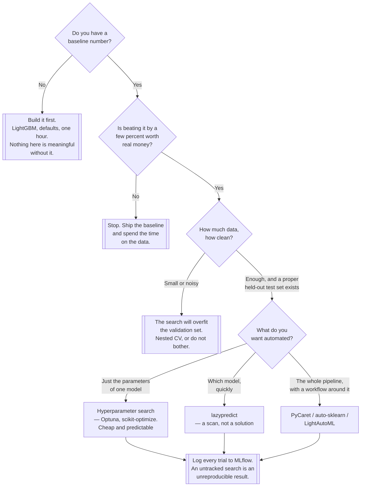

[← Algorithms](../README.md)

# AutoML

Searching the model and hyperparameter space automatically — and the question of whether the
search was worth running.

No subfolders: this is a leaf reference folder. Sibling problem classes:
[`../computer-vision/`](../computer-vision/README.md) ·
[`../deep-learning/`](../deep-learning/README.md) · [`../nlp/`](../nlp/README.md)

## Contents

1. [What AutoML actually automates](#1-what-automl-actually-automates)
   1. [The three layers](#11-the-three-layers)
   2. [What it does not automate](#12-what-it-does-not-automate)
2. [When it is worth it, versus a sensible baseline](#2-when-it-is-worth-it-versus-a-sensible-baseline)
3. [The operational cost nobody prices in](#3-the-operational-cost-nobody-prices-in)
4. [Decision tree](#4-decision-tree)
5. [Anti-patterns](#5-anti-patterns)
6. [Notes](#6-notes)
7. [How this applies to pikakube](#7-how-this-applies-to-pikakube)

---

## 1. What AutoML actually automates

### 1.1 The three layers

"AutoML" covers three different amounts of automation, and the tools here sit at different levels.
Being clear about which one you want prevents most of the disappointment.

| Layer | What is searched | Cost | Typical payoff |
|---|---|---|---|
| **Hyperparameter optimisation** | the parameters of one chosen model | hours of CPU | real and predictable — a few percent |
| **Model selection** | which algorithm, across a set | more | useful when you genuinely do not know |
| **Full pipeline search** | preprocessing + encoding + model + parameters, jointly | large | biggest search, biggest overfitting risk |

The first is nearly always worth doing and is barely "AutoML" — it is a loop. The third is what
people mean by the word and where the trade-off gets interesting.

### 1.2 What it does not automate

This is the part that decides whether the exercise helps:

- **Framing the problem.** What is being predicted, over what horizon, for what decision.
- **The target definition.** The single most common source of a model that scores well and is
  useless.
- **Leakage.** AutoML will happily find a feature that encodes the answer and report a spectacular
  score. It has no idea that the column was populated after the event.
- **The evaluation split.** Random splits on time-ordered data produce fantasy numbers, and the
  search will optimise into that fantasy hard.
- **Whether the metric matches the business decision.** Optimising accuracy on an imbalanced
  problem is a well-automated way of predicting the majority class.

AutoML compresses the part of the work that was already mechanical. The parts that were hard stay
hard, and a search running over a badly framed problem simply gets to a wrong answer faster.

## 2. When it is worth it, versus a sensible baseline

The comparison that matters is not AutoML versus nothing. It is **AutoML versus LightGBM with
default parameters**, which takes an hour to write and minutes to train.

| Situation | Verdict |
|---|---|
| No baseline exists yet | **build the baseline.** AutoML with nothing to beat cannot be evaluated |
| Baseline built, result adequate | stop. The search costs more than the remaining gain is worth |
| Baseline built, a few percent is commercially significant | **worth it** — this is the real use case |
| Many similar models over similar tabular datasets | **worth it** — the automation amortises across them |
| Nobody on the team knows the problem class | worth it as *exploration*, to see which families do well |
| Deep learning, images, text | mostly no. The transfer-learning path is stronger and cheaper |
| The data is small or noisy | **actively harmful** — the search overfits the validation set |

The last row deserves emphasis. A large search evaluated repeatedly against the same validation
split will find a configuration that fits that split's noise. The reported score improves and the
real performance does not. **The more configurations you try, the less the best validation score
means** — and AutoML's entire selling point is trying many configurations. Nested cross-validation
or a genuinely held-out test set is not optional here.

## 3. The operational cost nobody prices in

AutoML looks free because it is a library call. What it produces has downstream weight:

| Cost | Detail |
|---|---|
| Compute | a search is hours to days of CPU. On a shared cluster that capacity is taken from something |
| Artefact size | ensembles and stacks are large and slow to load compared with one boosted tree |
| Inference latency | a stacked ensemble is several models plus a meta-model, per prediction |
| Explainability | "why did it predict this?" gets harder in exactly the domains that ask the question |
| Retraining | rerunning the search may select a different pipeline, so the production model changes shape between retrains |
| Debuggability | when it degrades, you are debugging a pipeline nobody designed |

The last two are the ones that hurt over time. A model whose *structure* changes on every retrain
is much harder to reason about than one whose parameters change.

## 4. Decision tree

## 5. Anti-patterns

| Anti-pattern | Why it is bad | What to do instead |
|---|---|---|
| AutoML before a baseline | nothing to compare against, so any output looks like a win | LightGBM with defaults first |
| Trusting the best validation score from a large search | the more configurations tried, the more that score is noise | a held-out test set the search never saw |
| Random train/test split on time-ordered data | leakage from the future; the search optimises into it | split by time |
| Letting AutoML define the target or the metric | it cannot; it optimises whatever it is given, including nonsense | frame the problem yourself |
| Shipping a stacked ensemble for a two-percent gain | large artefact, slow inference, hard to explain, hard to debug | take the simple model unless the gain is priced |
| Re-running the search on every retrain | the production model changes shape unpredictably | fix the pipeline, retrain the weights |
| An unlogged search | hundreds of runs and no record of which produced the chosen model | log every trial to [`../../lifecycle/`](../../lifecycle/README.md) |
| Running a multi-day search on shared cluster capacity | it is invisible cost taken from other workloads | bound the time budget explicitly |

## 6. Notes

The original note for this folder was four GitHub links with no commentary. Each is preserved
below with what it is and where it sits on the three layers in section 1.1.

| Link | What it is | Where it fits |
|---|---|---|
| <https://github.com/automl/auto-sklearn> | the academic reference implementation. Bayesian optimisation plus meta-learning over the scikit-learn pipeline space, with automatic ensemble construction from the models it evaluated | **full pipeline search**. Strong results, and the ensembling is a large part of why. Linux-only, and development has been quiet — check its state before adopting |
| <https://github.com/pycaret/pycaret> | a low-code ML workflow: `setup()` prepares the data, `compare_models()` trains and ranks many algorithms, then tune, blend, stack and deploy from the same API | **model selection with a workflow**. The most practical of the four for a small team, because it also covers the boring parts. Integrates with MLflow for tracking out of the box |
| <https://github.com/shankarpandala/lazypredict> | trains every scikit-learn model with defaults and prints a leaderboard. That is all it does | **a scan, not AutoML.** Genuinely useful as a first-hour orientation: it tells you which families are in the running. Do not mistake the leaderboard for a result — no tuning, no validation discipline |
| <https://github.com/sb-ai-lab/LightAutoML> | Sber's AutoML framework, built for tabular problems at production scale — strong preprocessing, categorical handling and a time budget you set | **full pipeline search, production-oriented.** The time budget is the feature that matters: it makes the compute cost a decision rather than a surprise |

Two observations about the list as a whole:

- **All four are tabular-focused.** That is consistent with the rest of
  [`../`](../README.md) and it is where AutoML genuinely works. AutoML for images or text is a
  different and weaker proposition.
- **The obvious omission is a modern hyperparameter optimiser.** Optuna is the current default for
  layer one in section 1.1, and it is neither here nor in `../doc.md`'s ML list — which contains
  the older [scikit-optimize](https://scikit-optimize.github.io/stable/auto_examples/index.html)
  instead. For most teams, Optuna plus LightGBM is the AutoML that is actually worth running.

## 7. How this applies to pikakube

Nothing is deployed and nothing needs to be — AutoML is a library dependency, not
infrastructure. What it would consume from this platform:

- **CPU capacity, in bursts.** A search is a batch job that wants many cores for hours. It should
  be a scheduled workload with a bounded time budget, not something run from a laptop or left
  running in a notebook pod.
- **Tracking, more than any other workload here.** A search produces hundreds of runs. Without
  [`../../lifecycle/mlflow2/`](../../lifecycle/mlflow2/README.md), the answer to "which trial
  produced the model we shipped" is lost immediately — the failure described in
  [`../../README.md`](../../README.md#3-why-ml-is-operationally-different-from-software), at a
  hundred times the volume. PyCaret logs to MLflow natively, which makes this nearly free.
- **No GPU requirement**, which is fortunate — this cluster has no device plugin. All four tools
  here are CPU-bound tabular tools.

The gap worth naming: with a tracking server available and no policy about where searches run,
the likely reality is AutoML runs happening on laptops and never reaching MLflow at all.

---

[← Algorithms](../README.md)
