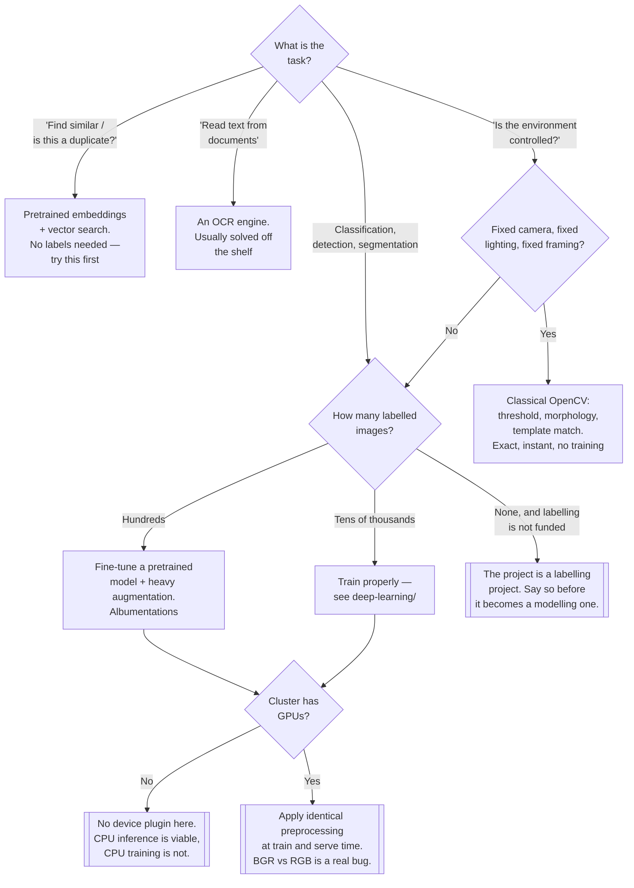

[← Algorithms](../README.md)

# Computer vision

Getting pixels into a model correctly — reading, transforming and augmenting images, which is
where most of the work and most of the bugs are.

No subfolders: this is a leaf reference folder. Sibling problem classes:
[`../automl/`](../automl/README.md) · [`../deep-learning/`](../deep-learning/README.md) ·
[`../nlp/`](../nlp/README.md)

## Contents

1. [The problem class](#1-the-problem-class)
   1. [The task taxonomy](#11-the-task-taxonomy)
   2. [Where the classical libraries still matter](#12-where-the-classical-libraries-still-matter)
2. [Augmentation is the lever](#2-augmentation-is-the-lever)
3. [The operational shape of vision workloads](#3-the-operational-shape-of-vision-workloads)
4. [Decision tree](#4-decision-tree)
5. [Anti-patterns](#5-anti-patterns)
6. [Notes](#6-notes)
7. [How this applies to pikakube](#7-how-this-applies-to-pikakube)

---

## 1. The problem class

### 1.1 The task taxonomy

Vision problems are not one problem, and the labelling cost differs by an order of magnitude
between them. That cost, not the model, usually decides what is feasible.

| Task | Output | Labelling cost |
|---|---|---|
| Classification | one label per image | low — a click per image |
| Detection | boxes plus labels | medium — a box per object |
| Segmentation | a label per pixel | high — outlining, per object |
| OCR / document extraction | text plus structure | varies; often solvable with an off-the-shelf engine |
| Similarity / retrieval | an embedding | **none** — no labels required |

The last row is the one worth remembering. Embedding-and-compare solves "find similar", "is this a
duplicate", "which product is this" without a labelled dataset, using a pretrained model as-is.
It is repeatedly the cheapest useful thing in this folder.

### 1.2 Where the classical libraries still matter

Deep learning took over the *modelling*. It did not take over everything around it, and the
libraries in the notes are all still load-bearing in the parts it left:

| Still classical | Why |
|---|---|
| **Reading and decoding** | somebody has to turn a JPEG into an array, handle EXIF rotation and colour spaces |
| **Preprocessing** | resize, crop, normalise, convert — every deep pipeline starts here |
| **Augmentation** | see section 2 |
| **Geometry** | homography, calibration, stitching, contour finding — solved problems with exact answers |
| **Cheap wins** | thresholding, morphology and template matching still solve controlled-environment problems in milliseconds, with no training |

That last row is worth taking seriously. If lighting and framing are fixed — a production line, a
scanner, a fixed camera — a classical pipeline can be exact, instant, explainable and free to
operate. Reaching for a trained model there is a choice to add a training pipeline, a GPU and a
drift problem to something that had none.

## 2. Augmentation is the lever

For most real vision projects the dataset is small, because labelling is expensive. Augmentation —
synthesising variations of the images you have — is the highest-leverage thing available, more so
than model architecture.

**The rule: augment to match the variation the model will actually see in production.** Rotation
matters if the camera angle varies; it is noise if the camera is bolted down. Colour jitter matters
if lighting varies; brightness augmentation on medical scans can destroy the signal.

Two failure modes:

| Failure | What happens |
|---|---|
| Augmenting for variation that does not occur | capacity spent learning invariance to something that never happens |
| Augmenting the labels wrong | flip an image and the bounding boxes must flip too; segmentation masks must be transformed identically |

The second is a real and common bug, and it is exactly what Albumentations exists to prevent —
it transforms images, boxes, masks and keypoints together, consistently.

**Augmentation is also part of training-serving skew.** The normalisation applied at training must
be applied identically at inference. A different mean/std, a different resize interpolation, a
different channel order (OpenCV reads BGR, most models expect RGB) produces a model that scores
well and predicts badly — the failure described in
[`../../README.md`](../../README.md#3-why-ml-is-operationally-different-from-software), in its
most literal form.

## 3. The operational shape of vision workloads

Vision is the most infrastructure-hungry problem class in this folder, and in specific ways:

| Concern | Detail |
|---|---|
| **Data volume** | images are large. A dataset is object storage, not a PVC, and the dataset is the thing to version |
| **Data loading** | decode and augmentation are CPU-bound and routinely starve the GPU. The bottleneck is often not the model |
| **GPU** | training is impractical without one; inference on small models is viable on CPU |
| **Artefact size** | model weights measured in hundreds of megabytes, which affects image builds and cold starts |
| **Latency** | preprocessing counts. A 200 ms resize in front of a 20 ms model is a 220 ms service |
| **Drift** | a camera is moved, a lens gets dirty, lighting changes seasonally. Nothing errors; accuracy falls |

The drift row is the vision-specific version of the general argument: the world literally changes
in front of the camera, and nothing in the stack notices.

## 4. Decision tree

## 5. Anti-patterns

| Anti-pattern | Why it is bad | What to do instead |
|---|---|---|
| Training a model where a classical pipeline is exact | you added a GPU, a training pipeline and a drift problem to a solved task | fixed conditions → classical CV |
| Different preprocessing at train and serve time | training-serving skew, in its most literal form | one shared transform, used by both paths |
| Ignoring BGR vs RGB | OpenCV reads BGR, most pretrained models expect RGB; the model degrades quietly | convert explicitly and assert it |
| Augmenting images without their labels | boxes and masks no longer match the image | Albumentations, which transforms them together |
| Augmenting for variation that never occurs | capacity wasted learning irrelevant invariance | match production conditions |
| Training from scratch on a small dataset | there is not enough data, and a pretrained backbone exists | fine-tune |
| Storing an image dataset on a PVC | it will not fit, it is not shared and it is not versioned | object storage |
| Optimising the model while the data loader starves it | GPU idle at 30% and the model was never the bottleneck | profile the input pipeline first |
| No drift check on a camera-fed model | a moved camera or a dirty lens degrades it with nothing to alert on | monitor input statistics |
| Measuring latency without preprocessing | the service is slower than the benchmark, always | measure end to end |

## 6. Notes

The original note for this folder was four GitHub links with no commentary. Each is preserved
below.

| Link | What it is | Why it is here |
|---|---|---|
| <https://github.com/opencv/opencv> | the foundational computer-vision library — I/O, colour conversion, filtering, geometry, feature detection, calibration, and classical algorithms for nearly everything | still the base layer of most vision pipelines even when the model is deep. **The BGR default is its most famous trap** (see anti-patterns) |
| <https://github.com/python-pillow/Pillow> | the Python imaging library: open, convert, resize, save. Format handling rather than algorithms | the default image I/O for the Python ecosystem; PyTorch and TensorFlow data pipelines assume it |
| <https://github.com/scikit-image/scikit-image> | image processing with a scikit-learn-shaped API — filters, segmentation, morphology, measurement | the scientific-Python counterpart to OpenCV. More readable, better documented, slower; strong for measurement and analysis rather than real-time |
| <https://github.com/albumentations-team/albumentations> | fast image augmentation that transforms **images, bounding boxes, masks and keypoints together** | the practical answer to section 2. Its correctness guarantee on labels is the reason to use it over hand-written transforms, and it is fast enough not to starve a GPU |

Two observations about the list:

- **It is entirely the preprocessing layer.** There is no model library here — no torchvision, no
  detection or segmentation framework. That is consistent with section 1.2: the modelling half is
  [`../deep-learning/`](../deep-learning/README.md), and this folder is what surrounds it.
- **Nothing here needs a GPU**, which matters given that this cluster has none available to the
  scheduler.

## 7. How this applies to pikakube

Nothing is deployed. As orientation, three things about this platform decide what vision work is
realistic here:

- **No GPU device plugin.** Recorded in [`../../README.md`](../../README.md#7-notes) —
  `NVIDIA/k8s-device-plugin` is noted and not installed, so GPUs are invisible to the scheduler.
  Fine-tuning and training are not currently possible on this cluster. CPU inference on a small
  model, and embedding-based similarity using a pretrained model, both are.
- **Object storage exists.** [MinIO](../../../data-governance/lakehouse/storage/minio/README.md)
  is deployed and is the right home for image datasets — not a PVC. It is already the artifact
  store for [MLflow](../../lifecycle/mlflow2/README.md), so datasets and model artefacts would sit
  in the same place.
- **No data versioning.** DVC is in the notes and not in use, which for vision is the sharpest
  version of the general problem: an image dataset changes by having files added to a prefix, and
  nothing records which files a given run saw.

The realistic first vision workload here is **embeddings plus similarity search on CPU** — no
labels, no GPU, no training pipeline — and it is the one that is never proposed because it is not
the interesting-sounding option.

---

[← Algorithms](../README.md)
