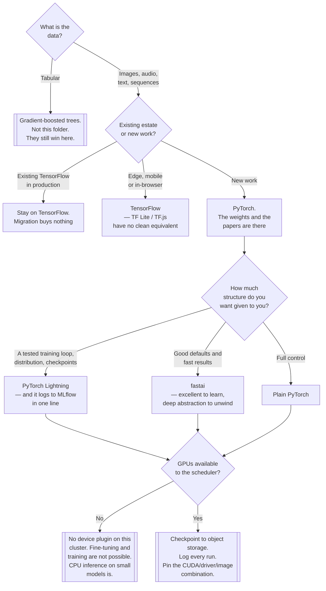

[← Algorithms](../README.md)

# Deep learning

Neural networks, and the framework question — which is the decision that determines your GPU
story, your serving story and your hiring story.

No subfolders: this is a leaf reference folder. Sibling problem classes:
[`../automl/`](../automl/README.md) ·
[`../computer-vision/`](../computer-vision/README.md) · [`../nlp/`](../nlp/README.md)

## Contents

1. [When deep learning is the right answer](#1-when-deep-learning-is-the-right-answer)
2. [The framework question](#2-the-framework-question)
   1. [PyTorch has won](#21-pytorch-has-won)
   2. [What the wrappers are for](#22-what-the-wrappers-are-for)
3. [The operational consequences of the choice](#3-the-operational-consequences-of-the-choice)
4. [Decision tree](#4-decision-tree)
5. [Anti-patterns](#5-anti-patterns)
6. [Notes](#6-notes)
7. [How this applies to pikakube](#7-how-this-applies-to-pikakube)

---

## 1. When deep learning is the right answer

It is the right answer for **unstructured data** — images, audio, text, sequences — where the
useful features cannot be written down by hand. That is a genuine and large category, and it is
not most business problems.

| Data | Reach for |
|---|---|
| Tables, rows and columns | **gradient-boosted trees.** LightGBM, XGBoost, CatBoost |
| Images, audio, video | deep learning, almost always fine-tuned rather than trained |
| Text | transformers — see [`../nlp/`](../nlp/README.md) |
| Sequences with structure | depends; classical methods are often competitive |
| Tables, but the CEO asked for AI | still gradient-boosted trees |

**On tabular data, gradient boosting still generally beats neural networks** — faster to train,
cheaper to serve, easier to explain, and less sensitive to preprocessing. This has been tested
repeatedly and remains true. Choosing deep learning for a tabular problem usually costs weeks and
buys nothing.

The second thing to internalise: **you are almost never training from scratch**. Fine-tuning a
pretrained model on a few thousand examples is the normal path, and it is the reason deep learning
is accessible at all — the expensive part was done by someone else on hardware you do not have.

## 2. The framework question

### 2.1 PyTorch has won

This is not a close call any more, and pretending otherwise wastes people's time.

| | **PyTorch** | **TensorFlow** |
|---|---|---|
| Research | overwhelming majority of new papers and reference implementations | rare |
| Pretrained models | Hugging Face is PyTorch-first; most weights appear here first or only | fewer, often ports |
| Ecosystem momentum | growing | maintenance |
| Debugging | eager by default — it is Python, and a breakpoint works | improved since TF 2, still more indirect |
| Production serving | TorchServe, ONNX export, vLLM, KServe runtimes | TF Serving is mature and genuinely good |
| Mobile / edge / browser | improving | TF Lite and TF.js remain a real advantage |

**The practical rule.** New work: PyTorch. The reason is not benchmarks, it is supply — the model
you want to fine-tune will be a PyTorch checkpoint, and the paper you want to reproduce will ship
PyTorch code. Fighting that costs more than any framework preference is worth.

TensorFlow remains a defensible choice in two places: an existing production estate built on it,
and edge or in-browser deployment where TF Lite and TF.js have no clean equivalent.

### 2.2 What the wrappers are for

Three of the five links in the notes are not competing frameworks but layers on top, and knowing
which layer you are at avoids a lot of confusion.

| Layer | Library | What it removes |
|---|---|---|
| Framework | PyTorch, TensorFlow | — |
| Model API | Keras | the boilerplate of defining and compiling a model |
| Training loop | PyTorch Lightning | the boilerplate of the loop: devices, distribution, checkpoints, logging, mixed precision |
| Opinionated defaults | fastai | the decisions — learning-rate schedules, augmentation, transfer-learning recipes |

**PyTorch Lightning is the one with the strongest operational argument.** The training loop is
where distributed training, checkpointing, mixed precision and logging live, and hand-written loops
get these subtly wrong — a checkpoint that does not restore the optimiser state, a metric averaged
incorrectly across devices, a run that cannot resume after a preemption. Lightning is that loop,
written once and tested. It also logs to MLflow with a single line, which is the cheapest possible
connection to [`../../lifecycle/`](../../lifecycle/README.md).

**fastai is a teaching and fast-results library.** Its defaults are genuinely good and its course
is the best practical introduction available. The trade is that the abstraction is deep, so
production customisation means unwinding it.

## 3. The operational consequences of the choice

Choosing a deep-learning framework is choosing a set of infrastructure requirements, and the
person choosing usually is not the person who will provide them:

| Requirement | Detail |
|---|---|
| **GPU nodes** | training is impractical without them, and they need a device plugin, drivers and a scheduling policy |
| **CUDA version coupling** | the framework, the driver and the container image must agree. This is the most common "works on my machine" in ML |
| **Large images** | a CUDA-enabled PyTorch image is several gigabytes; that is pull time on every cold start |
| **Checkpointing** | long training must survive preemption, which means writing checkpoints to object storage, not a local disk |
| **Artefact size** | weights in the hundreds of megabytes to gigabytes — an object store, not a git repository |
| **Serving is a separate decision** | the training framework does not have to be the serving runtime; ONNX export decouples them |
| **Reproducibility is harder** | GPU non-determinism means identical code and seeds can produce different weights |

That last point is a real qualification on
[`../../README.md`](../../README.md#3-why-ml-is-operationally-different-from-software): pinning
the code, data, seed and environment gets you close, and on GPU it does not always get you exact.
Determinism can be forced and costs speed.

## 4. Decision tree

## 5. Anti-patterns

| Anti-pattern | Why it is bad | What to do instead |
|---|---|---|
| Deep learning on tabular data | GBMs are better, faster and cheaper, and this is well established | LightGBM, XGBoost, CatBoost |
| Training from scratch | you do not have the data or the hardware that made pretraining work | fine-tune a pretrained checkpoint |
| Choosing TensorFlow for new work | the weights and the reference code you want are PyTorch | PyTorch, unless edge or an existing estate |
| A hand-written training loop | checkpoints, distribution and metric aggregation get subtly wrong | PyTorch Lightning |
| Checkpointing to a local disk | a preempted or evicted pod loses the run | object storage |
| Not pinning the CUDA / driver / image combination | the most common irreproducible environment failure in ML | pin all three together |
| Assuming GPU results are reproducible | non-determinism means identical seeds can diverge | force determinism if it matters, and accept the cost |
| Untracked training runs | the expensive runs are the ones you most need a record of | log to [`../../lifecycle/`](../../lifecycle/README.md) |
| Weights in a git repository | repositories become unusable at this artefact size | an object store, referenced by the run |
| Serving with the training framework by default | you are shipping a training stack to production | ONNX export, or a purpose-built serving runtime |

## 6. Notes

The original note for this folder was five GitHub links with no commentary. Each is preserved
below, with which layer of section 2.2 it occupies.

| Link | What it is | Layer / verdict |
|---|---|---|
| <https://github.com/tensorflow/tensorflow> | Google's deep-learning framework. Mature, with TF Serving, TF Lite and TF.js as a genuinely strong deployment story | **framework.** Defensible for an existing estate or for edge/browser; not the choice for new work |
| <https://github.com/pytorch/pytorch> | Meta's deep-learning framework, eager by default, now the research and production default | **framework. The answer for new work** — see section 2.1 |
| <https://github.com/keras-team/keras> | the high-level model API. Historically the friendly face of TensorFlow; **Keras 3 is multi-backend** and runs on TensorFlow, PyTorch or JAX | **model API.** Worth knowing that its TensorFlow-only association is out of date |
| <https://github.com/fastai/fastai> | a library of strong, opinionated defaults over PyTorch — transfer learning, learning-rate scheduling, augmentation — plus the course it exists to teach | **opinionated defaults.** Best-in-class for learning and for fast results; deep abstraction to unwind in production |
| <https://github.com/Lightning-AI/pytorch-lightning> | organises PyTorch code and owns the training loop: devices, distributed training, checkpointing, mixed precision, logging | **training loop.** The one with the clearest operational payoff, and one-line MLflow logging |

Observations about the list:

- **Both frameworks and three layers above them.** That is the right shape for an orientation
  folder; section 2.2 exists because a list like this reads as five alternatives when it is not.
- **No serving entry.** Training is covered and deployment is not. The serving links are in
  [`../../README.md`](../../README.md#7-notes) — KServe, Seldon, BentoML — none deployed.
- **No distributed-training entry either**, though `kubeflow/training-operator` and Ray are in the
  parent notes and are the Kubernetes-native answers.

## 7. How this applies to pikakube

Nothing is deployed, and for this folder the platform gap is concrete rather than theoretical.

**The blocking one: there are no GPUs available to the scheduler.**
`NVIDIA/k8s-device-plugin` is recorded in [`../../README.md`](../../README.md#7-notes) and is not
installed. Without it the kubelet does not advertise `nvidia.com/gpu` and no pod can request one,
regardless of what hardware exists. Every training and fine-tuning path in this folder is
unavailable until that changes. CPU inference on small models is not.

**What is already right, if that changes:**

- Artifact storage is solved — [MLflow](../../lifecycle/mlflow2/README.md) writes to S3, which is
  the correct destination for both checkpoints and final weights.
- Tracking is solved, and PyTorch Lightning connects to it in one line. Deep-learning runs are the
  most expensive things this platform would run and therefore the ones that most need a record.

**What is missing beyond the GPUs:**

1. **No distributed-training mechanism.** `kubeflow/training-operator` and Ray are both noted and
   neither is installed, so multi-node training has no Kubernetes-native path here.
2. **No serving runtime.** A trained model can be registered and cannot be deployed by anything on
   this platform.
3. **No image-build story for CUDA.** The framework, driver and base image must agree, and nothing
   in this repository pins that combination.

The honest position: this folder documents a capability the cluster does not currently have. Saying
that plainly is more useful than listing the frameworks as though they were available.

---

[← Algorithms](../README.md)
