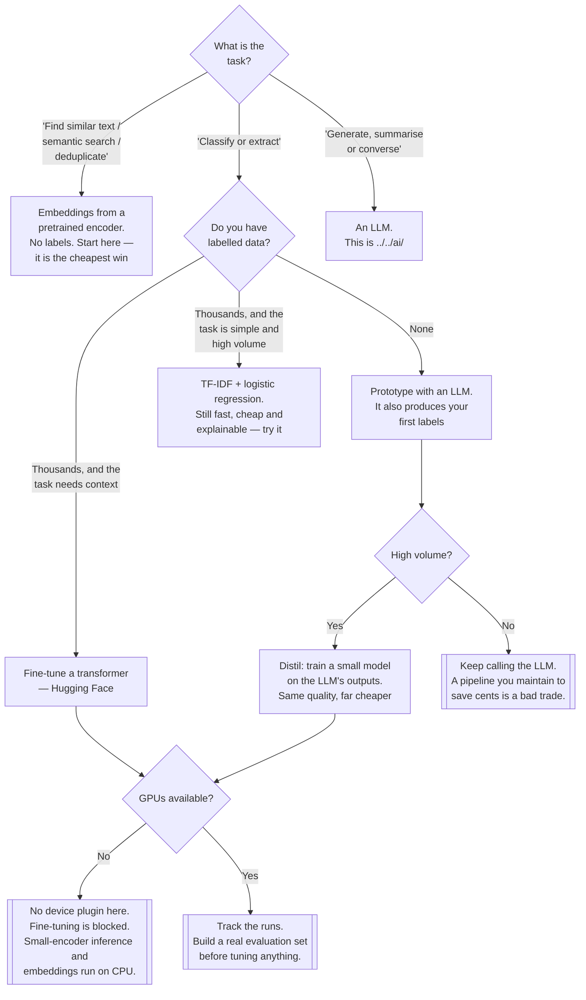

[← Algorithms](../README.md)

# NLP

Text — and the honest statement that the classical NLP stack has largely been displaced by
transformer models and LLMs.

No subfolders: this is a leaf reference folder. Sibling problem classes:
[`../automl/`](../automl/README.md) ·
[`../computer-vision/`](../computer-vision/README.md) ·
[`../deep-learning/`](../deep-learning/README.md)

## Contents

1. [What changed](#1-what-changed)
   1. [The classical pipeline](#11-the-classical-pipeline)
   2. [What replaced it](#12-what-replaced-it)
2. [Fine-tuned model, or an LLM?](#2-fine-tuned-model-or-an-llm)
3. [Where the boundary with ai/ falls](#3-where-the-boundary-with-ai-falls)
4. [Decision tree](#4-decision-tree)
5. [Anti-patterns](#5-anti-patterns)
6. [Notes](#6-notes)
7. [How this applies to pikakube](#7-how-this-applies-to-pikakube)

---

## 1. What changed

### 1.1 The classical pipeline

For roughly two decades, an NLP project meant assembling this:

| Stage | What it did | Status |
|---|---|---|
| Tokenisation | split text into words | replaced by subword tokenisers shipped with the model |
| Stop-word removal | drop common words | **counterproductive** for transformers — the model uses them |
| Stemming / lemmatisation | reduce words to a root | unnecessary; subword tokenisation handles morphology |
| TF-IDF / bag of words | text as a sparse vector | superseded by contextual embeddings |
| A linear model or SVM | classify the vector | superseded, though see section 2 |
| Hand-written rules | handle what the model got wrong | still alive, and still the fastest fix for a known case |

Each stage was a decision, each decision was a source of error, and the whole pipeline had to be
reproduced identically at inference time — which made it a textbook generator of training-serving
skew.

### 1.2 What replaced it

**Transformers, and then LLMs.** The practical consequences:

- **Preprocessing largely disappeared.** The model ships with its tokeniser. Feeding it
  stemmed, stop-word-stripped text makes it worse, not better — a genuinely counterintuitive
  reversal that catches people who learned the classical stack.
- **Transfer learning became the norm.** Fine-tuning a pretrained model on a few thousand examples
  beats a classical pipeline trained on far more.
- **Embeddings became the general-purpose tool.** Semantic search, deduplication, clustering,
  retrieval — all with no labels, using a pretrained encoder as-is. This is the cheapest useful
  thing in this folder and the most under-used.
- **Then LLMs removed the training step entirely** for many tasks. Classification, extraction and
  summarisation with a prompt and zero labelled examples is now a plausible baseline where
  previously the baseline was a labelling project.

What did *not* change: the data work. Deduplication, encoding, language detection, PII handling and
building a genuine evaluation set are still most of the effort, and no model removes them.

## 2. Fine-tuned model, or an LLM?

The real decision now, and it is an infrastructure decision as much as a modelling one.

| | **Fine-tuned transformer** | **LLM (API or self-hosted)** |
|---|---|---|
| Labelled data needed | thousands | none to a handful |
| Time to a first result | days | hours |
| Cost per prediction | very low | meaningful, and it recurs |
| Latency | milliseconds | hundreds of milliseconds to seconds |
| Runs on CPU | often yes, for small encoders | no |
| Predictable output | yes | needs constraining |
| Improves by | more labelled data | a better prompt, then examples |
| Where it lives | this folder | `../../ai/` |

**The pragmatic sequence** most teams should follow:

1. **Prototype with an LLM.** It tells you within a day whether the task is solvable at all, and
   it produces labelled examples as a side effect.
2. **If the volume is high, distil.** Use the LLM's outputs to train a small fine-tuned model. You
   get the LLM's quality at a fraction of the per-prediction cost and latency.
3. **If the volume is low, stop at step one.** A fine-tuned model that saves a few cents a day is
   not worth the pipeline that maintains it.

And the case that survives everything: **for a simple, high-volume classification task with plenty
of labels, TF-IDF plus logistic regression is still fast, cheap, explainable and often within a
few points.** It remains a legitimate baseline, and it is now rarely tried.

## 3. Where the boundary with ai/ falls

This folder and `../../ai/` overlap more than any other pair in the repository, so the line is
worth drawing:

| Concern | Folder |
|---|---|
| Fine-tuning an encoder for classification | **this folder** |
| Embeddings for search and deduplication | **this folder** |
| Text preprocessing and dataset work | **this folder** |
| Serving an LLM (vLLM, Ollama, KAITO) | `../../ai/llm/` |
| Routing, rate limiting, keys — an AI gateway | `../../ai/ai-gateway/` |
| Agents and orchestration | `../../ai/agents/` |
| RAG and tool use | `../../ai/` |

The short version: **if you are training or embedding, it is here. If you are calling a model
over a network, it is `../../ai/`.** The gradient between them is real and the folders are
adjacent for that reason — see the boundary discussion in
[`../../README.md`](../../README.md#2-the-boundary-with-ai).

## 4. Decision tree

## 5. Anti-patterns

| Anti-pattern | Why it is bad | What to do instead |
|---|---|---|
| Stemming and removing stop words before a transformer | it makes the model worse — it uses exactly that information | feed raw text to the model's own tokeniser |
| Building a classical pipeline in 2026 | many stages, each a source of error and skew, for a worse result | a pretrained model |
| Reaching for an LLM for semantic search | embeddings plus vector search are cheaper, faster and sufficient | an encoder, not a generator |
| A fine-tuning project before an LLM prototype | weeks spent before knowing whether the task is even solvable | prototype in a day, then decide |
| Distilling a low-volume task | you built and now maintain a pipeline to save very little | keep calling the model |
| No held-out evaluation set | every model looks fine; none can be compared | build the eval set first, and by hand |
| Different tokenisation at train and serve time | training-serving skew, the NLP-specific form | ship the tokeniser with the model |
| Ignoring TF-IDF plus logistic regression as a baseline | you have no idea whether the transformer earned its cost | run the cheap baseline once |
| Training on data with PII in it | the model memorises and can emit it | handle it before training, not after |
| Treating an LLM prompt as untracked configuration | it is the most impactful parameter and nothing versions it | version prompts like model code |

## 6. Notes

The original note for this folder was a single GitHub link with no commentary:

| Link | What it is |
|---|---|
| <https://github.com/huggingface/transformers> | the library and the ecosystem. Pretrained models for text, vision and audio; a uniform API across architectures; tokenisers that ship with their models; and the Hub that distributes the weights |

**That the folder contains exactly one link is the finding.** Compare it with
[`../computer-vision/`](../computer-vision/README.md) — four preprocessing libraries — or the
parent's [DataFrames and ML lists](../README.md#6-notes) with twenty. There is no NLTK, no spaCy,
no gensim, no scikit-learn text pipeline.

That is not an omission; it is an accurate reflection of section 1. The classical NLP toolchain
stopped being the thing you reach for, and one link to `transformers` genuinely covers what
replaced it. A list of stemmers would have been a more complete-looking and less honest folder.

**What follows from that single link, operationally:**

| Consequence | Detail |
|---|---|
| Model weights come from the Hub | an external dependency at build or run time. Air-gapped or reproducible builds need them mirrored |
| Weights are large | hundreds of megabytes to gigabytes — object storage, not a repository, and slow cold starts |
| The tokeniser is part of the model | it must be shipped and versioned with the weights, or you have introduced skew |
| Fine-tuning needs a GPU | inference on small encoders does not |
| It is PyTorch-first | consistent with [`../deep-learning/`](../deep-learning/README.md) |
| Licences vary per model | model licences are not the library licence, and some restrict commercial use. Check per checkpoint |

## 7. How this applies to pikakube

Nothing is deployed here, and the platform's real answer to text problems is next door.

**`../../ai/` is where this discipline has actually landed on this platform.** It has depth —
LLM serving (`ai/llm/` — vLLM, Ollama, KAITO, llmkube), AI gateways, agent
frameworks, MCP. This folder has one link. That asymmetry is section 1 reflected in the repository
layout, and it is the correct outcome rather than a gap.

**What is genuinely missing, in order:**

1. **No embeddings or vector search anywhere.** Semantic search and deduplication need no labels,
   no GPU and no fine-tuning — a pretrained encoder on CPU plus a vector index. It is the cheapest
   useful text capability available on this cluster and there is no path to it documented in either
   folder.
2. **No GPU.** `NVIDIA/k8s-device-plugin` is noted in [`../../README.md`](../../README.md#7-notes)
   and not installed, so fine-tuning is blocked here regardless of the library.
3. **Nothing tracks prompts or evaluations.** [MLflow](../../lifecycle/mlflow2/README.md) tracks
   training runs. LLM-based work has no training run — its parameters are the prompt and the model
   version, and nothing here records either. `ai/agents/langfuse/` is the tool in this repository
   aimed at that problem, and it sits in the other folder.

---

[← Algorithms](../README.md)
