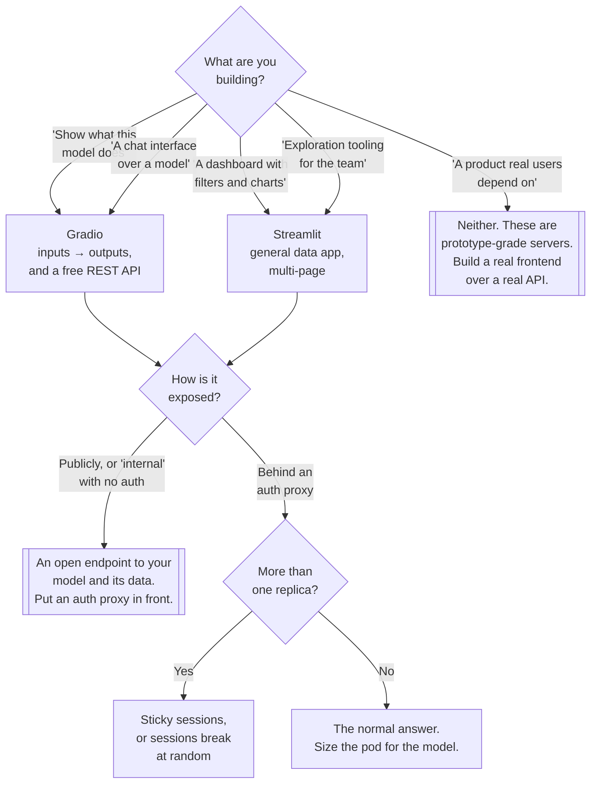

[← MLOps](../README.md)

# Apps

Turning a model into something a person can click, without a frontend team.

Tools: [`gradio/`](gradio/README.md) · [`streamlit/`](streamlit/README.md)

## Contents

1. [The problem](#1-the-problem)
2. [Gradio vs Streamlit](#2-gradio-vs-streamlit)
3. [The operational caveats](#3-the-operational-caveats)
   1. [They are stateful per session](#31-they-are-stateful-per-session)
   2. [Neither scales horizontally without care](#32-neither-scales-horizontally-without-care)
   3. [They are frequently exposed without authentication](#33-they-are-frequently-exposed-without-authentication)
4. [Decision tree](#4-decision-tree)
5. [Anti-patterns](#5-anti-patterns)
6. [How this applies to pikakube](#6-how-this-applies-to-pikakube)

---

## 1. The problem

A model in a notebook cannot be evaluated by the people whose judgement matters. A domain expert
will not run `predict()`; a stakeholder will not read a confusion matrix. The distance between "the
model works" and "somebody outside the team believes it" is a user interface, and building one
normally means a frontend project.

Gradio and Streamlit collapse that: a Python file becomes a web application, with no HTML, no
JavaScript, no build step and no second repository. That is the entire value proposition, and it
is a large one — it turns a two-week ask into an afternoon.

The cost is that what you get is a **prototype-grade web application** wearing the same clothes as
a production one, which is where section 3 comes in.

## 2. Gradio vs Streamlit

They look interchangeable and are not. The difference is what shape of thing they assume you are
building.

| | **[Gradio](gradio/README.md)** | **[Streamlit](streamlit/README.md)** |
|---|---|---|
| Shape | **model demo**: inputs → function → outputs | **data app**: a script that renders a page |
| Mental model | you describe a function's signature | you write a script top to bottom, and it re-runs |
| Best at | one model, a handful of inputs, an immediate result | dashboards, exploration, filters, multi-page apps |
| Input widgets | typed for ML — image, audio, video, file, chat | general — sliders, selects, text, dataframes |
| Multi-page | possible, not the point | first-class |
| Ecosystem | **powers most Hugging Face Spaces**; models ship with a Gradio demo | the general Python data-app default |
| Also gives you | a REST API and a client library for the same function, near free | nothing equivalent |

**The short rule.** One model, show what it does → Gradio. Several charts, filters and a
narrative → Streamlit.

Two consequences worth knowing:

**Gradio's function-first design gives you an API for free.** Because you declared the inputs and
outputs of a function, Gradio can expose the same thing as an HTTP endpoint with a generated
client. A demo becomes a callable service without extra work. Streamlit has no analogue — its
model is a page, not a function.

**Streamlit's rerun model is the thing that surprises people.** Any interaction re-executes the
whole script from the top. This is elegant until the script loads a 4 GB model, at which point
every widget click reloads it unless it is wrapped in a caching decorator. Most "Streamlit is
slow" reports are this.

## 3. The operational caveats

Both tools are honest about being application frameworks and quiet about being *servers*. Three
things bite in production, and they bite the same way for both.

### 3.1 They are stateful per session

Each connected user has server-side session state, held in the process. That is what makes the
interactivity work and it means the server is not stateless.

### 3.2 Neither scales horizontally without care

Follows directly from the above. Add a second replica and a user's next request may land on a pod
that has never heard of them — session lost, uploaded file gone, chat history empty.

| Problem | What it needs |
|---|---|
| Requests spread across replicas | sticky sessions at the ingress, or a single replica |
| Websocket connections | ingress and proxy timeouts long enough not to cut them |
| Large models loaded per process | cache the load, and accept that memory is per replica not shared |
| Long-running inference | it blocks; concurrency limits and queueing, not more replicas |

The practical shape for most internal apps is **one replica, sized generously, with sticky
sessions if there is ever a second**. Reaching for horizontal scaling because it is a web app is
how these break.

### 3.3 They are frequently exposed without authentication

This is the one that actually causes incidents. Both frameworks bind and serve with no
authentication by default. Gradio additionally offers `share=True`, which opens a public tunnel to
a locally running app in one keyword — extremely useful, and it puts an internal model on the
public internet without a single configuration file.

What is behind that endpoint is rarely just a model: it is the model, its inference cost, whatever
data the app loads to populate its dropdowns, and often a file upload path.

Both ship a rudimentary built-in auth option, and neither is an identity system — no SSO, no
groups, no audit. The correct pattern is the same one used for the
[MLflow UI](../lifecycle/mlflow/README.md): **put an authenticating proxy in front of it** and let
the app be unauthenticated behind that boundary. It is documented under
`../../security/2-cluster/identity-access/authentication/auth-proxy/`, and it is the same shape as
the `oauth2_proxy` sidecar in `lifecycle/mlflow/oauth/`.

## 4. Decision tree

## 5. Anti-patterns

| Anti-pattern | Why it is bad | What to do instead |
|---|---|---|
| Exposing the app with no authentication | it is an open endpoint to your model, its cost and its data | an auth proxy in front, always |
| `share=True` for anything non-trivial | a public tunnel to an internal app, created by one keyword | a proper deployment behind auth |
| Scaling to N replicas without sticky sessions | sessions break at random and the bug looks like a heisenbug | one replica, or sticky sessions |
| Loading the model at module scope, uncached | reloaded on every rerun or every worker; this is most "it is slow" | cache the load explicitly |
| Treating a demo as a product | prototype-grade servers acquire real users, then real expectations | a real API plus a real frontend, once it matters |
| No resource limits on a pod that loads a model | it grows until the node notices | request and limit memory deliberately |
| Long inference on the request path | it blocks the session and looks like a hang | a queue, a progress indicator, or a job |
| Streamlit chosen for a single-model demo | more scaffolding than the task needs | Gradio |
| Gradio chosen for a multi-page dashboard | fighting the framework's shape | Streamlit |
| Business logic living in the app file | it is now a UI script nobody can test or reuse | keep inference in a library the app imports |

## 6. How this applies to pikakube

**Documented, not deployed.** Both folders were a single GitHub link before this README, and there
are no manifests here — no Deployment, no Service, no ingress. This folder is the record of a
decision not yet taken.

Three things are already in place that would decide how a deployment here should look:

- **The model source.** [`../lifecycle/mlflow2/`](../lifecycle/mlflow2/README.md) has a registry.
  An app should load a *registered model version*, not a file somebody built — that is the whole
  point of the registry as a handoff artefact.
- **The auth pattern.** `lifecycle/mlflow/oauth/` already contains a worked example of fronting an
  unauthenticated UI with an OAuth proxy. Any Gradio or Streamlit app here should reuse that shape
  rather than rediscover it.
- **The gap it would expose.** Nothing here monitors what an app is asked or what it answers.
  A deployed model app is where drift becomes visible first, and there is no
  [`../../observability/`](../../observability/README.md) instrumentation planned for one.

The honest state: this is the layer that makes a model useful to somebody outside the team, and
it is the layer with the least here.

---

[← MLOps](../README.md)
